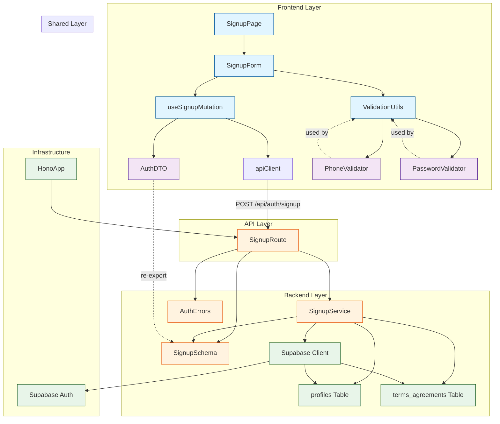

# UC-001 구현 계획

## 개요

### Backend 모듈

| 모듈명 | 위치 | 설명 |
|--------|------|------|
| **SignupRoute** | `src/features/auth/backend/route.ts` | 회원가입 API 엔드포인트 (`POST /api/auth/signup`) |
| **SignupSchema** | `src/features/auth/backend/schema.ts` | 요청/응답 Zod 스키마 정의 |
| **SignupService** | `src/features/auth/backend/service.ts` | Supabase Auth 계정 생성 + profiles/terms_agreements 삽입 로직 |
| **AuthErrors** | `src/features/auth/backend/error.ts` | Auth 관련 에러 코드 정의 |
| **HonoAppUpdate** | `src/backend/hono/app.ts` (수정) | `registerAuthRoutes()` 호출 추가 |

### Frontend 모듈

| 모듈명 | 위치 | 설명 |
|--------|------|------|
| **SignupPage** | `src/app/auth/signup/page.tsx` | 회원가입 페이지 (Next.js Page) |
| **SignupForm** | `src/features/auth/components/SignupForm.tsx` | 회원가입 폼 UI 컴포넌트 (react-hook-form + zod) |
| **useSignupMutation** | `src/features/auth/hooks/useSignupMutation.ts` | 회원가입 API 호출 React Query mutation |
| **AuthDTO** | `src/features/auth/lib/dto.ts` | Backend 스키마 재노출 (클라이언트용) |
| **ValidationUtils** | `src/features/auth/lib/validation.ts` | FE 검증 유틸 (이메일, 비밀번호, 휴대폰번호) |

### Shared 모듈

| 모듈명 | 위치 | 설명 |
|--------|------|------|
| **PhoneValidator** | `src/lib/validation/phone.ts` | 한국 휴대폰번호 검증 로직 (재사용 가능) |
| **PasswordValidator** | `src/lib/validation/password.ts` | 비밀번호 강도 검증 로직 (재사용 가능) |

---

## Module Dependency Diagram



---

## Implementation Plan

### 1. Shared 모듈 (공통 유틸리티)

#### 1.1 PhoneValidator
**파일**: `src/lib/validation/phone.ts`

**목적**: 한국 휴대폰번호 형식 검증 (재사용 가능)

**구현 내용**:
```typescript
// 한국 휴대폰번호 정규식: 010-XXXX-XXXX 또는 01XXXXXXXXX
const PHONE_REGEX = /^01[0-9]-?\d{3,4}-?\d{4}$/;

export const isValidKoreanPhone = (phone: string): boolean => {
  return PHONE_REGEX.test(phone);
};

export const normalizePhone = (phone: string): string => {
  return phone.replace(/-/g, '');
};
```

**Unit Tests**:
```typescript
describe('PhoneValidator', () => {
  it('010-1234-5678 형식을 허용해야 함', () => {
    expect(isValidKoreanPhone('010-1234-5678')).toBe(true);
  });

  it('01012345678 형식을 허용해야 함', () => {
    expect(isValidKoreanPhone('01012345678')).toBe(true);
  });

  it('011-123-4567 형식을 허용해야 함 (구형 번호)', () => {
    expect(isValidKoreanPhone('011-123-4567')).toBe(true);
  });

  it('02-1234-5678 형식을 거부해야 함 (지역번호)', () => {
    expect(isValidKoreanPhone('02-1234-5678')).toBe(false);
  });

  it('하이픈을 제거하고 정규화해야 함', () => {
    expect(normalizePhone('010-1234-5678')).toBe('01012345678');
  });
});
```

---

#### 1.2 PasswordValidator
**파일**: `src/lib/validation/password.ts`

**목적**: 비밀번호 강도 검증 (재사용 가능)

**구현 내용**:
```typescript
export type PasswordStrength = 'weak' | 'medium' | 'strong';

export const getPasswordStrength = (password: string): PasswordStrength => {
  if (password.length < 8) return 'weak';

  const hasLowerCase = /[a-z]/.test(password);
  const hasUpperCase = /[A-Z]/.test(password);
  const hasNumber = /\d/.test(password);
  const hasSpecial = /[!@#$%^&*(),.?":{}|<>]/.test(password);

  const criteriaCount = [hasLowerCase, hasUpperCase, hasNumber, hasSpecial].filter(Boolean).length;

  if (criteriaCount >= 3) return 'strong';
  if (criteriaCount >= 2) return 'medium';
  return 'weak';
};

export const isPasswordValid = (password: string): boolean => {
  return password.length >= 8;
};
```

**Unit Tests**:
```typescript
describe('PasswordValidator', () => {
  it('8자 미만은 weak', () => {
    expect(getPasswordStrength('Pass1!')).toBe('weak');
  });

  it('8자 이상 + 소문자 + 숫자만 있으면 medium', () => {
    expect(getPasswordStrength('password123')).toBe('medium');
  });

  it('8자 이상 + 대소문자 + 숫자 + 특수문자면 strong', () => {
    expect(getPasswordStrength('Pass123!')).toBe('strong');
  });

  it('최소 8자는 허용해야 함', () => {
    expect(isPasswordValid('12345678')).toBe(true);
  });

  it('8자 미만은 거부해야 함', () => {
    expect(isPasswordValid('1234567')).toBe(false);
  });
});
```

---

### 2. Backend 모듈

#### 2.1 AuthErrors
**파일**: `src/features/auth/backend/error.ts`

**목적**: Auth 관련 에러 코드 정의

**구현 내용**:
```typescript
export const authErrorCodes = {
  emailDuplicate: 'AUTH_EMAIL_DUPLICATE',
  signupFailed: 'AUTH_SIGNUP_FAILED',
  profileCreationFailed: 'AUTH_PROFILE_CREATION_FAILED',
  termsAgreementFailed: 'AUTH_TERMS_AGREEMENT_FAILED',
  invalidRole: 'AUTH_INVALID_ROLE',
  invalidRequest: 'AUTH_INVALID_REQUEST',
  transactionFailed: 'AUTH_TRANSACTION_FAILED',
} as const;

type AuthErrorValue = (typeof authErrorCodes)[keyof typeof authErrorCodes];

export type AuthServiceError = AuthErrorValue;
```

**Unit Tests**: N/A (상수 정의)

---

#### 2.2 SignupSchema
**파일**: `src/features/auth/backend/schema.ts`

**목적**: 회원가입 요청/응답 Zod 스키마 정의

**구현 내용**:
```typescript
import { z } from 'zod';

// 요청 스키마
export const SignupRequestSchema = z.object({
  email: z.string().email({ message: '올바른 이메일 형식을 입력하세요.' }),
  password: z.string().min(8, { message: '비밀번호는 최소 8자 이상이어야 합니다.' }),
  role: z.enum(['learner', 'instructor'], {
    errorMap: () => ({ message: '역할은 learner 또는 instructor만 선택 가능합니다.' }),
  }),
  name: z.string().min(1, { message: '이름을 입력하세요.' }),
  phone: z.string().regex(/^01[0-9]-?\d{3,4}-?\d{4}$/, {
    message: '올바른 휴대폰번호 형식을 입력하세요.',
  }),
  termsAgreed: z.literal(true, {
    errorMap: () => ({ message: '약관에 동의해주세요.' }),
  }),
});

export type SignupRequest = z.infer<typeof SignupRequestSchema>;

// 응답 스키마
export const SignupResponseSchema = z.object({
  token: z.string(),
  role: z.enum(['learner', 'instructor']),
  redirectTo: z.string(),
});

export type SignupResponse = z.infer<typeof SignupResponseSchema>;

// DB 스키마 (profiles)
export const ProfileRowSchema = z.object({
  id: z.string().uuid(),
  role: z.enum(['learner', 'instructor', 'operator']),
  name: z.string(),
  phone: z.string(),
  created_at: z.string(),
  updated_at: z.string(),
});

export type ProfileRow = z.infer<typeof ProfileRowSchema>;

// DB 스키마 (terms_agreements)
export const TermsAgreementRowSchema = z.object({
  id: z.string().uuid(),
  user_id: z.string().uuid(),
  agreed_at: z.string(),
  created_at: z.string(),
  updated_at: z.string(),
});

export type TermsAgreementRow = z.infer<typeof TermsAgreementRowSchema>;
```

**Unit Tests**:
```typescript
describe('SignupRequestSchema', () => {
  it('유효한 요청을 허용해야 함', () => {
    const valid = {
      email: 'test@example.com',
      password: 'Pass123!',
      role: 'learner',
      name: '홍길동',
      phone: '010-1234-5678',
      termsAgreed: true,
    };
    expect(() => SignupRequestSchema.parse(valid)).not.toThrow();
  });

  it('이메일 형식이 잘못되면 거부해야 함', () => {
    const invalid = { ...validRequest, email: 'invalid-email' };
    expect(() => SignupRequestSchema.parse(invalid)).toThrow();
  });

  it('비밀번호가 8자 미만이면 거부해야 함', () => {
    const invalid = { ...validRequest, password: '1234567' };
    expect(() => SignupRequestSchema.parse(invalid)).toThrow();
  });

  it('역할이 learner/instructor가 아니면 거부해야 함', () => {
    const invalid = { ...validRequest, role: 'admin' };
    expect(() => SignupRequestSchema.parse(invalid)).toThrow();
  });

  it('약관 미동의 시 거부해야 함', () => {
    const invalid = { ...validRequest, termsAgreed: false };
    expect(() => SignupRequestSchema.parse(invalid)).toThrow();
  });
});
```

---

#### 2.3 SignupService
**파일**: `src/features/auth/backend/service.ts`

**목적**: Supabase Auth 계정 생성 + profiles/terms_agreements 삽입

**구현 내용**:
```typescript
import type { SupabaseClient } from '@supabase/supabase-js';
import { normalizePhone } from '@/lib/validation/phone';
import { success, failure, type HandlerResult } from '@/backend/http/response';
import type { SignupRequest, SignupResponse } from './schema';
import { authErrorCodes, type AuthServiceError } from './error';

const PROFILES_TABLE = 'profiles';
const TERMS_AGREEMENTS_TABLE = 'terms_agreements';

export const signupUser = async (
  client: SupabaseClient,
  request: SignupRequest,
): Promise<HandlerResult<SignupResponse, AuthServiceError, unknown>> => {
  const { email, password, role, name, phone, termsAgreed } = request;

  // 1. Supabase Auth 계정 생성
  const { data: authData, error: authError } = await client.auth.signUp({
    email,
    password,
  });

  if (authError) {
    if (authError.message.includes('already registered')) {
      return failure(409, authErrorCodes.emailDuplicate, '이미 가입된 이메일입니다.');
    }
    return failure(500, authErrorCodes.signupFailed, authError.message);
  }

  if (!authData.user) {
    return failure(500, authErrorCodes.signupFailed, '계정 생성에 실패했습니다.');
  }

  const userId = authData.user.id;
  const normalizedPhone = normalizePhone(phone);

  // 2. profiles 테이블에 프로필 생성
  const { error: profileError } = await client.from(PROFILES_TABLE).insert({
    id: userId,
    role,
    name,
    phone: normalizedPhone,
  });

  if (profileError) {
    // 트랜잭션 롤백 불가 - Supabase Auth 계정은 이미 생성됨
    // 수동으로 삭제 필요하거나 별도 정리 작업 필요
    return failure(
      500,
      authErrorCodes.profileCreationFailed,
      '프로필 생성에 실패했습니다.',
      profileError.message,
    );
  }

  // 3. terms_agreements 테이블에 약관 동의 기록
  const { error: termsError } = await client.from(TERMS_AGREEMENTS_TABLE).insert({
    user_id: userId,
    agreed_at: new Date().toISOString(),
  });

  if (termsError) {
    return failure(
      500,
      authErrorCodes.termsAgreementFailed,
      '약관 동의 기록에 실패했습니다.',
      termsError.message,
    );
  }

  // 4. JWT 토큰 생성 (Supabase Auth에서 자동 발급)
  const token = authData.session?.access_token ?? '';

  // 5. 리다이렉트 경로 결정
  const redirectTo = role === 'learner' ? '/courses' : '/instructor/dashboard';

  return success({
    token,
    role,
    redirectTo,
  });
};
```

**Unit Tests**:
```typescript
describe('signupUser', () => {
  let mockClient: MockSupabaseClient;

  beforeEach(() => {
    mockClient = createMockSupabaseClient();
  });

  it('성공 시 토큰과 리다이렉트 경로를 반환해야 함', async () => {
    mockClient.auth.signUp.mockResolvedValue({
      data: { user: { id: 'user-123' }, session: { access_token: 'token-123' } },
      error: null,
    });
    mockClient.from.mockReturnValue({
      insert: jest.fn().mockResolvedValue({ error: null }),
    });

    const result = await signupUser(mockClient, validRequest);

    expect(result.ok).toBe(true);
    if (result.ok) {
      expect(result.data.token).toBe('token-123');
      expect(result.data.role).toBe('learner');
      expect(result.data.redirectTo).toBe('/courses');
    }
  });

  it('이메일 중복 시 409 에러를 반환해야 함', async () => {
    mockClient.auth.signUp.mockResolvedValue({
      data: { user: null, session: null },
      error: { message: 'User already registered' },
    });

    const result = await signupUser(mockClient, validRequest);

    expect(result.ok).toBe(false);
    if (!result.ok) {
      expect(result.status).toBe(409);
      expect(result.error.code).toBe(authErrorCodes.emailDuplicate);
    }
  });

  it('프로필 생성 실패 시 500 에러를 반환해야 함', async () => {
    mockClient.auth.signUp.mockResolvedValue({
      data: { user: { id: 'user-123' }, session: { access_token: 'token-123' } },
      error: null,
    });
    mockClient.from.mockReturnValue({
      insert: jest.fn().mockResolvedValue({ error: { message: 'Insert failed' } }),
    });

    const result = await signupUser(mockClient, validRequest);

    expect(result.ok).toBe(false);
    if (!result.ok) {
      expect(result.status).toBe(500);
      expect(result.error.code).toBe(authErrorCodes.profileCreationFailed);
    }
  });

  it('Instructor 역할 시 /instructor/dashboard로 리다이렉트해야 함', async () => {
    mockClient.auth.signUp.mockResolvedValue({
      data: { user: { id: 'user-123' }, session: { access_token: 'token-123' } },
      error: null,
    });
    mockClient.from.mockReturnValue({
      insert: jest.fn().mockResolvedValue({ error: null }),
    });

    const instructorRequest = { ...validRequest, role: 'instructor' };
    const result = await signupUser(mockClient, instructorRequest);

    expect(result.ok).toBe(true);
    if (result.ok) {
      expect(result.data.redirectTo).toBe('/instructor/dashboard');
    }
  });
});
```

---

#### 2.4 SignupRoute
**파일**: `src/features/auth/backend/route.ts`

**목적**: 회원가입 API 엔드포인트 정의

**구현 내용**:
```typescript
import type { Hono } from 'hono';
import type { AppEnv } from '@/backend/hono/context';
import { getSupabase, getLogger } from '@/backend/hono/context';
import { respond, failure } from '@/backend/http/response';
import { SignupRequestSchema } from './schema';
import { signupUser } from './service';

export const registerAuthRoutes = (app: Hono<AppEnv>) => {
  app.post('/api/auth/signup', async (c) => {
    // 1. 요청 본문 파싱
    const body = await c.req.json();

    // 2. 요청 검증
    const parsedRequest = SignupRequestSchema.safeParse(body);

    if (!parsedRequest.success) {
      return respond(
        c,
        failure(
          400,
          'AUTH_INVALID_REQUEST',
          '요청 데이터가 유효하지 않습니다.',
          parsedRequest.error.format(),
        ),
      );
    }

    // 3. Context에서 필요한 것 추출
    const supabase = getSupabase(c);
    const logger = getLogger(c);

    // 4. 서비스 호출
    const result = await signupUser(supabase, parsedRequest.data);

    // 5. 에러 로깅
    if (!result.ok) {
      logger.error('Signup failed', result.error);
    }

    // 6. 응답 반환
    return respond(c, result);
  });
};
```

**Unit Tests**: N/A (통합 테스트로 대체)

---

#### 2.5 HonoAppUpdate
**파일**: `src/backend/hono/app.ts` (기존 파일 수정)

**목적**: `registerAuthRoutes()` 호출 추가

**구현 내용**:
```typescript
import { registerAuthRoutes } from '@/features/auth/backend/route';

export const createHonoApp = () => {
  // ... 기존 코드 ...

  // 라우터 등록
  registerExampleRoutes(app);
  registerAuthRoutes(app);  // 추가

  // ... 기존 코드 ...
};
```

---

### 3. Frontend 모듈

#### 3.1 AuthDTO
**파일**: `src/features/auth/lib/dto.ts`

**목적**: Backend 스키마 재노출 (클라이언트용)

**구현 내용**:
```typescript
export {
  SignupRequestSchema,
  SignupResponseSchema,
  type SignupRequest,
  type SignupResponse,
} from '@/features/auth/backend/schema';
```

---

#### 3.2 ValidationUtils
**파일**: `src/features/auth/lib/validation.ts`

**목적**: FE 검증 유틸 (이메일, 비밀번호, 휴대폰번호)

**구현 내용**:
```typescript
import { isValidKoreanPhone } from '@/lib/validation/phone';
import { getPasswordStrength, isPasswordValid } from '@/lib/validation/password';

export const validateEmail = (email: string): string | null => {
  const emailRegex = /^[^\s@]+@[^\s@]+\.[^\s@]+$/;
  if (!email) return '이메일을 입력하세요.';
  if (!emailRegex.test(email)) return '올바른 이메일 형식을 입력하세요.';
  return null;
};

export const validatePassword = (password: string): string | null => {
  if (!password) return '비밀번호를 입력하세요.';
  if (!isPasswordValid(password)) return '비밀번호는 최소 8자 이상이어야 합니다.';
  return null;
};

export const validatePhone = (phone: string): string | null => {
  if (!phone) return '휴대폰번호를 입력하세요.';
  if (!isValidKoreanPhone(phone)) return '올바른 휴대폰번호 형식을 입력하세요.';
  return null;
};

export const validateName = (name: string): string | null => {
  if (!name) return '이름을 입력하세요.';
  if (name.length < 2) return '이름은 최소 2자 이상이어야 합니다.';
  return null;
};

export { getPasswordStrength };
```

**QA Sheet**:
| 시나리오 | 입력 | 기대 결과 |
|---------|------|-----------|
| 유효한 이메일 | `test@example.com` | `null` (에러 없음) |
| 유효하지 않은 이메일 | `invalid-email` | "올바른 이메일 형식을 입력하세요." |
| 빈 이메일 | `""` | "이메일을 입력하세요." |
| 유효한 비밀번호 | `Pass123!` | `null` (에러 없음) |
| 8자 미만 비밀번호 | `Pass1!` | "비밀번호는 최소 8자 이상이어야 합니다." |
| 유효한 휴대폰번호 | `010-1234-5678` | `null` (에러 없음) |
| 유효하지 않은 휴대폰번호 | `02-1234-5678` | "올바른 휴대폰번호 형식을 입력하세요." |
| 유효한 이름 | `홍길동` | `null` (에러 없음) |
| 1자 이름 | `홍` | "이름은 최소 2자 이상이어야 합니다." |

---

#### 3.3 useSignupMutation
**파일**: `src/features/auth/hooks/useSignupMutation.ts`

**목적**: 회원가입 API 호출 React Query mutation

**구현 내용**:
```typescript
'use client';

import { useMutation } from '@tanstack/react-query';
import { useRouter } from 'next/navigation';
import { apiClient, extractApiErrorMessage } from '@/lib/remote/api-client';
import {
  SignupRequestSchema,
  SignupResponseSchema,
  type SignupRequest,
} from '@/features/auth/lib/dto';

const signupUser = async (request: SignupRequest) => {
  try {
    const { data } = await apiClient.post('/api/auth/signup', request);
    return SignupResponseSchema.parse(data);
  } catch (error) {
    const message = extractApiErrorMessage(error, '회원가입에 실패했습니다.');
    throw new Error(message);
  }
};

export const useSignupMutation = () => {
  const router = useRouter();

  return useMutation({
    mutationFn: signupUser,
    onSuccess: (data) => {
      // 토큰 저장 (로컬 스토리지)
      localStorage.setItem('auth_token', data.token);

      // 역할에 따라 리다이렉트
      router.push(data.redirectTo);
    },
  });
};
```

**QA Sheet**:
| 시나리오 | API 응답 | 기대 결과 |
|---------|---------|-----------|
| 회원가입 성공 (Learner) | `{token: "xxx", role: "learner", redirectTo: "/courses"}` | 토큰 저장 + `/courses`로 리다이렉트 |
| 회원가입 성공 (Instructor) | `{token: "xxx", role: "instructor", redirectTo: "/instructor/dashboard"}` | 토큰 저장 + `/instructor/dashboard`로 리다이렉트 |
| 이메일 중복 | `409 Conflict` | 에러 메시지 "이미 가입된 이메일입니다." throw |
| 서버 오류 | `500 Internal Server Error` | 에러 메시지 "회원가입에 실패했습니다." throw |

---

#### 3.4 SignupForm
**파일**: `src/features/auth/components/SignupForm.tsx`

**목적**: 회원가입 폼 UI 컴포넌트

**구현 내용**:
```typescript
'use client';

import { useForm } from 'react-hook-form';
import { zodResolver } from '@hookform/resolvers/zod';
import { SignupRequestSchema, type SignupRequest } from '@/features/auth/lib/dto';
import { useSignupMutation } from '@/features/auth/hooks/useSignupMutation';
import { getPasswordStrength } from '@/features/auth/lib/validation';
import { Button } from '@/components/ui/button';
import { Input } from '@/components/ui/input';
import { Label } from '@/components/ui/label';
import { Checkbox } from '@/components/ui/checkbox';
import { useToast } from '@/hooks/use-toast';

export const SignupForm = () => {
  const { toast } = useToast();
  const {
    register,
    handleSubmit,
    watch,
    formState: { errors, isSubmitting },
  } = useForm<SignupRequest>({
    resolver: zodResolver(SignupRequestSchema),
    defaultValues: {
      role: 'learner',
      termsAgreed: false,
    },
  });

  const mutation = useSignupMutation();
  const password = watch('password', '');
  const passwordStrength = password ? getPasswordStrength(password) : null;

  const onSubmit = async (data: SignupRequest) => {
    try {
      await mutation.mutateAsync(data);
      toast({
        title: '회원가입 성공',
        description: '환영합니다!',
      });
    } catch (error) {
      toast({
        variant: 'destructive',
        title: '회원가입 실패',
        description: error instanceof Error ? error.message : '알 수 없는 오류가 발생했습니다.',
      });
    }
  };

  return (
    <form onSubmit={handleSubmit(onSubmit)} className="space-y-4">
      {/* 이메일 */}
      <div>
        <Label htmlFor="email">이메일</Label>
        <Input
          id="email"
          type="email"
          placeholder="example@example.com"
          {...register('email')}
        />
        {errors.email && <p className="text-sm text-red-500">{errors.email.message}</p>}
      </div>

      {/* 비밀번호 */}
      <div>
        <Label htmlFor="password">비밀번호</Label>
        <Input
          id="password"
          type="password"
          placeholder="최소 8자 이상"
          {...register('password')}
        />
        {errors.password && <p className="text-sm text-red-500">{errors.password.message}</p>}
        {passwordStrength && (
          <p className="text-sm text-gray-500">
            강도: {passwordStrength === 'weak' && '약함'}
            {passwordStrength === 'medium' && '보통'}
            {passwordStrength === 'strong' && '강함'}
          </p>
        )}
      </div>

      {/* 역할 선택 */}
      <div>
        <Label>역할</Label>
        <div className="flex gap-4">
          <label className="flex items-center gap-2">
            <input type="radio" value="learner" {...register('role')} />
            학습자
          </label>
          <label className="flex items-center gap-2">
            <input type="radio" value="instructor" {...register('role')} />
            강사
          </label>
        </div>
        {errors.role && <p className="text-sm text-red-500">{errors.role.message}</p>}
      </div>

      {/* 이름 */}
      <div>
        <Label htmlFor="name">이름</Label>
        <Input id="name" type="text" placeholder="홍길동" {...register('name')} />
        {errors.name && <p className="text-sm text-red-500">{errors.name.message}</p>}
      </div>

      {/* 휴대폰번호 */}
      <div>
        <Label htmlFor="phone">휴대폰번호</Label>
        <Input
          id="phone"
          type="tel"
          placeholder="010-1234-5678"
          {...register('phone')}
        />
        {errors.phone && <p className="text-sm text-red-500">{errors.phone.message}</p>}
      </div>

      {/* 약관 동의 */}
      <div className="flex items-center gap-2">
        <Checkbox id="termsAgreed" {...register('termsAgreed')} />
        <Label htmlFor="termsAgreed">약관에 동의합니다</Label>
      </div>
      {errors.termsAgreed && <p className="text-sm text-red-500">{errors.termsAgreed.message}</p>}

      {/* 제출 버튼 */}
      <Button type="submit" className="w-full" disabled={isSubmitting || mutation.isPending}>
        {isSubmitting || mutation.isPending ? '처리 중...' : '회원가입'}
      </Button>
    </form>
  );
};
```

**QA Sheet**:
| 시나리오 | 사용자 액션 | 기대 결과 |
|---------|------------|-----------|
| 빈 폼 제출 | 모든 필드 비움 + 제출 | 각 필드에 에러 메시지 표시 |
| 이메일 형식 오류 | `invalid-email` 입력 + 제출 | "올바른 이메일 형식을 입력하세요." 표시 |
| 비밀번호 8자 미만 | `Pass1!` 입력 | "비밀번호는 최소 8자 이상이어야 합니다." 표시 |
| 비밀번호 강도 표시 | `Pass123!` 입력 | "강도: 강함" 표시 |
| 휴대폰번호 형식 오류 | `02-1234-5678` 입력 | "올바른 휴대폰번호 형식을 입력하세요." 표시 |
| 약관 미동의 | 약관 체크 안 함 + 제출 | "약관에 동의해주세요." 표시 |
| 유효한 폼 제출 (Learner) | 모든 필드 올바르게 입력 + role=learner + 제출 | API 호출 + 성공 시 `/courses`로 리다이렉트 |
| 유효한 폼 제출 (Instructor) | 모든 필드 올바르게 입력 + role=instructor + 제출 | API 호출 + 성공 시 `/instructor/dashboard`로 리다이렉트 |
| API 에러 (이메일 중복) | 중복 이메일로 제출 | Toast 알림: "이미 가입된 이메일입니다." |
| API 에러 (서버 오류) | 서버 오류 발생 | Toast 알림: "회원가입에 실패했습니다." |
| 제출 중 버튼 비활성화 | 제출 버튼 클릭 | 버튼 텍스트 "처리 중..." + 버튼 비활성화 |

---

#### 3.5 SignupPage
**파일**: `src/app/auth/signup/page.tsx`

**목적**: 회원가입 페이지 (Next.js Page)

**구현 내용**:
```typescript
import { SignupForm } from '@/features/auth/components/SignupForm';
import { Card, CardContent, CardDescription, CardHeader, CardTitle } from '@/components/ui/card';

export default function SignupPage() {
  return (
    <div className="flex min-h-screen items-center justify-center bg-gray-50">
      <Card className="w-full max-w-md">
        <CardHeader>
          <CardTitle>회원가입</CardTitle>
          <CardDescription>새 계정을 만들어보세요</CardDescription>
        </CardHeader>
        <CardContent>
          <SignupForm />
        </CardContent>
      </Card>
    </div>
  );
}
```

**QA Sheet**:
| 시나리오 | 페이지 접근 | 기대 결과 |
|---------|------------|-----------|
| 페이지 로드 | `/auth/signup` 접속 | 회원가입 폼 표시 |
| 폼 제출 성공 (Learner) | 유효한 데이터로 제출 + role=learner | `/courses`로 리다이렉트 |
| 폼 제출 성공 (Instructor) | 유효한 데이터로 제출 + role=instructor | `/instructor/dashboard`로 리다이렉트 |

---

## 구현 순서 (권장)

1. **Shared 모듈** (공통 유틸리티)
   - `src/lib/validation/phone.ts`
   - `src/lib/validation/password.ts`

2. **Backend 모듈** (API 구현)
   - `src/features/auth/backend/error.ts`
   - `src/features/auth/backend/schema.ts`
   - `src/features/auth/backend/service.ts`
   - `src/features/auth/backend/route.ts`
   - `src/backend/hono/app.ts` (수정)

3. **Frontend 모듈** (UI 구현)
   - `src/features/auth/lib/dto.ts`
   - `src/features/auth/lib/validation.ts`
   - `src/features/auth/hooks/useSignupMutation.ts`
   - `src/features/auth/components/SignupForm.tsx`
   - `src/app/auth/signup/page.tsx`

4. **통합 테스트**
   - E2E 테스트: 회원가입 전체 플로우
   - API 테스트: `/api/auth/signup` 엔드포인트

---

## 추가 고려 사항

### 1. 트랜잭션 관리
현재 Supabase는 `auth.signUp()` 이후 profiles/terms_agreements 삽입이 별도 트랜잭션입니다. 프로필 생성 실패 시 Auth 계정이 orphan 상태로 남을 수 있습니다.

**해결 방안**:
- Supabase Database Webhooks를 사용하여 `auth.users` INSERT 이벤트에 트리거 연결
- 또는 별도 정리 작업(cron job)으로 orphan 계정 삭제

### 2. 토큰 저장 위치
현재 `localStorage`에 토큰을 저장하지만, XSS 공격에 취약할 수 있습니다.

**개선 방안**:
- HttpOnly 쿠키 사용 (서버에서 Set-Cookie)
- 또는 Supabase Auth Session 사용 (자동 관리)

### 3. 에러 처리 개선
현재 모든 에러를 Toast로 표시하지만, 필드별 에러를 인라인으로 표시하는 것이 UX 측면에서 더 좋습니다.

**개선 방안**:
- API 에러 응답에 필드별 에러 포함
- `setError()` 함수로 필드별 에러 설정

### 4. 로딩 상태 개선
현재 제출 버튼만 비활성화하지만, 전체 폼을 비활성화하는 것이 더 명확합니다.

**개선 방안**:
- `<fieldset disabled={isSubmitting}>`로 전체 폼 래핑
- 또는 로딩 오버레이 표시
