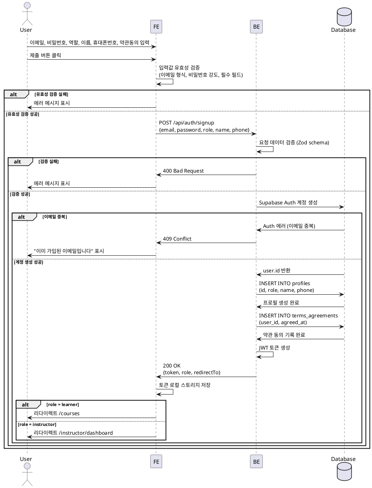

# UC-001: 역할 선택 & 온보딩

## Primary Actor
신규 사용자 (미가입 상태)

## Precondition
- 사용자가 계정이 없는 상태
- 회원가입 페이지(`/auth/signup`)에 접근

## Trigger
회원가입 폼 제출 버튼 클릭

## Main Scenario

1. 사용자가 이메일, 비밀번호 입력
2. 사용자가 역할 선택 (Learner / Instructor)
3. 사용자가 이름, 휴대폰번호 입력
4. 사용자가 약관 동의 체크박스 선택
5. 사용자가 제출 버튼 클릭
6. FE가 입력값 유효성 검증 (이메일 형식, 비밀번호 강도, 필수 필드)
7. FE가 BE에 회원가입 요청 (`POST /api/auth/signup`)
8. BE가 Supabase Auth로 계정 생성
9. BE가 `profiles` 테이블에 사용자 프로필 생성 (role, name, phone)
10. BE가 `terms_agreements` 테이블에 약관 동의 이력 저장
11. BE가 JWT 토큰 반환 및 성공 응답
12. FE가 토큰 저장 (로컬 스토리지 또는 쿠키)
13. FE가 역할에 따라 리다이렉트:
    - Learner → `/courses` (코스 카탈로그)
    - Instructor → `/instructor/dashboard` (강사 대시보드)

## Edge Cases

### 1. 이메일 중복
- **상황**: 이미 가입된 이메일로 회원가입 시도
- **처리**: `409 Conflict` 응답, "이미 가입된 이메일입니다" 메시지 표시

### 2. 유효하지 않은 이메일 형식
- **상황**: 이메일 형식이 올바르지 않음
- **처리**: FE 단에서 실시간 검증, 제출 차단, "올바른 이메일 형식을 입력하세요" 메시지 표시

### 3. 비밀번호 강도 부족
- **상황**: 비밀번호가 최소 8자 미만이거나 보안 요구사항 미충족
- **처리**: FE 단에서 실시간 검증, 제출 차단, 비밀번호 강도 가이드 표시

### 4. 휴대폰번호 형식 오류
- **상황**: 휴대폰번호가 한국 형식(`010-XXXX-XXXX` 또는 `01XXXXXXXXX`)이 아님
- **처리**: FE 단에서 실시간 검증, "올바른 휴대폰번호 형식을 입력하세요" 메시지 표시

### 5. 약관 미동의
- **상황**: 약관 동의 체크박스 미선택 상태에서 제출 시도
- **처리**: 제출 차단, "약관에 동의해주세요" 메시지 표시

### 6. 네트워크 오류
- **상황**: BE 통신 실패 (타임아웃, 서버 오류 등)
- **처리**: `500` 또는 네트워크 에러 발생 시 "일시적인 오류가 발생했습니다. 다시 시도해주세요" 메시지 표시

### 7. DB 트랜잭션 실패
- **상황**: Supabase Auth 계정은 생성되었으나 profiles 또는 terms_agreements 삽입 실패
- **처리**: BE에서 롤백 처리, `500 Internal Server Error` 응답, 사용자에게 재시도 안내

## Business Rules

### BR-001: 이메일 유일성
- 이메일은 시스템 내에서 유일해야 함
- Supabase Auth 레벨에서 중복 검증

### BR-002: 비밀번호 정책
- 최소 8자 이상
- 영문, 숫자, 특수문자 조합 권장 (FE 가이드)

### BR-003: 역할 제한
- 역할은 `learner`, `instructor` 중 하나만 선택 가능
- 온보딩 후 역할 변경 불가 (또는 별도 프로세스 필요)

### BR-004: 약관 동의 필수
- 약관 동의 없이 회원가입 불가
- 동의 시각(`agreed_at`)을 `terms_agreements` 테이블에 기록

### BR-005: 휴대폰번호 형식
- 한국 휴대폰번호 형식 (`010-XXXX-XXXX` 또는 `01XXXXXXXXX`)
- 하이픈 포함 여부 무관 (BE에서 정규화 처리)

### BR-006: 자동 리다이렉트
- 회원가입 성공 후 역할에 따라 자동 리다이렉트:
  - `role=learner` → `/courses`
  - `role=instructor` → `/instructor/dashboard`

---

## Sequence Diagram

