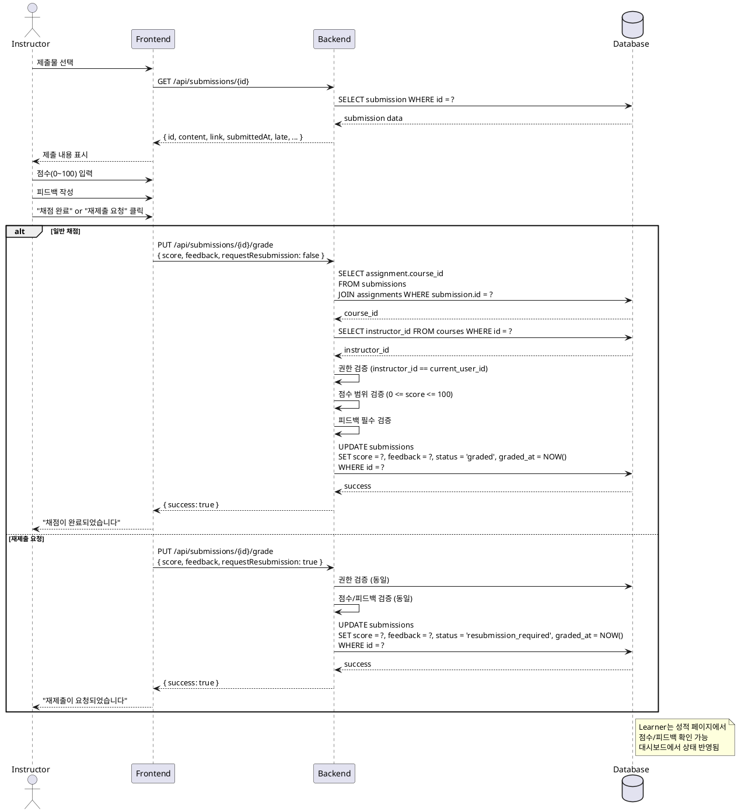

# UC-010: 제출물 채점 & 피드백 (Instructor)

## Primary Actor

Instructor

## Precondition

- Instructor 계정으로 로그인되어 있음
- 본인이 생성한 코스에 과제가 존재함
- 해당 과제에 학습자가 제출한 제출물이 존재함

## Trigger

Instructor가 제출물 목록에서 특정 제출물을 선택하고 채점 화면에 진입함

## Main Scenario

1. **제출물 선택**: Instructor가 과제의 제출물 목록에서 채점할 제출물을 선택함
2. **제출 내용 확인**: 시스템은 제출물의 텍스트 내용, 링크, 제출일시, 지각 여부를 표시함
3. **점수 입력**: Instructor가 0~100 범위의 점수를 입력함
4. **피드백 작성**: Instructor가 피드백 텍스트를 작성함 (필수)
5. **채점 방식 선택**:
   - **일반 채점**: "채점 완료" 버튼 클릭 → 상태 `graded`로 변경
   - **재제출 요청**: "재제출 요청" 버튼 클릭 → 상태 `resubmission_required`로 변경
6. **결과 저장**: 시스템은 점수, 피드백, 상태, 채점일시를 저장함
7. **Learner 반영**:
   - Learner의 성적 페이지에 점수와 피드백이 표시됨
   - Learner 대시보드에서 과제 상태가 업데이트됨

## Edge Cases

### 1. 점수 범위 초과
- **입력**: 점수가 0 미만 또는 100 초과인 경우
- **처리**: 클라이언트에서 입력 제한, 백엔드에서 검증 후 400 에러 반환
- **출력**: "점수는 0~100 범위로 입력해주세요" 메시지 표시

### 2. 피드백 미작성
- **입력**: 피드백 텍스트가 비어있는 경우
- **처리**: 제출 버튼 비활성화, 백엔드에서 검증 후 400 에러 반환
- **출력**: "피드백을 작성해주세요" 메시지 표시

### 3. 권한 없는 접근
- **입력**: 본인 코스가 아닌 과제의 제출물에 접근
- **처리**: 백엔드에서 과제의 코스 소유자 검증 후 403 에러 반환
- **출력**: "접근 권한이 없습니다" 메시지 표시

### 4. 이미 채점된 제출물
- **입력**: 이미 `graded` 상태인 제출물을 다시 채점
- **처리**: 기존 점수/피드백 덮어쓰기 허용, 채점일시 갱신
- **출력**: "기존 채점 내용이 업데이트되었습니다" 메시지 표시

### 5. 재제출 요청 후 새 제출물 채점
- **입력**: `resubmission_required` 상태로 변경 후, 학습자가 재제출한 제출물 채점
- **처리**: 새로운 제출물로 간주하여 정상 채점 진행
- **출력**: 새 점수와 피드백 저장됨

### 6. 동시 채점 시도
- **입력**: 여러 Instructor가 동일 제출물을 동시에 채점
- **처리**: 마지막 업데이트가 반영됨 (낙관적 동시성 제어)
- **출력**: 최종 저장된 채점 내용이 반영됨

## Business Rules

### 1. 점수 범위
- 점수는 0 이상 100 이하의 정수만 허용
- 소수점은 허용하지 않음

### 2. 피드백 필수
- 채점 시 피드백은 반드시 작성되어야 함
- 빈 문자열 또는 공백만 있는 경우 유효하지 않음

### 3. 상태 전환
- 점수 입력 + 일반 채점 → `graded`
- 점수 입력 + 재제출 요청 → `resubmission_required`
- 재채점 시 기존 채점 내용 덮어쓰기 가능

### 4. 접근 권한
- 과제가 속한 코스의 소유자만 채점 가능
- 본인이 생성하지 않은 코스의 제출물은 조회/채점 불가

### 5. 성적 반영
- `graded` 상태인 제출물만 코스 총점 계산에 포함됨
- `resubmission_required` 상태는 미채점으로 간주
- 재제출 후 재채점하면 새 점수로 갱신됨

### 6. 채점일시 기록
- 채점 시 `graded_at` 타임스탬프 자동 기록
- 재채점 시 `graded_at` 업데이트됨

## Sequence Diagram

