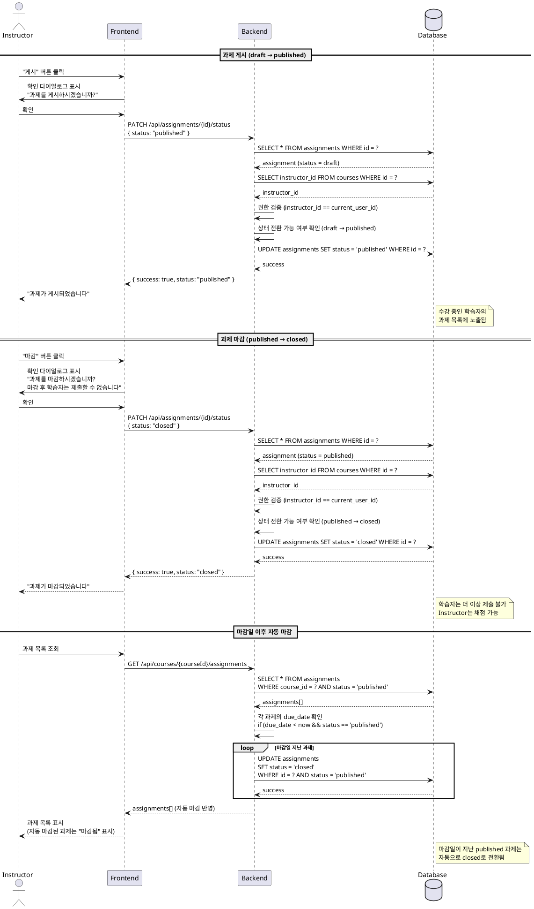

# UC-011: Assignment 게시/마감 (Instructor)

## Primary Actor

Instructor

## Precondition

- Instructor 계정으로 로그인되어 있음
- 본인이 생성한 코스에 과제가 존재함
- 과제 상태가 `draft` 또는 `published`임

## Trigger

Instructor가 과제 상세 화면에서 "게시" 또는 "마감" 버튼을 클릭함

## Main Scenario

### 1. 과제 게시 (draft → published)

1. **게시 버튼 클릭**: Instructor가 `draft` 상태의 과제에서 "게시" 버튼을 클릭함
2. **확인 다이얼로그**: 시스템은 "과제를 게시하시겠습니까?" 확인 다이얼로그를 표시함
3. **상태 전환**: Instructor가 확인하면 시스템은 과제 상태를 `published`로 변경함
4. **학습자 노출**: 해당 코스를 수강 중인 학습자의 과제 목록에 과제가 표시됨
5. **성공 메시지**: "과제가 게시되었습니다" 메시지 표시

### 2. 과제 마감 (published → closed)

1. **마감 버튼 클릭**: Instructor가 `published` 상태의 과제에서 "마감" 버튼을 클릭함
2. **확인 다이얼로그**: 시스템은 "과제를 마감하시겠습니까? 마감 후 학습자는 제출할 수 없습니다" 확인 다이얼로그를 표시함
3. **상태 전환**: Instructor가 확인하면 시스템은 과제 상태를 `closed`로 변경함
4. **제출 차단**: 학습자는 해당 과제에 더 이상 제출할 수 없음
5. **채점 가능**: Instructor는 기존 제출물에 대한 채점은 계속 가능함
6. **성공 메시지**: "과제가 마감되었습니다" 메시지 표시

### 3. 마감일 이후 자동 마감

1. **마감일 도래**: 과제의 `due_date`가 현재 시각을 지나감
2. **자동 상태 전환**: 시스템은 자동으로 과제 상태를 `closed`로 변경함
3. **제출 차단**: 학습자는 해당 과제에 더 이상 제출할 수 없음 (지각 허용 여부와 무관)
4. **학습자 화면 반영**: 학습자의 과제 목록에서 과제 상태가 "마감됨"으로 표시됨

## Edge Cases

### 1. 이미 게시된 과제 재게시
- **입력**: `published` 상태의 과제에서 게시 버튼 클릭
- **처리**: 게시 버튼 자체가 비활성화되어 있음
- **출력**: 버튼 비활성화 상태

### 2. 이미 마감된 과제 재마감
- **입력**: `closed` 상태의 과제에서 마감 버튼 클릭
- **처리**: 마감 버튼 자체가 비활성화되어 있음
- **출력**: 버튼 비활성화 상태

### 3. 권한 없는 접근
- **입력**: 본인 코스가 아닌 과제의 상태 전환 시도
- **처리**: 백엔드에서 과제의 코스 소유자 검증 후 403 에러 반환
- **출력**: "접근 권한이 없습니다" 메시지 표시

### 4. 유효하지 않은 상태 전환
- **입력**: `closed` → `published` 등 허용되지 않는 상태 전환 시도
- **처리**: 백엔드에서 상태 전환 규칙 검증 후 400 에러 반환
- **출력**: "유효하지 않은 상태 전환입니다" 메시지 표시

### 5. 마감일 이전 수동 마감
- **입력**: 마감일이 아직 도래하지 않았지만 Instructor가 수동으로 마감
- **처리**: 정상적으로 `closed` 상태로 전환
- **출력**: "과제가 마감되었습니다" 메시지 표시

### 6. 마감 후 제출 시도
- **입력**: 학습자가 `closed` 상태의 과제에 제출 시도
- **처리**: 제출 버튼 비활성화, 제출 API 호출 시 400 에러 반환
- **출력**: "마감된 과제입니다" 메시지 표시

### 7. 동시성 문제
- **입력**: 여러 Instructor가 동시에 상태 전환 시도
- **처리**: 마지막 요청이 반영됨 (낙관적 동시성 제어)
- **출력**: 최종 상태가 반영됨

## Business Rules

### 1. 상태 전환 규칙
- `draft` → `published`: 허용 (게시)
- `draft` → `closed`: 허용 (게시 없이 바로 마감)
- `published` → `closed`: 허용 (마감)
- `closed` → `published`: **불가** (일방향 전환)
- `closed` → `draft`: **불가** (일방향 전환)
- `published` → `draft`: **불가** (일방향 전환)

### 2. 게시 조건
- 과제는 `draft` 상태일 때만 게시 가능
- 게시 시 마감일(`due_date`)이 현재 시각 이후여야 함

### 3. 마감 조건
- 과제는 `published` 상태일 때 수동 마감 가능
- `draft` 상태에서 바로 `closed`로 전환 가능 (게시 없이 마감)
- 마감일 이후 자동으로 `closed` 상태로 전환됨

### 4. 자동 마감
- 마감일(`due_date`)이 현재 시각을 지나면 자동으로 `closed`로 전환
- 자동 마감은 배치 작업 또는 상태 확인 시점에 수행됨
- 지각 허용 여부(`allow_late`)와 무관하게 마감됨

### 5. 마감 후 동작
- `closed` 상태의 과제는 학습자가 제출할 수 없음
- Instructor는 기존 제출물에 대한 채점은 계속 가능함
- 과제 내용 수정은 불가능 (상태 전환만 가능)

### 6. 접근 권한
- 과제가 속한 코스의 소유자만 상태 전환 가능
- Learner는 과제 상태를 변경할 수 없음

### 7. 학습자 화면 반영
- `published` 상태의 과제만 학습자에게 표시됨
- `closed` 상태의 과제는 학습자에게 "마감됨"으로 표시되며 제출 버튼이 비활성화됨
- `draft` 상태의 과제는 학습자에게 표시되지 않음

## Sequence Diagram

