# UC-012: 운영 (Operator) - Implementation Plan

## 개요

UC-012는 **신고 처리**와 **메타데이터 관리** 두 가지 주요 기능으로 구성되며, Operator 역할 전용 기능입니다.

### Backend Modules

| 모듈명 | 위치 | 설명 |
|--------|------|------|
| **Reports Service** | `src/features/reports/backend/service.ts` | 신고 조회, 상태 전환, 액션 실행 비즈니스 로직 |
| **Reports Route** | `src/features/reports/backend/route.ts` | 신고 관련 API 라우트 정의 (GET/POST/PATCH) |
| **Reports Schema** | `src/features/reports/backend/schema.ts` | 신고 요청/응답 zod 스키마 정의 |
| **Reports Error** | `src/features/reports/backend/error.ts` | 신고 관련 에러 코드 정의 |
| **Metadata Service** | `src/features/metadata/backend/service.ts` | 메타데이터 CRUD 비즈니스 로직 |
| **Metadata Route** | `src/features/metadata/backend/route.ts` | 메타데이터 CRUD API 라우트 정의 |
| **Metadata Schema** | `src/features/metadata/backend/schema.ts` | 메타데이터 요청/응답 zod 스키마 정의 |
| **Metadata Error** | `src/features/metadata/backend/error.ts` | 메타데이터 관련 에러 코드 정의 |
| **Operator Guard Middleware** | `src/backend/middleware/operator-guard.ts` | Operator 권한 검증 공통 미들웨어 |

### Frontend Modules

| 모듈명 | 위치 | 설명 |
|--------|------|------|
| **Reports Query** | `src/features/reports/hooks/useReportsQuery.ts` | 신고 목록 조회 Query 훅 |
| **Report Query** | `src/features/reports/hooks/useReportQuery.ts` | 신고 상세 조회 Query 훅 |
| **Report Mutations** | `src/features/reports/hooks/useReportMutations.ts` | 신고 생성, 상태 변경, 액션 실행 Mutation 훅 |
| **Reports DTO** | `src/features/reports/lib/dto.ts` | Backend 스키마 재노출 |
| **Reports List Component** | `src/features/reports/components/reports-list.tsx` | 신고 목록 표시 컴포넌트 (필터링 포함) |
| **Report Detail Component** | `src/features/reports/components/report-detail.tsx` | 신고 상세 정보 표시 컴포넌트 |
| **Report Actions Component** | `src/features/reports/components/report-actions.tsx` | 신고 액션 버튼 컴포넌트 (경고/무효화/제한) |
| **Report Form Component** | `src/features/reports/components/report-form.tsx` | 신고 접수 폼 컴포넌트 (일반 사용자용) |
| **Metadata Query** | `src/features/metadata/hooks/useMetadataQuery.ts` | 메타데이터 조회 Query 훅 |
| **Metadata Mutations** | `src/features/metadata/hooks/useMetadataMutations.ts` | 메타데이터 CRUD Mutation 훅 |
| **Metadata DTO** | `src/features/metadata/lib/dto.ts` | Backend 스키마 재노출 |
| **Metadata List Component** | `src/features/metadata/components/metadata-list.tsx` | 메타데이터 목록 표시 컴포넌트 |
| **Metadata Dialog Component** | `src/features/metadata/components/metadata-dialog.tsx` | 메타데이터 생성/수정/삭제 다이얼로그 |
| **Reports Page** | `src/app/operator/reports/page.tsx` | 신고 관리 페이지 (Operator 전용) |
| **Metadata Page** | `src/app/operator/metadata/page.tsx` | 메타데이터 관리 페이지 (Operator 전용) |

### Database Migration

| 마이그레이션 | 설명 |
|-------------|------|
| **report_actions 테이블 추가** | 신고 처리 이력 기록 (처리자, 액션 유형, 처리 시각) |

---

## Diagram

```mermaid
graph TB
    subgraph "Frontend - Operator"
        ReportsPage[Reports Page<br/>operator/reports/page.tsx]
        MetadataPage[Metadata Page<br/>operator/metadata/page.tsx]

        ReportsList[ReportsList<br/>components/reports-list.tsx]
        ReportDetail[ReportDetail<br/>components/report-detail.tsx]
        ReportActions[ReportActions<br/>components/report-actions.tsx]

        MetadataList[MetadataList<br/>components/metadata-list.tsx]
        MetadataDialog[MetadataDialog<br/>components/metadata-dialog.tsx]

        ReportsQuery[useReportsQuery<br/>hooks/useReportsQuery.ts]
        ReportQuery[useReportQuery<br/>hooks/useReportQuery.ts]
        ReportMutations[useReportMutations<br/>hooks/useReportMutations.ts]

        MetadataQuery[useMetadataQuery<br/>hooks/useMetadataQuery.ts]
        MetadataMutations[useMetadataMutations<br/>hooks/useMetadataMutations.ts]

        ReportsDTO[Reports DTO<br/>lib/dto.ts]
        MetadataDTO[Metadata DTO<br/>lib/dto.ts]
    end

    subgraph "Frontend - General User"
        ReportForm[ReportForm<br/>components/report-form.tsx]
        CreateReportMutation[useCreateReportMutation<br/>hooks/useReportMutations.ts]
    end

    subgraph "Backend - Reports"
        ReportsRoute[Reports Route<br/>backend/route.ts<br/>GET /api/reports<br/>GET /api/reports/:id<br/>POST /api/reports<br/>PATCH /api/reports/:id/status<br/>POST /api/reports/:id/actions]
        ReportsService[Reports Service<br/>backend/service.ts]
        ReportsSchema[Reports Schema<br/>backend/schema.ts]
        ReportsError[Reports Error<br/>backend/error.ts]
    end

    subgraph "Backend - Metadata"
        MetadataRoute[Metadata Route<br/>backend/route.ts<br/>GET /api/metadata/:type<br/>POST /api/metadata/:type<br/>PATCH /api/metadata/:type/:id<br/>DELETE /api/metadata/:type/:id]
        MetadataService[Metadata Service<br/>backend/service.ts]
        MetadataSchema[Metadata Schema<br/>backend/schema.ts]
        MetadataError[Metadata Error<br/>backend/error.ts]
    end

    subgraph "Backend - Middleware"
        OperatorGuard[Operator Guard<br/>middleware/operator-guard.ts]
    end

    subgraph Database
        Reports[(reports)]
        ReportActions[(report_actions)]
        Categories[(metadata_categories)]
        Difficulties[(metadata_difficulties)]
        Profiles[(profiles)]
        Courses[(courses)]
        Assignments[(assignments)]
        Submissions[(submissions)]
    end

    ReportsPage --> ReportsList
    ReportsPage --> ReportDetail
    ReportsPage --> ReportActions
    ReportsList --> ReportsQuery
    ReportDetail --> ReportQuery
    ReportActions --> ReportMutations

    MetadataPage --> MetadataList
    MetadataPage --> MetadataDialog
    MetadataList --> MetadataQuery
    MetadataDialog --> MetadataMutations

    ReportForm --> CreateReportMutation

    ReportsQuery --> ReportsDTO
    ReportQuery --> ReportsDTO
    ReportMutations --> ReportsDTO
    CreateReportMutation --> ReportsDTO

    MetadataQuery --> MetadataDTO
    MetadataMutations --> MetadataDTO

    ReportsQuery --> |HTTP GET| ReportsRoute
    ReportQuery --> |HTTP GET| ReportsRoute
    ReportMutations --> |HTTP PATCH/POST| ReportsRoute
    CreateReportMutation --> |HTTP POST| ReportsRoute

    MetadataQuery --> |HTTP GET| MetadataRoute
    MetadataMutations --> |HTTP POST/PATCH/DELETE| MetadataRoute

    ReportsRoute --> OperatorGuard
    MetadataRoute --> OperatorGuard

    ReportsRoute --> ReportsService
    ReportsRoute --> ReportsSchema
    ReportsService --> ReportsSchema
    ReportsService --> ReportsError

    MetadataRoute --> MetadataService
    MetadataRoute --> MetadataSchema
    MetadataService --> MetadataSchema
    MetadataService --> MetadataError

    ReportsService --> Reports
    ReportsService --> ReportActions
    ReportsService --> Profiles
    ReportsService --> Courses
    ReportsService --> Assignments
    ReportsService --> Submissions

    MetadataService --> Categories
    MetadataService --> Difficulties
    MetadataService --> Courses

    OperatorGuard --> Profiles

    ReportsDTO -.re-export.-> ReportsSchema
    MetadataDTO -.re-export.-> MetadataSchema
```



---

## Implementation Plan

### 1. Database: report_actions 테이블 추가 (`supabase/migrations/0003_add_report_actions.sql`)

**책임**: 신고 처리 이력 기록

**구현 내용**:
```sql
-- Migration: add report_actions table for tracking report processing history

CREATE TABLE IF NOT EXISTS public.report_actions (
  id UUID PRIMARY KEY DEFAULT gen_random_uuid(),
  report_id UUID NOT NULL REFERENCES public.reports(id) ON DELETE CASCADE,
  operator_id UUID NOT NULL REFERENCES public.profiles(id) ON DELETE CASCADE,
  action_type TEXT NOT NULL CHECK (action_type IN ('warning', 'invalidate_submission', 'restrict_account', 'dismiss')),
  target_id UUID,
  memo TEXT,
  created_at TIMESTAMPTZ NOT NULL DEFAULT NOW(),
  updated_at TIMESTAMPTZ NOT NULL DEFAULT NOW()
);

COMMENT ON TABLE public.report_actions IS '신고 처리 액션 이력 (UC-012)';
COMMENT ON COLUMN public.report_actions.action_type IS '액션 유형: warning (경고), invalidate_submission (제출물 무효화), restrict_account (계정 제한), dismiss (기각)';
COMMENT ON COLUMN public.report_actions.target_id IS '액션 대상 ID (submission_id, user_id 등)';

CREATE INDEX IF NOT EXISTS idx_report_actions_report_id ON public.report_actions(report_id);
CREATE INDEX IF NOT EXISTS idx_report_actions_operator_id ON public.report_actions(operator_id);

DROP TRIGGER IF EXISTS update_report_actions_updated_at ON public.report_actions;
CREATE TRIGGER update_report_actions_updated_at
  BEFORE UPDATE ON public.report_actions
  FOR EACH ROW
  EXECUTE FUNCTION update_updated_at_column();

ALTER TABLE IF EXISTS public.report_actions DISABLE ROW LEVEL SECURITY;
```

---

### 2. Backend: Operator Guard Middleware (`src/backend/middleware/operator-guard.ts`)

**책임**: Operator 역할 권한 검증

**구현 내용**:
```typescript
import { createMiddleware } from 'hono/factory';
import type { AppEnv, AppContext } from '@/backend/hono/context';
import { getSupabase, getLogger } from '@/backend/hono/context';

/**
 * Operator 권한 검증 미들웨어
 *
 * @description
 * - Supabase Auth로 사용자 인증 확인
 * - profiles 테이블에서 role이 'operator'인지 검증
 * - 실패 시 401 (인증 실패) 또는 403 (권한 없음) 반환
 */
export const withOperatorGuard = () =>
  createMiddleware<AppEnv>(async (c: AppContext, next) => {
    const supabase = getSupabase(c);
    const logger = getLogger(c);

    // 1. 사용자 인증 확인
    const {
      data: { user },
      error: authError,
    } = await supabase.auth.getUser();

    if (authError || !user) {
      logger.warn('Unauthorized access to operator route', authError?.message);
      return c.json(
        {
          error: {
            code: 'UNAUTHORIZED',
            message: 'Unauthorized',
          },
        },
        401,
      );
    }

    // 2. 사용자 역할 확인
    const { data: profile } = await supabase
      .from('profiles')
      .select('role')
      .eq('id', user.id)
      .maybeSingle();

    if (!profile || profile.role !== 'operator') {
      logger.warn('Non-operator access attempt', { userId: user.id, role: profile?.role });
      return c.json(
        {
          error: {
            code: 'FORBIDDEN',
            message: 'Access denied. Operator role required.',
          },
        },
        403,
      );
    }

    // 3. userId를 Context에 저장 (서비스 레이어에서 사용)
    c.set('userId', user.id);

    await next();
  });
```

**Context 타입 확장** (`src/backend/hono/context.ts`):
```typescript
// AppVariables에 userId 추가
export type AppVariables = {
  supabase: SupabaseClient;
  logger: AppLogger;
  config: AppConfig;
  userId?: string; // Operator Guard에서 주입
};

// contextKeys에 userId 추가
export const contextKeys = {
  supabase: 'supabase',
  logger: 'logger',
  config: 'config',
  userId: 'userId',
} as const satisfies Record<keyof AppVariables, keyof AppVariables>;

// userId getter 추가
export const getUserId = (c: AppContext) =>
  c.get(contextKeys.userId) as string | undefined;
```

**Unit Tests**:
```typescript
describe('Operator Guard Middleware', () => {
  it('should allow operator access', async () => {
    // Mock: operator role
    mockSupabase.auth.getUser.mockResolvedValue({
      data: { user: { id: 'operator-id' } },
      error: null,
    });
    mockSupabase.from.mockReturnValue({
      select: jest.fn().mockReturnValue({
        eq: jest.fn().mockReturnValue({
          maybeSingle: jest.fn().mockResolvedValue({
            data: { role: 'operator' },
            error: null,
          }),
        }),
      }),
    });

    const response = await app.request('/api/reports');
    expect(response.status).toBe(200);
  });

  it('should deny non-operator access', async () => {
    // Mock: learner role
    mockSupabase.auth.getUser.mockResolvedValue({
      data: { user: { id: 'learner-id' } },
      error: null,
    });
    mockSupabase.from.mockReturnValue({
      select: jest.fn().mockReturnValue({
        eq: jest.fn().mockReturnValue({
          maybeSingle: jest.fn().mockResolvedValue({
            data: { role: 'learner' },
            error: null,
          }),
        }),
      }),
    });

    const response = await app.request('/api/reports');
    expect(response.status).toBe(403);
    expect(await response.json()).toEqual({
      error: {
        code: 'FORBIDDEN',
        message: 'Access denied. Operator role required.',
      },
    });
  });

  it('should deny unauthenticated access', async () => {
    // Mock: no user
    mockSupabase.auth.getUser.mockResolvedValue({
      data: { user: null },
      error: { message: 'Not authenticated' },
    });

    const response = await app.request('/api/reports');
    expect(response.status).toBe(401);
  });
});
```

---

### 3. Backend: Reports Schema (`src/features/reports/backend/schema.ts`)

**책임**: 신고 관련 요청/응답 데이터 구조 정의 및 검증

**구현 내용**:
```typescript
import { z } from 'zod';

// 신고 생성 요청 스키마 (일반 사용자용)
export const CreateReportSchema = z.object({
  targetType: z.enum(['course', 'assignment', 'submission', 'user']),
  targetId: z.string().uuid(),
  reason: z.string().min(1).max(200),
  content: z.string().min(1).max(2000),
});

// 신고 목록 조회 쿼리 파라미터 스키마
export const ReportsQuerySchema = z.object({
  status: z.enum(['received', 'investigating', 'resolved']).optional(),
  targetType: z.enum(['course', 'assignment', 'submission', 'user']).optional(),
  page: z.coerce.number().int().min(1).optional().default(1),
  limit: z.coerce.number().int().min(1).max(100).optional().default(20),
});

// 신고 상태 변경 요청 스키마
export const UpdateReportStatusSchema = z.object({
  status: z.enum(['investigating', 'resolved']),
  memo: z.string().max(1000).optional(),
});

// 신고 액션 실행 요청 스키마
export const ExecuteReportActionSchema = z.object({
  actionType: z.enum(['warning', 'invalidate_submission', 'restrict_account', 'dismiss']),
  targetId: z.string().uuid().optional(),
  memo: z.string().max(1000).optional(),
});

// 신고 응답 스키마
export const ReportResponseSchema = z.object({
  id: z.string().uuid(),
  reporterId: z.string().uuid(),
  reporterName: z.string(),
  targetType: z.enum(['course', 'assignment', 'submission', 'user']),
  targetId: z.string().uuid(),
  targetTitle: z.string().nullable(),
  reason: z.string(),
  content: z.string(),
  status: z.enum(['received', 'investigating', 'resolved']),
  actions: z.array(
    z.object({
      id: z.string().uuid(),
      actionType: z.enum(['warning', 'invalidate_submission', 'restrict_account', 'dismiss']),
      operatorId: z.string().uuid(),
      operatorName: z.string(),
      memo: z.string().nullable(),
      createdAt: z.string(),
    }),
  ),
  createdAt: z.string(),
  updatedAt: z.string(),
});

// 신고 목록 응답 스키마
export const ReportsResponseSchema = z.object({
  reports: z.array(ReportResponseSchema),
  total: z.number().int(),
  page: z.number().int(),
  limit: z.number().int(),
});

// DB Row 스키마
export const ReportRowSchema = z.object({
  id: z.string().uuid(),
  reporter_id: z.string().uuid(),
  target_type: z.enum(['course', 'assignment', 'submission', 'user']),
  target_id: z.string().uuid(),
  reason: z.string(),
  content: z.string(),
  status: z.enum(['received', 'investigating', 'resolved']),
  created_at: z.string(),
  updated_at: z.string(),
});

export const ReportActionRowSchema = z.object({
  id: z.string().uuid(),
  report_id: z.string().uuid(),
  operator_id: z.string().uuid(),
  action_type: z.enum(['warning', 'invalidate_submission', 'restrict_account', 'dismiss']),
  target_id: z.string().uuid().nullable(),
  memo: z.string().nullable(),
  created_at: z.string(),
  updated_at: z.string(),
});

export type CreateReportInput = z.infer<typeof CreateReportSchema>;
export type ReportsQuery = z.infer<typeof ReportsQuerySchema>;
export type UpdateReportStatusInput = z.infer<typeof UpdateReportStatusSchema>;
export type ExecuteReportActionInput = z.infer<typeof ExecuteReportActionSchema>;
export type ReportResponse = z.infer<typeof ReportResponseSchema>;
export type ReportsResponse = z.infer<typeof ReportsResponseSchema>;
export type ReportRow = z.infer<typeof ReportRowSchema>;
export type ReportActionRow = z.infer<typeof ReportActionRowSchema>;
```

---

### 4. Backend: Reports Error (`src/features/reports/backend/error.ts`)

**책임**: 신고 관련 에러 코드 정의

**구현 내용**:
```typescript
export const reportsErrorCodes = {
  notFound: 'REPORT_NOT_FOUND',
  targetNotFound: 'REPORT_TARGET_NOT_FOUND',
  invalidStatusTransition: 'INVALID_REPORT_STATUS_TRANSITION',
  actionFailed: 'REPORT_ACTION_FAILED',
  createError: 'REPORT_CREATE_ERROR',
  updateError: 'REPORT_UPDATE_ERROR',
  validationError: 'REPORT_VALIDATION_ERROR',
  forbidden: 'REPORT_FORBIDDEN',
  unauthorized: 'REPORT_UNAUTHORIZED',
} as const;

type ReportsErrorValue = (typeof reportsErrorCodes)[keyof typeof reportsErrorCodes];

export type ReportsServiceError = ReportsErrorValue;
```

---

### 5. Backend: Reports Service (`src/features/reports/backend/service.ts`)

**책임**: 신고 관련 비즈니스 로직 (조회, 생성, 상태 변경, 액션 실행)

**구현 내용**:
```typescript
import type { SupabaseClient } from '@supabase/supabase-js';
import type {
  CreateReportInput,
  ReportsQuery,
  UpdateReportStatusInput,
  ExecuteReportActionInput,
  ReportResponse,
  ReportsResponse,
  ReportRow,
  ReportActionRow,
} from './schema';
import {
  ReportResponseSchema,
  ReportsResponseSchema,
  ReportRowSchema,
  ReportActionRowSchema,
} from './schema';
import { reportsErrorCodes, type ReportsServiceError } from './error';
import { success, failure, type HandlerResult } from '@/backend/http/response';

// 상태 전환 규칙
const allowedTransitions: Record<string, string[]> = {
  received: ['investigating', 'resolved'],
  investigating: ['resolved'],
  resolved: [], // 일방향 전환
};

/**
 * 신고 목록 조회 (Operator 전용)
 */
export const getReports = async (
  client: SupabaseClient,
  query: ReportsQuery,
): Promise<HandlerResult<ReportsResponse, ReportsServiceError, unknown>> => {
  let dbQuery = client
    .from('reports')
    .select(
      `
      *,
      reporter:profiles!reports_reporter_id_fkey (
        id,
        name
      )
    `,
      { count: 'exact' },
    );

  // 필터링
  if (query.status) {
    dbQuery = dbQuery.eq('status', query.status);
  }
  if (query.targetType) {
    dbQuery = dbQuery.eq('target_type', query.targetType);
  }

  // 페이지네이션
  const offset = (query.page - 1) * query.limit;
  dbQuery = dbQuery
    .order('created_at', { ascending: false })
    .range(offset, offset + query.limit - 1);

  const { data, error, count } = await dbQuery;

  if (error) {
    return failure(500, reportsErrorCodes.createError, error.message);
  }

  // 각 신고의 대상 정보 조회
  const reportsWithTarget = await Promise.all(
    (data || []).map(async (report) => {
      const targetTitle = await getTargetTitle(client, report.target_type, report.target_id);
      const actions = await getReportActions(client, report.id);

      return {
        id: report.id,
        reporterId: report.reporter_id,
        reporterName: report.reporter?.name || 'Unknown',
        targetType: report.target_type,
        targetId: report.target_id,
        targetTitle,
        reason: report.reason,
        content: report.content,
        status: report.status,
        actions,
        createdAt: report.created_at,
        updatedAt: report.updated_at,
      };
    }),
  );

  const response: ReportsResponse = {
    reports: reportsWithTarget,
    total: count || 0,
    page: query.page,
    limit: query.limit,
  };

  const parsed = ReportsResponseSchema.safeParse(response);

  if (!parsed.success) {
    return failure(
      500,
      reportsErrorCodes.validationError,
      'Reports response validation failed',
      parsed.error.format(),
    );
  }

  return success(parsed.data);
};

/**
 * 신고 상세 조회 (Operator 전용)
 */
export const getReportById = async (
  client: SupabaseClient,
  reportId: string,
): Promise<HandlerResult<ReportResponse, ReportsServiceError, unknown>> => {
  const { data, error } = await client
    .from('reports')
    .select(
      `
      *,
      reporter:profiles!reports_reporter_id_fkey (
        id,
        name
      )
    `,
    )
    .eq('id', reportId)
    .maybeSingle();

  if (error) {
    return failure(500, reportsErrorCodes.createError, error.message);
  }

  if (!data) {
    return failure(404, reportsErrorCodes.notFound, 'Report not found');
  }

  const rowParse = ReportRowSchema.safeParse(data);
  if (!rowParse.success) {
    return failure(
      500,
      reportsErrorCodes.validationError,
      'Report row validation failed',
      rowParse.error.format(),
    );
  }

  // 대상 정보 조회
  const targetTitle = await getTargetTitle(client, data.target_type, data.target_id);

  // 처리 이력 조회
  const actions = await getReportActions(client, reportId);

  const response: ReportResponse = {
    id: data.id,
    reporterId: data.reporter_id,
    reporterName: data.reporter?.name || 'Unknown',
    targetType: data.target_type,
    targetId: data.target_id,
    targetTitle,
    reason: data.reason,
    content: data.content,
    status: data.status,
    actions,
    createdAt: data.created_at,
    updatedAt: data.updated_at,
  };

  const parsed = ReportResponseSchema.safeParse(response);

  if (!parsed.success) {
    return failure(
      500,
      reportsErrorCodes.validationError,
      'Report response validation failed',
      parsed.error.format(),
    );
  }

  return success(parsed.data);
};

/**
 * 신고 생성 (일반 사용자용)
 */
export const createReport = async (
  client: SupabaseClient,
  userId: string,
  input: CreateReportInput,
): Promise<HandlerResult<ReportResponse, ReportsServiceError, unknown>> => {
  // 대상 존재 여부 확인
  const targetExists = await checkTargetExists(client, input.targetType, input.targetId);
  if (!targetExists) {
    return failure(404, reportsErrorCodes.targetNotFound, 'Report target not found');
  }

  // 신고 생성
  const { data, error } = await client
    .from('reports')
    .insert({
      reporter_id: userId,
      target_type: input.targetType,
      target_id: input.targetId,
      reason: input.reason,
      content: input.content,
      status: 'received',
    })
    .select('*')
    .single();

  if (error) {
    return failure(500, reportsErrorCodes.createError, error.message);
  }

  // 생성된 신고 조회
  return getReportById(client, data.id);
};

/**
 * 신고 상태 변경 (Operator 전용)
 */
export const updateReportStatus = async (
  client: SupabaseClient,
  reportId: string,
  operatorId: string,
  input: UpdateReportStatusInput,
): Promise<HandlerResult<ReportResponse, ReportsServiceError, unknown>> => {
  // 신고 조회
  const { data: report } = await client
    .from('reports')
    .select('status')
    .eq('id', reportId)
    .maybeSingle();

  if (!report) {
    return failure(404, reportsErrorCodes.notFound, 'Report not found');
  }

  // 상태 전환 규칙 검증
  const currentStatus = report.status;
  const newStatus = input.status;

  if (!allowedTransitions[currentStatus]?.includes(newStatus)) {
    return failure(
      400,
      reportsErrorCodes.invalidStatusTransition,
      `Cannot transition from ${currentStatus} to ${newStatus}`,
    );
  }

  // 상태 업데이트
  const { error } = await client
    .from('reports')
    .update({ status: newStatus })
    .eq('id', reportId);

  if (error) {
    return failure(500, reportsErrorCodes.updateError, error.message);
  }

  // 처리 이력 기록 (메모가 있는 경우)
  if (input.memo) {
    await client.from('report_actions').insert({
      report_id: reportId,
      operator_id: operatorId,
      action_type: 'dismiss', // 상태 변경만 하는 경우 dismiss로 기록
      memo: input.memo,
    });
  }

  // 업데이트된 신고 조회
  return getReportById(client, reportId);
};

/**
 * 신고 액션 실행 (Operator 전용)
 */
export const executeReportAction = async (
  client: SupabaseClient,
  reportId: string,
  operatorId: string,
  input: ExecuteReportActionInput,
): Promise<HandlerResult<ReportResponse, ReportsServiceError, unknown>> => {
  // 신고 조회
  const { data: report } = await client
    .from('reports')
    .select('*')
    .eq('id', reportId)
    .maybeSingle();

  if (!report) {
    return failure(404, reportsErrorCodes.notFound, 'Report not found');
  }

  // 액션 실행
  let actionResult: { success: boolean; error?: string } = { success: true };

  switch (input.actionType) {
    case 'warning':
      // TODO: 경고 메시지 발송 로직 (알림 시스템 구현 후)
      break;

    case 'invalidate_submission':
      if (!input.targetId) {
        return failure(
          400,
          reportsErrorCodes.actionFailed,
          'Target ID is required for invalidate_submission action',
        );
      }
      actionResult = await invalidateSubmission(client, input.targetId);
      break;

    case 'restrict_account':
      if (!input.targetId) {
        return failure(
          400,
          reportsErrorCodes.actionFailed,
          'Target ID is required for restrict_account action',
        );
      }
      // TODO: 계정 제한 로직 (profiles 테이블에 status 컬럼 추가 필요)
      break;

    case 'dismiss':
      // 기각: 아무 조치 없음
      break;
  }

  if (!actionResult.success) {
    return failure(500, reportsErrorCodes.actionFailed, actionResult.error || 'Action failed');
  }

  // 처리 이력 기록
  await client.from('report_actions').insert({
    report_id: reportId,
    operator_id: operatorId,
    action_type: input.actionType,
    target_id: input.targetId || null,
    memo: input.memo || null,
  });

  // 신고 상태를 resolved로 변경
  await client.from('reports').update({ status: 'resolved' }).eq('id', reportId);

  // 업데이트된 신고 조회
  return getReportById(client, reportId);
};

/**
 * 제출물 무효화
 */
const invalidateSubmission = async (
  client: SupabaseClient,
  submissionId: string,
): Promise<{ success: boolean; error?: string }> => {
  const { error } = await client
    .from('submissions')
    .update({
      score: 0,
      status: 'graded', // invalidated 상태는 없으므로 graded로 처리
      feedback: '운영자에 의해 무효 처리되었습니다.',
      graded_at: new Date().toISOString(),
    })
    .eq('id', submissionId);

  if (error) {
    return { success: false, error: error.message };
  }

  return { success: true };
};

/**
 * 대상 존재 여부 확인
 */
const checkTargetExists = async (
  client: SupabaseClient,
  targetType: string,
  targetId: string,
): Promise<boolean> => {
  const tableName = getTableNameByTargetType(targetType);

  const { data } = await client.from(tableName).select('id').eq('id', targetId).maybeSingle();

  return !!data;
};

/**
 * 대상 제목 조회
 */
const getTargetTitle = async (
  client: SupabaseClient,
  targetType: string,
  targetId: string,
): Promise<string | null> => {
  const tableName = getTableNameByTargetType(targetType);

  const { data } = await client.from(tableName).select('*').eq('id', targetId).maybeSingle();

  if (!data) {
    return null;
  }

  // 대상 유형별 제목 필드 매핑
  switch (targetType) {
    case 'course':
    case 'assignment':
      return data.title;
    case 'submission':
      return `Submission ${data.id.slice(0, 8)}...`;
    case 'user':
      return data.name;
    default:
      return null;
  }
};

/**
 * 신고 처리 이력 조회
 */
const getReportActions = async (
  client: SupabaseClient,
  reportId: string,
): Promise<ReportResponse['actions']> => {
  const { data } = await client
    .from('report_actions')
    .select(
      `
      *,
      operator:profiles!report_actions_operator_id_fkey (
        id,
        name
      )
    `,
    )
    .eq('report_id', reportId)
    .order('created_at', { ascending: false });

  if (!data) {
    return [];
  }

  return data.map((action) => ({
    id: action.id,
    actionType: action.action_type,
    operatorId: action.operator_id,
    operatorName: action.operator?.name || 'Unknown',
    memo: action.memo,
    createdAt: action.created_at,
  }));
};

/**
 * 대상 유형별 테이블명 매핑
 */
const getTableNameByTargetType = (targetType: string): string => {
  switch (targetType) {
    case 'course':
      return 'courses';
    case 'assignment':
      return 'assignments';
    case 'submission':
      return 'submissions';
    case 'user':
      return 'profiles';
    default:
      throw new Error(`Unknown target type: ${targetType}`);
  }
};
```

**Unit Tests**:
```typescript
describe('Reports Service - UC-012', () => {
  describe('createReport', () => {
    it('should create a report', async () => {
      // Mock: 대상 존재
      mockClient.from.mockReturnValueOnce({
        select: jest.fn().mockReturnValue({
          eq: jest.fn().mockReturnValue({
            maybeSingle: jest.fn().mockResolvedValue({
              data: { id: 'course-id' },
              error: null,
            }),
          }),
        }),
      });

      // Mock: 신고 생성
      mockClient.from.mockReturnValueOnce({
        insert: jest.fn().mockReturnValue({
          select: jest.fn().mockReturnValue({
            single: jest.fn().mockResolvedValue({
              data: {
                id: 'report-id',
                reporter_id: 'user-id',
                target_type: 'course',
                target_id: 'course-id',
                reason: 'Spam',
                content: 'This is spam',
                status: 'received',
                created_at: '2025-01-01T00:00:00Z',
                updated_at: '2025-01-01T00:00:00Z',
              },
              error: null,
            }),
          }),
        }),
      });

      const result = await createReport(mockClient, 'user-id', {
        targetType: 'course',
        targetId: 'course-id',
        reason: 'Spam',
        content: 'This is spam',
      });

      expect(result.ok).toBe(true);
      if (result.ok) {
        expect(result.data.targetType).toBe('course');
        expect(result.data.status).toBe('received');
      }
    });

    it('should fail if target not found', async () => {
      // Mock: 대상 존재하지 않음
      mockClient.from.mockReturnValueOnce({
        select: jest.fn().mockReturnValue({
          eq: jest.fn().mockReturnValue({
            maybeSingle: jest.fn().mockResolvedValue({
              data: null,
              error: null,
            }),
          }),
        }),
      });

      const result = await createReport(mockClient, 'user-id', {
        targetType: 'course',
        targetId: 'non-existent-id',
        reason: 'Spam',
        content: 'This is spam',
      });

      expect(result.ok).toBe(false);
      if (!result.ok) {
        expect(result.error.code).toBe(reportsErrorCodes.targetNotFound);
      }
    });
  });

  describe('updateReportStatus', () => {
    it('should transition from received to investigating', async () => {
      // Mock: 신고 조회
      mockClient.from.mockReturnValueOnce({
        select: jest.fn().mockReturnValue({
          eq: jest.fn().mockReturnValue({
            maybeSingle: jest.fn().mockResolvedValue({
              data: { status: 'received' },
              error: null,
            }),
          }),
        }),
      });

      // Mock: 상태 업데이트
      mockClient.from.mockReturnValueOnce({
        update: jest.fn().mockReturnValue({
          eq: jest.fn().mockResolvedValue({
            error: null,
          }),
        }),
      });

      const result = await updateReportStatus(mockClient, 'report-id', 'operator-id', {
        status: 'investigating',
      });

      expect(result.ok).toBe(true);
    });

    it('should fail on invalid status transition', async () => {
      // Mock: 신고 조회
      mockClient.from.mockReturnValueOnce({
        select: jest.fn().mockReturnValue({
          eq: jest.fn().mockReturnValue({
            maybeSingle: jest.fn().mockResolvedValue({
              data: { status: 'resolved' },
              error: null,
            }),
          }),
        }),
      });

      const result = await updateReportStatus(mockClient, 'report-id', 'operator-id', {
        status: 'investigating',
      });

      expect(result.ok).toBe(false);
      if (!result.ok) {
        expect(result.error.code).toBe(reportsErrorCodes.invalidStatusTransition);
      }
    });
  });

  describe('executeReportAction', () => {
    it('should invalidate submission', async () => {
      // Mock: 신고 조회
      mockClient.from.mockReturnValueOnce({
        select: jest.fn().mockReturnValue({
          eq: jest.fn().mockReturnValue({
            maybeSingle: jest.fn().mockResolvedValue({
              data: { id: 'report-id', status: 'investigating' },
              error: null,
            }),
          }),
        }),
      });

      // Mock: 제출물 무효화
      mockClient.from.mockReturnValueOnce({
        update: jest.fn().mockReturnValue({
          eq: jest.fn().mockResolvedValue({
            error: null,
          }),
        }),
      });

      // Mock: 처리 이력 기록
      mockClient.from.mockReturnValueOnce({
        insert: jest.fn().mockResolvedValue({
          error: null,
        }),
      });

      // Mock: 신고 상태 업데이트
      mockClient.from.mockReturnValueOnce({
        update: jest.fn().mockReturnValue({
          eq: jest.fn().mockResolvedValue({
            error: null,
          }),
        }),
      });

      const result = await executeReportAction(mockClient, 'report-id', 'operator-id', {
        actionType: 'invalidate_submission',
        targetId: 'submission-id',
        memo: 'Invalid submission',
      });

      expect(result.ok).toBe(true);
    });
  });
});
```

---

### 6. Backend: Reports Route (`src/features/reports/backend/route.ts`)

**책임**: 신고 관련 HTTP API 엔드포인트 정의

**구현 내용**:
```typescript
import type { Hono } from 'hono';
import type { AppEnv } from '@/backend/hono/context';
import { getSupabase, getLogger, getUserId } from '@/backend/hono/context';
import { respond } from '@/backend/http/response';
import { withOperatorGuard } from '@/backend/middleware/operator-guard';
import {
  CreateReportSchema,
  ReportsQuerySchema,
  UpdateReportStatusSchema,
  ExecuteReportActionSchema,
} from './schema';
import {
  getReports,
  getReportById,
  createReport,
  updateReportStatus,
  executeReportAction,
} from './service';

export const registerReportsRoutes = (app: Hono<AppEnv>) => {
  /**
   * GET /api/reports
   * 신고 목록 조회 (Operator 전용)
   */
  app.get('/api/reports', withOperatorGuard(), async (c) => {
    const supabase = getSupabase(c);
    const logger = getLogger(c);

    // 쿼리 파라미터 검증
    const queryParse = ReportsQuerySchema.safeParse({
      status: c.req.query('status'),
      targetType: c.req.query('targetType'),
      page: c.req.query('page'),
      limit: c.req.query('limit'),
    });

    if (!queryParse.success) {
      logger.warn('Invalid query parameters', queryParse.error.format());
      return respond(
        c,
        {
          ok: false,
          status: 400,
          error: {
            code: 'INVALID_QUERY',
            message: 'Invalid query parameters',
            details: queryParse.error.format(),
          },
        },
      );
    }

    const result = await getReports(supabase, queryParse.data);

    return respond(c, result);
  });

  /**
   * GET /api/reports/:id
   * 신고 상세 조회 (Operator 전용)
   */
  app.get('/api/reports/:id', withOperatorGuard(), async (c) => {
    const supabase = getSupabase(c);
    const reportId = c.req.param('id');

    const result = await getReportById(supabase, reportId);

    return respond(c, result);
  });

  /**
   * POST /api/reports
   * 신고 생성 (일반 사용자용, 인증 필요)
   */
  app.post('/api/reports', async (c) => {
    const supabase = getSupabase(c);
    const logger = getLogger(c);

    // 사용자 인증 확인
    const {
      data: { user },
      error: authError,
    } = await supabase.auth.getUser();

    if (authError || !user) {
      logger.warn('Unauthorized report creation attempt', authError?.message);
      return c.json(
        {
          error: {
            code: 'UNAUTHORIZED',
            message: 'Unauthorized',
          },
        },
        401,
      );
    }

    // 요청 본문 검증
    const body = await c.req.json();
    const bodyParse = CreateReportSchema.safeParse(body);

    if (!bodyParse.success) {
      logger.warn('Invalid request body', bodyParse.error.format());
      return respond(
        c,
        {
          ok: false,
          status: 400,
          error: {
            code: 'INVALID_REQUEST',
            message: 'Invalid request body',
            details: bodyParse.error.format(),
          },
        },
      );
    }

    const result = await createReport(supabase, user.id, bodyParse.data);

    return respond(c, result);
  });

  /**
   * PATCH /api/reports/:id/status
   * 신고 상태 변경 (Operator 전용)
   */
  app.patch('/api/reports/:id/status', withOperatorGuard(), async (c) => {
    const supabase = getSupabase(c);
    const logger = getLogger(c);
    const reportId = c.req.param('id');
    const operatorId = getUserId(c);

    if (!operatorId) {
      logger.error('Operator ID not found in context');
      return c.json(
        {
          error: {
            code: 'INTERNAL_ERROR',
            message: 'Operator ID not found',
          },
        },
        500,
      );
    }

    // 요청 본문 검증
    const body = await c.req.json();
    const bodyParse = UpdateReportStatusSchema.safeParse(body);

    if (!bodyParse.success) {
      logger.warn('Invalid request body', bodyParse.error.format());
      return respond(
        c,
        {
          ok: false,
          status: 400,
          error: {
            code: 'INVALID_REQUEST',
            message: 'Invalid request body',
            details: bodyParse.error.format(),
          },
        },
      );
    }

    const result = await updateReportStatus(supabase, reportId, operatorId, bodyParse.data);

    return respond(c, result);
  });

  /**
   * POST /api/reports/:id/actions
   * 신고 액션 실행 (Operator 전용)
   */
  app.post('/api/reports/:id/actions', withOperatorGuard(), async (c) => {
    const supabase = getSupabase(c);
    const logger = getLogger(c);
    const reportId = c.req.param('id');
    const operatorId = getUserId(c);

    if (!operatorId) {
      logger.error('Operator ID not found in context');
      return c.json(
        {
          error: {
            code: 'INTERNAL_ERROR',
            message: 'Operator ID not found',
          },
        },
        500,
      );
    }

    // 요청 본문 검증
    const body = await c.req.json();
    const bodyParse = ExecuteReportActionSchema.safeParse(body);

    if (!bodyParse.success) {
      logger.warn('Invalid request body', bodyParse.error.format());
      return respond(
        c,
        {
          ok: false,
          status: 400,
          error: {
            code: 'INVALID_REQUEST',
            message: 'Invalid request body',
            details: bodyParse.error.format(),
          },
        },
      );
    }

    const result = await executeReportAction(supabase, reportId, operatorId, bodyParse.data);

    return respond(c, result);
  });
};
```

**Hono App 등록** (`src/backend/hono/app.ts`):
```typescript
import { registerReportsRoutes } from '@/features/reports/backend/route';

export const createHonoApp = () => {
  // ... 기존 코드 ...

  // Feature 라우트 등록
  registerExampleRoutes(app);
  registerReportsRoutes(app); // 추가

  // ...
};
```

---

### 7. Backend: Metadata Schema (`src/features/metadata/backend/schema.ts`)

**책임**: 메타데이터 관련 요청/응답 데이터 구조 정의 및 검증

**구현 내용**:
```typescript
import { z } from 'zod';

// 메타데이터 타입
export const MetadataTypeSchema = z.enum(['categories', 'difficulties']);

// 메타데이터 생성 요청 스키마
export const CreateMetadataSchema = z.object({
  name: z.string().trim().min(1).max(100),
  sortOrder: z.number().int().optional(),
});

// 메타데이터 수정 요청 스키마
export const UpdateMetadataSchema = z.object({
  name: z.string().trim().min(1).max(100).optional(),
  active: z.boolean().optional(),
  sortOrder: z.number().int().optional(),
});

// 메타데이터 응답 스키마
export const MetadataItemSchema = z.object({
  id: z.string().uuid(),
  name: z.string(),
  active: z.boolean(),
  sortOrder: z.number().nullable(),
  usageCount: z.number().int(),
  createdAt: z.string(),
  updatedAt: z.string(),
});

// 메타데이터 목록 응답 스키마
export const MetadataListResponseSchema = z.object({
  items: z.array(MetadataItemSchema),
});

// DB Row 스키마
export const MetadataRowSchema = z.object({
  id: z.string().uuid(),
  name: z.string(),
  active: z.boolean(),
  sort_order: z.number().nullable(),
  created_at: z.string(),
  updated_at: z.string(),
});

export type MetadataType = z.infer<typeof MetadataTypeSchema>;
export type CreateMetadataInput = z.infer<typeof CreateMetadataSchema>;
export type UpdateMetadataInput = z.infer<typeof UpdateMetadataSchema>;
export type MetadataItem = z.infer<typeof MetadataItemSchema>;
export type MetadataListResponse = z.infer<typeof MetadataListResponseSchema>;
export type MetadataRow = z.infer<typeof MetadataRowSchema>;
```

---

### 8. Backend: Metadata Error (`src/features/metadata/backend/error.ts`)

**책임**: 메타데이터 관련 에러 코드 정의

**구현 내용**:
```typescript
export const metadataErrorCodes = {
  notFound: 'METADATA_NOT_FOUND',
  duplicateName: 'METADATA_DUPLICATE_NAME',
  inUse: 'METADATA_IN_USE',
  invalidType: 'METADATA_INVALID_TYPE',
  createError: 'METADATA_CREATE_ERROR',
  updateError: 'METADATA_UPDATE_ERROR',
  deleteError: 'METADATA_DELETE_ERROR',
  validationError: 'METADATA_VALIDATION_ERROR',
} as const;

type MetadataErrorValue = (typeof metadataErrorCodes)[keyof typeof metadataErrorCodes];

export type MetadataServiceError = MetadataErrorValue;
```

---

### 9. Backend: Metadata Service (`src/features/metadata/backend/service.ts`)

**책임**: 메타데이터 CRUD 비즈니스 로직

**구현 내용**:
```typescript
import type { SupabaseClient } from '@supabase/supabase-js';
import type {
  MetadataType,
  CreateMetadataInput,
  UpdateMetadataInput,
  MetadataListResponse,
  MetadataItem,
  MetadataRow,
} from './schema';
import {
  MetadataListResponseSchema,
  MetadataItemSchema,
  MetadataRowSchema,
} from './schema';
import { metadataErrorCodes, type MetadataServiceError } from './error';
import { success, failure, type HandlerResult } from '@/backend/http/response';

/**
 * 메타데이터 목록 조회
 */
export const getMetadataList = async (
  client: SupabaseClient,
  type: MetadataType,
): Promise<HandlerResult<MetadataListResponse, MetadataServiceError, unknown>> => {
  const tableName = getTableName(type);

  // 메타데이터 조회 + 사용 중인 코스 수 계산
  const { data, error } = await client.from(tableName).select('*').order('sort_order', {
    ascending: true,
    nullsFirst: false,
  });

  if (error) {
    return failure(500, metadataErrorCodes.createError, error.message);
  }

  // 각 메타데이터의 사용 중인 코스 수 조회
  const itemsWithUsage = await Promise.all(
    (data || []).map(async (item) => {
      const usageCount = await getUsageCount(client, type, item.name);

      return {
        id: item.id,
        name: item.name,
        active: item.active,
        sortOrder: item.sort_order,
        usageCount,
        createdAt: item.created_at,
        updatedAt: item.updated_at,
      };
    }),
  );

  const response: MetadataListResponse = {
    items: itemsWithUsage,
  };

  const parsed = MetadataListResponseSchema.safeParse(response);

  if (!parsed.success) {
    return failure(
      500,
      metadataErrorCodes.validationError,
      'Metadata list response validation failed',
      parsed.error.format(),
    );
  }

  return success(parsed.data);
};

/**
 * 메타데이터 생성
 */
export const createMetadata = async (
  client: SupabaseClient,
  type: MetadataType,
  input: CreateMetadataInput,
): Promise<HandlerResult<MetadataItem, MetadataServiceError, unknown>> => {
  const tableName = getTableName(type);

  // 중복 이름 검증
  const { data: existing } = await client
    .from(tableName)
    .select('id')
    .eq('name', input.name)
    .maybeSingle();

  if (existing) {
    return failure(400, metadataErrorCodes.duplicateName, 'Metadata name already exists');
  }

  // 생성
  const { data, error } = await client
    .from(tableName)
    .insert({
      name: input.name,
      sort_order: input.sortOrder || null,
      active: true,
    })
    .select('*')
    .single();

  if (error) {
    return failure(500, metadataErrorCodes.createError, error.message);
  }

  const rowParse = MetadataRowSchema.safeParse(data);

  if (!rowParse.success) {
    return failure(
      500,
      metadataErrorCodes.validationError,
      'Metadata row validation failed',
      rowParse.error.format(),
    );
  }

  const response: MetadataItem = {
    id: rowParse.data.id,
    name: rowParse.data.name,
    active: rowParse.data.active,
    sortOrder: rowParse.data.sort_order,
    usageCount: 0,
    createdAt: rowParse.data.created_at,
    updatedAt: rowParse.data.updated_at,
  };

  const parsed = MetadataItemSchema.safeParse(response);

  if (!parsed.success) {
    return failure(
      500,
      metadataErrorCodes.validationError,
      'Metadata item validation failed',
      parsed.error.format(),
    );
  }

  return success(parsed.data);
};

/**
 * 메타데이터 수정
 */
export const updateMetadata = async (
  client: SupabaseClient,
  type: MetadataType,
  id: string,
  input: UpdateMetadataInput,
): Promise<HandlerResult<MetadataItem, MetadataServiceError, unknown>> => {
  const tableName = getTableName(type);

  // 메타데이터 존재 확인
  const { data: existing } = await client.from(tableName).select('*').eq('id', id).maybeSingle();

  if (!existing) {
    return failure(404, metadataErrorCodes.notFound, 'Metadata not found');
  }

  // 이름 변경 시 중복 검증
  if (input.name && input.name !== existing.name) {
    const { data: duplicate } = await client
      .from(tableName)
      .select('id')
      .eq('name', input.name)
      .maybeSingle();

    if (duplicate) {
      return failure(400, metadataErrorCodes.duplicateName, 'Metadata name already exists');
    }
  }

  // 업데이트
  const updateData: Record<string, unknown> = {};
  if (input.name !== undefined) updateData.name = input.name;
  if (input.active !== undefined) updateData.active = input.active;
  if (input.sortOrder !== undefined) updateData.sort_order = input.sortOrder;

  const { data, error } = await client
    .from(tableName)
    .update(updateData)
    .eq('id', id)
    .select('*')
    .single();

  if (error) {
    return failure(500, metadataErrorCodes.updateError, error.message);
  }

  const rowParse = MetadataRowSchema.safeParse(data);

  if (!rowParse.success) {
    return failure(
      500,
      metadataErrorCodes.validationError,
      'Metadata row validation failed',
      rowParse.error.format(),
    );
  }

  const usageCount = await getUsageCount(client, type, rowParse.data.name);

  const response: MetadataItem = {
    id: rowParse.data.id,
    name: rowParse.data.name,
    active: rowParse.data.active,
    sortOrder: rowParse.data.sort_order,
    usageCount,
    createdAt: rowParse.data.created_at,
    updatedAt: rowParse.data.updated_at,
  };

  const parsed = MetadataItemSchema.safeParse(response);

  if (!parsed.success) {
    return failure(
      500,
      metadataErrorCodes.validationError,
      'Metadata item validation failed',
      parsed.error.format(),
    );
  }

  return success(parsed.data);
};

/**
 * 메타데이터 삭제
 */
export const deleteMetadata = async (
  client: SupabaseClient,
  type: MetadataType,
  id: string,
): Promise<HandlerResult<{ success: boolean }, MetadataServiceError, unknown>> => {
  const tableName = getTableName(type);

  // 메타데이터 존재 확인
  const { data: existing } = await client.from(tableName).select('name').eq('id', id).maybeSingle();

  if (!existing) {
    return failure(404, metadataErrorCodes.notFound, 'Metadata not found');
  }

  // 사용 중인 코스 수 확인
  const usageCount = await getUsageCount(client, type, existing.name);

  if (usageCount > 0) {
    return failure(
      400,
      metadataErrorCodes.inUse,
      `Metadata is used by ${usageCount} course(s). Please deactivate instead of delete.`,
    );
  }

  // 삭제
  const { error } = await client.from(tableName).delete().eq('id', id);

  if (error) {
    return failure(500, metadataErrorCodes.deleteError, error.message);
  }

  return success({ success: true });
};

/**
 * 메타데이터 사용 중인 코스 수 조회
 */
const getUsageCount = async (
  client: SupabaseClient,
  type: MetadataType,
  name: string,
): Promise<number> => {
  const column = type === 'categories' ? 'category' : 'difficulty';

  const { count } = await client
    .from('courses')
    .select('id', { count: 'exact', head: true })
    .eq(column, name);

  return count || 0;
};

/**
 * 메타데이터 타입별 테이블명 매핑
 */
const getTableName = (type: MetadataType): string => {
  return type === 'categories' ? 'metadata_categories' : 'metadata_difficulties';
};
```

**Unit Tests**:
```typescript
describe('Metadata Service - UC-012', () => {
  describe('createMetadata', () => {
    it('should create a category', async () => {
      // Mock: 중복 확인
      mockClient.from.mockReturnValueOnce({
        select: jest.fn().mockReturnValue({
          eq: jest.fn().mockReturnValue({
            maybeSingle: jest.fn().mockResolvedValue({
              data: null,
              error: null,
            }),
          }),
        }),
      });

      // Mock: 생성
      mockClient.from.mockReturnValueOnce({
        insert: jest.fn().mockReturnValue({
          select: jest.fn().mockReturnValue({
            single: jest.fn().mockResolvedValue({
              data: {
                id: 'category-id',
                name: 'New Category',
                active: true,
                sort_order: null,
                created_at: '2025-01-01T00:00:00Z',
                updated_at: '2025-01-01T00:00:00Z',
              },
              error: null,
            }),
          }),
        }),
      });

      const result = await createMetadata(mockClient, 'categories', {
        name: 'New Category',
      });

      expect(result.ok).toBe(true);
      if (result.ok) {
        expect(result.data.name).toBe('New Category');
        expect(result.data.active).toBe(true);
      }
    });

    it('should fail if name is duplicate', async () => {
      // Mock: 중복 확인
      mockClient.from.mockReturnValueOnce({
        select: jest.fn().mockReturnValue({
          eq: jest.fn().mockReturnValue({
            maybeSingle: jest.fn().mockResolvedValue({
              data: { id: 'existing-id' },
              error: null,
            }),
          }),
        }),
      });

      const result = await createMetadata(mockClient, 'categories', {
        name: 'Existing Category',
      });

      expect(result.ok).toBe(false);
      if (!result.ok) {
        expect(result.error.code).toBe(metadataErrorCodes.duplicateName);
      }
    });
  });

  describe('deleteMetadata', () => {
    it('should delete if not in use', async () => {
      // Mock: 메타데이터 존재 확인
      mockClient.from.mockReturnValueOnce({
        select: jest.fn().mockReturnValue({
          eq: jest.fn().mockReturnValue({
            maybeSingle: jest.fn().mockResolvedValue({
              data: { name: 'Category' },
              error: null,
            }),
          }),
        }),
      });

      // Mock: 사용 중인 코스 수 조회
      mockClient.from.mockReturnValueOnce({
        select: jest.fn().mockReturnValue({
          eq: jest.fn().mockResolvedValue({
            count: 0,
          }),
        }),
      });

      // Mock: 삭제
      mockClient.from.mockReturnValueOnce({
        delete: jest.fn().mockReturnValue({
          eq: jest.fn().mockResolvedValue({
            error: null,
          }),
        }),
      });

      const result = await deleteMetadata(mockClient, 'categories', 'category-id');

      expect(result.ok).toBe(true);
    });

    it('should fail if in use', async () => {
      // Mock: 메타데이터 존재 확인
      mockClient.from.mockReturnValueOnce({
        select: jest.fn().mockReturnValue({
          eq: jest.fn().mockReturnValue({
            maybeSingle: jest.fn().mockResolvedValue({
              data: { name: 'Category' },
              error: null,
            }),
          }),
        }),
      });

      // Mock: 사용 중인 코스 수 조회
      mockClient.from.mockReturnValueOnce({
        select: jest.fn().mockReturnValue({
          eq: jest.fn().mockResolvedValue({
            count: 5,
          }),
        }),
      });

      const result = await deleteMetadata(mockClient, 'categories', 'category-id');

      expect(result.ok).toBe(false);
      if (!result.ok) {
        expect(result.error.code).toBe(metadataErrorCodes.inUse);
      }
    });
  });
});
```

---

### 10. Backend: Metadata Route (`src/features/metadata/backend/route.ts`)

**책임**: 메타데이터 CRUD HTTP API 엔드포인트 정의

**구현 내용**:
```typescript
import type { Hono } from 'hono';
import type { AppEnv } from '@/backend/hono/context';
import { getSupabase, getLogger } from '@/backend/hono/context';
import { respond } from '@/backend/http/response';
import { withOperatorGuard } from '@/backend/middleware/operator-guard';
import {
  MetadataTypeSchema,
  CreateMetadataSchema,
  UpdateMetadataSchema,
} from './schema';
import {
  getMetadataList,
  createMetadata,
  updateMetadata,
  deleteMetadata,
} from './service';

export const registerMetadataRoutes = (app: Hono<AppEnv>) => {
  /**
   * GET /api/metadata/:type
   * 메타데이터 목록 조회 (Operator 전용)
   * type: categories | difficulties
   */
  app.get('/api/metadata/:type', withOperatorGuard(), async (c) => {
    const supabase = getSupabase(c);
    const logger = getLogger(c);
    const type = c.req.param('type');

    // 타입 검증
    const typeParse = MetadataTypeSchema.safeParse(type);

    if (!typeParse.success) {
      logger.warn('Invalid metadata type', { type });
      return c.json(
        {
          error: {
            code: 'INVALID_METADATA_TYPE',
            message: 'Invalid metadata type. Must be "categories" or "difficulties".',
          },
        },
        400,
      );
    }

    const result = await getMetadataList(supabase, typeParse.data);

    return respond(c, result);
  });

  /**
   * POST /api/metadata/:type
   * 메타데이터 생성 (Operator 전용)
   */
  app.post('/api/metadata/:type', withOperatorGuard(), async (c) => {
    const supabase = getSupabase(c);
    const logger = getLogger(c);
    const type = c.req.param('type');

    // 타입 검증
    const typeParse = MetadataTypeSchema.safeParse(type);

    if (!typeParse.success) {
      logger.warn('Invalid metadata type', { type });
      return c.json(
        {
          error: {
            code: 'INVALID_METADATA_TYPE',
            message: 'Invalid metadata type. Must be "categories" or "difficulties".',
          },
        },
        400,
      );
    }

    // 요청 본문 검증
    const body = await c.req.json();
    const bodyParse = CreateMetadataSchema.safeParse(body);

    if (!bodyParse.success) {
      logger.warn('Invalid request body', bodyParse.error.format());
      return respond(
        c,
        {
          ok: false,
          status: 400,
          error: {
            code: 'INVALID_REQUEST',
            message: 'Invalid request body',
            details: bodyParse.error.format(),
          },
        },
      );
    }

    const result = await createMetadata(supabase, typeParse.data, bodyParse.data);

    return respond(c, result);
  });

  /**
   * PATCH /api/metadata/:type/:id
   * 메타데이터 수정 (Operator 전용)
   */
  app.patch('/api/metadata/:type/:id', withOperatorGuard(), async (c) => {
    const supabase = getSupabase(c);
    const logger = getLogger(c);
    const type = c.req.param('type');
    const id = c.req.param('id');

    // 타입 검증
    const typeParse = MetadataTypeSchema.safeParse(type);

    if (!typeParse.success) {
      logger.warn('Invalid metadata type', { type });
      return c.json(
        {
          error: {
            code: 'INVALID_METADATA_TYPE',
            message: 'Invalid metadata type. Must be "categories" or "difficulties".',
          },
        },
        400,
      );
    }

    // 요청 본문 검증
    const body = await c.req.json();
    const bodyParse = UpdateMetadataSchema.safeParse(body);

    if (!bodyParse.success) {
      logger.warn('Invalid request body', bodyParse.error.format());
      return respond(
        c,
        {
          ok: false,
          status: 400,
          error: {
            code: 'INVALID_REQUEST',
            message: 'Invalid request body',
            details: bodyParse.error.format(),
          },
        },
      );
    }

    const result = await updateMetadata(supabase, typeParse.data, id, bodyParse.data);

    return respond(c, result);
  });

  /**
   * DELETE /api/metadata/:type/:id
   * 메타데이터 삭제 (Operator 전용)
   */
  app.delete('/api/metadata/:type/:id', withOperatorGuard(), async (c) => {
    const supabase = getSupabase(c);
    const logger = getLogger(c);
    const type = c.req.param('type');
    const id = c.req.param('id');

    // 타입 검증
    const typeParse = MetadataTypeSchema.safeParse(type);

    if (!typeParse.success) {
      logger.warn('Invalid metadata type', { type });
      return c.json(
        {
          error: {
            code: 'INVALID_METADATA_TYPE',
            message: 'Invalid metadata type. Must be "categories" or "difficulties".',
          },
        },
        400,
      );
    }

    const result = await deleteMetadata(supabase, typeParse.data, id);

    return respond(c, result);
  });
};
```

**Hono App 등록** (`src/backend/hono/app.ts`):
```typescript
import { registerMetadataRoutes } from '@/features/metadata/backend/route';

export const createHonoApp = () => {
  // ... 기존 코드 ...

  // Feature 라우트 등록
  registerExampleRoutes(app);
  registerReportsRoutes(app);
  registerMetadataRoutes(app); // 추가

  // ...
};
```

---

### 11. Frontend: Reports Hooks (`src/features/reports/hooks/`)

**책임**: 신고 관련 React Query 훅

**구현 내용**:

**`useReportsQuery.ts`**:
```typescript
'use client';

import { useQuery } from '@tanstack/react-query';
import { apiClient, extractApiErrorMessage } from '@/lib/remote/api-client';
import { ReportsResponseSchema, type ReportsQuery } from '@/features/reports/lib/dto';

const fetchReports = async (query: ReportsQuery) => {
  try {
    const params = new URLSearchParams();
    if (query.status) params.set('status', query.status);
    if (query.targetType) params.set('targetType', query.targetType);
    params.set('page', query.page.toString());
    params.set('limit', query.limit.toString());

    const { data } = await apiClient.get(`/api/reports?${params.toString()}`);
    return ReportsResponseSchema.parse(data);
  } catch (error) {
    const message = extractApiErrorMessage(error, 'Failed to fetch reports.');
    throw new Error(message);
  }
};

export const useReportsQuery = (query: ReportsQuery) =>
  useQuery({
    queryKey: ['reports', query],
    queryFn: () => fetchReports(query),
    staleTime: 30 * 1000,
  });
```

**`useReportQuery.ts`**:
```typescript
'use client';

import { useQuery } from '@tanstack/react-query';
import { apiClient, extractApiErrorMessage } from '@/lib/remote/api-client';
import { ReportResponseSchema } from '@/features/reports/lib/dto';

const fetchReport = async (reportId: string) => {
  try {
    const { data } = await apiClient.get(`/api/reports/${reportId}`);
    return ReportResponseSchema.parse(data);
  } catch (error) {
    const message = extractApiErrorMessage(error, 'Failed to fetch report.');
    throw new Error(message);
  }
};

export const useReportQuery = (reportId: string) =>
  useQuery({
    queryKey: ['report', reportId],
    queryFn: () => fetchReport(reportId),
    enabled: Boolean(reportId),
    staleTime: 30 * 1000,
  });
```

**`useReportMutations.ts`**:
```typescript
'use client';

import { useMutation, useQueryClient } from '@tanstack/react-query';
import { apiClient, extractApiErrorMessage } from '@/lib/remote/api-client';
import {
  CreateReportSchema,
  UpdateReportStatusSchema,
  ExecuteReportActionSchema,
  ReportResponseSchema,
  type CreateReportInput,
  type UpdateReportStatusInput,
  type ExecuteReportActionInput,
} from '@/features/reports/lib/dto';

// 신고 생성 (일반 사용자용)
const createReport = async (input: CreateReportInput) => {
  try {
    const validated = CreateReportSchema.parse(input);
    const { data } = await apiClient.post('/api/reports', validated);
    return ReportResponseSchema.parse(data);
  } catch (error) {
    const message = extractApiErrorMessage(error, 'Failed to create report.');
    throw new Error(message);
  }
};

export const useCreateReportMutation = () => {
  const queryClient = useQueryClient();

  return useMutation({
    mutationFn: createReport,
    onSuccess: () => {
      queryClient.invalidateQueries({ queryKey: ['reports'] });
    },
  });
};

// 신고 상태 변경 (Operator 전용)
const updateReportStatus = async (reportId: string, input: UpdateReportStatusInput) => {
  try {
    const validated = UpdateReportStatusSchema.parse(input);
    const { data } = await apiClient.patch(`/api/reports/${reportId}/status`, validated);
    return ReportResponseSchema.parse(data);
  } catch (error) {
    const message = extractApiErrorMessage(error, 'Failed to update report status.');
    throw new Error(message);
  }
};

export const useUpdateReportStatusMutation = () => {
  const queryClient = useQueryClient();

  return useMutation({
    mutationFn: ({ reportId, input }: { reportId: string; input: UpdateReportStatusInput }) =>
      updateReportStatus(reportId, input),
    onSuccess: (_, variables) => {
      queryClient.invalidateQueries({ queryKey: ['report', variables.reportId] });
      queryClient.invalidateQueries({ queryKey: ['reports'] });
    },
  });
};

// 신고 액션 실행 (Operator 전용)
const executeReportAction = async (reportId: string, input: ExecuteReportActionInput) => {
  try {
    const validated = ExecuteReportActionSchema.parse(input);
    const { data } = await apiClient.post(`/api/reports/${reportId}/actions`, validated);
    return ReportResponseSchema.parse(data);
  } catch (error) {
    const message = extractApiErrorMessage(error, 'Failed to execute report action.');
    throw new Error(message);
  }
};

export const useExecuteReportActionMutation = () => {
  const queryClient = useQueryClient();

  return useMutation({
    mutationFn: ({ reportId, input }: { reportId: string; input: ExecuteReportActionInput }) =>
      executeReportAction(reportId, input),
    onSuccess: (_, variables) => {
      queryClient.invalidateQueries({ queryKey: ['report', variables.reportId] });
      queryClient.invalidateQueries({ queryKey: ['reports'] });
    },
  });
};
```

---

### 12. Frontend: Metadata Hooks (`src/features/metadata/hooks/`)

**책임**: 메타데이터 관련 React Query 훅

**구현 내용**:

**`useMetadataQuery.ts`**:
```typescript
'use client';

import { useQuery } from '@tanstack/react-query';
import { apiClient, extractApiErrorMessage } from '@/lib/remote/api-client';
import { MetadataListResponseSchema, type MetadataType } from '@/features/metadata/lib/dto';

const fetchMetadata = async (type: MetadataType) => {
  try {
    const { data } = await apiClient.get(`/api/metadata/${type}`);
    return MetadataListResponseSchema.parse(data);
  } catch (error) {
    const message = extractApiErrorMessage(error, 'Failed to fetch metadata.');
    throw new Error(message);
  }
};

export const useMetadataQuery = (type: MetadataType) =>
  useQuery({
    queryKey: ['metadata', type],
    queryFn: () => fetchMetadata(type),
    staleTime: 60 * 1000,
  });
```

**`useMetadataMutations.ts`**:
```typescript
'use client';

import { useMutation, useQueryClient } from '@tanstack/react-query';
import { apiClient, extractApiErrorMessage } from '@/lib/remote/api-client';
import {
  CreateMetadataSchema,
  UpdateMetadataSchema,
  MetadataItemSchema,
  type MetadataType,
  type CreateMetadataInput,
  type UpdateMetadataInput,
} from '@/features/metadata/lib/dto';

// 메타데이터 생성
const createMetadata = async (type: MetadataType, input: CreateMetadataInput) => {
  try {
    const validated = CreateMetadataSchema.parse(input);
    const { data } = await apiClient.post(`/api/metadata/${type}`, validated);
    return MetadataItemSchema.parse(data);
  } catch (error) {
    const message = extractApiErrorMessage(error, 'Failed to create metadata.');
    throw new Error(message);
  }
};

export const useCreateMetadataMutation = () => {
  const queryClient = useQueryClient();

  return useMutation({
    mutationFn: ({ type, input }: { type: MetadataType; input: CreateMetadataInput }) =>
      createMetadata(type, input),
    onSuccess: (_, variables) => {
      queryClient.invalidateQueries({ queryKey: ['metadata', variables.type] });
    },
  });
};

// 메타데이터 수정
const updateMetadata = async (type: MetadataType, id: string, input: UpdateMetadataInput) => {
  try {
    const validated = UpdateMetadataSchema.parse(input);
    const { data } = await apiClient.patch(`/api/metadata/${type}/${id}`, validated);
    return MetadataItemSchema.parse(data);
  } catch (error) {
    const message = extractApiErrorMessage(error, 'Failed to update metadata.');
    throw new Error(message);
  }
};

export const useUpdateMetadataMutation = () => {
  const queryClient = useQueryClient();

  return useMutation({
    mutationFn: ({ type, id, input }: { type: MetadataType; id: string; input: UpdateMetadataInput }) =>
      updateMetadata(type, id, input),
    onSuccess: (_, variables) => {
      queryClient.invalidateQueries({ queryKey: ['metadata', variables.type] });
    },
  });
};

// 메타데이터 삭제
const deleteMetadata = async (type: MetadataType, id: string) => {
  try {
    await apiClient.delete(`/api/metadata/${type}/${id}`);
  } catch (error) {
    const message = extractApiErrorMessage(error, 'Failed to delete metadata.');
    throw new Error(message);
  }
};

export const useDeleteMetadataMutation = () => {
  const queryClient = useQueryClient();

  return useMutation({
    mutationFn: ({ type, id }: { type: MetadataType; id: string }) => deleteMetadata(type, id),
    onSuccess: (_, variables) => {
      queryClient.invalidateQueries({ queryKey: ['metadata', variables.type] });
    },
  });
};
```

---

### 13. Frontend: Components & Pages

**책임**: UI 렌더링 및 사용자 인터랙션

**구현 계획** (상세 코드는 구현 단계에서 작성):

**Reports Components**:
- `reports-list.tsx`: 신고 목록 표시 (필터링, 페이지네이션)
- `report-detail.tsx`: 신고 상세 정보 표시
- `report-actions.tsx`: 신고 액션 버튼 (조사 시작, 경고, 무효화, 제한, 기각)
- `report-form.tsx`: 신고 접수 폼 (일반 사용자용)

**Metadata Components**:
- `metadata-list.tsx`: 메타데이터 목록 표시 (사용 중인 코스 수 포함)
- `metadata-dialog.tsx`: 메타데이터 생성/수정/삭제 다이얼로그

**Pages**:
- `src/app/operator/reports/page.tsx`: 신고 관리 페이지
- `src/app/operator/metadata/page.tsx`: 메타데이터 관리 페이지

**QA Sheet** (Frontend 컴포넌트 테스트):

#### Reports List Component
| 시나리오 | 기대 결과 |
|---------|----------|
| 초기 렌더링 | 신고 목록 표시, 기본값은 전체 상태 |
| 상태 필터 변경 (received/investigating/resolved) | 필터링된 신고 목록 표시 |
| 대상 유형 필터 변경 (course/assignment/submission/user) | 필터링된 신고 목록 표시 |
| 페이지네이션 | 다음/이전 페이지 이동 시 목록 갱신 |
| 신고 선택 | 신고 상세 페이지로 이동 |

#### Report Detail Component
| 시나리오 | 기대 결과 |
|---------|----------|
| 신고 상세 표시 | 신고자, 대상, 사유, 내용, 처리 이력 표시 |
| "조사 시작" 버튼 클릭 (received 상태) | 확인 다이얼로그 표시 → 상태 investigating으로 변경 |
| "조사 시작" 버튼 비활성화 (investigating/resolved 상태) | 버튼 비활성화됨 |
| 액션 선택 (경고/무효화/제한/기각) | 확인 다이얼로그 표시 → 액션 실행 → 상태 resolved로 변경 |
| 처리 이력 표시 | 처리자, 액션 유형, 처리 시각, 메모 표시 |

#### Metadata List Component
| 시나리오 | 기대 결과 |
|---------|----------|
| 초기 렌더링 | 메타데이터 목록 표시 (사용 중인 코스 수 포함) |
| "생성" 버튼 클릭 | 생성 다이얼로그 표시 |
| 메타데이터 선택 후 "수정" 버튼 클릭 | 수정 다이얼로그 표시 (기존 값 pre-fill) |
| 메타데이터 선택 후 "삭제" 버튼 클릭 (사용 안 함) | 삭제 확인 다이얼로그 표시 → 삭제 성공 |
| 메타데이터 선택 후 "삭제" 버튼 클릭 (사용 중) | "N개의 코스에서 사용 중입니다. 비활성화하시겠습니까?" 확인 다이얼로그 표시 → 비활성화 |

#### Metadata Dialog Component
| 시나리오 | 기대 결과 |
|---------|----------|
| 이름 입력 (빈 문자열) | "이름을 입력해주세요" 에러 표시 |
| 이름 입력 (중복) | "이미 존재하는 이름입니다" 에러 표시 |
| 생성 성공 | 다이얼로그 닫힘 → 목록 갱신 → 성공 토스트 표시 |
| 수정 성공 | 다이얼로그 닫힘 → 목록 갱신 → 성공 토스트 표시 |

---

## 구현 순서 권장사항

1. **Database Migration** (report_actions 테이블 추가)
2. **Backend Middleware** (Operator Guard)
3. **Backend: Reports** (Schema → Error → Service → Route)
4. **Backend: Metadata** (Schema → Error → Service → Route)
5. **Frontend: Reports** (DTO → Hooks → Components → Pages)
6. **Frontend: Metadata** (DTO → Hooks → Components → Pages)
7. **통합 테스트 및 QA**

---

## 추가 고려사항

1. **알림 시스템**: 신고 처리 시 알림 발송 기능은 별도 알림 feature 구현 후 통합
2. **계정 제한**: profiles 테이블에 `status` 컬럼 추가 필요 (별도 마이그레이션)
3. **신고 대상 삭제 처리**: 신고 대상이 삭제된 경우에도 신고 조회 가능하도록 null-safe 처리
4. **페이지네이션**: 신고 목록 페이지네이션 구현 (기본 20개씩)
5. **권한 검증**: Operator Guard 미들웨어를 다른 feature에서도 재사용 가능
