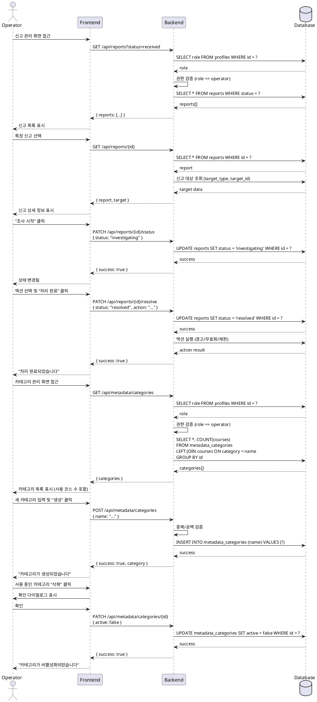

# UC-012: 운영 (Operator)

## Primary Actor

Operator

## Precondition

- Operator 계정으로 로그인되어 있음
- 운영자 권한이 부여되어 있음

## Trigger

- 일반 사용자가 신고를 접수함
- Operator가 신고 처리 또는 메타데이터 관리 화면에 진입함

## Main Scenario

### 1. 신고 처리

1. **신고 목록 조회**: Operator가 신고 관리 화면에서 신고 목록을 조회함
2. **필터링**: 신고 유형(코스/과제/제출물/사용자), 상태(received/investigating/resolved)로 필터링 가능
3. **신고 선택**: Operator가 처리할 신고를 선택하여 상세 정보 확인 (신고자, 대상, 사유, 내용, 처리 이력)
4. **조사 시작**: "조사 시작" 버튼 클릭 → 상태 `investigating`으로 변경
5. **액션 선택 및 실행**:
   - 경고: 대상 사용자에게 경고 메시지 발송
   - 제출물 무효화: 제출물 점수 0점 처리, 상태 `invalidated`
   - 계정 제한: 사용자 계정 일시/영구 정지
   - 기각: 아무 조치 없이 종료
6. **처리 완료**: "처리 완료" 버튼 클릭 → 상태 `resolved`로 변경
7. **알림 발송**: 신고자 및 대상자에게 처리 결과 알림 (선택)

### 2. 메타데이터 관리

1. **메타데이터 목록 조회**: Operator가 카테고리 또는 난이도 관리 화면에 진입함
2. **목록 표시**: 모든 메타데이터를 활성화 여부 및 사용 중인 코스 수와 함께 표시함
3. **CRUD 작업**:
   - **생성**: 새 이름 입력 후 생성 (중복 검증)
   - **수정**: 기존 이름 수정
   - **비활성화**: 사용 중인 메타데이터는 비활성화 처리 (새 코스 생성 시 선택 불가, 기존 코스는 유지)
   - **삭제**: 사용하지 않는 메타데이터는 완전 삭제 가능
4. **결과 반영**: 메타데이터 목록 및 코스 생성 화면에 즉시 반영됨

## Edge Cases

### 1. 권한 없는 접근
- Operator가 아닌 사용자가 접근 시 403 에러, "접근 권한이 없습니다" 메시지 표시

### 2. 이미 처리된 신고 재처리
- `resolved` 상태의 신고는 처리 버튼 비활성화, 조회만 가능

### 3. 신고 대상 삭제됨
- 신고 대상이 이미 삭제된 경우 "대상 삭제됨" 표시, 처리는 가능

### 4. 사용 중인 메타데이터 삭제 시도
- "N개의 코스에서 사용 중입니다. 비활성화하시겠습니까?" 확인 다이얼로그 표시

### 5. 메타데이터 이름 중복
- UNIQUE 제약 위반 시 400 에러, "이미 존재하는 이름입니다" 메시지 표시

### 6. 메타데이터 이름 공백
- 빈 문자열 또는 공백만 있는 경우 400 에러, "이름을 입력해주세요" 메시지 표시

### 7. 존재하지 않는 신고 접근
- 존재하지 않는 신고 ID 접근 시 404 에러, "신고를 찾을 수 없습니다" 메시지 표시

## Business Rules

### 1. 권한
- Operator 역할만 접근 가능
- Learner, Instructor는 접근 불가

### 2. 신고 상태 전환
- `received` → `investigating` → `resolved` (일방향, 역방향 불가)

### 3. 신고 액션
- 경고: 대상 사용자에게 경고 메시지 발송
- 제출물 무효화: 점수 0점 처리, 상태 `invalidated`
- 계정 제한: 일시/영구 정지
- 기각: 아무 조치 없음
- 여러 액션 동시 실행 가능

### 4. 신고 유형
- 코스, 과제, 제출물, 사용자

### 5. 메타데이터 관리
- 이름은 UNIQUE (중복 불가)
- 사용 중인 메타데이터는 비활성화만 가능 (삭제 불가)
- 비활성화된 메타데이터는 새 코스 생성 시 선택 불가, 기존 코스는 유지

### 6. 처리 이력
- 모든 액션은 이력으로 기록 (처리자, 시각, 액션 종류, 결과)
- 신고자 및 대상자에게 알림 발송 (선택)

## Sequence Diagram

