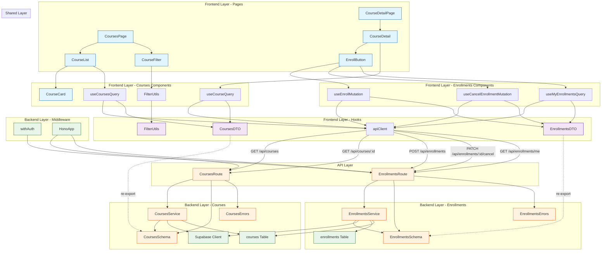

# UC-002 구현 계획

## 개요

### Backend 모듈 (Courses)

| 모듈명 | 위치 | 설명 |
|--------|------|------|
| **CoursesRoute** | `src/features/courses/backend/route.ts` | 코스 관련 API 엔드포인트 (`GET /api/courses`, `GET /api/courses/:courseId`) |
| **CoursesSchema** | `src/features/courses/backend/schema.ts` | 코스 요청/응답 Zod 스키마 정의 |
| **CoursesService** | `src/features/courses/backend/service.ts` | 코스 목록/상세 조회 비즈니스 로직 |
| **CoursesErrors** | `src/features/courses/backend/error.ts` | 코스 관련 에러 코드 정의 |

### Backend 모듈 (Enrollments)

| 모듈명 | 위치 | 설명 |
|--------|------|------|
| **EnrollmentsRoute** | `src/features/enrollments/backend/route.ts` | 수강신청 API 엔드포인트 (`GET /api/enrollments/me`, `POST /api/enrollments`, `PATCH /api/enrollments/:id/cancel`) |
| **EnrollmentsSchema** | `src/features/enrollments/backend/schema.ts` | 수강신청 요청/응답 Zod 스키마 정의 |
| **EnrollmentsService** | `src/features/enrollments/backend/service.ts` | 수강신청/취소/조회 비즈니스 로직 |
| **EnrollmentsErrors** | `src/features/enrollments/backend/error.ts` | 수강신청 관련 에러 코드 정의 |

### Backend 모듈 (Middleware)

| 모듈명 | 위치 | 설명 |
|--------|------|------|
| **withAuth** | `src/backend/middleware/auth.ts` | JWT 토큰 검증 및 사용자 정보 주입 미들웨어 |
| **HonoAppUpdate** | `src/backend/hono/app.ts` (수정) | `registerCoursesRoutes()`, `registerEnrollmentsRoutes()` 호출 추가 |

### Frontend 모듈 (Courses)

| 모듈명 | 위치 | 설명 |
|--------|------|------|
| **CoursesPage** | `src/app/courses/page.tsx` | 코스 카탈로그 페이지 (Next.js Page) |
| **CourseDetailPage** | `src/app/courses/[courseId]/page.tsx` | 코스 상세 페이지 (Next.js Page) |
| **CourseList** | `src/features/courses/components/CourseList.tsx` | 코스 목록 표시 컴포넌트 |
| **CourseCard** | `src/features/courses/components/CourseCard.tsx` | 코스 카드 UI 컴포넌트 |
| **CourseDetail** | `src/features/courses/components/CourseDetail.tsx` | 코스 상세 정보 표시 컴포넌트 |
| **CourseFilter** | `src/features/courses/components/CourseFilter.tsx` | 검색/필터/정렬 UI 컴포넌트 |
| **useCoursesQuery** | `src/features/courses/hooks/useCoursesQuery.ts` | 코스 목록 조회 React Query 훅 |
| **useCourseQuery** | `src/features/courses/hooks/useCourseQuery.ts` | 코스 상세 조회 React Query 훅 |
| **CoursesDTO** | `src/features/courses/lib/dto.ts` | Backend 스키마 재노출 |
| **FilterUtils** | `src/features/courses/lib/filter.ts` | 클라이언트 사이드 필터링/정렬 로직 |

### Frontend 모듈 (Enrollments)

| 모듈명 | 위치 | 설명 |
|--------|------|------|
| **EnrollButton** | `src/features/enrollments/components/EnrollButton.tsx` | 수강신청/취소 버튼 컴포넌트 |
| **useEnrollMutation** | `src/features/enrollments/hooks/useEnrollMutation.ts` | 수강신청 React Query mutation |
| **useCancelEnrollmentMutation** | `src/features/enrollments/hooks/useCancelEnrollmentMutation.ts` | 수강취소 React Query mutation |
| **useMyEnrollmentsQuery** | `src/features/enrollments/hooks/useMyEnrollmentsQuery.ts` | 내 수강 목록 조회 React Query 훅 |
| **EnrollmentsDTO** | `src/features/enrollments/lib/dto.ts` | Backend 스키마 재노출 |

---

## Module Dependency Diagram



---

## Implementation Plan

### 1. Backend 모듈 (Middleware)

#### 1.1 withAuth
**파일**: `src/backend/middleware/auth.ts`

**목적**: JWT 토큰 검증 및 사용자 정보 주입 미들웨어

**구현 내용**:
```typescript
import { createMiddleware } from 'hono/factory';
import type { AppEnv } from '@/backend/hono/context';
import { getSupabase } from '@/backend/hono/context';

export type AuthVariables = {
  userId: string;
  userRole: 'learner' | 'instructor' | 'operator';
};

export const withAuth = () =>
  createMiddleware<AppEnv & { Variables: AuthVariables }>(async (c, next) => {
    const authHeader = c.req.header('Authorization');

    if (!authHeader || !authHeader.startsWith('Bearer ')) {
      return c.json({ error: { code: 'UNAUTHORIZED', message: '인증이 필요합니다.' } }, 401);
    }

    const token = authHeader.substring(7);
    const supabase = getSupabase(c);

    const { data, error } = await supabase.auth.getUser(token);

    if (error || !data.user) {
      return c.json({ error: { code: 'UNAUTHORIZED', message: '유효하지 않은 토큰입니다.' } }, 401);
    }

    // profiles 테이블에서 역할 조회
    const { data: profile, error: profileError } = await supabase
      .from('profiles')
      .select('role')
      .eq('id', data.user.id)
      .single();

    if (profileError || !profile) {
      return c.json({ error: { code: 'UNAUTHORIZED', message: '사용자 정보를 찾을 수 없습니다.' } }, 401);
    }

    c.set('userId', data.user.id);
    c.set('userRole', profile.role as 'learner' | 'instructor' | 'operator');

    await next();
  });
```

**Unit Tests**:
```typescript
describe('withAuth', () => {
  it('Authorization 헤더가 없으면 401 반환', async () => {
    const response = await app.request('/protected', { headers: {} });
    expect(response.status).toBe(401);
  });

  it('Bearer 토큰 형식이 아니면 401 반환', async () => {
    const response = await app.request('/protected', {
      headers: { Authorization: 'InvalidToken' },
    });
    expect(response.status).toBe(401);
  });

  it('유효하지 않은 토큰이면 401 반환', async () => {
    const response = await app.request('/protected', {
      headers: { Authorization: 'Bearer invalid-token' },
    });
    expect(response.status).toBe(401);
  });

  it('유효한 토큰이면 userId와 userRole을 컨텍스트에 설정', async () => {
    const response = await app.request('/protected', {
      headers: { Authorization: 'Bearer valid-token' },
    });
    expect(response.status).toBe(200);
    // c.get('userId'), c.get('userRole') 검증
  });
});
```

---

### 2. Backend 모듈 (Courses)

#### 2.1 CoursesErrors
**파일**: `src/features/courses/backend/error.ts`

**목적**: 코스 관련 에러 코드 정의

**구현 내용**:
```typescript
export const coursesErrorCodes = {
  notFound: 'COURSE_NOT_FOUND',
  fetchError: 'COURSE_FETCH_ERROR',
  validationError: 'COURSE_VALIDATION_ERROR',
  invalidStatus: 'COURSE_INVALID_STATUS',
} as const;

type CoursesErrorValue = (typeof coursesErrorCodes)[keyof typeof coursesErrorCodes];

export type CoursesServiceError = CoursesErrorValue;
```

---

#### 2.2 CoursesSchema
**파일**: `src/features/courses/backend/schema.ts`

**목적**: 코스 요청/응답 Zod 스키마 정의

**구현 내용**:
```typescript
import { z } from 'zod';

// 쿼리 파라미터 스키마 (목록 조회)
export const CoursesQuerySchema = z.object({
  status: z.enum(['draft', 'published', 'archived']).optional().default('published'),
  category: z.string().optional(),
  difficulty: z.enum(['beginner', 'intermediate', 'advanced']).optional(),
  search: z.string().optional(),
  sortBy: z.enum(['latest', 'popular']).optional().default('latest'),
});

export type CoursesQuery = z.infer<typeof CoursesQuerySchema>;

// 코스 응답 스키마
export const CourseResponseSchema = z.object({
  id: z.string().uuid(),
  instructorId: z.string().uuid(),
  title: z.string(),
  description: z.string().nullable(),
  category: z.string(),
  difficulty: z.enum(['beginner', 'intermediate', 'advanced']),
  curriculum: z.record(z.unknown()).nullable(), // JSONB
  status: z.enum(['draft', 'published', 'archived']),
  enrollmentCount: z.number().int().min(0),
  averageRating: z.number().min(0).max(5).nullable(),
  createdAt: z.string(),
  updatedAt: z.string(),
});

export type CourseResponse = z.infer<typeof CourseResponseSchema>;

// 코스 목록 응답 스키마
export const CoursesResponseSchema = z.object({
  courses: z.array(CourseResponseSchema),
  total: z.number().int().min(0),
});

export type CoursesResponse = z.infer<typeof CoursesResponseSchema>;

// DB 행 스키마
export const CourseRowSchema = z.object({
  id: z.string().uuid(),
  instructor_id: z.string().uuid(),
  title: z.string(),
  description: z.string().nullable(),
  category: z.string(),
  difficulty: z.enum(['beginner', 'intermediate', 'advanced']),
  curriculum: z.record(z.unknown()).nullable(),
  status: z.enum(['draft', 'published', 'archived']),
  created_at: z.string(),
  updated_at: z.string(),
});

export type CourseRow = z.infer<typeof CourseRowSchema>;

// 파라미터 스키마 (상세 조회)
export const CourseParamsSchema = z.object({
  courseId: z.string().uuid({ message: 'Course ID must be a valid UUID.' }),
});

export type CourseParams = z.infer<typeof CourseParamsSchema>;
```

**Unit Tests**:
```typescript
describe('CoursesQuerySchema', () => {
  it('status 기본값은 published', () => {
    const result = CoursesQuerySchema.parse({});
    expect(result.status).toBe('published');
  });

  it('유효한 쿼리 파라미터를 허용', () => {
    const result = CoursesQuerySchema.parse({
      status: 'published',
      category: 'Programming',
      difficulty: 'beginner',
      search: 'React',
      sortBy: 'popular',
    });
    expect(result.status).toBe('published');
  });

  it('유효하지 않은 status를 거부', () => {
    expect(() => CoursesQuerySchema.parse({ status: 'invalid' })).toThrow();
  });
});
```

---

#### 2.3 CoursesService
**파일**: `src/features/courses/backend/service.ts`

**목적**: 코스 목록/상세 조회 비즈니스 로직

**구현 내용**:
```typescript
import type { SupabaseClient } from '@supabase/supabase-js';
import { success, failure, type HandlerResult } from '@/backend/http/response';
import type { CoursesQuery, CoursesResponse, CourseResponse, CourseRow } from './schema';
import { CoursesResponseSchema, CourseResponseSchema, CourseRowSchema } from './schema';
import { coursesErrorCodes, type CoursesServiceError } from './error';

const COURSES_TABLE = 'courses';
const ENROLLMENTS_TABLE = 'enrollments';

export const getCourses = async (
  client: SupabaseClient,
  query: CoursesQuery,
): Promise<HandlerResult<CoursesResponse, CoursesServiceError, unknown>> => {
  let queryBuilder = client.from(COURSES_TABLE).select('*', { count: 'exact' });

  // 필터링
  if (query.status) {
    queryBuilder = queryBuilder.eq('status', query.status);
  }

  if (query.category) {
    queryBuilder = queryBuilder.eq('category', query.category);
  }

  if (query.difficulty) {
    queryBuilder = queryBuilder.eq('difficulty', query.difficulty);
  }

  if (query.search) {
    queryBuilder = queryBuilder.or(
      `title.ilike.%${query.search}%,description.ilike.%${query.search}%`,
    );
  }

  // 정렬
  if (query.sortBy === 'latest') {
    queryBuilder = queryBuilder.order('created_at', { ascending: false });
  }
  // popular 정렬은 클라이언트 사이드에서 처리 (enrollmentCount 기준)

  const { data, error, count } = await queryBuilder;

  if (error) {
    return failure(500, coursesErrorCodes.fetchError, error.message);
  }

  if (!data) {
    return success({ courses: [], total: 0 });
  }

  // 각 코스의 수강생 수 조회
  const coursesWithCounts = await Promise.all(
    data.map(async (course) => {
      const { count: enrollmentCount } = await client
        .from(ENROLLMENTS_TABLE)
        .select('*', { count: 'exact', head: true })
        .eq('course_id', course.id)
        .is('canceled_at', null);

      const rowParse = CourseRowSchema.safeParse(course);

      if (!rowParse.success) {
        return null;
      }

      return {
        id: rowParse.data.id,
        instructorId: rowParse.data.instructor_id,
        title: rowParse.data.title,
        description: rowParse.data.description,
        category: rowParse.data.category,
        difficulty: rowParse.data.difficulty,
        curriculum: rowParse.data.curriculum,
        status: rowParse.data.status,
        enrollmentCount: enrollmentCount ?? 0,
        averageRating: null, // TODO: 평균 평점 계산 (추후 구현)
        createdAt: rowParse.data.created_at,
        updatedAt: rowParse.data.updated_at,
      } satisfies CourseResponse;
    }),
  );

  const validCourses = coursesWithCounts.filter((c) => c !== null) as CourseResponse[];

  // popular 정렬이면 enrollmentCount 기준으로 정렬
  if (query.sortBy === 'popular') {
    validCourses.sort((a, b) => b.enrollmentCount - a.enrollmentCount);
  }

  const parsed = CoursesResponseSchema.safeParse({
    courses: validCourses,
    total: count ?? 0,
  });

  if (!parsed.success) {
    return failure(
      500,
      coursesErrorCodes.validationError,
      'Courses response validation failed.',
      parsed.error.format(),
    );
  }

  return success(parsed.data);
};

export const getCourseById = async (
  client: SupabaseClient,
  courseId: string,
): Promise<HandlerResult<CourseResponse, CoursesServiceError, unknown>> => {
  const { data, error } = await client
    .from(COURSES_TABLE)
    .select('*')
    .eq('id', courseId)
    .maybeSingle<CourseRow>();

  if (error) {
    return failure(500, coursesErrorCodes.fetchError, error.message);
  }

  if (!data) {
    return failure(404, coursesErrorCodes.notFound, '코스를 찾을 수 없습니다.');
  }

  const rowParse = CourseRowSchema.safeParse(data);

  if (!rowParse.success) {
    return failure(
      500,
      coursesErrorCodes.validationError,
      'Course row validation failed.',
      rowParse.error.format(),
    );
  }

  // 수강생 수 조회
  const { count: enrollmentCount } = await client
    .from(ENROLLMENTS_TABLE)
    .select('*', { count: 'exact', head: true })
    .eq('course_id', courseId)
    .is('canceled_at', null);

  const mapped = {
    id: rowParse.data.id,
    instructorId: rowParse.data.instructor_id,
    title: rowParse.data.title,
    description: rowParse.data.description,
    category: rowParse.data.category,
    difficulty: rowParse.data.difficulty,
    curriculum: rowParse.data.curriculum,
    status: rowParse.data.status,
    enrollmentCount: enrollmentCount ?? 0,
    averageRating: null,
    createdAt: rowParse.data.created_at,
    updatedAt: rowParse.data.updated_at,
  } satisfies CourseResponse;

  const parsed = CourseResponseSchema.safeParse(mapped);

  if (!parsed.success) {
    return failure(
      500,
      coursesErrorCodes.validationError,
      'Course response validation failed.',
      parsed.error.format(),
    );
  }

  return success(parsed.data);
};
```

**Unit Tests**:
```typescript
describe('getCourses', () => {
  it('published 코스만 조회', async () => {
    const result = await getCourses(mockClient, { status: 'published' });
    expect(result.ok).toBe(true);
    if (result.ok) {
      expect(result.data.courses.every((c) => c.status === 'published')).toBe(true);
    }
  });

  it('카테고리 필터링', async () => {
    const result = await getCourses(mockClient, { category: 'Programming' });
    expect(result.ok).toBe(true);
    if (result.ok) {
      expect(result.data.courses.every((c) => c.category === 'Programming')).toBe(true);
    }
  });

  it('검색어로 필터링 (제목 또는 설명)', async () => {
    const result = await getCourses(mockClient, { search: 'React' });
    expect(result.ok).toBe(true);
  });

  it('최신순 정렬', async () => {
    const result = await getCourses(mockClient, { sortBy: 'latest' });
    expect(result.ok).toBe(true);
    // createdAt 내림차순 검증
  });

  it('인기순 정렬 (수강생 수 기준)', async () => {
    const result = await getCourses(mockClient, { sortBy: 'popular' });
    expect(result.ok).toBe(true);
    // enrollmentCount 내림차순 검증
  });
});

describe('getCourseById', () => {
  it('존재하는 코스를 반환', async () => {
    const result = await getCourseById(mockClient, 'course-123');
    expect(result.ok).toBe(true);
    if (result.ok) {
      expect(result.data.id).toBe('course-123');
    }
  });

  it('존재하지 않는 코스는 404 반환', async () => {
    const result = await getCourseById(mockClient, 'non-existent');
    expect(result.ok).toBe(false);
    if (!result.ok) {
      expect(result.status).toBe(404);
    }
  });
});
```

---

#### 2.4 CoursesRoute
**파일**: `src/features/courses/backend/route.ts`

**목적**: 코스 관련 API 엔드포인트 정의

**구현 내용**:
```typescript
import type { Hono } from 'hono';
import type { AppEnv } from '@/backend/hono/context';
import { getSupabase, getLogger } from '@/backend/hono/context';
import { respond, failure } from '@/backend/http/response';
import { CoursesQuerySchema, CourseParamsSchema } from './schema';
import { getCourses, getCourseById } from './service';

export const registerCoursesRoutes = (app: Hono<AppEnv>) => {
  // 코스 목록 조회
  app.get('/api/courses', async (c) => {
    const queryParams = c.req.query();
    const parsedQuery = CoursesQuerySchema.safeParse(queryParams);

    if (!parsedQuery.success) {
      return respond(
        c,
        failure(
          400,
          'INVALID_QUERY_PARAMS',
          '쿼리 파라미터가 유효하지 않습니다.',
          parsedQuery.error.format(),
        ),
      );
    }

    const supabase = getSupabase(c);
    const logger = getLogger(c);

    const result = await getCourses(supabase, parsedQuery.data);

    if (!result.ok) {
      logger.error('Failed to fetch courses', result.error);
    }

    return respond(c, result);
  });

  // 코스 상세 조회
  app.get('/api/courses/:courseId', async (c) => {
    const parsedParams = CourseParamsSchema.safeParse({ courseId: c.req.param('courseId') });

    if (!parsedParams.success) {
      return respond(
        c,
        failure(
          400,
          'INVALID_COURSE_PARAMS',
          '코스 ID가 유효하지 않습니다.',
          parsedParams.error.format(),
        ),
      );
    }

    const supabase = getSupabase(c);
    const logger = getLogger(c);

    const result = await getCourseById(supabase, parsedParams.data.courseId);

    if (!result.ok) {
      logger.error('Failed to fetch course', result.error);
    }

    return respond(c, result);
  });
};
```

---

### 3. Backend 모듈 (Enrollments)

#### 3.1 EnrollmentsErrors
**파일**: `src/features/enrollments/backend/error.ts`

**목적**: 수강신청 관련 에러 코드 정의

**구현 내용**:
```typescript
export const enrollmentsErrorCodes = {
  notFound: 'ENROLLMENT_NOT_FOUND',
  alreadyEnrolled: 'ENROLLMENT_ALREADY_ENROLLED',
  courseNotPublished: 'ENROLLMENT_COURSE_NOT_PUBLISHED',
  notLearner: 'ENROLLMENT_NOT_LEARNER',
  alreadyCanceled: 'ENROLLMENT_ALREADY_CANCELED',
  fetchError: 'ENROLLMENT_FETCH_ERROR',
  createError: 'ENROLLMENT_CREATE_ERROR',
  cancelError: 'ENROLLMENT_CANCEL_ERROR',
  validationError: 'ENROLLMENT_VALIDATION_ERROR',
} as const;

type EnrollmentsErrorValue = (typeof enrollmentsErrorCodes)[keyof typeof enrollmentsErrorCodes];

export type EnrollmentsServiceError = EnrollmentsErrorValue;
```

---

#### 3.2 EnrollmentsSchema
**파일**: `src/features/enrollments/backend/schema.ts`

**목적**: 수강신청 요청/응답 Zod 스키마 정의

**구현 내용**:
```typescript
import { z } from 'zod';

// 수강신청 요청 스키마
export const EnrollRequestSchema = z.object({
  courseId: z.string().uuid({ message: 'Course ID must be a valid UUID.' }),
});

export type EnrollRequest = z.infer<typeof EnrollRequestSchema>;

// 수강신청 응답 스키마
export const EnrollmentResponseSchema = z.object({
  id: z.string().uuid(),
  userId: z.string().uuid(),
  courseId: z.string().uuid(),
  enrolledAt: z.string(),
  canceledAt: z.string().nullable(),
  createdAt: z.string(),
  updatedAt: z.string(),
});

export type EnrollmentResponse = z.infer<typeof EnrollmentResponseSchema>;

// 내 수강 목록 응답 스키마
export const MyEnrollmentsResponseSchema = z.object({
  enrollments: z.array(EnrollmentResponseSchema),
});

export type MyEnrollmentsResponse = z.infer<typeof MyEnrollmentsResponseSchema>;

// DB 행 스키마
export const EnrollmentRowSchema = z.object({
  id: z.string().uuid(),
  user_id: z.string().uuid(),
  course_id: z.string().uuid(),
  enrolled_at: z.string(),
  canceled_at: z.string().nullable(),
  created_at: z.string(),
  updated_at: z.string(),
});

export type EnrollmentRow = z.infer<typeof EnrollmentRowSchema>;

// 파라미터 스키마
export const EnrollmentParamsSchema = z.object({
  enrollmentId: z.string().uuid({ message: 'Enrollment ID must be a valid UUID.' }),
});

export type EnrollmentParams = z.infer<typeof EnrollmentParamsSchema>;

// 쿼리 파라미터 스키마 (내 수강 목록)
export const MyEnrollmentsQuerySchema = z.object({
  courseId: z.string().uuid().optional(),
});

export type MyEnrollmentsQuery = z.infer<typeof MyEnrollmentsQuerySchema>;
```

---

#### 3.3 EnrollmentsService
**파일**: `src/features/enrollments/backend/service.ts`

**목적**: 수강신청/취소/조회 비즈니스 로직

**구현 내용**:
```typescript
import type { SupabaseClient } from '@supabase/supabase-js';
import { success, failure, type HandlerResult } from '@/backend/http/response';
import type {
  EnrollRequest,
  EnrollmentResponse,
  MyEnrollmentsResponse,
  EnrollmentRow,
  MyEnrollmentsQuery,
} from './schema';
import {
  EnrollmentResponseSchema,
  MyEnrollmentsResponseSchema,
  EnrollmentRowSchema,
} from './schema';
import { enrollmentsErrorCodes, type EnrollmentsServiceError } from './error';

const ENROLLMENTS_TABLE = 'enrollments';
const COURSES_TABLE = 'courses';

export const enrollCourse = async (
  client: SupabaseClient,
  userId: string,
  userRole: string,
  request: EnrollRequest,
): Promise<HandlerResult<EnrollmentResponse, EnrollmentsServiceError, unknown>> => {
  // 1. 역할 확인
  if (userRole !== 'learner') {
    return failure(403, enrollmentsErrorCodes.notLearner, '학습자만 수강신청할 수 있습니다.');
  }

  // 2. 코스 상태 확인
  const { data: course, error: courseError } = await client
    .from(COURSES_TABLE)
    .select('status')
    .eq('id', request.courseId)
    .maybeSingle();

  if (courseError) {
    return failure(500, enrollmentsErrorCodes.fetchError, courseError.message);
  }

  if (!course) {
    return failure(404, enrollmentsErrorCodes.notFound, '코스를 찾을 수 없습니다.');
  }

  if (course.status !== 'published') {
    return failure(
      400,
      enrollmentsErrorCodes.courseNotPublished,
      '현재 수강신청할 수 없는 코스입니다.',
    );
  }

  // 3. 중복 수강 확인
  const { data: existing, error: existingError } = await client
    .from(ENROLLMENTS_TABLE)
    .select('*')
    .eq('user_id', userId)
    .eq('course_id', request.courseId)
    .is('canceled_at', null)
    .maybeSingle();

  if (existingError) {
    return failure(500, enrollmentsErrorCodes.fetchError, existingError.message);
  }

  if (existing) {
    return failure(409, enrollmentsErrorCodes.alreadyEnrolled, '이미 수강신청한 코스입니다.');
  }

  // 4. 수강신청 생성
  const { data, error } = await client
    .from(ENROLLMENTS_TABLE)
    .insert({
      user_id: userId,
      course_id: request.courseId,
      enrolled_at: new Date().toISOString(),
    })
    .select()
    .single<EnrollmentRow>();

  if (error) {
    return failure(500, enrollmentsErrorCodes.createError, error.message);
  }

  const rowParse = EnrollmentRowSchema.safeParse(data);

  if (!rowParse.success) {
    return failure(
      500,
      enrollmentsErrorCodes.validationError,
      'Enrollment row validation failed.',
      rowParse.error.format(),
    );
  }

  const mapped = {
    id: rowParse.data.id,
    userId: rowParse.data.user_id,
    courseId: rowParse.data.course_id,
    enrolledAt: rowParse.data.enrolled_at,
    canceledAt: rowParse.data.canceled_at,
    createdAt: rowParse.data.created_at,
    updatedAt: rowParse.data.updated_at,
  } satisfies EnrollmentResponse;

  const parsed = EnrollmentResponseSchema.safeParse(mapped);

  if (!parsed.success) {
    return failure(
      500,
      enrollmentsErrorCodes.validationError,
      'Enrollment response validation failed.',
      parsed.error.format(),
    );
  }

  return success(parsed.data, 201);
};

export const cancelEnrollment = async (
  client: SupabaseClient,
  userId: string,
  enrollmentId: string,
): Promise<HandlerResult<EnrollmentResponse, EnrollmentsServiceError, unknown>> => {
  // 1. enrollment 조회
  const { data, error } = await client
    .from(ENROLLMENTS_TABLE)
    .select('*')
    .eq('id', enrollmentId)
    .eq('user_id', userId)
    .maybeSingle<EnrollmentRow>();

  if (error) {
    return failure(500, enrollmentsErrorCodes.fetchError, error.message);
  }

  if (!data) {
    return failure(404, enrollmentsErrorCodes.notFound, '수강신청 내역을 찾을 수 없습니다.');
  }

  // 2. 이미 취소된 경우
  if (data.canceled_at) {
    return failure(400, enrollmentsErrorCodes.alreadyCanceled, '이미 취소된 수강신청입니다.');
  }

  // 3. 수강 취소 (soft delete)
  const { data: updated, error: updateError } = await client
    .from(ENROLLMENTS_TABLE)
    .update({ canceled_at: new Date().toISOString() })
    .eq('id', enrollmentId)
    .select()
    .single<EnrollmentRow>();

  if (updateError) {
    return failure(500, enrollmentsErrorCodes.cancelError, updateError.message);
  }

  const rowParse = EnrollmentRowSchema.safeParse(updated);

  if (!rowParse.success) {
    return failure(
      500,
      enrollmentsErrorCodes.validationError,
      'Enrollment row validation failed.',
      rowParse.error.format(),
    );
  }

  const mapped = {
    id: rowParse.data.id,
    userId: rowParse.data.user_id,
    courseId: rowParse.data.course_id,
    enrolledAt: rowParse.data.enrolled_at,
    canceledAt: rowParse.data.canceled_at,
    createdAt: rowParse.data.created_at,
    updatedAt: rowParse.data.updated_at,
  } satisfies EnrollmentResponse;

  const parsed = EnrollmentResponseSchema.safeParse(mapped);

  if (!parsed.success) {
    return failure(
      500,
      enrollmentsErrorCodes.validationError,
      'Enrollment response validation failed.',
      parsed.error.format(),
    );
  }

  return success(parsed.data);
};

export const getMyEnrollments = async (
  client: SupabaseClient,
  userId: string,
  query: MyEnrollmentsQuery,
): Promise<HandlerResult<MyEnrollmentsResponse, EnrollmentsServiceError, unknown>> => {
  let queryBuilder = client
    .from(ENROLLMENTS_TABLE)
    .select('*')
    .eq('user_id', userId)
    .is('canceled_at', null);

  if (query.courseId) {
    queryBuilder = queryBuilder.eq('course_id', query.courseId);
  }

  const { data, error } = await queryBuilder;

  if (error) {
    return failure(500, enrollmentsErrorCodes.fetchError, error.message);
  }

  if (!data) {
    return success({ enrollments: [] });
  }

  const enrollments = data
    .map((row) => {
      const rowParse = EnrollmentRowSchema.safeParse(row);

      if (!rowParse.success) {
        return null;
      }

      return {
        id: rowParse.data.id,
        userId: rowParse.data.user_id,
        courseId: rowParse.data.course_id,
        enrolledAt: rowParse.data.enrolled_at,
        canceledAt: rowParse.data.canceled_at,
        createdAt: rowParse.data.created_at,
        updatedAt: rowParse.data.updated_at,
      } satisfies EnrollmentResponse;
    })
    .filter((e) => e !== null) as EnrollmentResponse[];

  const parsed = MyEnrollmentsResponseSchema.safeParse({ enrollments });

  if (!parsed.success) {
    return failure(
      500,
      enrollmentsErrorCodes.validationError,
      'Enrollments response validation failed.',
      parsed.error.format(),
    );
  }

  return success(parsed.data);
};
```

**Unit Tests**:
```typescript
describe('enrollCourse', () => {
  it('Learner가 published 코스에 수강신청 성공', async () => {
    const result = await enrollCourse(mockClient, 'user-123', 'learner', {
      courseId: 'course-456',
    });
    expect(result.ok).toBe(true);
    if (result.ok) {
      expect(result.status).toBe(201);
    }
  });

  it('Instructor는 수강신청 불가 (403)', async () => {
    const result = await enrollCourse(mockClient, 'user-123', 'instructor', {
      courseId: 'course-456',
    });
    expect(result.ok).toBe(false);
    if (!result.ok) {
      expect(result.status).toBe(403);
    }
  });

  it('draft 코스는 수강신청 불가 (400)', async () => {
    const result = await enrollCourse(mockClient, 'user-123', 'learner', {
      courseId: 'draft-course',
    });
    expect(result.ok).toBe(false);
    if (!result.ok) {
      expect(result.status).toBe(400);
    }
  });

  it('중복 수강신청 불가 (409)', async () => {
    await enrollCourse(mockClient, 'user-123', 'learner', { courseId: 'course-456' });
    const result = await enrollCourse(mockClient, 'user-123', 'learner', {
      courseId: 'course-456',
    });
    expect(result.ok).toBe(false);
    if (!result.ok) {
      expect(result.status).toBe(409);
    }
  });
});

describe('cancelEnrollment', () => {
  it('수강 취소 성공', async () => {
    const result = await cancelEnrollment(mockClient, 'user-123', 'enrollment-789');
    expect(result.ok).toBe(true);
    if (result.ok) {
      expect(result.data.canceledAt).not.toBeNull();
    }
  });

  it('이미 취소된 enrollment는 다시 취소 불가 (400)', async () => {
    await cancelEnrollment(mockClient, 'user-123', 'enrollment-789');
    const result = await cancelEnrollment(mockClient, 'user-123', 'enrollment-789');
    expect(result.ok).toBe(false);
    if (!result.ok) {
      expect(result.status).toBe(400);
    }
  });

  it('존재하지 않는 enrollment는 404', async () => {
    const result = await cancelEnrollment(mockClient, 'user-123', 'non-existent');
    expect(result.ok).toBe(false);
    if (!result.ok) {
      expect(result.status).toBe(404);
    }
  });
});
```

---

#### 3.4 EnrollmentsRoute
**파일**: `src/features/enrollments/backend/route.ts`

**목적**: 수강신청 API 엔드포인트 정의

**구현 내용**:
```typescript
import type { Hono } from 'hono';
import type { AppEnv } from '@/backend/hono/context';
import { getSupabase, getLogger } from '@/backend/hono/context';
import { respond, failure } from '@/backend/http/response';
import { withAuth } from '@/backend/middleware/auth';
import {
  EnrollRequestSchema,
  EnrollmentParamsSchema,
  MyEnrollmentsQuerySchema,
} from './schema';
import { enrollCourse, cancelEnrollment, getMyEnrollments } from './service';

export const registerEnrollmentsRoutes = (app: Hono<AppEnv>) => {
  // 내 수강 목록 조회
  app.get('/api/enrollments/me', withAuth(), async (c) => {
    const queryParams = c.req.query();
    const parsedQuery = MyEnrollmentsQuerySchema.safeParse(queryParams);

    if (!parsedQuery.success) {
      return respond(
        c,
        failure(
          400,
          'INVALID_QUERY_PARAMS',
          '쿼리 파라미터가 유효하지 않습니다.',
          parsedQuery.error.format(),
        ),
      );
    }

    const supabase = getSupabase(c);
    const logger = getLogger(c);
    const userId = c.get('userId');

    const result = await getMyEnrollments(supabase, userId, parsedQuery.data);

    if (!result.ok) {
      logger.error('Failed to fetch my enrollments', result.error);
    }

    return respond(c, result);
  });

  // 수강신청
  app.post('/api/enrollments', withAuth(), async (c) => {
    const body = await c.req.json();
    const parsedRequest = EnrollRequestSchema.safeParse(body);

    if (!parsedRequest.success) {
      return respond(
        c,
        failure(
          400,
          'INVALID_ENROLL_REQUEST',
          '요청 데이터가 유효하지 않습니다.',
          parsedRequest.error.format(),
        ),
      );
    }

    const supabase = getSupabase(c);
    const logger = getLogger(c);
    const userId = c.get('userId');
    const userRole = c.get('userRole');

    const result = await enrollCourse(supabase, userId, userRole, parsedRequest.data);

    if (!result.ok) {
      logger.error('Failed to enroll course', result.error);
    }

    return respond(c, result);
  });

  // 수강 취소
  app.patch('/api/enrollments/:enrollmentId/cancel', withAuth(), async (c) => {
    const parsedParams = EnrollmentParamsSchema.safeParse({
      enrollmentId: c.req.param('enrollmentId'),
    });

    if (!parsedParams.success) {
      return respond(
        c,
        failure(
          400,
          'INVALID_ENROLLMENT_PARAMS',
          'Enrollment ID가 유효하지 않습니다.',
          parsedParams.error.format(),
        ),
      );
    }

    const supabase = getSupabase(c);
    const logger = getLogger(c);
    const userId = c.get('userId');

    const result = await cancelEnrollment(
      supabase,
      userId,
      parsedParams.data.enrollmentId,
    );

    if (!result.ok) {
      logger.error('Failed to cancel enrollment', result.error);
    }

    return respond(c, result);
  });
};
```

---

### 4. Frontend 모듈 (Courses)

#### 4.1 CoursesDTO
**파일**: `src/features/courses/lib/dto.ts`

**목적**: Backend 스키마 재노출

**구현 내용**:
```typescript
export {
  CoursesQuerySchema,
  CourseResponseSchema,
  CoursesResponseSchema,
  CourseParamsSchema,
  type CoursesQuery,
  type CourseResponse,
  type CoursesResponse,
  type CourseParams,
} from '@/features/courses/backend/schema';
```

---

#### 4.2 FilterUtils
**파일**: `src/features/courses/lib/filter.ts`

**목적**: 클라이언트 사이드 필터링/정렬 로직

**구현 내용**:
```typescript
import type { CourseResponse } from './dto';

export const filterCourses = (
  courses: CourseResponse[],
  search?: string,
  category?: string,
  difficulty?: string,
): CourseResponse[] => {
  let filtered = courses;

  if (search) {
    const lowerSearch = search.toLowerCase();
    filtered = filtered.filter(
      (course) =>
        course.title.toLowerCase().includes(lowerSearch) ||
        course.description?.toLowerCase().includes(lowerSearch),
    );
  }

  if (category) {
    filtered = filtered.filter((course) => course.category === category);
  }

  if (difficulty) {
    filtered = filtered.filter((course) => course.difficulty === difficulty);
  }

  return filtered;
};

export const sortCourses = (
  courses: CourseResponse[],
  sortBy: 'latest' | 'popular',
): CourseResponse[] => {
  const sorted = [...courses];

  if (sortBy === 'latest') {
    sorted.sort((a, b) => new Date(b.createdAt).getTime() - new Date(a.createdAt).getTime());
  } else if (sortBy === 'popular') {
    sorted.sort((a, b) => b.enrollmentCount - a.enrollmentCount);
  }

  return sorted;
};
```

**Unit Tests**:
```typescript
describe('filterCourses', () => {
  it('검색어로 제목 필터링', () => {
    const result = filterCourses(mockCourses, 'React');
    expect(result.every((c) => c.title.includes('React'))).toBe(true);
  });

  it('카테고리로 필터링', () => {
    const result = filterCourses(mockCourses, undefined, 'Programming');
    expect(result.every((c) => c.category === 'Programming')).toBe(true);
  });

  it('난이도로 필터링', () => {
    const result = filterCourses(mockCourses, undefined, undefined, 'beginner');
    expect(result.every((c) => c.difficulty === 'beginner')).toBe(true);
  });
});

describe('sortCourses', () => {
  it('최신순 정렬', () => {
    const result = sortCourses(mockCourses, 'latest');
    // createdAt 내림차순 검증
  });

  it('인기순 정렬', () => {
    const result = sortCourses(mockCourses, 'popular');
    // enrollmentCount 내림차순 검증
  });
});
```

---

#### 4.3 useCoursesQuery
**파일**: `src/features/courses/hooks/useCoursesQuery.ts`

**목적**: 코스 목록 조회 React Query 훅

**구현 내용**:
```typescript
'use client';

import { useQuery } from '@tanstack/react-query';
import { apiClient, extractApiErrorMessage } from '@/lib/remote/api-client';
import { CoursesResponseSchema, type CoursesQuery } from '@/features/courses/lib/dto';

const fetchCourses = async (query: CoursesQuery) => {
  try {
    const params = new URLSearchParams();
    if (query.status) params.append('status', query.status);
    if (query.category) params.append('category', query.category);
    if (query.difficulty) params.append('difficulty', query.difficulty);
    if (query.search) params.append('search', query.search);
    if (query.sortBy) params.append('sortBy', query.sortBy);

    const { data } = await apiClient.get(`/api/courses?${params.toString()}`);
    return CoursesResponseSchema.parse(data);
  } catch (error) {
    const message = extractApiErrorMessage(error, '코스 목록을 불러오는데 실패했습니다.');
    throw new Error(message);
  }
};

export const useCoursesQuery = (query: CoursesQuery = { status: 'published' }) =>
  useQuery({
    queryKey: ['courses', query],
    queryFn: () => fetchCourses(query),
    staleTime: 5 * 60 * 1000, // 5분
  });
```

**QA Sheet**:
| 시나리오 | 입력 | 기대 결과 |
|---------|------|-----------|
| published 코스만 조회 | `{status: 'published'}` | published 코스 목록 반환 |
| 카테고리 필터 | `{category: 'Programming'}` | Programming 카테고리 코스만 반환 |
| 검색어 | `{search: 'React'}` | 제목/설명에 'React' 포함된 코스 반환 |
| 최신순 정렬 | `{sortBy: 'latest'}` | createdAt 내림차순 정렬 |
| 인기순 정렬 | `{sortBy: 'popular'}` | enrollmentCount 내림차순 정렬 |

---

#### 4.4 useCourseQuery
**파일**: `src/features/courses/hooks/useCourseQuery.ts`

**목적**: 코스 상세 조회 React Query 훅

**구현 내용**:
```typescript
'use client';

import { useQuery } from '@tanstack/react-query';
import { apiClient, extractApiErrorMessage } from '@/lib/remote/api-client';
import { CourseResponseSchema } from '@/features/courses/lib/dto';

const fetchCourse = async (courseId: string) => {
  try {
    const { data } = await apiClient.get(`/api/courses/${courseId}`);
    return CourseResponseSchema.parse(data);
  } catch (error) {
    const message = extractApiErrorMessage(error, '코스 정보를 불러오는데 실패했습니다.');
    throw new Error(message);
  }
};

export const useCourseQuery = (courseId: string) =>
  useQuery({
    queryKey: ['course', courseId],
    queryFn: () => fetchCourse(courseId),
    enabled: Boolean(courseId),
    staleTime: 5 * 60 * 1000,
  });
```

**QA Sheet**:
| 시나리오 | 입력 | 기대 결과 |
|---------|------|-----------|
| 존재하는 코스 조회 | `'course-123'` | 코스 상세 정보 반환 |
| 존재하지 않는 코스 | `'non-existent'` | 에러 발생 "코스를 찾을 수 없습니다" |
| 빈 courseId | `''` | 쿼리 실행 안 됨 (enabled: false) |

---

#### 4.5 CourseFilter
**파일**: `src/features/courses/components/CourseFilter.tsx`

**목적**: 검색/필터/정렬 UI 컴포넌트

**구현 내용**:
```typescript
'use client';

import { Input } from '@/components/ui/input';
import { Label } from '@/components/ui/label';
import { Select } from '@/components/ui/select';

type CourseFilterProps = {
  search: string;
  category: string;
  difficulty: string;
  sortBy: 'latest' | 'popular';
  onSearchChange: (search: string) => void;
  onCategoryChange: (category: string) => void;
  onDifficultyChange: (difficulty: string) => void;
  onSortByChange: (sortBy: 'latest' | 'popular') => void;
};

export const CourseFilter = ({
  search,
  category,
  difficulty,
  sortBy,
  onSearchChange,
  onCategoryChange,
  onDifficultyChange,
  onSortByChange,
}: CourseFilterProps) => {
  return (
    <div className="space-y-4">
      {/* 검색 */}
      <div>
        <Label htmlFor="search">검색</Label>
        <Input
          id="search"
          type="text"
          placeholder="코스 제목 또는 설명 검색"
          value={search}
          onChange={(e) => onSearchChange(e.target.value)}
        />
      </div>

      <div className="grid grid-cols-3 gap-4">
        {/* 카테고리 */}
        <div>
          <Label htmlFor="category">카테고리</Label>
          <Select value={category} onValueChange={onCategoryChange}>
            <option value="">전체</option>
            <option value="Programming">Programming</option>
            <option value="Design">Design</option>
            <option value="Business">Business</option>
            <option value="Marketing">Marketing</option>
          </Select>
        </div>

        {/* 난이도 */}
        <div>
          <Label htmlFor="difficulty">난이도</Label>
          <Select value={difficulty} onValueChange={onDifficultyChange}>
            <option value="">전체</option>
            <option value="beginner">Beginner</option>
            <option value="intermediate">Intermediate</option>
            <option value="advanced">Advanced</option>
          </Select>
        </div>

        {/* 정렬 */}
        <div>
          <Label htmlFor="sortBy">정렬</Label>
          <Select value={sortBy} onValueChange={onSortByChange}>
            <option value="latest">최신순</option>
            <option value="popular">인기순</option>
          </Select>
        </div>
      </div>
    </div>
  );
};
```

**QA Sheet**:
| 시나리오 | 사용자 액션 | 기대 결과 |
|---------|------------|-----------|
| 검색어 입력 | "React" 입력 | onSearchChange("React") 호출 |
| 카테고리 선택 | "Programming" 선택 | onCategoryChange("Programming") 호출 |
| 난이도 선택 | "beginner" 선택 | onDifficultyChange("beginner") 호출 |
| 정렬 변경 | "인기순" 선택 | onSortByChange("popular") 호출 |

---

#### 4.6 CourseCard
**파일**: `src/features/courses/components/CourseCard.tsx`

**목적**: 코스 카드 UI 컴포넌트

**구현 내용**:
```typescript
'use client';

import Link from 'next/link';
import { Card, CardContent, CardDescription, CardHeader, CardTitle } from '@/components/ui/card';
import { Badge } from '@/components/ui/badge';
import type { CourseResponse } from '@/features/courses/lib/dto';

type CourseCardProps = {
  course: CourseResponse;
};

export const CourseCard = ({ course }: CourseCardProps) => {
  return (
    <Link href={`/courses/${course.id}`}>
      <Card className="hover:shadow-lg transition-shadow cursor-pointer">
        <CardHeader>
          <div className="flex items-start justify-between">
            <CardTitle>{course.title}</CardTitle>
            <Badge>{course.difficulty}</Badge>
          </div>
          <CardDescription>{course.description ?? '설명 없음'}</CardDescription>
        </CardHeader>
        <CardContent>
          <div className="flex items-center justify-between text-sm text-gray-500">
            <span>{course.category}</span>
            <span>수강생: {course.enrollmentCount}명</span>
          </div>
        </CardContent>
      </Card>
    </Link>
  );
};
```

**QA Sheet**:
| 시나리오 | Props | 기대 결과 |
|---------|-------|-----------|
| 코스 카드 표시 | `course` 객체 | 제목, 설명, 카테고리, 난이도, 수강생 수 표시 |
| 카드 클릭 | - | `/courses/{courseId}` 페이지로 이동 |

---

#### 4.7 CourseList
**파일**: `src/features/courses/components/CourseList.tsx`

**목적**: 코스 목록 표시 컴포넌트

**구현 내용**:
```typescript
'use client';

import { CourseCard } from './CourseCard';
import type { CourseResponse } from '@/features/courses/lib/dto';

type CourseListProps = {
  courses: CourseResponse[];
  isLoading?: boolean;
};

export const CourseList = ({ courses, isLoading }: CourseListProps) => {
  if (isLoading) {
    return <div>로딩 중...</div>;
  }

  if (courses.length === 0) {
    return <div className="text-center text-gray-500">코스가 없습니다.</div>;
  }

  return (
    <div className="grid grid-cols-1 md:grid-cols-2 lg:grid-cols-3 gap-4">
      {courses.map((course) => (
        <CourseCard key={course.id} course={course} />
      ))}
    </div>
  );
};
```

**QA Sheet**:
| 시나리오 | Props | 기대 결과 |
|---------|-------|-----------|
| 코스 목록 표시 | `courses: [...]` | 각 코스를 CourseCard로 표시 |
| 로딩 중 | `isLoading: true` | "로딩 중..." 표시 |
| 빈 목록 | `courses: []` | "코스가 없습니다." 표시 |

---

#### 4.8 CourseDetail
**파일**: `src/features/courses/components/CourseDetail.tsx`

**목적**: 코스 상세 정보 표시 컴포넌트

**구현 내용**:
```typescript
'use client';

import { Card, CardContent, CardDescription, CardHeader, CardTitle } from '@/components/ui/card';
import { Badge } from '@/components/ui/badge';
import { EnrollButton } from '@/features/enrollments/components/EnrollButton';
import type { CourseResponse } from '@/features/courses/lib/dto';

type CourseDetailProps = {
  course: CourseResponse;
};

export const CourseDetail = ({ course }: CourseDetailProps) => {
  return (
    <div className="space-y-6">
      <Card>
        <CardHeader>
          <div className="flex items-start justify-between">
            <div>
              <CardTitle className="text-3xl">{course.title}</CardTitle>
              <CardDescription className="mt-2">{course.description}</CardDescription>
            </div>
            <Badge>{course.difficulty}</Badge>
          </div>
        </CardHeader>
        <CardContent>
          <div className="space-y-4">
            <div className="flex items-center gap-4 text-sm text-gray-500">
              <span>카테고리: {course.category}</span>
              <span>수강생: {course.enrollmentCount}명</span>
              {course.averageRating && <span>평점: {course.averageRating}/5</span>}
            </div>

            {/* 수강신청/취소 버튼 */}
            <EnrollButton courseId={course.id} />

            {/* 커리큘럼 */}
            {course.curriculum && (
              <div>
                <h3 className="font-semibold mb-2">커리큘럼</h3>
                <pre className="bg-gray-100 p-4 rounded">
                  {JSON.stringify(course.curriculum, null, 2)}
                </pre>
              </div>
            )}
          </div>
        </CardContent>
      </Card>
    </div>
  );
};
```

**QA Sheet**:
| 시나리오 | Props | 기대 결과 |
|---------|-------|-----------|
| 코스 상세 표시 | `course` 객체 | 제목, 설명, 카테고리, 난이도, 수강생 수, 커리큘럼, 수강신청 버튼 표시 |

---

#### 4.9 CoursesPage
**파일**: `src/app/courses/page.tsx`

**목적**: 코스 카탈로그 페이지

**구현 내용**:
```typescript
'use client';

import { useState } from 'react';
import { CourseList } from '@/features/courses/components/CourseList';
import { CourseFilter } from '@/features/courses/components/CourseFilter';
import { useCoursesQuery } from '@/features/courses/hooks/useCoursesQuery';
import { filterCourses, sortCourses } from '@/features/courses/lib/filter';

export default function CoursesPage() {
  const [search, setSearch] = useState('');
  const [category, setCategory] = useState('');
  const [difficulty, setDifficulty] = useState('');
  const [sortBy, setSortBy] = useState<'latest' | 'popular'>('latest');

  const { data, isLoading } = useCoursesQuery({ status: 'published' });

  // 클라이언트 사이드 필터링/정렬
  const filteredCourses = data
    ? sortCourses(filterCourses(data.courses, search, category, difficulty), sortBy)
    : [];

  return (
    <div className="container mx-auto py-8 space-y-6">
      <h1 className="text-3xl font-bold">코스 카탈로그</h1>

      <CourseFilter
        search={search}
        category={category}
        difficulty={difficulty}
        sortBy={sortBy}
        onSearchChange={setSearch}
        onCategoryChange={setCategory}
        onDifficultyChange={setDifficulty}
        onSortByChange={setSortBy}
      />

      <CourseList courses={filteredCourses} isLoading={isLoading} />
    </div>
  );
}
```

**QA Sheet**:
| 시나리오 | 사용자 액션 | 기대 결과 |
|---------|------------|-----------|
| 페이지 로드 | `/courses` 접속 | published 코스 목록 표시 |
| 검색어 입력 | "React" 입력 | React 포함된 코스만 표시 |
| 카테고리 선택 | "Programming" 선택 | Programming 카테고리만 표시 |
| 난이도 선택 | "beginner" 선택 | beginner 난이도만 표시 |
| 정렬 변경 | "인기순" 선택 | 수강생 수 내림차순 정렬 |

---

#### 4.10 CourseDetailPage
**파일**: `src/app/courses/[courseId]/page.tsx`

**목적**: 코스 상세 페이지

**구현 내용**:
```typescript
'use client';

import { use } from 'react';
import { CourseDetail } from '@/features/courses/components/CourseDetail';
import { useCourseQuery } from '@/features/courses/hooks/useCourseQuery';

type CourseDetailPageProps = {
  params: Promise<{ courseId: string }>;
};

export default function CourseDetailPage({ params }: CourseDetailPageProps) {
  const { courseId } = use(params);
  const { data: course, isLoading, error } = useCourseQuery(courseId);

  if (isLoading) {
    return <div className="container mx-auto py-8">로딩 중...</div>;
  }

  if (error) {
    return (
      <div className="container mx-auto py-8 text-red-500">
        {error instanceof Error ? error.message : '코스를 불러오는데 실패했습니다.'}
      </div>
    );
  }

  if (!course) {
    return <div className="container mx-auto py-8">코스를 찾을 수 없습니다.</div>;
  }

  return (
    <div className="container mx-auto py-8">
      <CourseDetail course={course} />
    </div>
  );
}
```

**QA Sheet**:
| 시나리오 | URL | 기대 결과 |
|---------|-----|-----------|
| 존재하는 코스 | `/courses/course-123` | 코스 상세 정보 표시 |
| 존재하지 않는 코스 | `/courses/non-existent` | 에러 메시지 표시 |
| 로딩 중 | - | "로딩 중..." 표시 |

---

### 5. Frontend 모듈 (Enrollments)

#### 5.1 EnrollmentsDTO
**파일**: `src/features/enrollments/lib/dto.ts`

**목적**: Backend 스키마 재노출

**구현 내용**:
```typescript
export {
  EnrollRequestSchema,
  EnrollmentResponseSchema,
  MyEnrollmentsResponseSchema,
  EnrollmentParamsSchema,
  MyEnrollmentsQuerySchema,
  type EnrollRequest,
  type EnrollmentResponse,
  type MyEnrollmentsResponse,
  type EnrollmentParams,
  type MyEnrollmentsQuery,
} from '@/features/enrollments/backend/schema';
```

---

#### 5.2 useMyEnrollmentsQuery
**파일**: `src/features/enrollments/hooks/useMyEnrollmentsQuery.ts`

**목적**: 내 수강 목록 조회 React Query 훅

**구현 내용**:
```typescript
'use client';

import { useQuery } from '@tanstack/react-query';
import { apiClient, extractApiErrorMessage } from '@/lib/remote/api-client';
import {
  MyEnrollmentsResponseSchema,
  type MyEnrollmentsQuery,
} from '@/features/enrollments/lib/dto';

const fetchMyEnrollments = async (query: MyEnrollmentsQuery) => {
  try {
    const params = new URLSearchParams();
    if (query.courseId) params.append('courseId', query.courseId);

    const { data } = await apiClient.get(`/api/enrollments/me?${params.toString()}`);
    return MyEnrollmentsResponseSchema.parse(data);
  } catch (error) {
    const message = extractApiErrorMessage(error, '수강 목록을 불러오는데 실패했습니다.');
    throw new Error(message);
  }
};

export const useMyEnrollmentsQuery = (query: MyEnrollmentsQuery = {}) =>
  useQuery({
    queryKey: ['myEnrollments', query],
    queryFn: () => fetchMyEnrollments(query),
    staleTime: 60 * 1000, // 1분
  });
```

**QA Sheet**:
| 시나리오 | 입력 | 기대 결과 |
|---------|------|-----------|
| 전체 수강 목록 | `{}` | 내가 수강 중인 모든 코스 반환 |
| 특정 코스 수강 여부 | `{courseId: 'course-123'}` | 해당 코스 수강 정보만 반환 |

---

#### 5.3 useEnrollMutation
**파일**: `src/features/enrollments/hooks/useEnrollMutation.ts`

**목적**: 수강신청 React Query mutation

**구현 내용**:
```typescript
'use client';

import { useMutation, useQueryClient } from '@tanstack/react-query';
import { apiClient, extractApiErrorMessage } from '@/lib/remote/api-client';
import {
  EnrollmentResponseSchema,
  type EnrollRequest,
} from '@/features/enrollments/lib/dto';

const enrollCourse = async (request: EnrollRequest) => {
  try {
    const { data } = await apiClient.post('/api/enrollments', request);
    return EnrollmentResponseSchema.parse(data);
  } catch (error) {
    const message = extractApiErrorMessage(error, '수강신청에 실패했습니다.');
    throw new Error(message);
  }
};

export const useEnrollMutation = () => {
  const queryClient = useQueryClient();

  return useMutation({
    mutationFn: enrollCourse,
    onSuccess: () => {
      // 내 수강 목록 캐시 무효화
      queryClient.invalidateQueries({ queryKey: ['myEnrollments'] });
      // 코스 상세 캐시 무효화 (수강생 수 업데이트)
      queryClient.invalidateQueries({ queryKey: ['course'] });
    },
  });
};
```

**QA Sheet**:
| 시나리오 | API 응답 | 기대 결과 |
|---------|---------|-----------|
| 수강신청 성공 | `201 Created` | 성공 처리 + 캐시 무효화 |
| 중복 수강신청 | `409 Conflict` | 에러 메시지 "이미 수강신청한 코스입니다." throw |
| draft 코스 신청 | `400 Bad Request` | 에러 메시지 "현재 수강신청할 수 없는 코스입니다." throw |
| Instructor가 신청 | `403 Forbidden` | 에러 메시지 "학습자만 수강신청할 수 있습니다." throw |

---

#### 5.4 useCancelEnrollmentMutation
**파일**: `src/features/enrollments/hooks/useCancelEnrollmentMutation.ts`

**목적**: 수강취소 React Query mutation

**구현 내용**:
```typescript
'use client';

import { useMutation, useQueryClient } from '@tanstack/react-query';
import { apiClient, extractApiErrorMessage } from '@/lib/remote/api-client';
import { EnrollmentResponseSchema } from '@/features/enrollments/lib/dto';

const cancelEnrollment = async (enrollmentId: string) => {
  try {
    const { data } = await apiClient.patch(`/api/enrollments/${enrollmentId}/cancel`);
    return EnrollmentResponseSchema.parse(data);
  } catch (error) {
    const message = extractApiErrorMessage(error, '수강취소에 실패했습니다.');
    throw new Error(message);
  }
};

export const useCancelEnrollmentMutation = () => {
  const queryClient = useQueryClient();

  return useMutation({
    mutationFn: cancelEnrollment,
    onSuccess: () => {
      queryClient.invalidateQueries({ queryKey: ['myEnrollments'] });
      queryClient.invalidateQueries({ queryKey: ['course'] });
    },
  });
};
```

**QA Sheet**:
| 시나리오 | API 응답 | 기대 결과 |
|---------|---------|-----------|
| 수강취소 성공 | `200 OK` | 성공 처리 + 캐시 무효화 |
| 존재하지 않는 enrollment | `404 Not Found` | 에러 메시지 "수강신청 내역을 찾을 수 없습니다." throw |
| 이미 취소됨 | `400 Bad Request` | 에러 메시지 "이미 취소된 수강신청입니다." throw |

---

#### 5.5 EnrollButton
**파일**: `src/features/enrollments/components/EnrollButton.tsx`

**목적**: 수강신청/취소 버튼 컴포넌트

**구현 내용**:
```typescript
'use client';

import { useState } from 'react';
import { Button } from '@/components/ui/button';
import { useToast } from '@/hooks/use-toast';
import { useMyEnrollmentsQuery } from '@/features/enrollments/hooks/useMyEnrollmentsQuery';
import { useEnrollMutation } from '@/features/enrollments/hooks/useEnrollMutation';
import { useCancelEnrollmentMutation } from '@/features/enrollments/hooks/useCancelEnrollmentMutation';

type EnrollButtonProps = {
  courseId: string;
};

export const EnrollButton = ({ courseId }: EnrollButtonProps) => {
  const { toast } = useToast();
  const [showConfirm, setShowConfirm] = useState(false);

  const { data: enrollments } = useMyEnrollmentsQuery({ courseId });
  const enrollMutation = useEnrollMutation();
  const cancelMutation = useCancelEnrollmentMutation();

  const currentEnrollment = enrollments?.enrollments.find((e) => e.courseId === courseId);
  const isEnrolled = Boolean(currentEnrollment);

  const handleEnroll = async () => {
    try {
      await enrollMutation.mutateAsync({ courseId });
      toast({
        title: '수강신청 완료',
        description: '수강신청이 완료되었습니다.',
      });
    } catch (error) {
      toast({
        variant: 'destructive',
        title: '수강신청 실패',
        description: error instanceof Error ? error.message : '알 수 없는 오류가 발생했습니다.',
      });
    }
  };

  const handleCancel = async () => {
    if (!currentEnrollment) return;

    setShowConfirm(false);

    try {
      await cancelMutation.mutateAsync(currentEnrollment.id);
      toast({
        title: '수강취소 완료',
        description: '수강이 취소되었습니다.',
      });
    } catch (error) {
      toast({
        variant: 'destructive',
        title: '수강취소 실패',
        description: error instanceof Error ? error.message : '알 수 없는 오류가 발생했습니다.',
      });
    }
  };

  if (isEnrolled) {
    return (
      <>
        <Button
          variant="outline"
          onClick={() => setShowConfirm(true)}
          disabled={cancelMutation.isPending}
        >
          {cancelMutation.isPending ? '처리 중...' : '수강취소'}
        </Button>

        {showConfirm && (
          <div className="mt-2 p-4 bg-yellow-50 border border-yellow-200 rounded">
            <p className="mb-2">정말 수강을 취소하시겠습니까?</p>
            <div className="flex gap-2">
              <Button size="sm" variant="destructive" onClick={handleCancel}>
                확인
              </Button>
              <Button size="sm" variant="outline" onClick={() => setShowConfirm(false)}>
                취소
              </Button>
            </div>
          </div>
        )}
      </>
    );
  }

  return (
    <Button onClick={handleEnroll} disabled={enrollMutation.isPending}>
      {enrollMutation.isPending ? '처리 중...' : '수강신청'}
    </Button>
  );
};
```

**QA Sheet**:
| 시나리오 | 현재 상태 | 사용자 액션 | 기대 결과 |
|---------|---------|------------|-----------|
| 미수강 코스 | 수강 안 함 | - | "수강신청" 버튼 표시 |
| 수강신청 버튼 클릭 | 수강 안 함 | "수강신청" 클릭 | API 호출 + 성공 시 "수강신청 완료" 토스트 |
| 수강 중 | 수강 중 | - | "수강취소" 버튼 표시 |
| 수강취소 버튼 클릭 | 수강 중 | "수강취소" 클릭 | 확인 다이얼로그 표시 |
| 수강취소 확인 | 확인 다이얼로그 표시 | "확인" 클릭 | API 호출 + 성공 시 "수강취소 완료" 토스트 |
| 수강취소 취소 | 확인 다이얼로그 표시 | "취소" 클릭 | 다이얼로그 닫힘 |
| API 에러 (중복 신청) | - | - | "이미 수강신청한 코스입니다." 토스트 |
| 처리 중 | - | - | 버튼 비활성화 + "처리 중..." 표시 |

---

## 구현 순서 (권장)

1. **Backend - Middleware** (공통 인증)
   - `src/backend/middleware/auth.ts`

2. **Backend - Courses** (코스 API)
   - `src/features/courses/backend/error.ts`
   - `src/features/courses/backend/schema.ts`
   - `src/features/courses/backend/service.ts`
   - `src/features/courses/backend/route.ts`

3. **Backend - Enrollments** (수강신청 API)
   - `src/features/enrollments/backend/error.ts`
   - `src/features/enrollments/backend/schema.ts`
   - `src/features/enrollments/backend/service.ts`
   - `src/features/enrollments/backend/route.ts`

4. **Backend - Hono App 업데이트**
   - `src/backend/hono/app.ts` (라우터 등록)

5. **Frontend - Courses** (코스 UI)
   - `src/features/courses/lib/dto.ts`
   - `src/features/courses/lib/filter.ts`
   - `src/features/courses/hooks/useCoursesQuery.ts`
   - `src/features/courses/hooks/useCourseQuery.ts`
   - `src/features/courses/components/CourseFilter.tsx`
   - `src/features/courses/components/CourseCard.tsx`
   - `src/features/courses/components/CourseList.tsx`
   - `src/features/courses/components/CourseDetail.tsx`
   - `src/app/courses/page.tsx`
   - `src/app/courses/[courseId]/page.tsx`

6. **Frontend - Enrollments** (수강신청 UI)
   - `src/features/enrollments/lib/dto.ts`
   - `src/features/enrollments/hooks/useMyEnrollmentsQuery.ts`
   - `src/features/enrollments/hooks/useEnrollMutation.ts`
   - `src/features/enrollments/hooks/useCancelEnrollmentMutation.ts`
   - `src/features/enrollments/components/EnrollButton.tsx`

7. **통합 테스트**
   - E2E 테스트: 코스 탐색 → 상세 → 수강신청 → 취소 전체 플로우
   - API 테스트: 모든 엔드포인트

---

## 추가 고려 사항

### 1. 인증 미들웨어 재사용
`withAuth` 미들웨어는 다른 기능에서도 재사용 가능하도록 설계했습니다.

### 2. 클라이언트 사이드 vs 서버 사이드 필터링
현재는 클라이언트 사이드 필터링을 사용하지만, 데이터가 많아지면 서버 사이드로 전환 고려.

### 3. 페이지네이션
현재는 전체 목록을 반환하지만, 추후 페이지네이션 추가 고려.

### 4. 캐시 전략
- 코스 목록: 5분 staleTime
- 내 수강 목록: 1분 staleTime
- 수강신청/취소 시 관련 캐시 무효화

### 5. 에러 바운더리
코스 상세 페이지에서 404 에러 처리를 개선하여 사용자 경험 향상.
