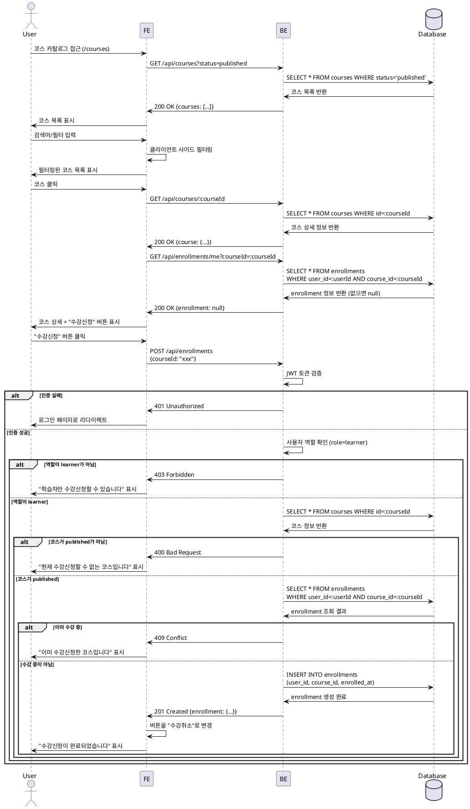
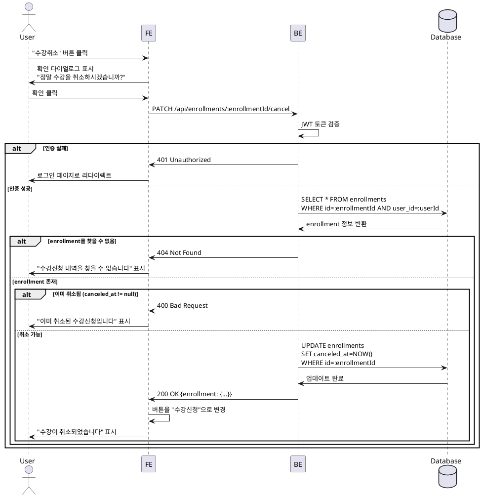

# UC-002: 코스 탐색 & 수강신청/취소 (Learner)

## Primary Actor
학습자 (Learner)

## Precondition
- 사용자가 Learner 역할로 로그인된 상태
- 코스 카탈로그 페이지(`/courses`) 또는 코스 상세 페이지(`/courses/[courseId]`) 접근

## Trigger
수강신청 또는 수강취소 버튼 클릭

## Main Scenario

### 코스 탐색 플로우
1. 사용자가 코스 카탈로그 페이지(`/courses`) 접근
2. FE가 BE에 코스 목록 요청 (`GET /api/courses`)
3. BE가 `published` 상태의 코스 목록 반환
4. FE가 코스 목록 표시
5. 사용자가 검색어 입력 또는 필터(카테고리, 난이도) 선택
6. FE가 클라이언트 사이드에서 필터링 또는 BE에 필터링된 요청
7. 사용자가 정렬 기준 변경 (최신순/인기순)
8. FE가 정렬된 코스 목록 표시

### 코스 상세 플로우
9. 사용자가 코스 클릭하여 상세 페이지 진입 (`/courses/[courseId]`)
10. FE가 BE에 코스 상세 정보 요청 (`GET /api/courses/:courseId`)
11. BE가 코스 상세 정보 반환 (소개, 커리큘럼, 강사 정보, 수강생 수, 평균 평점)
12. FE가 사용자의 수강 여부 확인 (`GET /api/enrollments/me`)
13. FE가 수강 여부에 따라 버튼 표시:
    - 미수강: "수강신청" 버튼
    - 수강 중: "수강취소" 버튼

### 수강신청 플로우
14. 사용자가 "수강신청" 버튼 클릭
15. FE가 BE에 수강신청 요청 (`POST /api/enrollments`)
16. BE가 사용자 인증 확인 (JWT 토큰 검증)
17. BE가 사용자 역할 확인 (Learner만 가능)
18. BE가 코스 상태 확인 (`published`만 가능)
19. BE가 중복 수강 확인 (`enrollments` 테이블에서 user_id + course_id 조회)
20. BE가 `enrollments` 테이블에 레코드 생성
21. BE가 성공 응답 반환 (`201 Created`)
22. FE가 성공 메시지 표시 ("수강신청이 완료되었습니다.")
23. FE가 버튼을 "수강취소"로 변경

### 수강취소 플로우
24. 사용자가 "수강취소" 버튼 클릭
25. FE가 확인 다이얼로그 표시 ("정말 수강을 취소하시겠습니까?")
26. 사용자가 확인 클릭
27. FE가 BE에 수강취소 요청 (`DELETE /api/enrollments/:enrollmentId` 또는 `PATCH /api/enrollments/:enrollmentId/cancel`)
28. BE가 사용자 인증 및 권한 확인
29. BE가 해당 enrollment 조회
30. BE가 `canceled_at` 필드 업데이트 (soft delete)
31. BE가 성공 응답 반환 (`200 OK`)
32. FE가 성공 메시지 표시 ("수강이 취소되었습니다.")
33. FE가 버튼을 "수강신청"으로 변경

## Edge Cases

### 1. 코스가 published 상태가 아님
- **상황**: draft 또는 archived 상태의 코스에 수강신청 시도
- **처리**: `400 Bad Request` 응답, "현재 수강신청할 수 없는 코스입니다" 메시지 표시

### 2. 이미 수강신청한 코스에 다시 신청 시도
- **상황**: 중복 수강신청 시도
- **처리**: `409 Conflict` 응답, "이미 수강신청한 코스입니다" 메시지 표시

### 3. 수강신청하지 않은 코스를 취소 시도
- **상황**: enrollment가 없는 상태에서 취소 시도
- **처리**: `404 Not Found` 응답, "수강신청 내역을 찾을 수 없습니다" 메시지 표시

### 4. Instructor가 수강신청 시도
- **상황**: Learner가 아닌 역할로 수강신청 시도
- **처리**: `403 Forbidden` 응답, "학습자만 수강신청할 수 있습니다" 메시지 표시

### 5. 비로그인 사용자가 수강신청 시도
- **상황**: 인증되지 않은 사용자가 수강신청 시도
- **처리**: `401 Unauthorized` 응답, 로그인 페이지로 리다이렉트

### 6. 네트워크 오류
- **상황**: BE 통신 실패 (타임아웃, 서버 오류 등)
- **처리**: `500` 또는 네트워크 에러 발생 시 "일시적인 오류가 발생했습니다. 다시 시도해주세요" 메시지 표시

### 7. 존재하지 않는 코스
- **상황**: 삭제되었거나 존재하지 않는 코스 ID로 요청
- **처리**: `404 Not Found` 응답, "코스를 찾을 수 없습니다" 메시지 표시

## Business Rules

### BR-001: published 코스만 수강신청 가능
- 코스 상태가 `published`인 경우에만 수강신청 버튼 표시
- `draft` 또는 `archived` 코스는 카탈로그에 표시되지 않거나 수강신청 불가 표시

### BR-002: 중복 수강신청 불가
- `enrollments` 테이블의 UNIQUE 제약조건 (`user_id + course_id`)으로 중복 방지
- 이미 수강 중인 코스는 "수강신청" 버튼 대신 "수강취소" 버튼 표시

### BR-003: Learner만 수강신청 가능
- `role=learner`인 사용자만 수강신청 가능
- `role=instructor` 또는 `role=operator`는 수강신청 불가

### BR-004: 수강취소 시 성적 집계 제외
- `canceled_at`이 설정된 enrollment는 성적 집계에서 제외
- 대시보드의 "내 코스" 목록에서도 제외

### BR-005: 수강취소는 soft delete
- `enrollments` 테이블에서 레코드를 삭제하지 않고 `canceled_at` 필드만 업데이트
- 추후 재수강 이력 추적 및 통계 분석에 활용 가능

### BR-006: 검색 및 필터링
- 검색어: 코스 제목 또는 설명에서 검색
- 필터: 카테고리, 난이도로 필터링
- 정렬: 최신순 (`created_at DESC`), 인기순 (수강생 수 기준)

---

## Sequence Diagram

### 수강신청 플로우

### 수강취소 플로우

