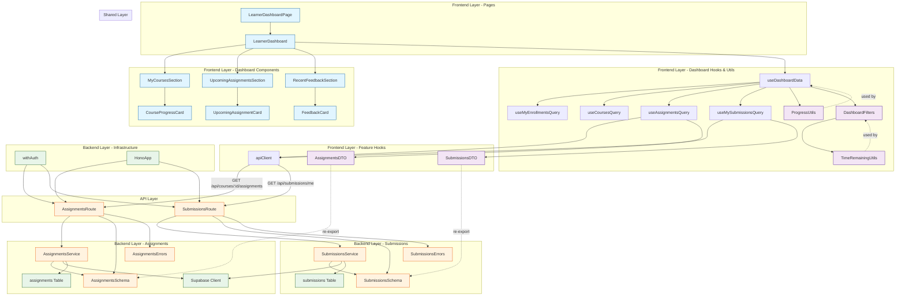

# UC-003 구현 계획

## 개요

### Backend 모듈 (Assignments)

| 모듈명 | 위치 | 설명 |
|--------|------|------|
| **AssignmentsRoute** | `src/features/assignments/backend/route.ts` | 과제 관련 API 엔드포인트 (`GET /api/courses/:courseId/assignments`) |
| **AssignmentsSchema** | `src/features/assignments/backend/schema.ts` | 과제 요청/응답 Zod 스키마 정의 |
| **AssignmentsService** | `src/features/assignments/backend/service.ts` | 과제 목록 조회 비즈니스 로직 |
| **AssignmentsErrors** | `src/features/assignments/backend/error.ts` | 과제 관련 에러 코드 정의 |

### Backend 모듈 (Submissions)

| 모듈명 | 위치 | 설명 |
|--------|------|------|
| **SubmissionsRoute** | `src/features/submissions/backend/route.ts` | 제출물 관련 API 엔드포인트 (`GET /api/submissions/me`) |
| **SubmissionsSchema** | `src/features/submissions/backend/schema.ts` | 제출물 요청/응답 Zod 스키마 정의 |
| **SubmissionsService** | `src/features/submissions/backend/service.ts` | 내 제출물 조회 비즈니스 로직 |
| **SubmissionsErrors** | `src/features/submissions/backend/error.ts` | 제출물 관련 에러 코드 정의 |

### Backend 모듈 (Hono Update)

| 모듈명 | 위치 | 설명 |
|--------|------|------|
| **HonoAppUpdate** | `src/backend/hono/app.ts` (수정) | `registerAssignmentsRoutes()`, `registerSubmissionsRoutes()` 호출 추가 |

### Frontend 모듈 (Dashboard)

| 모듈명 | 위치 | 설명 |
|--------|------|------|
| **LearnerDashboardPage** | `src/app/learner/dashboard/page.tsx` | Learner 대시보드 페이지 (Next.js Page) |
| **LearnerDashboard** | `src/features/dashboard/components/LearnerDashboard.tsx` | 대시보드 메인 컨테이너 컴포넌트 |
| **MyCoursesSection** | `src/features/dashboard/components/MyCoursesSection.tsx` | 내 코스 섹션 (진행률 포함) |
| **UpcomingAssignmentsSection** | `src/features/dashboard/components/UpcomingAssignmentsSection.tsx` | 마감 임박 과제 섹션 |
| **RecentFeedbackSection** | `src/features/dashboard/components/RecentFeedbackSection.tsx` | 최근 피드백 섹션 |
| **CourseProgressCard** | `src/features/dashboard/components/CourseProgressCard.tsx` | 코스 진행률 카드 UI |
| **UpcomingAssignmentCard** | `src/features/dashboard/components/UpcomingAssignmentCard.tsx` | 마감 임박 과제 카드 UI |
| **FeedbackCard** | `src/features/dashboard/components/FeedbackCard.tsx` | 피드백 카드 UI |
| **useDashboardData** | `src/features/dashboard/hooks/useDashboardData.ts` | 대시보드 전체 데이터 조회 및 집계 훅 |
| **ProgressUtils** | `src/features/dashboard/lib/progress.ts` | 진행률 계산 유틸리티 |
| **DashboardFilters** | `src/features/dashboard/lib/filters.ts` | 마감 임박/최근 피드백 필터링 유틸리티 |

### Frontend 모듈 (Assignments)

| 모듈명 | 위치 | 설명 |
|--------|------|------|
| **useAssignmentsQuery** | `src/features/assignments/hooks/useAssignmentsQuery.ts` | 코스별 과제 목록 조회 React Query 훅 |
| **AssignmentsDTO** | `src/features/assignments/lib/dto.ts` | Backend 스키마 재노출 |

### Frontend 모듈 (Submissions)

| 모듈명 | 위치 | 설명 |
|--------|------|------|
| **useMySubmissionsQuery** | `src/features/submissions/hooks/useMySubmissionsQuery.ts` | 내 제출물 목록 조회 React Query 훅 |
| **SubmissionsDTO** | `src/features/submissions/lib/dto.ts` | Backend 스키마 재노출 |

### Shared 모듈

| 모듈명 | 위치 | 설명 |
|--------|------|------|
| **TimeRemainingUtils** | `src/lib/date/time-remaining.ts` | 남은 시간 계산 및 포맷팅 유틸리티 (재사용 가능) |

---

## Module Dependency Diagram



---

## Implementation Plan

### 1. Shared 모듈 (공통 유틸리티)

#### 1.1 TimeRemainingUtils
**파일**: `src/lib/date/time-remaining.ts`

**목적**: 남은 시간 계산 및 포맷팅 (재사용 가능)

**구현 내용**:
```typescript
export const getTimeRemaining = (targetDate: Date | string): number => {
  const now = new Date().getTime();
  const target = new Date(targetDate).getTime();
  return target - now;
};

export const formatTimeRemaining = (ms: number): string => {
  if (ms <= 0) {
    return '마감됨';
  }

  const hours = Math.floor(ms / (1000 * 60 * 60));
  const minutes = Math.floor((ms % (1000 * 60 * 60)) / (1000 * 60));

  if (hours >= 24) {
    const days = Math.floor(hours / 24);
    return `${days}일 남음`;
  }

  if (hours > 0) {
    return `${hours}시간 ${minutes}분 남음`;
  }

  return `${minutes}분 남음`;
};

export const isWithin24Hours = (targetDate: Date | string): boolean => {
  const remaining = getTimeRemaining(targetDate);
  return remaining > 0 && remaining <= 24 * 60 * 60 * 1000;
};
```

**Unit Tests**:
```typescript
describe('TimeRemainingUtils', () => {
  it('24시간 이상 남았으면 일 단위로 표시', () => {
    const future = new Date(Date.now() + 2 * 24 * 60 * 60 * 1000);
    expect(formatTimeRemaining(getTimeRemaining(future))).toBe('2일 남음');
  });

  it('24시간 미만이면 시간 단위로 표시', () => {
    const future = new Date(Date.now() + 5 * 60 * 60 * 1000);
    expect(formatTimeRemaining(getTimeRemaining(future))).toMatch(/5시간/);
  });

  it('1시간 미만이면 분 단위로 표시', () => {
    const future = new Date(Date.now() + 30 * 60 * 1000);
    expect(formatTimeRemaining(getTimeRemaining(future))).toBe('30분 남음');
  });

  it('마감 시각이 지났으면 "마감됨"', () => {
    const past = new Date(Date.now() - 1000);
    expect(formatTimeRemaining(getTimeRemaining(past))).toBe('마감됨');
  });

  it('24시간 이내 판별', () => {
    const in12Hours = new Date(Date.now() + 12 * 60 * 60 * 1000);
    expect(isWithin24Hours(in12Hours)).toBe(true);

    const in48Hours = new Date(Date.now() + 48 * 60 * 60 * 1000);
    expect(isWithin24Hours(in48Hours)).toBe(false);
  });
});
```

---

### 2. Backend 모듈 (Assignments)

#### 2.1 AssignmentsErrors
**파일**: `src/features/assignments/backend/error.ts`

**목적**: 과제 관련 에러 코드 정의

**구현 내용**:
```typescript
export const assignmentsErrorCodes = {
  notFound: 'ASSIGNMENT_NOT_FOUND',
  fetchError: 'ASSIGNMENT_FETCH_ERROR',
  validationError: 'ASSIGNMENT_VALIDATION_ERROR',
  courseNotFound: 'ASSIGNMENT_COURSE_NOT_FOUND',
} as const;

type AssignmentsErrorValue = (typeof assignmentsErrorCodes)[keyof typeof assignmentsErrorCodes];

export type AssignmentsServiceError = AssignmentsErrorValue;
```

---

#### 2.2 AssignmentsSchema
**파일**: `src/features/assignments/backend/schema.ts`

**목적**: 과제 요청/응답 Zod 스키마 정의

**구현 내용**:
```typescript
import { z } from 'zod';

// 쿼리 파라미터 스키마
export const AssignmentsQuerySchema = z.object({
  status: z.enum(['draft', 'published', 'closed']).optional(),
});

export type AssignmentsQuery = z.infer<typeof AssignmentsQuerySchema>;

// 과제 응답 스키마
export const AssignmentResponseSchema = z.object({
  id: z.string().uuid(),
  courseId: z.string().uuid(),
  title: z.string(),
  description: z.string(),
  dueDate: z.string(),
  weight: z.number(),
  allowLate: z.boolean(),
  allowResubmit: z.boolean(),
  status: z.enum(['draft', 'published', 'closed']),
  createdAt: z.string(),
  updatedAt: z.string(),
});

export type AssignmentResponse = z.infer<typeof AssignmentResponseSchema>;

// 과제 목록 응답 스키마
export const AssignmentsResponseSchema = z.object({
  assignments: z.array(AssignmentResponseSchema),
});

export type AssignmentsResponse = z.infer<typeof AssignmentsResponseSchema>;

// DB 행 스키마
export const AssignmentRowSchema = z.object({
  id: z.string().uuid(),
  course_id: z.string().uuid(),
  title: z.string(),
  description: z.string(),
  due_date: z.string(),
  weight: z.number(),
  allow_late: z.boolean(),
  allow_resubmit: z.boolean(),
  status: z.enum(['draft', 'published', 'closed']),
  created_at: z.string(),
  updated_at: z.string(),
});

export type AssignmentRow = z.infer<typeof AssignmentRowSchema>;

// 파라미터 스키마
export const CourseIdParamsSchema = z.object({
  courseId: z.string().uuid({ message: 'Course ID must be a valid UUID.' }),
});

export type CourseIdParams = z.infer<typeof CourseIdParamsSchema>;
```

---

#### 2.3 AssignmentsService
**파일**: `src/features/assignments/backend/service.ts`

**목적**: 과제 목록 조회 비즈니스 로직

**구현 내용**:
```typescript
import type { SupabaseClient } from '@supabase/supabase-js';
import { success, failure, type HandlerResult } from '@/backend/http/response';
import type { AssignmentsQuery, AssignmentsResponse, AssignmentRow } from './schema';
import { AssignmentsResponseSchema, AssignmentRowSchema, AssignmentResponseSchema } from './schema';
import { assignmentsErrorCodes, type AssignmentsServiceError } from './error';

const ASSIGNMENTS_TABLE = 'assignments';
const COURSES_TABLE = 'courses';

export const getAssignmentsByCourseId = async (
  client: SupabaseClient,
  courseId: string,
  query: AssignmentsQuery,
): Promise<HandlerResult<AssignmentsResponse, AssignmentsServiceError, unknown>> => {
  // 1. 코스 존재 확인
  const { data: course, error: courseError } = await client
    .from(COURSES_TABLE)
    .select('id')
    .eq('id', courseId)
    .maybeSingle();

  if (courseError) {
    return failure(500, assignmentsErrorCodes.fetchError, courseError.message);
  }

  if (!course) {
    return failure(404, assignmentsErrorCodes.courseNotFound, '코스를 찾을 수 없습니다.');
  }

  // 2. 과제 목록 조회
  let queryBuilder = client.from(ASSIGNMENTS_TABLE).select('*').eq('course_id', courseId);

  if (query.status) {
    queryBuilder = queryBuilder.eq('status', query.status);
  }

  queryBuilder = queryBuilder.order('due_date', { ascending: true });

  const { data, error } = await queryBuilder;

  if (error) {
    return failure(500, assignmentsErrorCodes.fetchError, error.message);
  }

  if (!data) {
    return success({ assignments: [] });
  }

  // 3. 데이터 매핑
  const assignments = data
    .map((row) => {
      const rowParse = AssignmentRowSchema.safeParse(row);

      if (!rowParse.success) {
        return null;
      }

      return {
        id: rowParse.data.id,
        courseId: rowParse.data.course_id,
        title: rowParse.data.title,
        description: rowParse.data.description,
        dueDate: rowParse.data.due_date,
        weight: rowParse.data.weight,
        allowLate: rowParse.data.allow_late,
        allowResubmit: rowParse.data.allow_resubmit,
        status: rowParse.data.status,
        createdAt: rowParse.data.created_at,
        updatedAt: rowParse.data.updated_at,
      } satisfies AssignmentResponse;
    })
    .filter((a) => a !== null) as AssignmentResponse[];

  const parsed = AssignmentsResponseSchema.safeParse({ assignments });

  if (!parsed.success) {
    return failure(
      500,
      assignmentsErrorCodes.validationError,
      'Assignments response validation failed.',
      parsed.error.format(),
    );
  }

  return success(parsed.data);
};
```

**Unit Tests**:
```typescript
describe('getAssignmentsByCourseId', () => {
  it('코스의 모든 과제를 반환', async () => {
    const result = await getAssignmentsByCourseId(mockClient, 'course-123', {});
    expect(result.ok).toBe(true);
    if (result.ok) {
      expect(result.data.assignments.length).toBeGreaterThan(0);
    }
  });

  it('status 필터링 (published만)', async () => {
    const result = await getAssignmentsByCourseId(mockClient, 'course-123', {
      status: 'published',
    });
    expect(result.ok).toBe(true);
    if (result.ok) {
      expect(result.data.assignments.every((a) => a.status === 'published')).toBe(true);
    }
  });

  it('due_date 오름차순 정렬', async () => {
    const result = await getAssignmentsByCourseId(mockClient, 'course-123', {});
    expect(result.ok).toBe(true);
    if (result.ok) {
      const dates = result.data.assignments.map((a) => new Date(a.dueDate).getTime());
      expect(dates).toEqual([...dates].sort((a, b) => a - b));
    }
  });

  it('존재하지 않는 코스는 404', async () => {
    const result = await getAssignmentsByCourseId(mockClient, 'non-existent', {});
    expect(result.ok).toBe(false);
    if (!result.ok) {
      expect(result.status).toBe(404);
    }
  });
});
```

---

#### 2.4 AssignmentsRoute
**파일**: `src/features/assignments/backend/route.ts`

**목적**: 과제 관련 API 엔드포인트 정의

**구현 내용**:
```typescript
import type { Hono } from 'hono';
import type { AppEnv } from '@/backend/hono/context';
import { getSupabase, getLogger } from '@/backend/hono/context';
import { respond, failure } from '@/backend/http/response';
import { AssignmentsQuerySchema, CourseIdParamsSchema } from './schema';
import { getAssignmentsByCourseId } from './service';

export const registerAssignmentsRoutes = (app: Hono<AppEnv>) => {
  // 코스별 과제 목록 조회
  app.get('/api/courses/:courseId/assignments', async (c) => {
    const parsedParams = CourseIdParamsSchema.safeParse({ courseId: c.req.param('courseId') });

    if (!parsedParams.success) {
      return respond(
        c,
        failure(
          400,
          'INVALID_COURSE_PARAMS',
          '코스 ID가 유효하지 않습니다.',
          parsedParams.error.format(),
        ),
      );
    }

    const queryParams = c.req.query();
    const parsedQuery = AssignmentsQuerySchema.safeParse(queryParams);

    if (!parsedQuery.success) {
      return respond(
        c,
        failure(
          400,
          'INVALID_QUERY_PARAMS',
          '쿼리 파라미터가 유효하지 않습니다.',
          parsedQuery.error.format(),
        ),
      );
    }

    const supabase = getSupabase(c);
    const logger = getLogger(c);

    const result = await getAssignmentsByCourseId(
      supabase,
      parsedParams.data.courseId,
      parsedQuery.data,
    );

    if (!result.ok) {
      logger.error('Failed to fetch assignments', result.error);
    }

    return respond(c, result);
  });
};
```

---

### 3. Backend 모듈 (Submissions)

#### 3.1 SubmissionsErrors
**파일**: `src/features/submissions/backend/error.ts`

**목적**: 제출물 관련 에러 코드 정의

**구현 내용**:
```typescript
export const submissionsErrorCodes = {
  notFound: 'SUBMISSION_NOT_FOUND',
  fetchError: 'SUBMISSION_FETCH_ERROR',
  validationError: 'SUBMISSION_VALIDATION_ERROR',
} as const;

type SubmissionsErrorValue = (typeof submissionsErrorCodes)[keyof typeof submissionsErrorCodes];

export type SubmissionsServiceError = SubmissionsErrorValue;
```

---

#### 3.2 SubmissionsSchema
**파일**: `src/features/submissions/backend/schema.ts`

**목적**: 제출물 요청/응답 Zod 스키마 정의

**구현 내용**:
```typescript
import { z } from 'zod';

// 제출물 응답 스키마
export const SubmissionResponseSchema = z.object({
  id: z.string().uuid(),
  assignmentId: z.string().uuid(),
  userId: z.string().uuid(),
  text: z.string(),
  link: z.string().nullable(),
  late: z.boolean(),
  score: z.number().nullable(),
  feedback: z.string().nullable(),
  status: z.enum(['submitted', 'graded', 'resubmission_required']),
  submittedAt: z.string(),
  resubmittedAt: z.string().nullable(),
  gradedAt: z.string().nullable(),
  createdAt: z.string(),
  updatedAt: z.string(),
});

export type SubmissionResponse = z.infer<typeof SubmissionResponseSchema>;

// 내 제출물 목록 응답 스키마
export const MySubmissionsResponseSchema = z.object({
  submissions: z.array(SubmissionResponseSchema),
});

export type MySubmissionsResponse = z.infer<typeof MySubmissionsResponseSchema>;

// DB 행 스키마
export const SubmissionRowSchema = z.object({
  id: z.string().uuid(),
  assignment_id: z.string().uuid(),
  user_id: z.string().uuid(),
  text: z.string(),
  link: z.string().nullable(),
  late: z.boolean(),
  score: z.number().nullable(),
  feedback: z.string().nullable(),
  status: z.enum(['submitted', 'graded', 'resubmission_required']),
  submitted_at: z.string(),
  resubmitted_at: z.string().nullable(),
  graded_at: z.string().nullable(),
  created_at: z.string(),
  updated_at: z.string(),
});

export type SubmissionRow = z.infer<typeof SubmissionRowSchema>;
```

---

#### 3.3 SubmissionsService
**파일**: `src/features/submissions/backend/service.ts`

**목적**: 내 제출물 조회 비즈니스 로직

**구현 내용**:
```typescript
import type { SupabaseClient } from '@supabase/supabase-js';
import { success, failure, type HandlerResult } from '@/backend/http/response';
import type { MySubmissionsResponse, SubmissionRow, SubmissionResponse } from './schema';
import { MySubmissionsResponseSchema, SubmissionRowSchema } from './schema';
import { submissionsErrorCodes, type SubmissionsServiceError } from './error';

const SUBMISSIONS_TABLE = 'submissions';

export const getMySubmissions = async (
  client: SupabaseClient,
  userId: string,
): Promise<HandlerResult<MySubmissionsResponse, SubmissionsServiceError, unknown>> => {
  const { data, error } = await client
    .from(SUBMISSIONS_TABLE)
    .select('*')
    .eq('user_id', userId)
    .order('submitted_at', { ascending: false });

  if (error) {
    return failure(500, submissionsErrorCodes.fetchError, error.message);
  }

  if (!data) {
    return success({ submissions: [] });
  }

  const submissions = data
    .map((row) => {
      const rowParse = SubmissionRowSchema.safeParse(row);

      if (!rowParse.success) {
        return null;
      }

      return {
        id: rowParse.data.id,
        assignmentId: rowParse.data.assignment_id,
        userId: rowParse.data.user_id,
        text: rowParse.data.text,
        link: rowParse.data.link,
        late: rowParse.data.late,
        score: rowParse.data.score,
        feedback: rowParse.data.feedback,
        status: rowParse.data.status,
        submittedAt: rowParse.data.submitted_at,
        resubmittedAt: rowParse.data.resubmitted_at,
        gradedAt: rowParse.data.graded_at,
        createdAt: rowParse.data.created_at,
        updatedAt: rowParse.data.updated_at,
      } satisfies SubmissionResponse;
    })
    .filter((s) => s !== null) as SubmissionResponse[];

  const parsed = MySubmissionsResponseSchema.safeParse({ submissions });

  if (!parsed.success) {
    return failure(
      500,
      submissionsErrorCodes.validationError,
      'Submissions response validation failed.',
      parsed.error.format(),
    );
  }

  return success(parsed.data);
};
```

**Unit Tests**:
```typescript
describe('getMySubmissions', () => {
  it('내 모든 제출물을 반환', async () => {
    const result = await getMySubmissions(mockClient, 'user-123');
    expect(result.ok).toBe(true);
    if (result.ok) {
      expect(result.data.submissions.every((s) => s.userId === 'user-123')).toBe(true);
    }
  });

  it('submitted_at 내림차순 정렬', async () => {
    const result = await getMySubmissions(mockClient, 'user-123');
    expect(result.ok).toBe(true);
    if (result.ok) {
      const dates = result.data.submissions.map((s) => new Date(s.submittedAt).getTime());
      expect(dates).toEqual([...dates].sort((a, b) => b - a));
    }
  });

  it('제출물이 없으면 빈 배열 반환', async () => {
    const result = await getMySubmissions(mockClient, 'user-no-submissions');
    expect(result.ok).toBe(true);
    if (result.ok) {
      expect(result.data.submissions).toEqual([]);
    }
  });
});
```

---

#### 3.4 SubmissionsRoute
**파일**: `src/features/submissions/backend/route.ts`

**목적**: 제출물 관련 API 엔드포인트 정의

**구현 내용**:
```typescript
import type { Hono } from 'hono';
import type { AppEnv } from '@/backend/hono/context';
import { getSupabase, getLogger } from '@/backend/hono/context';
import { respond } from '@/backend/http/response';
import { withAuth } from '@/backend/middleware/auth';
import { getMySubmissions } from './service';

export const registerSubmissionsRoutes = (app: Hono<AppEnv>) => {
  // 내 제출물 목록 조회
  app.get('/api/submissions/me', withAuth(), async (c) => {
    const supabase = getSupabase(c);
    const logger = getLogger(c);
    const userId = c.get('userId');

    const result = await getMySubmissions(supabase, userId);

    if (!result.ok) {
      logger.error('Failed to fetch my submissions', result.error);
    }

    return respond(c, result);
  });
};
```

---

### 4. Frontend 모듈 (Shared Utils)

#### 4.1 ProgressUtils
**파일**: `src/features/dashboard/lib/progress.ts`

**목적**: 진행률 계산 유틸리티

**구현 내용**:
```typescript
import type { AssignmentResponse } from '@/features/assignments/lib/dto';
import type { SubmissionResponse } from '@/features/submissions/lib/dto';

export type CourseProgress = {
  completed: number;
  total: number;
  percentage: number;
};

export const calculateProgress = (
  assignments: AssignmentResponse[],
  submissions: SubmissionResponse[],
): CourseProgress => {
  const publishedAssignments = assignments.filter((a) => a.status === 'published');
  const totalCount = publishedAssignments.length;

  if (totalCount === 0) {
    return { completed: 0, total: 0, percentage: 0 };
  }

  const completedCount = publishedAssignments.filter((a) =>
    submissions.some((s) => s.assignmentId === a.id),
  ).length;

  const percentage = Math.round((completedCount / totalCount) * 1000) / 10; // 소수점 1자리

  return { completed: completedCount, total: totalCount, percentage };
};
```

**Unit Tests**:
```typescript
describe('calculateProgress', () => {
  it('진행률을 올바르게 계산', () => {
    const assignments = [
      { id: '1', status: 'published' },
      { id: '2', status: 'published' },
      { id: '3', status: 'published' },
    ] as AssignmentResponse[];

    const submissions = [{ assignmentId: '1' }, { assignmentId: '2' }] as SubmissionResponse[];

    const result = calculateProgress(assignments, submissions);
    expect(result).toEqual({ completed: 2, total: 3, percentage: 66.7 });
  });

  it('published 과제만 계산', () => {
    const assignments = [
      { id: '1', status: 'published' },
      { id: '2', status: 'draft' },
      { id: '3', status: 'closed' },
    ] as AssignmentResponse[];

    const submissions = [{ assignmentId: '1' }] as SubmissionResponse[];

    const result = calculateProgress(assignments, submissions);
    expect(result).toEqual({ completed: 1, total: 1, percentage: 100 });
  });

  it('과제가 없으면 0% 반환', () => {
    const result = calculateProgress([], []);
    expect(result).toEqual({ completed: 0, total: 0, percentage: 0 });
  });

  it('제출이 없으면 0% 반환', () => {
    const assignments = [{ id: '1', status: 'published' }] as AssignmentResponse[];
    const result = calculateProgress(assignments, []);
    expect(result).toEqual({ completed: 0, total: 1, percentage: 0 });
  });
});
```

---

#### 4.2 DashboardFilters
**파일**: `src/features/dashboard/lib/filters.ts`

**목적**: 마감 임박/최근 피드백 필터링 유틸리티

**구현 내용**:
```typescript
import { isWithin24Hours } from '@/lib/date/time-remaining';
import type { AssignmentResponse } from '@/features/assignments/lib/dto';
import type { SubmissionResponse } from '@/features/submissions/lib/dto';

export const filterUpcomingAssignments = (
  assignments: AssignmentResponse[],
  submissions: SubmissionResponse[],
): AssignmentResponse[] => {
  return assignments
    .filter((a) => {
      const isPublished = a.status === 'published';
      const isUpcoming = isWithin24Hours(a.dueDate);
      const isNotSubmitted = !submissions.some((s) => s.assignmentId === a.id);
      return isPublished && isUpcoming && isNotSubmitted;
    })
    .sort((a, b) => new Date(a.dueDate).getTime() - new Date(b.dueDate).getTime());
};

export const filterRecentFeedback = (submissions: SubmissionResponse[]): SubmissionResponse[] => {
  return submissions
    .filter((s) => s.status === 'graded' && s.gradedAt)
    .sort((a, b) => new Date(b.gradedAt!).getTime() - new Date(a.gradedAt!).getTime())
    .slice(0, 3);
};

export const truncateFeedback = (feedback: string, maxLength: number = 50): string => {
  if (feedback.length <= maxLength) {
    return feedback;
  }
  return feedback.substring(0, maxLength) + '...';
};
```

**Unit Tests**:
```typescript
describe('filterUpcomingAssignments', () => {
  it('24시간 이내 마감 & 미제출 과제만 반환', () => {
    const now = new Date();
    const in12Hours = new Date(now.getTime() + 12 * 60 * 60 * 1000);
    const in48Hours = new Date(now.getTime() + 48 * 60 * 60 * 1000);

    const assignments = [
      { id: '1', status: 'published', dueDate: in12Hours.toISOString() },
      { id: '2', status: 'published', dueDate: in48Hours.toISOString() },
      { id: '3', status: 'draft', dueDate: in12Hours.toISOString() },
    ] as AssignmentResponse[];

    const submissions = [] as SubmissionResponse[];

    const result = filterUpcomingAssignments(assignments, submissions);
    expect(result).toHaveLength(1);
    expect(result[0].id).toBe('1');
  });

  it('제출한 과제는 제외', () => {
    const in12Hours = new Date(Date.now() + 12 * 60 * 60 * 1000);
    const assignments = [
      { id: '1', status: 'published', dueDate: in12Hours.toISOString() },
    ] as AssignmentResponse[];

    const submissions = [{ assignmentId: '1' }] as SubmissionResponse[];

    const result = filterUpcomingAssignments(assignments, submissions);
    expect(result).toHaveLength(0);
  });

  it('due_date 오름차순 정렬', () => {
    const in6Hours = new Date(Date.now() + 6 * 60 * 60 * 1000);
    const in12Hours = new Date(Date.now() + 12 * 60 * 60 * 1000);

    const assignments = [
      { id: '1', status: 'published', dueDate: in12Hours.toISOString() },
      { id: '2', status: 'published', dueDate: in6Hours.toISOString() },
    ] as AssignmentResponse[];

    const result = filterUpcomingAssignments(assignments, []);
    expect(result[0].id).toBe('2');
    expect(result[1].id).toBe('1');
  });
});

describe('filterRecentFeedback', () => {
  it('graded 상태만 반환', () => {
    const submissions = [
      { id: '1', status: 'graded', gradedAt: '2025-01-01' },
      { id: '2', status: 'submitted', gradedAt: null },
    ] as SubmissionResponse[];

    const result = filterRecentFeedback(submissions);
    expect(result).toHaveLength(1);
    expect(result[0].id).toBe('1');
  });

  it('graded_at 내림차순 정렬', () => {
    const submissions = [
      { id: '1', status: 'graded', gradedAt: '2025-01-01T10:00:00Z' },
      { id: '2', status: 'graded', gradedAt: '2025-01-02T10:00:00Z' },
      { id: '3', status: 'graded', gradedAt: '2025-01-01T12:00:00Z' },
    ] as SubmissionResponse[];

    const result = filterRecentFeedback(submissions);
    expect(result[0].id).toBe('2');
  });

  it('최신 3개만 반환', () => {
    const submissions = Array.from({ length: 5 }, (_, i) => ({
      id: `${i}`,
      status: 'graded',
      gradedAt: new Date(Date.now() - i * 1000).toISOString(),
    })) as SubmissionResponse[];

    const result = filterRecentFeedback(submissions);
    expect(result).toHaveLength(3);
  });
});

describe('truncateFeedback', () => {
  it('50자 이하는 그대로 반환', () => {
    const short = '짧은 피드백';
    expect(truncateFeedback(short)).toBe(short);
  });

  it('50자 초과는 잘라서 ... 추가', () => {
    const long = 'a'.repeat(60);
    expect(truncateFeedback(long)).toBe('a'.repeat(50) + '...');
  });
});
```

---

### 5. Frontend 모듈 (Hooks)

#### 5.1 AssignmentsDTO
**파일**: `src/features/assignments/lib/dto.ts`

**구현 내용**:
```typescript
export {
  AssignmentsQuerySchema,
  AssignmentResponseSchema,
  AssignmentsResponseSchema,
  CourseIdParamsSchema,
  type AssignmentsQuery,
  type AssignmentResponse,
  type AssignmentsResponse,
  type CourseIdParams,
} from '@/features/assignments/backend/schema';
```

---

#### 5.2 useAssignmentsQuery
**파일**: `src/features/assignments/hooks/useAssignmentsQuery.ts`

**목적**: 코스별 과제 목록 조회 React Query 훅

**구현 내용**:
```typescript
'use client';

import { useQuery } from '@tanstack/react-query';
import { apiClient, extractApiErrorMessage } from '@/lib/remote/api-client';
import { AssignmentsResponseSchema, type AssignmentsQuery } from '@/features/assignments/lib/dto';

const fetchAssignments = async (courseId: string, query: AssignmentsQuery) => {
  try {
    const params = new URLSearchParams();
    if (query.status) params.append('status', query.status);

    const { data } = await apiClient.get(`/api/courses/${courseId}/assignments?${params.toString()}`);
    return AssignmentsResponseSchema.parse(data);
  } catch (error) {
    const message = extractApiErrorMessage(error, '과제 목록을 불러오는데 실패했습니다.');
    throw new Error(message);
  }
};

export const useAssignmentsQuery = (courseId: string, query: AssignmentsQuery = {}) =>
  useQuery({
    queryKey: ['assignments', courseId, query],
    queryFn: () => fetchAssignments(courseId, query),
    enabled: Boolean(courseId),
    staleTime: 5 * 60 * 1000, // 5분
  });
```

**QA Sheet**:
| 시나리오 | 입력 | 기대 결과 |
|---------|------|-----------|
| 코스의 모든 과제 조회 | `courseId: 'course-123'` | 해당 코스의 모든 과제 반환 |
| published 과제만 조회 | `{status: 'published'}` | published 과제만 반환 |
| 빈 courseId | `''` | 쿼리 실행 안 됨 (enabled: false) |

---

#### 5.3 SubmissionsDTO
**파일**: `src/features/submissions/lib/dto.ts`

**구현 내용**:
```typescript
export {
  SubmissionResponseSchema,
  MySubmissionsResponseSchema,
  type SubmissionResponse,
  type MySubmissionsResponse,
} from '@/features/submissions/backend/schema';
```

---

#### 5.4 useMySubmissionsQuery
**파일**: `src/features/submissions/hooks/useMySubmissionsQuery.ts`

**목적**: 내 제출물 목록 조회 React Query 훅

**구현 내용**:
```typescript
'use client';

import { useQuery } from '@tanstack/react-query';
import { apiClient, extractApiErrorMessage } from '@/lib/remote/api-client';
import { MySubmissionsResponseSchema } from '@/features/submissions/lib/dto';

const fetchMySubmissions = async () => {
  try {
    const { data } = await apiClient.get('/api/submissions/me');
    return MySubmissionsResponseSchema.parse(data);
  } catch (error) {
    const message = extractApiErrorMessage(error, '제출물 목록을 불러오는데 실패했습니다.');
    throw new Error(message);
  }
};

export const useMySubmissionsQuery = () =>
  useQuery({
    queryKey: ['mySubmissions'],
    queryFn: fetchMySubmissions,
    staleTime: 60 * 1000, // 1분
  });
```

**QA Sheet**:
| 시나리오 | 기대 결과 |
|---------|-----------|
| 내 제출물 조회 | 내가 제출한 모든 과제 반환 |
| 제출물 없음 | 빈 배열 반환 |

---

#### 5.5 useDashboardData
**파일**: `src/features/dashboard/hooks/useDashboardData.ts`

**목적**: 대시보드 전체 데이터 조회 및 집계 훅

**구현 내용**:
```typescript
'use client';

import { useMemo } from 'react';
import { useMyEnrollmentsQuery } from '@/features/enrollments/hooks/useMyEnrollmentsQuery';
import { useAssignmentsQuery } from '@/features/assignments/hooks/useAssignmentsQuery';
import { useMySubmissionsQuery } from '@/features/submissions/hooks/useMySubmissionsQuery';
import { calculateProgress } from '@/features/dashboard/lib/progress';
import { filterUpcomingAssignments, filterRecentFeedback } from '@/features/dashboard/lib/filters';

export const useDashboardData = () => {
  const { data: enrollmentsData, isLoading: enrollmentsLoading } = useMyEnrollmentsQuery({});
  const { data: submissionsData, isLoading: submissionsLoading } = useMySubmissionsQuery();

  const enrollments = enrollmentsData?.enrollments ?? [];
  const submissions = submissionsData?.submissions ?? [];

  // 각 코스의 과제 목록 조회 (published만)
  const assignmentsQueries = enrollments.map((enrollment) =>
    useAssignmentsQuery(enrollment.courseId, { status: 'published' }),
  );

  const assignmentsLoading = assignmentsQueries.some((q) => q.isLoading);
  const allAssignments = assignmentsQueries.flatMap((q) => q.data?.assignments ?? []);

  // 코스별 진행률 계산
  const courseProgress = useMemo(() => {
    return enrollments.map((enrollment) => {
      const courseAssignments = allAssignments.filter((a) => a.courseId === enrollment.courseId);
      const progress = calculateProgress(courseAssignments, submissions);

      return {
        enrollmentId: enrollment.id,
        courseId: enrollment.courseId,
        ...progress,
      };
    });
  }, [enrollments, allAssignments, submissions]);

  // 마감 임박 과제
  const upcomingAssignments = useMemo(() => {
    return filterUpcomingAssignments(allAssignments, submissions);
  }, [allAssignments, submissions]);

  // 최근 피드백
  const recentFeedback = useMemo(() => {
    return filterRecentFeedback(submissions);
  }, [submissions]);

  return {
    enrollments,
    courseProgress,
    upcomingAssignments,
    recentFeedback,
    isLoading: enrollmentsLoading || assignmentsLoading || submissionsLoading,
  };
};
```

**QA Sheet**:
| 시나리오 | 기대 결과 |
|---------|-----------|
| 데이터 로딩 | isLoading = true |
| 수강 중인 코스 있음 | enrollments, courseProgress, upcomingAssignments, recentFeedback 반환 |
| 수강 중인 코스 없음 | 빈 배열 반환 |

---

### 6. Frontend 모듈 (Components)

#### 6.1 CourseProgressCard
**파일**: `src/features/dashboard/components/CourseProgressCard.tsx`

**구현 내용**:
```typescript
'use client';

import Link from 'next/link';
import { Card, CardContent, CardDescription, CardHeader, CardTitle } from '@/components/ui/card';
import type { CourseProgress } from '@/features/dashboard/lib/progress';

type CourseProgressCardProps = {
  courseId: string;
  courseTitle: string;
  progress: CourseProgress;
};

export const CourseProgressCard = ({ courseId, courseTitle, progress }: CourseProgressCardProps) => {
  return (
    <Card>
      <CardHeader>
        <div className="flex items-start justify-between">
          <CardTitle>{courseTitle}</CardTitle>
          <span className="text-2xl font-bold text-primary">{progress.percentage}%</span>
        </div>
        <CardDescription>
          완료: {progress.completed}/{progress.total} 과제
        </CardDescription>
      </CardHeader>
      <CardContent>
        <div className="w-full bg-gray-200 rounded-full h-2">
          <div
            className="bg-primary h-2 rounded-full transition-all"
            style={{ width: `${progress.percentage}%` }}
          />
        </div>
        <Link href={`/courses/${courseId}`} className="text-sm text-blue-600 mt-2 inline-block">
          코스로 이동 →
        </Link>
      </CardContent>
    </Card>
  );
};
```

**QA Sheet**:
| 시나리오 | Props | 기대 결과 |
|---------|-------|-----------|
| 진행률 표시 | `progress: {percentage: 66.7, completed: 2, total: 3}` | "66.7%" + "완료: 2/3 과제" + 프로그레스 바 표시 |
| 코스 이동 링크 | `courseId: 'course-123'` | `/courses/course-123` 링크 |

---

#### 6.2 UpcomingAssignmentCard
**파일**: `src/features/dashboard/components/UpcomingAssignmentCard.tsx`

**구현 내용**:
```typescript
'use client';

import Link from 'next/link';
import { Card, CardContent, CardDescription, CardHeader, CardTitle } from '@/components/ui/card';
import { formatTimeRemaining, getTimeRemaining } from '@/lib/date/time-remaining';
import type { AssignmentResponse } from '@/features/assignments/lib/dto';

type UpcomingAssignmentCardProps = {
  assignment: AssignmentResponse;
  courseTitle: string;
};

export const UpcomingAssignmentCard = ({ assignment, courseTitle }: UpcomingAssignmentCardProps) => {
  const remaining = getTimeRemaining(assignment.dueDate);
  const formattedRemaining = formatTimeRemaining(remaining);

  return (
    <Card className="border-l-4 border-l-orange-500">
      <CardHeader>
        <CardTitle className="text-lg">{assignment.title}</CardTitle>
        <CardDescription>코스: {courseTitle}</CardDescription>
      </CardHeader>
      <CardContent>
        <div className="space-y-2">
          <p className="text-sm text-gray-600">
            마감: {new Date(assignment.dueDate).toLocaleString('ko-KR')}
          </p>
          <p className="text-sm font-semibold text-orange-600">({formattedRemaining})</p>
          <Link
            href={`/courses/${assignment.courseId}/assignments/${assignment.id}`}
            className="text-sm text-blue-600 inline-block"
          >
            과제로 이동 →
          </Link>
        </div>
      </CardContent>
    </Card>
  );
};
```

**QA Sheet**:
| 시나리오 | Props | 기대 결과 |
|---------|-------|-----------|
| 마감 임박 과제 표시 | `assignment`, `courseTitle` | 과제명, 코스명, 마감일, 남은 시간 표시 |
| 과제 이동 링크 | - | `/courses/{courseId}/assignments/{assignmentId}` 링크 |

---

#### 6.3 FeedbackCard
**파일**: `src/features/dashboard/components/FeedbackCard.tsx`

**구현 내용**:
```typescript
'use client';

import Link from 'next/link';
import { Card, CardContent, CardDescription, CardHeader, CardTitle } from '@/components/ui/card';
import { Badge } from '@/components/ui/badge';
import { truncateFeedback } from '@/features/dashboard/lib/filters';
import type { SubmissionResponse } from '@/features/submissions/lib/dto';

type FeedbackCardProps = {
  submission: SubmissionResponse;
  assignmentTitle: string;
  courseTitle: string;
};

export const FeedbackCard = ({ submission, assignmentTitle, courseTitle }: FeedbackCardProps) => {
  return (
    <Card>
      <CardHeader>
        <div className="flex items-start justify-between">
          <CardTitle className="text-lg">{assignmentTitle}</CardTitle>
          <Badge variant="secondary">{submission.score ?? 0}점</Badge>
        </div>
        <CardDescription>코스: {courseTitle}</CardDescription>
      </CardHeader>
      <CardContent>
        <p className="text-sm text-gray-600 mb-2">
          "{truncateFeedback(submission.feedback ?? '피드백 없음')}"
        </p>
        <Link
          href={`/courses/${submission.assignmentId}/feedback`}
          className="text-sm text-blue-600"
        >
          상세 보기 →
        </Link>
      </CardContent>
    </Card>
  );
};
```

**QA Sheet**:
| 시나리오 | Props | 기대 결과 |
|---------|-------|-----------|
| 피드백 표시 | `submission`, `assignmentTitle`, `courseTitle` | 과제명, 코스명, 점수, 피드백 요약 표시 |
| 피드백 50자 초과 | `feedback: 긴 피드백...` | 50자까지만 표시 + "..." |

---

#### 6.4 MyCoursesSection
**파일**: `src/features/dashboard/components/MyCoursesSection.tsx`

**구현 내용**:
```typescript
'use client';

import { CourseProgressCard } from './CourseProgressCard';
import type { EnrollmentResponse } from '@/features/enrollments/lib/dto';
import type { CourseResponse } from '@/features/courses/lib/dto';
import type { CourseProgress } from '@/features/dashboard/lib/progress';

type MyCoursesSectionProps = {
  enrollments: EnrollmentResponse[];
  courses: CourseResponse[];
  courseProgress: Array<CourseProgress & { courseId: string }>;
};

export const MyCoursesSection = ({ enrollments, courses, courseProgress }: MyCoursesSectionProps) => {
  if (enrollments.length === 0) {
    return (
      <div className="text-center py-8">
        <p className="text-gray-500">수강 중인 코스가 없습니다.</p>
        <a href="/courses" className="text-blue-600 underline">
          코스를 탐색해보세요 →
        </a>
      </div>
    );
  }

  return (
    <div className="space-y-4">
      <h2 className="text-2xl font-bold">내 코스</h2>
      <div className="grid grid-cols-1 md:grid-cols-2 lg:grid-cols-3 gap-4">
        {courseProgress.map((progress) => {
          const course = courses.find((c) => c.id === progress.courseId);
          if (!course) return null;

          return (
            <CourseProgressCard
              key={progress.courseId}
              courseId={progress.courseId}
              courseTitle={course.title}
              progress={progress}
            />
          );
        })}
      </div>
    </div>
  );
};
```

**QA Sheet**:
| 시나리오 | Props | 기대 결과 |
|---------|-------|-----------|
| 수강 중인 코스 있음 | `enrollments: [...]` | 각 코스의 진행률 카드 표시 |
| 수강 중인 코스 없음 | `enrollments: []` | "수강 중인 코스가 없습니다" + 코스 탐색 링크 |

---

#### 6.5 UpcomingAssignmentsSection
**파일**: `src/features/dashboard/components/UpcomingAssignmentsSection.tsx`

**구현 내용**:
```typescript
'use client';

import { UpcomingAssignmentCard } from './UpcomingAssignmentCard';
import type { AssignmentResponse } from '@/features/assignments/lib/dto';
import type { CourseResponse } from '@/features/courses/lib/dto';

type UpcomingAssignmentsSectionProps = {
  upcomingAssignments: AssignmentResponse[];
  courses: CourseResponse[];
};

export const UpcomingAssignmentsSection = ({
  upcomingAssignments,
  courses,
}: UpcomingAssignmentsSectionProps) => {
  if (upcomingAssignments.length === 0) {
    return (
      <div className="text-center py-8">
        <p className="text-gray-500">마감 임박 과제가 없습니다.</p>
      </div>
    );
  }

  return (
    <div className="space-y-4">
      <h2 className="text-2xl font-bold">마감 임박 과제</h2>
      <div className="grid grid-cols-1 md:grid-cols-2 gap-4">
        {upcomingAssignments.map((assignment) => {
          const course = courses.find((c) => c.id === assignment.courseId);
          if (!course) return null;

          return (
            <UpcomingAssignmentCard
              key={assignment.id}
              assignment={assignment}
              courseTitle={course.title}
            />
          );
        })}
      </div>
    </div>
  );
};
```

**QA Sheet**:
| 시나리오 | Props | 기대 결과 |
|---------|-------|-----------|
| 마감 임박 과제 있음 | `upcomingAssignments: [...]` | 각 과제 카드 표시 |
| 마감 임박 과제 없음 | `upcomingAssignments: []` | "마감 임박 과제가 없습니다" 표시 |

---

#### 6.6 RecentFeedbackSection
**파일**: `src/features/dashboard/components/RecentFeedbackSection.tsx`

**구현 내용**:
```typescript
'use client';

import { FeedbackCard } from './FeedbackCard';
import type { SubmissionResponse } from '@/features/submissions/lib/dto';
import type { AssignmentResponse } from '@/features/assignments/lib/dto';
import type { CourseResponse } from '@/features/courses/lib/dto';

type RecentFeedbackSectionProps = {
  recentFeedback: SubmissionResponse[];
  assignments: AssignmentResponse[];
  courses: CourseResponse[];
};

export const RecentFeedbackSection = ({
  recentFeedback,
  assignments,
  courses,
}: RecentFeedbackSectionProps) => {
  if (recentFeedback.length === 0) {
    return (
      <div className="text-center py-8">
        <p className="text-gray-500">최근 피드백이 없습니다.</p>
      </div>
    );
  }

  return (
    <div className="space-y-4">
      <h2 className="text-2xl font-bold">최근 피드백</h2>
      <div className="grid grid-cols-1 md:grid-cols-2 lg:grid-cols-3 gap-4">
        {recentFeedback.map((submission) => {
          const assignment = assignments.find((a) => a.id === submission.assignmentId);
          const course = assignment ? courses.find((c) => c.id === assignment.courseId) : null;

          if (!assignment || !course) return null;

          return (
            <FeedbackCard
              key={submission.id}
              submission={submission}
              assignmentTitle={assignment.title}
              courseTitle={course.title}
            />
          );
        })}
      </div>
    </div>
  );
};
```

**QA Sheet**:
| 시나리오 | Props | 기대 결과 |
|---------|-------|-----------|
| 최근 피드백 있음 | `recentFeedback: [...]` | 각 피드백 카드 표시 (최대 3개) |
| 피드백 없음 | `recentFeedback: []` | "최근 피드백이 없습니다" 표시 |

---

#### 6.7 LearnerDashboard
**파일**: `src/features/dashboard/components/LearnerDashboard.tsx`

**구현 내용**:
```typescript
'use client';

import { useDashboardData } from '@/features/dashboard/hooks/useDashboardData';
import { MyCoursesSection } from './MyCoursesSection';
import { UpcomingAssignmentsSection } from './UpcomingAssignmentsSection';
import { RecentFeedbackSection } from './RecentFeedbackSection';

export const LearnerDashboard = () => {
  const { enrollments, courseProgress, upcomingAssignments, recentFeedback, isLoading } =
    useDashboardData();

  if (isLoading) {
    return <div className="container mx-auto py-8">로딩 중...</div>;
  }

  return (
    <div className="container mx-auto py-8 space-y-8">
      <h1 className="text-3xl font-bold">대시보드</h1>

      <MyCoursesSection
        enrollments={enrollments}
        courses={[]} // TODO: 코스 정보 추가
        courseProgress={courseProgress}
      />

      <UpcomingAssignmentsSection upcomingAssignments={upcomingAssignments} courses={[]} />

      <RecentFeedbackSection recentFeedback={recentFeedback} assignments={[]} courses={[]} />
    </div>
  );
};
```

**QA Sheet**:
| 시나리오 | 상태 | 기대 결과 |
|---------|------|-----------|
| 데이터 로딩 | `isLoading: true` | "로딩 중..." 표시 |
| 데이터 로드 완료 | `isLoading: false` | 3개 섹션 표시 (내 코스, 마감 임박, 최근 피드백) |

---

#### 6.8 LearnerDashboardPage
**파일**: `src/app/learner/dashboard/page.tsx`

**구현 내용**:
```typescript
import { LearnerDashboard } from '@/features/dashboard/components/LearnerDashboard';

export default function LearnerDashboardPage() {
  return <LearnerDashboard />;
}
```

**QA Sheet**:
| 시나리오 | URL | 기대 결과 |
|---------|-----|-----------|
| 페이지 접근 | `/learner/dashboard` | LearnerDashboard 컴포넌트 표시 |

---

## 구현 순서 (권장)

1. **Shared 모듈** (공통 유틸리티)
   - `src/lib/date/time-remaining.ts`

2. **Backend - Assignments** (과제 API)
   - `src/features/assignments/backend/error.ts`
   - `src/features/assignments/backend/schema.ts`
   - `src/features/assignments/backend/service.ts`
   - `src/features/assignments/backend/route.ts`

3. **Backend - Submissions** (제출물 API)
   - `src/features/submissions/backend/error.ts`
   - `src/features/submissions/backend/schema.ts`
   - `src/features/submissions/backend/service.ts`
   - `src/features/submissions/backend/route.ts`

4. **Backend - Hono App 업데이트**
   - `src/backend/hono/app.ts` (라우터 등록)

5. **Frontend - Hooks & Utils** (데이터 조회 및 집계)
   - `src/features/assignments/lib/dto.ts`
   - `src/features/assignments/hooks/useAssignmentsQuery.ts`
   - `src/features/submissions/lib/dto.ts`
   - `src/features/submissions/hooks/useMySubmissionsQuery.ts`
   - `src/features/dashboard/lib/progress.ts`
   - `src/features/dashboard/lib/filters.ts`
   - `src/features/dashboard/hooks/useDashboardData.ts`

6. **Frontend - Components** (대시보드 UI)
   - `src/features/dashboard/components/CourseProgressCard.tsx`
   - `src/features/dashboard/components/UpcomingAssignmentCard.tsx`
   - `src/features/dashboard/components/FeedbackCard.tsx`
   - `src/features/dashboard/components/MyCoursesSection.tsx`
   - `src/features/dashboard/components/UpcomingAssignmentsSection.tsx`
   - `src/features/dashboard/components/RecentFeedbackSection.tsx`
   - `src/features/dashboard/components/LearnerDashboard.tsx`
   - `src/app/learner/dashboard/page.tsx`

7. **통합 테스트**
   - E2E 테스트: 대시보드 접근 → 데이터 로드 → 3개 섹션 표시

---

## 추가 고려 사항

### 1. 성능 최적화
현재 각 코스마다 개별적으로 과제를 조회하므로 N+1 문제가 발생할 수 있습니다.

**개선 방안**:
- BE에서 `GET /api/dashboard/summary` 엔드포인트 추가
- 한 번의 요청으로 모든 데이터 조회

### 2. 실시간 업데이트
현재는 페이지 로드 시점의 데이터만 표시합니다.

**개선 방안**:
- 새로고침 버튼 추가
- 향후 WebSocket으로 실시간 업데이트 구현

### 3. 캐시 전략
- 과제 목록: 5분 staleTime
- 내 제출물: 1분 staleTime
- 대시보드 데이터: 각 훅의 staleTime 조합

### 4. 에러 바운더리
각 섹션별로 에러가 발생해도 다른 섹션은 정상 표시되도록 에러 바운더리 추가.

### 5. 로딩 상태 개선
전체 로딩 대신 각 섹션별 스켈레톤 UI 표시로 개선.
