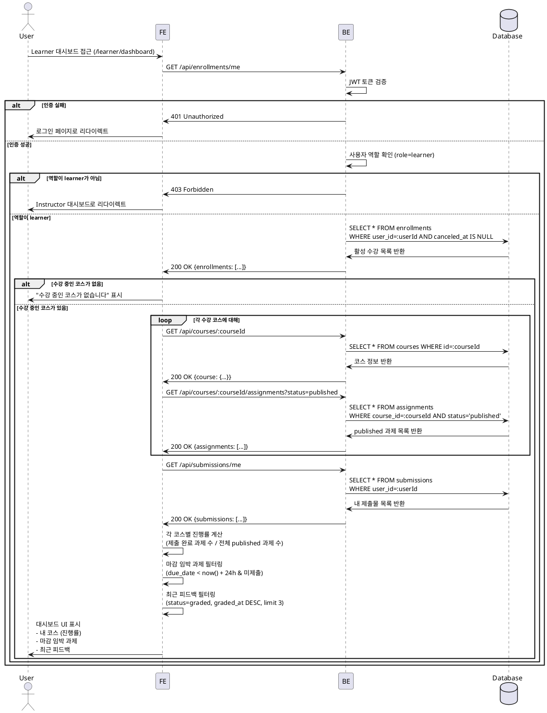

# UC-003: Learner 대시보드

## Primary Actor
학습자 (Learner)

## Precondition
- 사용자가 Learner 역할로 로그인된 상태
- 대시보드 페이지(`/learner/dashboard` 또는 `/`) 접근

## Trigger
Learner 대시보드 페이지 접근

## Main Scenario

1. 사용자가 Learner 대시보드 페이지 접근 (`/learner/dashboard`)
2. FE가 BE에 내 수강 목록 요청 (`GET /api/enrollments/me`)
3. BE가 현재 사용자의 활성 수강 목록 반환 (`canceled_at = null`)
4. FE가 각 코스 정보 조회 (`GET /api/courses/:courseId`)
5. FE가 각 코스의 과제 목록 요청 (`GET /api/courses/:courseId/assignments?status=published`)
6. FE가 내 제출물 목록 요청 (`GET /api/submissions/me`)
7. FE가 각 코스별 진행률 계산:
   - 진행률 = (제출 완료된 과제 수 / 전체 published 과제 수) × 100
8. FE가 마감 임박 과제 필터링:
   - 조건: `due_date`가 현재 시각으로부터 24시간 이내
   - 조건: 아직 제출하지 않은 과제
   - 정렬: `due_date` 오름차순
9. FE가 최근 피드백 필터링:
   - 조건: `status = graded`
   - 정렬: `graded_at` 내림차순
   - 제한: 최신 3개
10. FE가 대시보드 UI 표시:
    - **내 코스 섹션**: 코스 제목, 진행률 (%, 완료/전체), 코스 이동 링크
    - **마감 임박 과제 섹션**: 과제명, 코스명, 마감일, 남은 시간, 과제 이동 링크
    - **최근 피드백 섹션**: 과제명, 코스명, 점수, 피드백 요약, 상세 이동 링크

## Edge Cases

### 1. 수강 중인 코스가 없음
- **상황**: enrollment가 없거나 모두 취소됨
- **처리**: "수강 중인 코스가 없습니다. 코스를 탐색해보세요." 메시지 + 코스 카탈로그 링크 표시

### 2. 과제가 없는 코스
- **상황**: 특정 코스에 published 과제가 없음
- **처리**: 진행률 0% 표시 또는 "과제 없음" 표시

### 3. 제출한 과제가 없음
- **상황**: 모든 과제가 미제출 상태
- **처리**: 진행률 0% 표시

### 4. 마감 임박 과제가 없음
- **상황**: 24시간 이내 마감 과제가 없거나 모두 제출 완료
- **처리**: "마감 임박 과제가 없습니다." 메시지 표시

### 5. 피드백이 없음
- **상황**: 채점 완료된 과제가 없음
- **처리**: "최근 피드백이 없습니다." 메시지 표시

### 6. 비로그인 사용자
- **상황**: 인증되지 않은 사용자가 대시보드 접근 시도
- **처리**: `401 Unauthorized`, 로그인 페이지로 리다이렉트

### 7. Instructor가 Learner 대시보드 접근
- **상황**: Instructor 역할로 Learner 대시보드 접근 시도
- **처리**: `403 Forbidden` 또는 Instructor 대시보드로 리다이렉트

### 8. 네트워크 오류
- **상황**: BE 통신 실패 (타임아웃, 서버 오류 등)
- **처리**: "대시보드를 불러오는데 실패했습니다. 다시 시도해주세요." 메시지 + 새로고침 버튼 표시

## Business Rules

### BR-001: Learner만 접근 가능
- `role=learner`인 사용자만 Learner 대시보드 접근 가능
- `role=instructor`는 `/instructor/dashboard`로 리다이렉트
- `role=operator`는 운영자 페이지로 리다이렉트

### BR-002: 활성 수강만 표시
- `canceled_at = null`인 enrollment만 "내 코스"에 표시
- 취소된 수강은 대시보드에서 제외

### BR-003: published 과제만 진행률 계산
- `status = published`인 과제만 전체 과제 수에 포함
- `draft` 또는 `closed` 과제는 진행률 계산에서 제외

### BR-004: 진행률 계산 방식
- 진행률 = (제출 완료된 과제 수 / 전체 published 과제 수) × 100
- 제출 완료 = `submissions` 테이블에 레코드 존재 (status 무관)
- 소수점 첫째 자리까지 표시 (예: 66.7%)

### BR-005: 마감 임박 기준
- 마감 임박 = `due_date`가 현재 시각으로부터 24시간 이내
- 아직 제출하지 않은 과제만 포함
- `due_date` 오름차순으로 정렬 (가장 급한 순서)

### BR-006: 최근 피드백 표시
- `status = graded`인 제출물만 표시
- `graded_at` 기준 내림차순 정렬
- 최신 3개만 표시
- 피드백 내용은 50자까지만 요약 표시

### BR-007: 실시간 업데이트
- 대시보드는 페이지 로드 시점의 데이터 표시
- 새로고침 버튼 제공하여 수동 갱신 가능
- 자동 갱신은 향후 WebSocket으로 구현 고려

---

## Sequence Diagram



---

## 대시보드 UI 구성 (예시)

### 내 코스 섹션
```
┌─────────────────────────────────────────┐
│ 내 코스                                  │
├─────────────────────────────────────────┤
│ React 기초 강의                  [66.7%] │
│ 완료: 2/3 과제                          │
│                                [코스로] │
├─────────────────────────────────────────┤
│ Next.js 마스터                  [100%]  │
│ 완료: 5/5 과제                          │
│                                [코스로] │
└─────────────────────────────────────────┘
```

### 마감 임박 과제 섹션
```
┌─────────────────────────────────────────┐
│ 마감 임박 과제                           │
├─────────────────────────────────────────┤
│ React Hooks 과제                        │
│ 코스: React 기초 강의                   │
│ 마감: 2025-11-20 23:59 (5시간 남음)    │
│                              [과제로 →] │
├─────────────────────────────────────────┤
│ 상태 관리 프로젝트                      │
│ 코스: React 기초 강의                   │
│ 마감: 2025-11-21 18:00 (23시간 남음)   │
│                              [과제로 →] │
└─────────────────────────────────────────┘
```

### 최근 피드백 섹션
```
┌─────────────────────────────────────────┐
│ 최근 피드백                              │
├─────────────────────────────────────────┤
│ JSX 기초 과제                     [95점] │
│ 코스: React 기초 강의                   │
│ "매우 잘 작성하셨습니다. 코드 구조가..." │
│                              [상세 보기] │
├─────────────────────────────────────────┤
│ 컴포넌트 설계                     [88점] │
│ 코스: React 기초 강의                   │
│ "전반적으로 좋습니다. Props 전달 방..." │
│                              [상세 보기] │
└─────────────────────────────────────────┘
```

---

## 데이터 집계 로직 (예시)

### 진행률 계산
```typescript
// 코스별 진행률 계산
const calculateProgress = (courseId: string, assignments: Assignment[], submissions: Submission[]) => {
  const publishedAssignments = assignments.filter(a => a.status === 'published');
  const totalCount = publishedAssignments.length;

  if (totalCount === 0) {
    return { completed: 0, total: 0, percentage: 0 };
  }

  const completedCount = publishedAssignments.filter(a =>
    submissions.some(s => s.assignmentId === a.id)
  ).length;

  const percentage = Math.round((completedCount / totalCount) * 1000) / 10; // 소수점 1자리

  return { completed: completedCount, total: totalCount, percentage };
};
```

### 마감 임박 과제 필터링
```typescript
// 마감 임박 과제 필터링 (24시간 이내 & 미제출)
const filterUpcomingAssignments = (assignments: Assignment[], submissions: Submission[]) => {
  const now = new Date();
  const in24Hours = new Date(now.getTime() + 24 * 60 * 60 * 1000);

  return assignments
    .filter(a => {
      const dueDate = new Date(a.dueDate);
      const isUpcoming = dueDate >= now && dueDate <= in24Hours;
      const isNotSubmitted = !submissions.some(s => s.assignmentId === a.id);
      return a.status === 'published' && isUpcoming && isNotSubmitted;
    })
    .sort((a, b) => new Date(a.dueDate).getTime() - new Date(b.dueDate).getTime());
};
```

### 최근 피드백 필터링
```typescript
// 최근 피드백 필터링 (graded_at 기준 최신 3개)
const filterRecentFeedback = (submissions: Submission[]) => {
  return submissions
    .filter(s => s.status === 'graded' && s.gradedAt)
    .sort((a, b) => new Date(b.gradedAt!).getTime() - new Date(a.gradedAt!).getTime())
    .slice(0, 3);
};
```
