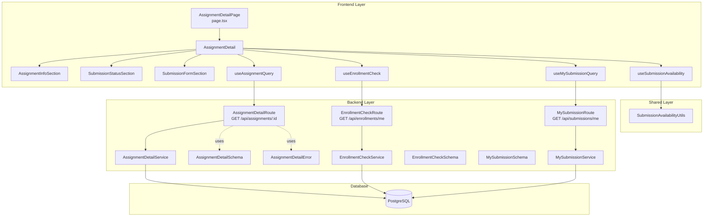

# UC-004: 과제 상세 열람 - Implementation Plan

## 개요

### Backend Modules (4개)

| 모듈명 | 위치 | 설명 |
|--------|------|------|
| AssignmentDetailRoute | `src/features/assignments/backend/route.ts` | `GET /api/assignments/:assignmentId` 라우터 |
| AssignmentDetailService | `src/features/assignments/backend/service.ts` | 과제 상세 조회 비즈니스 로직 |
| AssignmentDetailSchema | `src/features/assignments/backend/schema.ts` | `AssignmentResponse` Zod 스키마 |
| AssignmentDetailError | `src/features/assignments/backend/error.ts` | 과제 조회 관련 에러 코드 (`ASSIGNMENT_NOT_FOUND`, `ASSIGNMENT_NOT_PUBLISHED`) |

### Frontend Modules (9개)

| 모듈명 | 위치 | 설명 |
|--------|------|------|
| AssignmentDetailPage | `src/app/courses/[courseId]/assignments/[assignmentId]/page.tsx` | 과제 상세 페이지 |
| AssignmentDetail | `src/features/assignments/components/AssignmentDetail.tsx` | 과제 상세 메인 컴포넌트 |
| AssignmentInfoSection | `src/features/assignments/components/AssignmentInfoSection.tsx` | 과제 정보 섹션 (제목, 설명, 마감일, 정책) |
| SubmissionStatusSection | `src/features/assignments/components/SubmissionStatusSection.tsx` | 제출 상태 섹션 (제출 시각, 점수 등) |
| SubmissionFormSection | `src/features/assignments/components/SubmissionFormSection.tsx` | 제출 폼 섹션 (조건부 활성화/비활성화) |
| useAssignmentQuery | `src/features/assignments/hooks/useAssignmentQuery.ts` | 과제 상세 조회 React Query 훅 |
| useEnrollmentCheck | `src/features/enrollments/hooks/useEnrollmentCheck.ts` | 수강 여부 확인 훅 |
| useMySubmissionQuery | `src/features/submissions/hooks/useMySubmissionQuery.ts` | 내 제출물 조회 React Query 훅 |
| useSubmissionAvailability | `src/features/assignments/hooks/useSubmissionAvailability.ts` | 제출 가능 여부 계산 훅 |

### Shared Modules (1개)

| 모듈명 | 위치 | 설명 |
|--------|------|------|
| SubmissionAvailabilityUtils | `src/lib/validation/submission-availability.ts` | 제출 가능 여부 판단 로직 (`checkSubmissionAvailability`) |

---

## Diagram



---

## Implementation Plan

### 1. Backend: AssignmentDetailRoute

**파일**: `src/features/assignments/backend/route.ts`

**책임**: `GET /api/assignments/:assignmentId` 엔드포인트 정의

**구현 내용**:
```typescript
import { Hono } from 'hono';
import type { AppEnv } from '@/backend/hono/context';
import { respond } from '@/backend/http/response';
import { getAssignmentById } from './service';
import { assignmentResponseSchema } from './schema';
import { ASSIGNMENT_NOT_FOUND, ASSIGNMENT_NOT_PUBLISHED } from './error';

const assignmentsRoute = new Hono<AppEnv>();

assignmentsRoute.get('/api/assignments/:assignmentId', async (c) => {
  const { assignmentId } = c.req.param();
  const supabase = c.get('supabase');

  const result = await getAssignmentById(supabase, assignmentId);

  return respond(c, result, assignmentResponseSchema);
});

export function registerAssignmentsRoute(app: Hono<AppEnv>) {
  app.route('/', assignmentsRoute);
}
```

**의존성**:
- `AssignmentDetailService.getAssignmentById`
- `AssignmentDetailSchema.assignmentResponseSchema`
- `AssignmentDetailError`

**단위 테스트**: N/A (프레젠테이션 레이어)

**QA Sheet**:
```markdown
## AssignmentDetailRoute QA Sheet

### 1. 정상 케이스
- [ ] `GET /api/assignments/:assignmentId` 요청 시 200 OK 반환
- [ ] 응답 body가 `assignmentResponseSchema` 형식과 일치

### 2. 에러 케이스
- [ ] 존재하지 않는 assignmentId로 요청 시 404 Not Found
- [ ] draft 상태 과제 요청 시 403 Forbidden

### 3. 인증
- [ ] JWT 토큰 없이 요청 시 401 Unauthorized
```

---

### 2. Backend: AssignmentDetailService

**파일**: `src/features/assignments/backend/service.ts`

**책임**: Supabase에서 과제 상세 정보 조회

**구현 내용**:
```typescript
import type { SupabaseClient } from '@supabase/supabase-js';
import { success, failure } from '@/backend/http/response';
import { ASSIGNMENT_NOT_FOUND, ASSIGNMENT_NOT_PUBLISHED } from './error';

export async function getAssignmentById(
  supabase: SupabaseClient,
  assignmentId: string,
) {
  const { data, error } = await supabase
    .from('assignments')
    .select('*')
    .eq('id', assignmentId)
    .single();

  if (error || !data) {
    return failure(ASSIGNMENT_NOT_FOUND);
  }

  // draft 상태는 Instructor만 접근 가능
  if (data.status === 'draft') {
    return failure(ASSIGNMENT_NOT_PUBLISHED);
  }

  return success({
    id: data.id,
    courseId: data.course_id,
    title: data.title,
    description: data.description,
    dueDate: data.due_date,
    scoreWeight: data.score_weight,
    allowLate: data.allow_late,
    allowResubmit: data.allow_resubmit,
    status: data.status,
  });
}
```

**의존성**:
- Supabase Client
- `AssignmentDetailError`

**단위 테스트**:
```typescript
describe('AssignmentDetailService', () => {
  describe('getAssignmentById', () => {
    it('존재하는 published 과제를 조회하면 success 반환', async () => {
      const mockSupabase = createMockSupabase({
        from: jest.fn().mockReturnValue({
          select: jest.fn().mockReturnValue({
            eq: jest.fn().mockReturnValue({
              single: jest.fn().mockResolvedValue({
                data: {
                  id: 'assignment-1',
                  course_id: 'course-1',
                  title: 'React Hooks',
                  description: '...',
                  due_date: '2025-11-25T23:59:00Z',
                  score_weight: 20,
                  allow_late: true,
                  allow_resubmit: true,
                  status: 'published',
                },
                error: null,
              }),
            }),
          }),
        }),
      });

      const result = await getAssignmentById(mockSupabase, 'assignment-1');

      expect(result.ok).toBe(true);
      expect(result.data?.title).toBe('React Hooks');
    });

    it('존재하지 않는 과제 조회 시 ASSIGNMENT_NOT_FOUND 반환', async () => {
      const mockSupabase = createMockSupabase({
        from: jest.fn().mockReturnValue({
          select: jest.fn().mockReturnValue({
            eq: jest.fn().mockReturnValue({
              single: jest.fn().mockResolvedValue({
                data: null,
                error: { message: 'Not found' },
              }),
            }),
          }),
        }),
      });

      const result = await getAssignmentById(mockSupabase, 'invalid-id');

      expect(result.ok).toBe(false);
      expect(result.error).toBe(ASSIGNMENT_NOT_FOUND);
    });

    it('draft 상태 과제 조회 시 ASSIGNMENT_NOT_PUBLISHED 반환', async () => {
      const mockSupabase = createMockSupabase({
        from: jest.fn().mockReturnValue({
          select: jest.fn().mockReturnValue({
            eq: jest.fn().mockReturnValue({
              single: jest.fn().mockResolvedValue({
                data: {
                  id: 'assignment-2',
                  status: 'draft',
                },
                error: null,
              }),
            }),
          }),
        }),
      });

      const result = await getAssignmentById(mockSupabase, 'assignment-2');

      expect(result.ok).toBe(false);
      expect(result.error).toBe(ASSIGNMENT_NOT_PUBLISHED);
    });
  });
});
```

---

### 3. Backend: AssignmentDetailSchema

**파일**: `src/features/assignments/backend/schema.ts`

**책임**: 과제 상세 응답 Zod 스키마 정의

**구현 내용**:
```typescript
import { z } from 'zod';

export const assignmentResponseSchema = z.object({
  id: z.string().uuid(),
  courseId: z.string().uuid(),
  title: z.string(),
  description: z.string(),
  dueDate: z.string().datetime(),
  scoreWeight: z.number().min(0).max(100),
  allowLate: z.boolean(),
  allowResubmit: z.boolean(),
  status: z.enum(['published', 'closed']),
});

export type AssignmentResponse = z.infer<typeof assignmentResponseSchema>;
```

**의존성**: 없음

**단위 테스트**:
```typescript
describe('AssignmentDetailSchema', () => {
  describe('assignmentResponseSchema', () => {
    it('유효한 데이터를 파싱해야 함', () => {
      const validData = {
        id: '123e4567-e89b-12d3-a456-426614174000',
        courseId: '123e4567-e89b-12d3-a456-426614174001',
        title: 'React Hooks',
        description: 'Learn React Hooks',
        dueDate: '2025-11-25T23:59:00Z',
        scoreWeight: 20,
        allowLate: true,
        allowResubmit: true,
        status: 'published',
      };

      const result = assignmentResponseSchema.safeParse(validData);

      expect(result.success).toBe(true);
    });

    it('scoreWeight가 0-100 범위를 벗어나면 실패', () => {
      const invalidData = {
        id: '123e4567-e89b-12d3-a456-426614174000',
        courseId: '123e4567-e89b-12d3-a456-426614174001',
        title: 'Test',
        description: 'Test',
        dueDate: '2025-11-25T23:59:00Z',
        scoreWeight: 150,
        allowLate: true,
        allowResubmit: true,
        status: 'published',
      };

      const result = assignmentResponseSchema.safeParse(invalidData);

      expect(result.success).toBe(false);
    });

    it('status가 draft이면 실패 (published/closed만 허용)', () => {
      const invalidData = {
        id: '123e4567-e89b-12d3-a456-426614174000',
        courseId: '123e4567-e89b-12d3-a456-426614174001',
        title: 'Test',
        description: 'Test',
        dueDate: '2025-11-25T23:59:00Z',
        scoreWeight: 20,
        allowLate: true,
        allowResubmit: true,
        status: 'draft',
      };

      const result = assignmentResponseSchema.safeParse(invalidData);

      expect(result.success).toBe(false);
    });
  });
});
```

---

### 4. Backend: AssignmentDetailError

**파일**: `src/features/assignments/backend/error.ts`

**책임**: 과제 조회 관련 에러 코드 정의

**구현 내용**:
```typescript
import type { ErrorCode } from '@/backend/http/response';

export const ASSIGNMENT_NOT_FOUND: ErrorCode = {
  code: 'ASSIGNMENT_NOT_FOUND',
  message: '과제를 찾을 수 없습니다',
  status: 404,
};

export const ASSIGNMENT_NOT_PUBLISHED: ErrorCode = {
  code: 'ASSIGNMENT_NOT_PUBLISHED',
  message: '아직 공개되지 않은 과제입니다',
  status: 403,
};
```

**의존성**: 없음

**단위 테스트**: N/A (상수 정의)

---

### 5. Frontend: AssignmentDetailPage

**파일**: `src/app/courses/[courseId]/assignments/[assignmentId]/page.tsx`

**책임**: 과제 상세 페이지 라우트

**구현 내용**:
```typescript
'use client';

import { use } from 'react';
import { AssignmentDetail } from '@/features/assignments/components/AssignmentDetail';

type Params = Promise<{
  courseId: string;
  assignmentId: string;
}>;

export default function AssignmentDetailPage({ params }: { params: Params }) {
  const { courseId, assignmentId } = use(params);

  return (
    <div className="container mx-auto py-8">
      <AssignmentDetail courseId={courseId} assignmentId={assignmentId} />
    </div>
  );
}
```

**의존성**:
- `AssignmentDetail` 컴포넌트

**QA Sheet**:
```markdown
## AssignmentDetailPage QA Sheet

### 1. 라우팅
- [ ] `/courses/[courseId]/assignments/[assignmentId]` 경로로 접근 가능
- [ ] courseId, assignmentId가 정상적으로 파싱됨

### 2. 레이아웃
- [ ] 페이지가 중앙 정렬되어 표시
- [ ] 반응형 레이아웃 적용 (모바일/데스크톱)
```

---

### 6. Frontend: AssignmentDetail

**파일**: `src/features/assignments/components/AssignmentDetail.tsx`

**책임**: 과제 상세 메인 컴포넌트 (데이터 조회 및 섹션 조합)

**구현 내용**:
```typescript
'use client';

import { useAssignmentQuery } from '@/features/assignments/hooks/useAssignmentQuery';
import { useEnrollmentCheck } from '@/features/enrollments/hooks/useEnrollmentCheck';
import { useMySubmissionQuery } from '@/features/submissions/hooks/useMySubmissionQuery';
import { useSubmissionAvailability } from '@/features/assignments/hooks/useSubmissionAvailability';
import { AssignmentInfoSection } from './AssignmentInfoSection';
import { SubmissionStatusSection } from './SubmissionStatusSection';
import { SubmissionFormSection } from './SubmissionFormSection';
import { Alert, AlertDescription } from '@/components/ui/alert';
import { Button } from '@/components/ui/button';

type AssignmentDetailProps = {
  courseId: string;
  assignmentId: string;
};

export function AssignmentDetail({ courseId, assignmentId }: AssignmentDetailProps) {
  const assignmentQuery = useAssignmentQuery(assignmentId);
  const enrollmentQuery = useEnrollmentCheck(courseId);
  const submissionQuery = useMySubmissionQuery(assignmentId);

  const { canSubmit, reason } = useSubmissionAvailability(
    assignmentQuery.data,
    submissionQuery.data,
  );

  if (assignmentQuery.isLoading || enrollmentQuery.isLoading || submissionQuery.isLoading) {
    return <div>로딩 중...</div>;
  }

  if (assignmentQuery.error) {
    return (
      <Alert variant="destructive">
        <AlertDescription>
          과제를 불러오는데 실패했습니다. 다시 시도해주세요.
        </AlertDescription>
        <Button onClick={() => assignmentQuery.refetch()}>새로고침</Button>
      </Alert>
    );
  }

  if (!enrollmentQuery.data) {
    return (
      <Alert>
        <AlertDescription>
          수강 중인 코스의 과제만 확인할 수 있습니다.
        </AlertDescription>
      </Alert>
    );
  }

  return (
    <div className="space-y-6">
      <AssignmentInfoSection assignment={assignmentQuery.data!} />

      {submissionQuery.data && (
        <SubmissionStatusSection submission={submissionQuery.data} />
      )}

      <SubmissionFormSection
        assignment={assignmentQuery.data!}
        submission={submissionQuery.data}
        canSubmit={canSubmit}
        disableReason={reason}
      />
    </div>
  );
}
```

**의존성**:
- `useAssignmentQuery`
- `useEnrollmentCheck`
- `useMySubmissionQuery`
- `useSubmissionAvailability`
- `AssignmentInfoSection`, `SubmissionStatusSection`, `SubmissionFormSection`

**QA Sheet**:
```markdown
## AssignmentDetail QA Sheet

### 1. 로딩 상태
- [ ] 데이터 로딩 중 "로딩 중..." 메시지 표시
- [ ] 3개 쿼리 모두 완료될 때까지 대기

### 2. 에러 처리
- [ ] 과제 조회 실패 시 에러 메시지 + 새로고침 버튼 표시
- [ ] 수강하지 않은 코스의 과제 접근 시 안내 메시지 표시

### 3. 정상 렌더링
- [ ] 과제 정보 섹션 표시
- [ ] 제출물이 있으면 제출 상태 섹션 표시
- [ ] 제출 폼 섹션 표시 (조건부 활성화/비활성화)

### 4. 제출 가능 여부
- [ ] canSubmit=true일 때 제출 폼 활성화
- [ ] canSubmit=false일 때 제출 폼 비활성화 + 사유 표시
```

---

### 7. Frontend: AssignmentInfoSection

**파일**: `src/features/assignments/components/AssignmentInfoSection.tsx`

**책임**: 과제 정보 섹션 (제목, 설명, 마감일, 정책)

**구현 내용**:
```typescript
'use client';

import type { AssignmentResponse } from '@/features/assignments/lib/dto';
import { Card, CardHeader, CardTitle, CardContent } from '@/components/ui/card';
import { format } from 'date-fns';
import { ko } from 'date-fns/locale';

type AssignmentInfoSectionProps = {
  assignment: AssignmentResponse;
};

export function AssignmentInfoSection({ assignment }: AssignmentInfoSectionProps) {
  return (
    <Card>
      <CardHeader>
        <CardTitle>{assignment.title}</CardTitle>
      </CardHeader>
      <CardContent className="space-y-4">
        <div>
          <p className="text-sm text-muted-foreground">설명</p>
          <p className="whitespace-pre-wrap">{assignment.description}</p>
        </div>

        <div className="grid grid-cols-2 gap-4">
          <div>
            <p className="text-sm text-muted-foreground">마감일</p>
            <p>{format(new Date(assignment.dueDate), 'PPP p', { locale: ko })}</p>
          </div>
          <div>
            <p className="text-sm text-muted-foreground">점수 비중</p>
            <p>{assignment.scoreWeight}%</p>
          </div>
        </div>

        <div>
          <p className="text-sm text-muted-foreground">정책</p>
          <div className="flex gap-2">
            <span className={assignment.allowLate ? 'text-green-600' : 'text-red-600'}>
              {assignment.allowLate ? '✓ 지각 제출 가능' : '✗ 마감 시간 엄수'}
            </span>
            <span className={assignment.allowResubmit ? 'text-green-600' : 'text-red-600'}>
              {assignment.allowResubmit ? '✓ 재제출 가능' : '✗ 1회 제출만 가능'}
            </span>
          </div>
        </div>
      </CardContent>
    </Card>
  );
}
```

**의존성**:
- `AssignmentResponse` DTO
- shadcn-ui Card 컴포넌트
- date-fns

**QA Sheet**:
```markdown
## AssignmentInfoSection QA Sheet

### 1. 과제 정보 표시
- [ ] 제목이 정확하게 표시
- [ ] 설명이 줄바꿈 유지하며 표시
- [ ] 마감일이 한국어 로케일로 포맷팅되어 표시
- [ ] 점수 비중이 퍼센트로 표시

### 2. 정책 표시
- [ ] allowLate=true일 때 "✓ 지각 제출 가능" 표시
- [ ] allowLate=false일 때 "✗ 마감 시간 엄수" 표시
- [ ] allowResubmit=true일 때 "✓ 재제출 가능" 표시
- [ ] allowResubmit=false일 때 "✗ 1회 제출만 가능" 표시

### 3. 스타일링
- [ ] Card 레이아웃 적용
- [ ] 반응형 그리드 (마감일/점수 비중)
```

---

### 8. Frontend: SubmissionStatusSection

**파일**: `src/features/assignments/components/SubmissionStatusSection.tsx`

**책임**: 제출 상태 섹션 (제출 시각, 점수 등)

**구현 내용**:
```typescript
'use client';

import type { SubmissionResponse } from '@/features/submissions/lib/dto';
import { Card, CardHeader, CardTitle, CardContent } from '@/components/ui/card';
import { format } from 'date-fns';
import { ko } from 'date-fns/locale';
import { match } from 'ts-pattern';

type SubmissionStatusSectionProps = {
  submission: SubmissionResponse;
};

export function SubmissionStatusSection({ submission }: SubmissionStatusSectionProps) {
  const statusText = match(submission.status)
    .with('submitted', () => '제출 완료')
    .with('graded', () => '채점 완료')
    .with('resubmission_required', () => '재제출 요청')
    .exhaustive();

  return (
    <Card>
      <CardHeader>
        <CardTitle>제출 상태</CardTitle>
      </CardHeader>
      <CardContent className="space-y-2">
        <div>
          <p className="text-sm text-muted-foreground">상태</p>
          <p>{statusText}</p>
        </div>

        <div>
          <p className="text-sm text-muted-foreground">제출 시각</p>
          <p>{format(new Date(submission.submittedAt), 'PPP p', { locale: ko })}</p>
        </div>

        {submission.status === 'graded' && submission.score !== null && (
          <div>
            <p className="text-sm text-muted-foreground">점수</p>
            <p className="text-lg font-bold">{submission.score}점</p>
          </div>
        )}
      </CardContent>
    </Card>
  );
}
```

**의존성**:
- `SubmissionResponse` DTO
- shadcn-ui Card 컴포넌트
- date-fns
- ts-pattern

**QA Sheet**:
```markdown
## SubmissionStatusSection QA Sheet

### 1. 제출 상태 표시
- [ ] status='submitted'일 때 "제출 완료" 표시
- [ ] status='graded'일 때 "채점 완료" 표시
- [ ] status='resubmission_required'일 때 "재제출 요청" 표시

### 2. 제출 시각 표시
- [ ] submittedAt이 한국어 로케일로 포맷팅되어 표시

### 3. 점수 표시
- [ ] status='graded'이고 score가 있을 때만 점수 표시
- [ ] 점수가 큰 글씨로 강조 표시
```

---

### 9. Frontend: SubmissionFormSection

**파일**: `src/features/assignments/components/SubmissionFormSection.tsx`

**책임**: 제출 폼 섹션 (조건부 활성화/비활성화)

**구현 내용**:
```typescript
'use client';

import type { AssignmentResponse } from '@/features/assignments/lib/dto';
import type { SubmissionResponse } from '@/features/submissions/lib/dto';
import { Card, CardHeader, CardTitle, CardContent } from '@/components/ui/card';
import { Button } from '@/components/ui/button';
import { Textarea } from '@/components/ui/textarea';
import { Input } from '@/components/ui/input';
import { Alert, AlertDescription } from '@/components/ui/alert';
import { useState } from 'react';

type SubmissionFormSectionProps = {
  assignment: AssignmentResponse;
  submission: SubmissionResponse | null;
  canSubmit: boolean;
  disableReason?: string;
};

export function SubmissionFormSection({
  assignment,
  submission,
  canSubmit,
  disableReason,
}: SubmissionFormSectionProps) {
  const [content, setContent] = useState(submission?.content || '');
  const [link, setLink] = useState(submission?.link || '');

  const handleSubmit = () => {
    // TODO: 제출 로직 구현 (UC-005에서 처리)
    console.log({ content, link });
  };

  if (!canSubmit && disableReason) {
    return (
      <Card>
        <CardHeader>
          <CardTitle>과제 제출</CardTitle>
        </CardHeader>
        <CardContent>
          <Alert>
            <AlertDescription>{disableReason}</AlertDescription>
          </Alert>

          {submission && (
            <div className="mt-4 space-y-2">
              <p className="text-sm text-muted-foreground">제출 내용</p>
              <p className="whitespace-pre-wrap">{submission.content}</p>

              {submission.link && (
                <>
                  <p className="text-sm text-muted-foreground">링크</p>
                  <a href={submission.link} target="_blank" rel="noopener noreferrer" className="text-blue-600 underline">
                    {submission.link}
                  </a>
                </>
              )}
            </div>
          )}
        </CardContent>
      </Card>
    );
  }

  return (
    <Card>
      <CardHeader>
        <CardTitle>과제 제출</CardTitle>
      </CardHeader>
      <CardContent className="space-y-4">
        <div>
          <label className="text-sm font-medium">제출 내용 (필수) *</label>
          <Textarea
            value={content}
            onChange={(e) => setContent(e.target.value)}
            placeholder="과제 내용을 입력하세요"
            rows={6}
          />
        </div>

        <div>
          <label className="text-sm font-medium">링크 (선택)</label>
          <Input
            type="url"
            value={link}
            onChange={(e) => setLink(e.target.value)}
            placeholder="https://github.com/..."
          />
        </div>

        <Button onClick={handleSubmit} disabled={!content}>
          제출하기
        </Button>
      </CardContent>
    </Card>
  );
}
```

**의존성**:
- `AssignmentResponse`, `SubmissionResponse` DTO
- shadcn-ui 컴포넌트 (Card, Button, Textarea, Input, Alert)

**QA Sheet**:
```markdown
## SubmissionFormSection QA Sheet

### 1. 제출 불가 상태
- [ ] canSubmit=false일 때 disableReason 표시
- [ ] 기존 제출물이 있으면 제출 내용 표시 (읽기 전용)
- [ ] 기존 제출물의 링크가 있으면 클릭 가능한 링크로 표시

### 2. 제출 가능 상태
- [ ] 제출 내용 입력란 표시 (Textarea)
- [ ] 링크 입력란 표시 (Input)
- [ ] 제출하기 버튼 표시
- [ ] 제출 내용이 비어있으면 제출 버튼 비활성화

### 3. 폼 상태 관리
- [ ] 기존 제출물이 있으면 content, link 초기값 설정
- [ ] 사용자 입력에 따라 상태 업데이트
```

---

### 10. Frontend: useAssignmentQuery

**파일**: `src/features/assignments/hooks/useAssignmentQuery.ts`

**책임**: 과제 상세 조회 React Query 훅

**구현 내용**:
```typescript
import { useQuery } from '@tanstack/react-query';
import { apiClient } from '@/lib/remote/api-client';
import { assignmentResponseSchema } from '@/features/assignments/lib/dto';

export function useAssignmentQuery(assignmentId: string) {
  return useQuery({
    queryKey: ['assignments', assignmentId],
    queryFn: async () => {
      const response = await apiClient.get(`/api/assignments/${assignmentId}`);
      return assignmentResponseSchema.parse(response.data);
    },
    enabled: !!assignmentId,
  });
}
```

**의존성**:
- `@tanstack/react-query`
- `apiClient`
- `assignmentResponseSchema` (re-exported from backend)

**단위 테스트**: N/A (React Query 훅)

---

### 11. Frontend: useEnrollmentCheck

**파일**: `src/features/enrollments/hooks/useEnrollmentCheck.ts`

**책임**: 수강 여부 확인 훅

**구현 내용**:
```typescript
import { useQuery } from '@tanstack/react-query';
import { apiClient } from '@/lib/remote/api-client';

export function useEnrollmentCheck(courseId: string) {
  return useQuery({
    queryKey: ['enrollments', 'check', courseId],
    queryFn: async () => {
      const response = await apiClient.get(`/api/enrollments/me`, {
        params: { courseId },
      });

      // enrollment가 있으면 true, 없으면 false
      return response.data.enrollment !== null;
    },
    enabled: !!courseId,
  });
}
```

**의존성**:
- `@tanstack/react-query`
- `apiClient`

**단위 테스트**: N/A (React Query 훅)

---

### 12. Frontend: useMySubmissionQuery

**파일**: `src/features/submissions/hooks/useMySubmissionQuery.ts`

**책임**: 내 제출물 조회 React Query 훅

**구현 내용**:
```typescript
import { useQuery } from '@tanstack/react-query';
import { apiClient } from '@/lib/remote/api-client';
import { submissionResponseSchema } from '@/features/submissions/lib/dto';

export function useMySubmissionQuery(assignmentId: string) {
  return useQuery({
    queryKey: ['submissions', 'me', assignmentId],
    queryFn: async () => {
      const response = await apiClient.get(`/api/submissions/me`, {
        params: { assignmentId },
      });

      // submission이 없으면 null 반환
      if (!response.data.submission) {
        return null;
      }

      return submissionResponseSchema.parse(response.data.submission);
    },
    enabled: !!assignmentId,
  });
}
```

**의존성**:
- `@tanstack/react-query`
- `apiClient`
- `submissionResponseSchema`

**단위 테스트**: N/A (React Query 훅)

---

### 13. Frontend: useSubmissionAvailability

**파일**: `src/features/assignments/hooks/useSubmissionAvailability.ts`

**책임**: 제출 가능 여부 계산 훅

**구현 내용**:
```typescript
import { useMemo } from 'react';
import type { AssignmentResponse } from '@/features/assignments/lib/dto';
import type { SubmissionResponse } from '@/features/submissions/lib/dto';
import { checkSubmissionAvailability } from '@/lib/validation/submission-availability';

export function useSubmissionAvailability(
  assignment: AssignmentResponse | undefined,
  submission: SubmissionResponse | null | undefined,
) {
  return useMemo(() => {
    if (!assignment) {
      return { canSubmit: false, reason: '과제 정보를 불러오는 중입니다' };
    }

    return checkSubmissionAvailability(assignment, submission ?? null);
  }, [assignment, submission]);
}
```

**의존성**:
- `checkSubmissionAvailability` (Shared Utils)
- `AssignmentResponse`, `SubmissionResponse` DTO

**단위 테스트**: N/A (useMemo 래퍼)

---

### 14. Shared: SubmissionAvailabilityUtils

**파일**: `src/lib/validation/submission-availability.ts`

**책임**: 제출 가능 여부 판단 로직

**구현 내용**:
```typescript
import type { AssignmentResponse } from '@/features/assignments/lib/dto';
import type { SubmissionResponse } from '@/features/submissions/lib/dto';

export type SubmissionAvailability = {
  canSubmit: boolean;
  reason?: string;
};

export function checkSubmissionAvailability(
  assignment: AssignmentResponse,
  submission: SubmissionResponse | null,
): SubmissionAvailability {
  // 1. closed 상태 체크
  if (assignment.status === 'closed') {
    return { canSubmit: false, reason: '마감된 과제입니다' };
  }

  // 2. 마감 시간 체크
  const now = new Date();
  const dueDate = new Date(assignment.dueDate);
  const isPastDue = now > dueDate;

  if (isPastDue && !assignment.allowLate) {
    return { canSubmit: false, reason: '마감 시간이 지났습니다' };
  }

  // 3. 재제출 체크
  if (submission && !assignment.allowResubmit) {
    return { canSubmit: false, reason: '재제출이 허용되지 않습니다' };
  }

  // 4. 재제출 요청 상태 체크
  if (submission?.status === 'resubmission_required') {
    return { canSubmit: true };
  }

  // 5. 모든 조건 통과
  return { canSubmit: true };
}
```

**의존성**:
- `AssignmentResponse`, `SubmissionResponse` DTO

**단위 테스트**:
```typescript
describe('SubmissionAvailabilityUtils', () => {
  describe('checkSubmissionAvailability', () => {
    it('Case 1: 미제출 & 마감 전 - 제출 가능', () => {
      const assignment: AssignmentResponse = {
        id: 'assignment-1',
        courseId: 'course-1',
        title: 'Test',
        description: 'Test',
        dueDate: new Date(Date.now() + 2 * 24 * 60 * 60 * 1000).toISOString(), // 2일 후
        scoreWeight: 20,
        allowLate: true,
        allowResubmit: true,
        status: 'published',
      };

      const result = checkSubmissionAvailability(assignment, null);

      expect(result.canSubmit).toBe(true);
      expect(result.reason).toBeUndefined();
    });

    it('Case 2: 미제출 & 마감 후 (지각 허용) - 제출 가능', () => {
      const assignment: AssignmentResponse = {
        id: 'assignment-1',
        courseId: 'course-1',
        title: 'Test',
        description: 'Test',
        dueDate: new Date(Date.now() - 1 * 24 * 60 * 60 * 1000).toISOString(), // 1일 전
        scoreWeight: 20,
        allowLate: true,
        allowResubmit: true,
        status: 'published',
      };

      const result = checkSubmissionAvailability(assignment, null);

      expect(result.canSubmit).toBe(true);
    });

    it('Case 3: 미제출 & 마감 후 (지각 불허) - 제출 불가', () => {
      const assignment: AssignmentResponse = {
        id: 'assignment-1',
        courseId: 'course-1',
        title: 'Test',
        description: 'Test',
        dueDate: new Date(Date.now() - 1 * 24 * 60 * 60 * 1000).toISOString(),
        scoreWeight: 20,
        allowLate: false,
        allowResubmit: true,
        status: 'published',
      };

      const result = checkSubmissionAvailability(assignment, null);

      expect(result.canSubmit).toBe(false);
      expect(result.reason).toBe('마감 시간이 지났습니다');
    });

    it('Case 4: 제출 완료 (재제출 허용) - 제출 가능', () => {
      const assignment: AssignmentResponse = {
        id: 'assignment-1',
        courseId: 'course-1',
        title: 'Test',
        description: 'Test',
        dueDate: new Date(Date.now() + 2 * 24 * 60 * 60 * 1000).toISOString(),
        scoreWeight: 20,
        allowLate: true,
        allowResubmit: true,
        status: 'published',
      };

      const submission: SubmissionResponse = {
        id: 'submission-1',
        assignmentId: 'assignment-1',
        userId: 'user-1',
        content: 'Test content',
        link: null,
        status: 'submitted',
        submittedAt: new Date().toISOString(),
        score: null,
      };

      const result = checkSubmissionAvailability(assignment, submission);

      expect(result.canSubmit).toBe(true);
    });

    it('Case 5: 제출 완료 (재제출 불허) - 제출 불가', () => {
      const assignment: AssignmentResponse = {
        id: 'assignment-1',
        courseId: 'course-1',
        title: 'Test',
        description: 'Test',
        dueDate: new Date(Date.now() + 2 * 24 * 60 * 60 * 1000).toISOString(),
        scoreWeight: 20,
        allowLate: true,
        allowResubmit: false,
        status: 'published',
      };

      const submission: SubmissionResponse = {
        id: 'submission-1',
        assignmentId: 'assignment-1',
        userId: 'user-1',
        content: 'Test content',
        link: null,
        status: 'submitted',
        submittedAt: new Date().toISOString(),
        score: null,
      };

      const result = checkSubmissionAvailability(assignment, submission);

      expect(result.canSubmit).toBe(false);
      expect(result.reason).toBe('재제출이 허용되지 않습니다');
    });

    it('Case 6: 재제출 요청됨 - 제출 가능', () => {
      const assignment: AssignmentResponse = {
        id: 'assignment-1',
        courseId: 'course-1',
        title: 'Test',
        description: 'Test',
        dueDate: new Date(Date.now() + 2 * 24 * 60 * 60 * 1000).toISOString(),
        scoreWeight: 20,
        allowLate: true,
        allowResubmit: false,
        status: 'published',
      };

      const submission: SubmissionResponse = {
        id: 'submission-1',
        assignmentId: 'assignment-1',
        userId: 'user-1',
        content: 'Test content',
        link: null,
        status: 'resubmission_required',
        submittedAt: new Date().toISOString(),
        score: null,
      };

      const result = checkSubmissionAvailability(assignment, submission);

      expect(result.canSubmit).toBe(true);
    });

    it('Case 7: 채점 완료 (재제출 불허) - 제출 불가', () => {
      const assignment: AssignmentResponse = {
        id: 'assignment-1',
        courseId: 'course-1',
        title: 'Test',
        description: 'Test',
        dueDate: new Date(Date.now() + 2 * 24 * 60 * 60 * 1000).toISOString(),
        scoreWeight: 20,
        allowLate: true,
        allowResubmit: false,
        status: 'published',
      };

      const submission: SubmissionResponse = {
        id: 'submission-1',
        assignmentId: 'assignment-1',
        userId: 'user-1',
        content: 'Test content',
        link: null,
        status: 'graded',
        submittedAt: new Date().toISOString(),
        score: 95,
      };

      const result = checkSubmissionAvailability(assignment, submission);

      expect(result.canSubmit).toBe(false);
      expect(result.reason).toBe('재제출이 허용되지 않습니다');
    });

    it('closed 상태 과제 - 제출 불가', () => {
      const assignment: AssignmentResponse = {
        id: 'assignment-1',
        courseId: 'course-1',
        title: 'Test',
        description: 'Test',
        dueDate: new Date(Date.now() + 2 * 24 * 60 * 60 * 1000).toISOString(),
        scoreWeight: 20,
        allowLate: true,
        allowResubmit: true,
        status: 'closed',
      };

      const result = checkSubmissionAvailability(assignment, null);

      expect(result.canSubmit).toBe(false);
      expect(result.reason).toBe('마감된 과제입니다');
    });
  });
});
```

---

## 추가 고려사항

### 1. DTO Re-export

프론트엔드에서 사용할 스키마는 다음과 같이 재노출:

**파일**: `src/features/assignments/lib/dto.ts`
```typescript
export { assignmentResponseSchema } from '../backend/schema';
export type { AssignmentResponse } from '../backend/schema';
```

**파일**: `src/features/submissions/lib/dto.ts`
```typescript
export { submissionResponseSchema } from '../backend/schema';
export type { SubmissionResponse } from '../backend/schema';
```

### 2. Backend 라우터 등록

`src/backend/hono/app.ts`에서 `registerAssignmentsRoute` 호출 필요:

```typescript
import { registerAssignmentsRoute } from '@/features/assignments/backend/route';

export function createHonoApp() {
  const app = new Hono<AppEnv>();

  // ... middleware

  registerAssignmentsRoute(app);

  return app;
}
```

### 3. 의존 API

다음 API는 이미 구현되었다고 가정 (UC-002, UC-003에서 구현됨):
- `GET /api/enrollments/me?courseId=:courseId`
- `GET /api/submissions/me?assignmentId=:assignmentId`

만약 구현되지 않았다면 별도 구현 필요.

### 4. 성능 최적화

현재 구현은 3개의 독립적인 API 호출을 수행합니다. 향후 다음 최적화 고려:
- Backend에서 `GET /api/assignments/:assignmentId?include=enrollment,submission` 형태로 한 번에 조회
- React Query의 `useQueries`를 사용하여 병렬 호출 최적화
