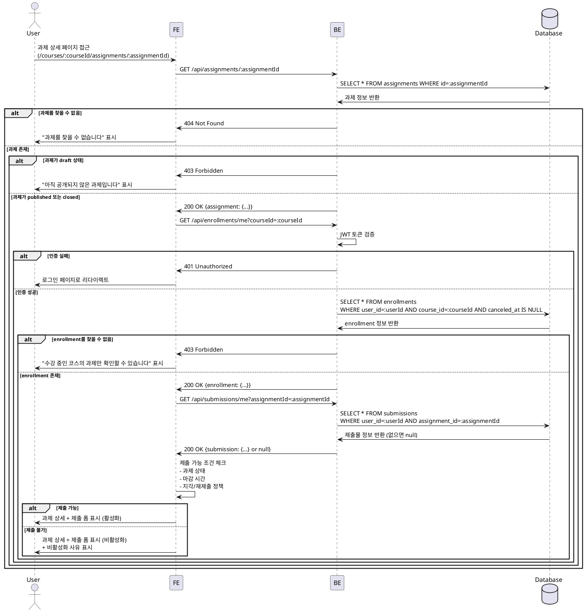

# UC-004: 과제 상세 열람 (Learner)

## Primary Actor
학습자 (Learner)

## Precondition
- 사용자가 Learner 역할로 로그인된 상태
- 수강 중인 코스 존재
- 과제 상세 페이지(`/courses/[courseId]/assignments/[assignmentId]`) 접근

## Trigger
과제 목록에서 특정 과제 클릭 또는 과제 상세 페이지 직접 접근

## Main Scenario

1. 사용자가 코스 페이지에서 과제 목록 접근 (`/courses/[courseId]`)
2. 사용자가 특정 과제 클릭하여 상세 페이지 진입 (`/courses/[courseId]/assignments/[assignmentId]`)
3. FE가 BE에 과제 상세 정보 요청 (`GET /api/assignments/:assignmentId`)
4. BE가 과제 정보 조회
5. BE가 과제 상태 확인 (`published` 또는 `closed`)
6. BE가 과제 정보 반환
7. FE가 BE에 사용자의 수강 여부 확인 요청 (`GET /api/enrollments/me?courseId=:courseId`)
8. BE가 수강 여부 확인 (`canceled_at = null`)
9. BE가 수강 정보 반환
10. FE가 BE에 해당 과제의 내 제출물 조회 요청 (`GET /api/submissions/me?assignmentId=:assignmentId`)
11. BE가 제출물 조회 (존재하면 반환, 없으면 null)
12. FE가 과제 상세 UI 표시:
    - **과제 정보 섹션**: 제목, 설명, 마감일, 점수 비중
    - **정책 정보 섹션**: 지각 허용 여부, 재제출 허용 여부
    - **제출 상태 섹션**: 제출 여부, 제출 시각, 점수 (있을 경우)
13. FE가 제출 폼 표시:
    - `closed` 상태: 제출 버튼 비활성화 + "마감된 과제입니다" 메시지
    - `published` 상태 & 마감일 경과 & 지각 불허: 제출 버튼 비활성화 + "마감 시간이 지났습니다" 메시지
    - `published` 상태 & 마감일 이내 또는 지각 허용: 제출 버튼 활성화
    - 이미 제출했고 재제출 불허: 제출 버튼 비활성화 + "재제출이 허용되지 않습니다" 메시지

## Edge Cases

### 1. published 상태가 아닌 과제 열람 시도
- **상황**: draft 상태의 과제에 직접 접근 시도
- **처리**: `403 Forbidden`, "아직 공개되지 않은 과제입니다" 메시지 표시

### 2. 수강하지 않은 코스의 과제 열람 시도
- **상황**: enrollment가 없거나 취소된 상태에서 과제 접근
- **처리**: `403 Forbidden`, "수강 중인 코스의 과제만 확인할 수 있습니다" 메시지 표시 + 코스 신청 페이지 링크

### 3. 존재하지 않는 과제
- **상황**: 삭제되었거나 존재하지 않는 과제 ID로 접근
- **처리**: `404 Not Found`, "과제를 찾을 수 없습니다" 메시지 표시

### 4. 비로그인 사용자
- **상황**: 인증되지 않은 사용자가 과제 상세 접근 시도
- **처리**: `401 Unauthorized`, 로그인 페이지로 리다이렉트

### 5. Instructor가 자신의 과제 열람
- **상황**: Instructor가 본인이 생성한 과제를 Learner 관점에서 열람 시도
- **처리**: Instructor용 과제 관리 페이지로 리다이렉트 또는 읽기 전용 모드

### 6. 마감된 과제 (closed)
- **상황**: 과제 상태가 `closed`
- **처리**: 과제 정보는 표시하되, 제출 버튼 비활성화 + "마감된 과제입니다" 안내

### 7. 마감 시간 경과 (지각 불허)
- **상황**: `due_date` 경과 & `allow_late = false`
- **처리**: 제출 버튼 비활성화 + "마감 시간이 지났습니다" 안내

### 8. 이미 제출 완료 (재제출 불허)
- **상황**: 제출물 존재 & `allow_resubmit = false`
- **처리**: 제출 폼 대신 제출 내용 표시 + "재제출이 허용되지 않습니다" 안내

### 9. 네트워크 오류
- **상황**: BE 통신 실패 (타임아웃, 서버 오류 등)
- **처리**: "과제를 불러오는데 실패했습니다. 다시 시도해주세요" 메시지 + 새로고침 버튼

## Business Rules

### BR-001: published 과제만 열람 가능
- `status = published` 또는 `status = closed`인 과제만 Learner가 열람 가능
- `status = draft`인 과제는 Instructor만 접근 가능

### BR-002: 수강 중인 코스의 과제만 접근 가능
- 해당 과제의 `course_id`에 대한 활성 enrollment 필요 (`canceled_at = null`)
- enrollment가 없거나 취소된 경우 접근 불가

### BR-003: 제출 가능 조건
과제 제출이 가능하려면 다음 조건을 모두 만족해야 함:
1. 과제 상태가 `published`
2. **마감 시간 전** 또는 **마감 시간 후 + 지각 허용**
3. **미제출** 또는 **제출 완료 + 재제출 허용**

### BR-004: 제출 버튼 비활성화 조건
다음 중 하나라도 해당하면 제출 버튼 비활성화:
- 과제 상태가 `closed`
- 마감 시간 경과 & `allow_late = false`
- 이미 제출 완료 & `allow_resubmit = false`

### BR-005: 과제 정보 표시 항목
- 제목, 설명 (Markdown 지원 고려)
- 마감일 (로컬 타임존으로 표시)
- 점수 비중 (예: 20%)
- 지각 허용 여부 (예: "지각 제출 가능" 또는 "마감 시간 엄수")
- 재제출 허용 여부 (예: "재제출 가능" 또는 "1회 제출만 가능")

### BR-006: 제출 상태 표시
제출물이 있는 경우:
- 제출 시각
- 지각 여부
- 현재 상태 (`submitted`, `graded`, `resubmission_required`)
- 점수 (채점 완료된 경우)

### BR-007: 읽기 전용 vs 편집 가능
- Learner: 제출 폼 표시 (조건에 따라 활성화/비활성화)
- Instructor: 읽기 전용 또는 관리 페이지로 리다이렉트

---

## Sequence Diagram



---

## UI 구성 (예시)

### 과제 정보 섹션
```
┌─────────────────────────────────────────┐
│ React Hooks 과제                        │
│                                         │
│ 설명:                                   │
│ React Hooks를 활용하여 상태 관리를      │
│ 구현하세요. useState, useEffect를       │
│ 활용한 실습 과제입니다.                 │
│                                         │
│ 마감: 2025-11-25 23:59                 │
│ 점수 비중: 20%                          │
│                                         │
│ 정책:                                   │
│ ✓ 지각 제출 가능                        │
│ ✓ 재제출 가능                           │
└─────────────────────────────────────────┘
```

### 제출 상태 섹션 (제출 완료 시)
```
┌─────────────────────────────────────────┐
│ 제출 상태                               │
├─────────────────────────────────────────┤
│ ✓ 제출 완료                             │
│ 제출 시각: 2025-11-24 15:30            │
│ 상태: 채점 대기 중                      │
└─────────────────────────────────────────┘
```

### 제출 폼 섹션 (제출 가능)
```
┌─────────────────────────────────────────┐
│ 과제 제출                               │
├─────────────────────────────────────────┤
│ 제출 내용 (필수) *                      │
│ ┌─────────────────────────────────────┐ │
│ │                                     │ │
│ │ [텍스트 입력란]                     │ │
│ │                                     │ │
│ └─────────────────────────────────────┘ │
│                                         │
│ 링크 (선택)                             │
│ ┌─────────────────────────────────────┐ │
│ │ https://github.com/...              │ │
│ └─────────────────────────────────────┘ │
│                                         │
│                        [제출하기 버튼]  │
└─────────────────────────────────────────┘
```

### 제출 폼 섹션 (제출 불가 - 마감)
```
┌─────────────────────────────────────────┐
│ 과제 제출                               │
├─────────────────────────────────────────┤
│ ⚠ 마감된 과제입니다                     │
│                                         │
│ 제출 기한이 지나 더 이상 제출할 수      │
│ 없습니다.                               │
└─────────────────────────────────────────┘
```

### 제출 폼 섹션 (제출 불가 - 재제출 불허)
```
┌─────────────────────────────────────────┐
│ 과제 제출                               │
├─────────────────────────────────────────┤
│ ℹ 이미 제출 완료                        │
│                                         │
│ 이 과제는 재제출이 허용되지 않습니다.   │
│                                         │
│ 제출 내용:                              │
│ "React Hooks를 사용하여 카운터..."      │
│                                         │
│ 링크: https://github.com/...           │
└─────────────────────────────────────────┘
```

---

## 제출 가능 조건 로직 (예시)

```typescript
type SubmissionAvailability = {
  canSubmit: boolean;
  reason?: string;
};

const checkSubmissionAvailability = (
  assignment: AssignmentResponse,
  submission: SubmissionResponse | null,
): SubmissionAvailability => {
  // 1. closed 상태 체크
  if (assignment.status === 'closed') {
    return { canSubmit: false, reason: '마감된 과제입니다' };
  }

  // 2. 마감 시간 체크
  const now = new Date();
  const dueDate = new Date(assignment.dueDate);
  const isPastDue = now > dueDate;

  if (isPastDue && !assignment.allowLate) {
    return { canSubmit: false, reason: '마감 시간이 지났습니다' };
  }

  // 3. 재제출 체크
  if (submission && !assignment.allowResubmit) {
    return { canSubmit: false, reason: '재제출이 허용되지 않습니다' };
  }

  // 4. 재제출 요청 상태 체크
  if (submission?.status === 'resubmission_required') {
    return { canSubmit: true };
  }

  // 5. 모든 조건 통과
  return { canSubmit: true };
};
```

---

## 데이터 조합 예시

### Case 1: 미제출 & 마감 전
- 과제 상태: `published`
- 마감일: 2일 후
- 제출물: 없음
- **결과**: 제출 폼 활성화

### Case 2: 미제출 & 마감 후 (지각 허용)
- 과제 상태: `published`
- 마감일: 1일 전
- 지각 허용: `true`
- 제출물: 없음
- **결과**: 제출 폼 활성화 + "지각 제출입니다" 경고 표시

### Case 3: 미제출 & 마감 후 (지각 불허)
- 과제 상태: `published`
- 마감일: 1일 전
- 지각 허용: `false`
- 제출물: 없음
- **결과**: 제출 폼 비활성화 + "마감 시간이 지났습니다"

### Case 4: 제출 완료 (재제출 허용)
- 과제 상태: `published`
- 제출물: 있음
- 재제출 허용: `true`
- **결과**: 기존 제출 내용 표시 + 제출 폼 활성화

### Case 5: 제출 완료 (재제출 불허)
- 과제 상태: `published`
- 제출물: 있음
- 재제출 허용: `false`
- **결과**: 기존 제출 내용만 표시 (읽기 전용)

### Case 6: 재제출 요청됨
- 과제 상태: `published`
- 제출물 상태: `resubmission_required`
- **결과**: 제출 폼 활성화 + "재제출이 요청되었습니다" 알림

### Case 7: 채점 완료
- 과제 상태: `published`
- 제출물 상태: `graded`
- 재제출 허용: `false`
- **결과**: 점수 및 피드백 표시 + 제출 폼 비활성화
