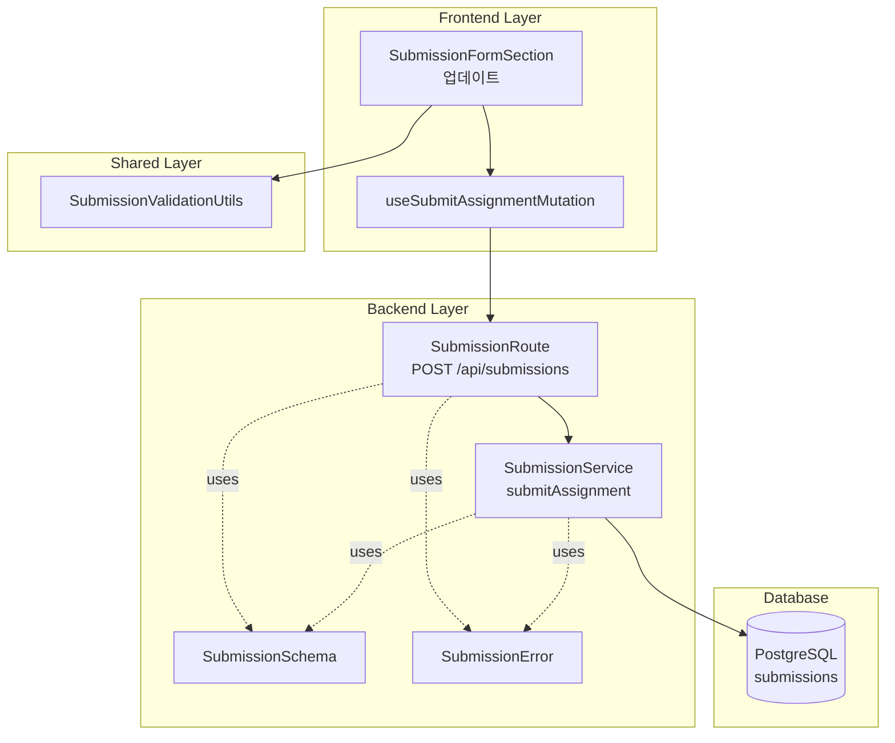

# UC-005: 과제 제출/재제출 - Implementation Plan

## 개요

### Backend Modules (4개)

| 모듈명 | 위치 | 설명 |
|--------|------|------|
| SubmissionRoute | `src/features/submissions/backend/route.ts` | `POST /api/submissions` 라우터 |
| SubmissionService | `src/features/submissions/backend/service.ts` | 과제 제출/재제출 비즈니스 로직 |
| SubmissionSchema | `src/features/submissions/backend/schema.ts` | `SubmitAssignmentRequest`, `SubmissionResponse` Zod 스키마 |
| SubmissionError | `src/features/submissions/backend/error.ts` | 제출 관련 에러 코드 (`ASSIGNMENT_CLOSED`, `PAST_DUE`, `RESUBMIT_NOT_ALLOWED` 등) |

### Frontend Modules (2개)

| 모듈명 | 위치 | 설명 |
|--------|------|------|
| useSubmitAssignmentMutation | `src/features/submissions/hooks/useSubmitAssignmentMutation.ts` | 과제 제출 React Query mutation 훅 |
| SubmissionFormSection (업데이트) | `src/features/assignments/components/SubmissionFormSection.tsx` | UC-004에서 생성한 컴포넌트에 실제 제출 로직 연결 |

### Shared Modules (1개)

| 모듈명 | 위치 | 설명 |
|--------|------|------|
| SubmissionValidationUtils | `src/lib/validation/submission-validation.ts` | 제출 입력값 검증 로직 (`validateSubmissionInput`) |

---

## Diagram



---

## Implementation Plan

### 1. Backend: SubmissionRoute

**파일**: `src/features/submissions/backend/route.ts`

**책임**: `POST /api/submissions` 엔드포인트 정의

**구현 내용**:
```typescript
import { Hono } from 'hono';
import type { AppEnv } from '@/backend/hono/context';
import { respond } from '@/backend/http/response';
import { submitAssignment } from './service';
import { submitAssignmentRequestSchema, submissionResponseSchema } from './schema';

const submissionsRoute = new Hono<AppEnv>();

submissionsRoute.post('/api/submissions', async (c) => {
  const supabase = c.get('supabase');
  const logger = c.get('logger');

  // 사용자 인증 확인 (withAuth 미들웨어에서 처리됨)
  const user = c.get('user'); // withAuth 미들웨어에서 주입
  if (!user) {
    return c.json({ error: 'Unauthorized' }, 401);
  }

  // 요청 body 검증
  const body = await c.req.json();
  const parseResult = submitAssignmentRequestSchema.safeParse(body);

  if (!parseResult.success) {
    return c.json({ error: 'Invalid request', details: parseResult.error }, 400);
  }

  const result = await submitAssignment(supabase, user.id, parseResult.data);

  return respond(c, result, submissionResponseSchema);
});

export function registerSubmissionsRoute(app: Hono<AppEnv>) {
  app.route('/', submissionsRoute);
}
```

**의존성**:
- `SubmissionService.submitAssignment`
- `SubmissionSchema.submitAssignmentRequestSchema`, `submissionResponseSchema`
- `withAuth` 미들웨어 (사용자 인증)

**단위 테스트**: N/A (프레젠테이션 레이어)

**QA Sheet**:
```markdown
## SubmissionRoute QA Sheet

### 1. 정상 케이스
- [ ] `POST /api/submissions` 요청 시 201 Created 또는 200 OK 반환
- [ ] 신규 제출 시 201 Created 반환
- [ ] 재제출 시 200 OK 반환
- [ ] 응답 body가 `submissionResponseSchema` 형식과 일치

### 2. 에러 케이스
- [ ] 인증되지 않은 요청 시 401 Unauthorized
- [ ] 요청 body 검증 실패 시 400 Bad Request
- [ ] 존재하지 않는 과제 제출 시 404 Not Found
- [ ] closed 상태 과제 제출 시 400 Bad Request
- [ ] 마감 시간 경과 & 지각 불허 시 400 Bad Request
- [ ] 재제출 불허 & 이미 제출 완료 시 400 Bad Request

### 3. 입력값 검증
- [ ] content가 비어있으면 400 Bad Request
- [ ] link가 URL 형식이 아니면 400 Bad Request
```

---

### 2. Backend: SubmissionService

**파일**: `src/features/submissions/backend/service.ts`

**책임**: 과제 제출/재제출 비즈니스 로직

**구현 내용**:
```typescript
import type { SupabaseClient } from '@supabase/supabase-js';
import { success, failure } from '@/backend/http/response';
import {
  ASSIGNMENT_NOT_FOUND,
  ASSIGNMENT_NOT_PUBLISHED,
  ASSIGNMENT_CLOSED,
  NOT_ENROLLED,
  PAST_DUE,
  RESUBMIT_NOT_ALLOWED,
} from './error';
import type { SubmitAssignmentRequest } from './schema';

export async function submitAssignment(
  supabase: SupabaseClient,
  userId: string,
  input: SubmitAssignmentRequest,
) {
  // 1. 과제 조회
  const { data: assignment, error: assignmentError } = await supabase
    .from('assignments')
    .select('*')
    .eq('id', input.assignmentId)
    .single();

  if (assignmentError || !assignment) {
    return failure(ASSIGNMENT_NOT_FOUND);
  }

  // 2. 과제 상태 확인
  if (assignment.status === 'draft') {
    return failure(ASSIGNMENT_NOT_PUBLISHED);
  }

  if (assignment.status === 'closed') {
    return failure(ASSIGNMENT_CLOSED);
  }

  // 3. 수강 여부 확인
  const { data: enrollment } = await supabase
    .from('enrollments')
    .select('*')
    .eq('user_id', userId)
    .eq('course_id', assignment.course_id)
    .is('canceled_at', null)
    .single();

  if (!enrollment) {
    return failure(NOT_ENROLLED);
  }

  // 4. 기존 제출물 조회
  const { data: existingSubmission } = await supabase
    .from('submissions')
    .select('*')
    .eq('user_id', userId)
    .eq('assignment_id', input.assignmentId)
    .single();

  // 5. 마감 시간 확인
  const now = new Date();
  const dueDate = new Date(assignment.due_date);
  const isPastDue = now > dueDate;

  if (isPastDue && !assignment.allow_late) {
    return failure(PAST_DUE);
  }

  // 6. 재제출 여부 확인
  if (
    existingSubmission &&
    !assignment.allow_resubmit &&
    existingSubmission.status !== 'resubmission_required'
  ) {
    return failure(RESUBMIT_NOT_ALLOWED);
  }

  // 7. 지각 여부 계산
  const late = isPastDue;

  // 8. 제출물 생성 또는 업데이트
  if (!existingSubmission) {
    // 신규 제출
    const { data: newSubmission, error } = await supabase
      .from('submissions')
      .insert({
        user_id: userId,
        assignment_id: input.assignmentId,
        content: input.content,
        link: input.link || null,
        status: 'submitted',
        late,
        submitted_at: new Date().toISOString(),
      })
      .select()
      .single();

    if (error) {
      return failure({
        code: 'SUBMISSION_FAILED',
        message: '제출에 실패했습니다',
        status: 500,
      });
    }

    return success({
      id: newSubmission.id,
      assignmentId: newSubmission.assignment_id,
      userId: newSubmission.user_id,
      content: newSubmission.content,
      link: newSubmission.link,
      status: newSubmission.status,
      late: newSubmission.late,
      submittedAt: newSubmission.submitted_at,
      score: newSubmission.score,
      feedback: newSubmission.feedback,
      gradedAt: newSubmission.graded_at,
    });
  } else {
    // 재제출
    const { data: updatedSubmission, error } = await supabase
      .from('submissions')
      .update({
        content: input.content,
        link: input.link || null,
        status: 'submitted',
        late,
        submitted_at: new Date().toISOString(),
        score: null,
        feedback: null,
        graded_at: null,
      })
      .eq('id', existingSubmission.id)
      .select()
      .single();

    if (error) {
      return failure({
        code: 'RESUBMISSION_FAILED',
        message: '재제출에 실패했습니다',
        status: 500,
      });
    }

    return success({
      id: updatedSubmission.id,
      assignmentId: updatedSubmission.assignment_id,
      userId: updatedSubmission.user_id,
      content: updatedSubmission.content,
      link: updatedSubmission.link,
      status: updatedSubmission.status,
      late: updatedSubmission.late,
      submittedAt: updatedSubmission.submitted_at,
      score: updatedSubmission.score,
      feedback: updatedSubmission.feedback,
      gradedAt: updatedSubmission.graded_at,
    });
  }
}
```

**의존성**:
- Supabase Client
- `SubmissionError`

**단위 테스트**:
```typescript
describe('SubmissionService', () => {
  describe('submitAssignment', () => {
    it('신규 제출 시 success 반환', async () => {
      const mockSupabase = createMockSupabase({
        assignments: {
          id: 'assignment-1',
          status: 'published',
          course_id: 'course-1',
          due_date: new Date(Date.now() + 24 * 60 * 60 * 1000).toISOString(),
          allow_late: true,
          allow_resubmit: true,
        },
        enrollments: {
          user_id: 'user-1',
          course_id: 'course-1',
          canceled_at: null,
        },
        submissions: null, // 기존 제출물 없음
      });

      const result = await submitAssignment(mockSupabase, 'user-1', {
        assignmentId: 'assignment-1',
        content: 'Test content',
        link: 'https://github.com/test',
      });

      expect(result.ok).toBe(true);
      expect(result.data?.status).toBe('submitted');
      expect(result.data?.late).toBe(false);
    });

    it('마감 후 & 지각 허용 시 late=true로 제출', async () => {
      const mockSupabase = createMockSupabase({
        assignments: {
          id: 'assignment-1',
          status: 'published',
          course_id: 'course-1',
          due_date: new Date(Date.now() - 24 * 60 * 60 * 1000).toISOString(), // 1일 전
          allow_late: true,
          allow_resubmit: true,
        },
        enrollments: {
          user_id: 'user-1',
          course_id: 'course-1',
          canceled_at: null,
        },
        submissions: null,
      });

      const result = await submitAssignment(mockSupabase, 'user-1', {
        assignmentId: 'assignment-1',
        content: 'Test content',
      });

      expect(result.ok).toBe(true);
      expect(result.data?.late).toBe(true);
    });

    it('마감 후 & 지각 불허 시 PAST_DUE 반환', async () => {
      const mockSupabase = createMockSupabase({
        assignments: {
          id: 'assignment-1',
          status: 'published',
          course_id: 'course-1',
          due_date: new Date(Date.now() - 24 * 60 * 60 * 1000).toISOString(),
          allow_late: false,
          allow_resubmit: true,
        },
        enrollments: {
          user_id: 'user-1',
          course_id: 'course-1',
          canceled_at: null,
        },
        submissions: null,
      });

      const result = await submitAssignment(mockSupabase, 'user-1', {
        assignmentId: 'assignment-1',
        content: 'Test content',
      });

      expect(result.ok).toBe(false);
      expect(result.error).toBe(PAST_DUE);
    });

    it('재제출 허용 시 기존 제출물 업데이트', async () => {
      const mockSupabase = createMockSupabase({
        assignments: {
          id: 'assignment-1',
          status: 'published',
          course_id: 'course-1',
          due_date: new Date(Date.now() + 24 * 60 * 60 * 1000).toISOString(),
          allow_late: true,
          allow_resubmit: true,
        },
        enrollments: {
          user_id: 'user-1',
          course_id: 'course-1',
          canceled_at: null,
        },
        submissions: {
          id: 'submission-1',
          user_id: 'user-1',
          assignment_id: 'assignment-1',
          status: 'submitted',
          score: 80,
          feedback: 'Good job',
        },
      });

      const result = await submitAssignment(mockSupabase, 'user-1', {
        assignmentId: 'assignment-1',
        content: 'Updated content',
      });

      expect(result.ok).toBe(true);
      expect(result.data?.content).toBe('Updated content');
      expect(result.data?.score).toBeNull(); // 점수 초기화
      expect(result.data?.feedback).toBeNull(); // 피드백 초기화
    });

    it('재제출 불허 & 이미 제출 완료 시 RESUBMIT_NOT_ALLOWED 반환', async () => {
      const mockSupabase = createMockSupabase({
        assignments: {
          id: 'assignment-1',
          status: 'published',
          course_id: 'course-1',
          due_date: new Date(Date.now() + 24 * 60 * 60 * 1000).toISOString(),
          allow_late: true,
          allow_resubmit: false,
        },
        enrollments: {
          user_id: 'user-1',
          course_id: 'course-1',
          canceled_at: null,
        },
        submissions: {
          id: 'submission-1',
          user_id: 'user-1',
          assignment_id: 'assignment-1',
          status: 'submitted',
        },
      });

      const result = await submitAssignment(mockSupabase, 'user-1', {
        assignmentId: 'assignment-1',
        content: 'Updated content',
      });

      expect(result.ok).toBe(false);
      expect(result.error).toBe(RESUBMIT_NOT_ALLOWED);
    });

    it('재제출 요청 상태일 때는 재제출 허용', async () => {
      const mockSupabase = createMockSupabase({
        assignments: {
          id: 'assignment-1',
          status: 'published',
          course_id: 'course-1',
          due_date: new Date(Date.now() + 24 * 60 * 60 * 1000).toISOString(),
          allow_late: true,
          allow_resubmit: false, // 재제출 불허
        },
        enrollments: {
          user_id: 'user-1',
          course_id: 'course-1',
          canceled_at: null,
        },
        submissions: {
          id: 'submission-1',
          user_id: 'user-1',
          assignment_id: 'assignment-1',
          status: 'resubmission_required', // 재제출 요청 상태
        },
      });

      const result = await submitAssignment(mockSupabase, 'user-1', {
        assignmentId: 'assignment-1',
        content: 'Updated content',
      });

      expect(result.ok).toBe(true);
    });

    it('closed 상태 과제 제출 시 ASSIGNMENT_CLOSED 반환', async () => {
      const mockSupabase = createMockSupabase({
        assignments: {
          id: 'assignment-1',
          status: 'closed',
          course_id: 'course-1',
        },
      });

      const result = await submitAssignment(mockSupabase, 'user-1', {
        assignmentId: 'assignment-1',
        content: 'Test content',
      });

      expect(result.ok).toBe(false);
      expect(result.error).toBe(ASSIGNMENT_CLOSED);
    });

    it('수강하지 않은 코스의 과제 제출 시 NOT_ENROLLED 반환', async () => {
      const mockSupabase = createMockSupabase({
        assignments: {
          id: 'assignment-1',
          status: 'published',
          course_id: 'course-1',
        },
        enrollments: null, // 수강 정보 없음
      });

      const result = await submitAssignment(mockSupabase, 'user-1', {
        assignmentId: 'assignment-1',
        content: 'Test content',
      });

      expect(result.ok).toBe(false);
      expect(result.error).toBe(NOT_ENROLLED);
    });
  });
});
```

---

### 3. Backend: SubmissionSchema

**파일**: `src/features/submissions/backend/schema.ts`

**책임**: 제출 요청/응답 Zod 스키마 정의

**구현 내용**:
```typescript
import { z } from 'zod';

export const submitAssignmentRequestSchema = z.object({
  assignmentId: z.string().uuid(),
  content: z.string().min(1, '과제 내용을 입력해주세요').max(10000, '과제 내용은 10,000자를 초과할 수 없습니다'),
  link: z.string().url('올바른 URL 형식을 입력해주세요').optional().nullable(),
});

export type SubmitAssignmentRequest = z.infer<typeof submitAssignmentRequestSchema>;

export const submissionResponseSchema = z.object({
  id: z.string().uuid(),
  assignmentId: z.string().uuid(),
  userId: z.string().uuid(),
  content: z.string(),
  link: z.string().nullable(),
  status: z.enum(['submitted', 'graded', 'resubmission_required']),
  late: z.boolean(),
  submittedAt: z.string().datetime(),
  score: z.number().nullable(),
  feedback: z.string().nullable(),
  gradedAt: z.string().datetime().nullable(),
});

export type SubmissionResponse = z.infer<typeof submissionResponseSchema>;
```

**의존성**: 없음

**단위 테스트**:
```typescript
describe('SubmissionSchema', () => {
  describe('submitAssignmentRequestSchema', () => {
    it('유효한 데이터를 파싱해야 함', () => {
      const validData = {
        assignmentId: '123e4567-e89b-12d3-a456-426614174000',
        content: 'Test content',
        link: 'https://github.com/test',
      };

      const result = submitAssignmentRequestSchema.safeParse(validData);

      expect(result.success).toBe(true);
    });

    it('content가 비어있으면 실패', () => {
      const invalidData = {
        assignmentId: '123e4567-e89b-12d3-a456-426614174000',
        content: '',
      };

      const result = submitAssignmentRequestSchema.safeParse(invalidData);

      expect(result.success).toBe(false);
    });

    it('link가 URL 형식이 아니면 실패', () => {
      const invalidData = {
        assignmentId: '123e4567-e89b-12d3-a456-426614174000',
        content: 'Test content',
        link: 'invalid-url',
      };

      const result = submitAssignmentRequestSchema.safeParse(invalidData);

      expect(result.success).toBe(false);
    });

    it('link가 없어도 성공 (선택 필드)', () => {
      const validData = {
        assignmentId: '123e4567-e89b-12d3-a456-426614174000',
        content: 'Test content',
      };

      const result = submitAssignmentRequestSchema.safeParse(validData);

      expect(result.success).toBe(true);
    });

    it('content가 10,000자를 초과하면 실패', () => {
      const invalidData = {
        assignmentId: '123e4567-e89b-12d3-a456-426614174000',
        content: 'a'.repeat(10001),
      };

      const result = submitAssignmentRequestSchema.safeParse(invalidData);

      expect(result.success).toBe(false);
    });
  });

  describe('submissionResponseSchema', () => {
    it('유효한 데이터를 파싱해야 함', () => {
      const validData = {
        id: '123e4567-e89b-12d3-a456-426614174000',
        assignmentId: '123e4567-e89b-12d3-a456-426614174001',
        userId: '123e4567-e89b-12d3-a456-426614174002',
        content: 'Test content',
        link: 'https://github.com/test',
        status: 'submitted',
        late: false,
        submittedAt: '2025-11-20T10:00:00Z',
        score: null,
        feedback: null,
        gradedAt: null,
      };

      const result = submissionResponseSchema.safeParse(validData);

      expect(result.success).toBe(true);
    });
  });
});
```

---

### 4. Backend: SubmissionError

**파일**: `src/features/submissions/backend/error.ts`

**책임**: 제출 관련 에러 코드 정의

**구현 내용**:
```typescript
import type { ErrorCode } from '@/backend/http/response';

export const ASSIGNMENT_NOT_FOUND: ErrorCode = {
  code: 'ASSIGNMENT_NOT_FOUND',
  message: '과제를 찾을 수 없습니다',
  status: 404,
};

export const ASSIGNMENT_NOT_PUBLISHED: ErrorCode = {
  code: 'ASSIGNMENT_NOT_PUBLISHED',
  message: '아직 공개되지 않은 과제입니다',
  status: 403,
};

export const ASSIGNMENT_CLOSED: ErrorCode = {
  code: 'ASSIGNMENT_CLOSED',
  message: '마감된 과제입니다',
  status: 400,
};

export const NOT_ENROLLED: ErrorCode = {
  code: 'NOT_ENROLLED',
  message: '수강 중인 코스의 과제만 제출할 수 있습니다',
  status: 403,
};

export const PAST_DUE: ErrorCode = {
  code: 'PAST_DUE',
  message: '마감 시간이 지났습니다',
  status: 400,
};

export const RESUBMIT_NOT_ALLOWED: ErrorCode = {
  code: 'RESUBMIT_NOT_ALLOWED',
  message: '재제출이 허용되지 않습니다',
  status: 400,
};
```

**의존성**: 없음

**단위 테스트**: N/A (상수 정의)

---

### 5. Frontend: useSubmitAssignmentMutation

**파일**: `src/features/submissions/hooks/useSubmitAssignmentMutation.ts`

**책임**: 과제 제출 React Query mutation 훅

**구현 내용**:
```typescript
import { useMutation, useQueryClient } from '@tanstack/react-query';
import { apiClient } from '@/lib/remote/api-client';
import { submitAssignmentRequestSchema, submissionResponseSchema } from '@/features/submissions/lib/dto';
import type { SubmitAssignmentRequest } from '@/features/submissions/lib/dto';

export function useSubmitAssignmentMutation() {
  const queryClient = useQueryClient();

  return useMutation({
    mutationFn: async (input: SubmitAssignmentRequest) => {
      // 클라이언트 사이드 검증
      const validatedInput = submitAssignmentRequestSchema.parse(input);

      const response = await apiClient.post('/api/submissions', validatedInput);

      return submissionResponseSchema.parse(response.data);
    },
    onSuccess: (data, variables) => {
      // 제출 성공 시 관련 쿼리 무효화
      queryClient.invalidateQueries({
        queryKey: ['submissions', 'me', variables.assignmentId],
      });

      // 대시보드 쿼리도 무효화 (진행률 업데이트)
      queryClient.invalidateQueries({
        queryKey: ['enrollments', 'me'],
      });
    },
  });
}
```

**의존성**:
- `@tanstack/react-query`
- `apiClient`
- `submitAssignmentRequestSchema`, `submissionResponseSchema`

**단위 테스트**: N/A (React Query 훅)

---

### 6. Frontend: SubmissionFormSection (업데이트)

**파일**: `src/features/assignments/components/SubmissionFormSection.tsx`

**책임**: UC-004에서 생성한 컴포넌트에 실제 제출 로직 연결

**구현 내용**:
```typescript
'use client';

import type { AssignmentResponse } from '@/features/assignments/lib/dto';
import type { SubmissionResponse } from '@/features/submissions/lib/dto';
import { Card, CardHeader, CardTitle, CardContent } from '@/components/ui/card';
import { Button } from '@/components/ui/button';
import { Textarea } from '@/components/ui/textarea';
import { Input } from '@/components/ui/input';
import { Alert, AlertDescription } from '@/components/ui/alert';
import { useToast } from '@/hooks/use-toast';
import { useState } from 'react';
import { useSubmitAssignmentMutation } from '@/features/submissions/hooks/useSubmitAssignmentMutation';
import { validateSubmissionInput } from '@/lib/validation/submission-validation';

type SubmissionFormSectionProps = {
  assignment: AssignmentResponse;
  submission: SubmissionResponse | null;
  canSubmit: boolean;
  disableReason?: string;
};

export function SubmissionFormSection({
  assignment,
  submission,
  canSubmit,
  disableReason,
}: SubmissionFormSectionProps) {
  const [content, setContent] = useState(submission?.content || '');
  const [link, setLink] = useState(submission?.link || '');
  const [validationError, setValidationError] = useState<string | null>(null);

  const { toast } = useToast();
  const submitMutation = useSubmitAssignmentMutation();

  const handleSubmit = async () => {
    // 클라이언트 사이드 검증
    const validation = validateSubmissionInput({ content, link });

    if (!validation.isValid) {
      setValidationError(validation.error!);
      return;
    }

    setValidationError(null);

    try {
      await submitMutation.mutateAsync({
        assignmentId: assignment.id,
        content,
        link: link || undefined,
      });

      toast({
        title: '제출 완료',
        description: submission ? '과제가 재제출되었습니다' : '과제가 제출되었습니다',
      });
    } catch (error) {
      toast({
        title: '제출 실패',
        description: '제출에 실패했습니다. 다시 시도해주세요',
        variant: 'destructive',
      });
    }
  };

  if (!canSubmit && disableReason) {
    return (
      <Card>
        <CardHeader>
          <CardTitle>과제 제출</CardTitle>
        </CardHeader>
        <CardContent>
          <Alert>
            <AlertDescription>{disableReason}</AlertDescription>
          </Alert>

          {submission && (
            <div className="mt-4 space-y-2">
              <p className="text-sm text-muted-foreground">제출 내용</p>
              <p className="whitespace-pre-wrap">{submission.content}</p>

              {submission.link && (
                <>
                  <p className="text-sm text-muted-foreground">링크</p>
                  <a
                    href={submission.link}
                    target="_blank"
                    rel="noopener noreferrer"
                    className="text-blue-600 underline"
                  >
                    {submission.link}
                  </a>
                </>
              )}
            </div>
          )}
        </CardContent>
      </Card>
    );
  }

  return (
    <Card>
      <CardHeader>
        <CardTitle>과제 제출</CardTitle>
      </CardHeader>
      <CardContent className="space-y-4">
        {validationError && (
          <Alert variant="destructive">
            <AlertDescription>{validationError}</AlertDescription>
          </Alert>
        )}

        <div>
          <label className="text-sm font-medium">제출 내용 (필수) *</label>
          <Textarea
            value={content}
            onChange={(e) => setContent(e.target.value)}
            placeholder="과제 내용을 입력하세요"
            rows={6}
          />
        </div>

        <div>
          <label className="text-sm font-medium">링크 (선택)</label>
          <Input
            type="url"
            value={link}
            onChange={(e) => setLink(e.target.value)}
            placeholder="https://github.com/..."
          />
        </div>

        <Button
          onClick={handleSubmit}
          disabled={!content || submitMutation.isPending}
        >
          {submitMutation.isPending
            ? '제출 중...'
            : submission
            ? '재제출하기'
            : '제출하기'}
        </Button>
      </CardContent>
    </Card>
  );
}
```

**의존성**:
- `useSubmitAssignmentMutation`
- `validateSubmissionInput`
- shadcn-ui 컴포넌트 (Card, Button, Textarea, Input, Alert)
- `useToast` 훅

**QA Sheet**:
```markdown
## SubmissionFormSection QA Sheet

### 1. 제출 불가 상태
- [ ] canSubmit=false일 때 disableReason 표시
- [ ] 기존 제출물이 있으면 제출 내용 표시 (읽기 전용)
- [ ] 기존 제출물의 링크가 있으면 클릭 가능한 링크로 표시

### 2. 제출 가능 상태
- [ ] 제출 내용 입력란 표시 (Textarea)
- [ ] 링크 입력란 표시 (Input)
- [ ] 제출하기 버튼 표시
- [ ] 제출 내용이 비어있으면 제출 버튼 비활성화

### 3. 클라이언트 검증
- [ ] 제출 내용이 비어있으면 "과제 내용을 입력해주세요" 표시
- [ ] 링크가 URL 형식이 아니면 "올바른 URL 형식을 입력해주세요" 표시

### 4. 제출 로직
- [ ] 제출 버튼 클릭 시 mutation 실행
- [ ] 제출 중일 때 버튼 텍스트 "제출 중..." 표시
- [ ] 제출 성공 시 토스트 메시지 표시
- [ ] 제출 실패 시 에러 토스트 메시지 표시

### 5. 재제출
- [ ] 기존 제출물이 있으면 버튼 텍스트 "재제출하기" 표시
- [ ] 재제출 성공 시 "과제가 재제출되었습니다" 메시지 표시
```

---

### 7. Shared: SubmissionValidationUtils

**파일**: `src/lib/validation/submission-validation.ts`

**책임**: 제출 입력값 검증 로직

**구현 내용**:
```typescript
type ValidationResult = {
  isValid: boolean;
  error?: string;
};

type SubmissionInput = {
  content: string;
  link?: string;
};

export function validateSubmissionInput(input: SubmissionInput): ValidationResult {
  // 1. 텍스트 필수 확인
  if (!input.content || input.content.trim().length === 0) {
    return { isValid: false, error: '과제 내용을 입력해주세요' };
  }

  // 2. 텍스트 길이 확인
  if (input.content.length > 10000) {
    return { isValid: false, error: '과제 내용은 10,000자를 초과할 수 없습니다' };
  }

  // 3. 링크 URL 형식 확인 (입력된 경우에만)
  if (input.link && input.link.trim().length > 0) {
    try {
      new URL(input.link);
    } catch {
      return { isValid: false, error: '올바른 URL 형식을 입력해주세요' };
    }
  }

  return { isValid: true };
}
```

**의존성**: 없음

**단위 테스트**:
```typescript
describe('SubmissionValidationUtils', () => {
  describe('validateSubmissionInput', () => {
    it('유효한 입력값이면 isValid=true 반환', () => {
      const result = validateSubmissionInput({
        content: 'Test content',
        link: 'https://github.com/test',
      });

      expect(result.isValid).toBe(true);
      expect(result.error).toBeUndefined();
    });

    it('content가 비어있으면 isValid=false 반환', () => {
      const result = validateSubmissionInput({
        content: '',
      });

      expect(result.isValid).toBe(false);
      expect(result.error).toBe('과제 내용을 입력해주세요');
    });

    it('content가 공백만 있으면 isValid=false 반환', () => {
      const result = validateSubmissionInput({
        content: '   ',
      });

      expect(result.isValid).toBe(false);
      expect(result.error).toBe('과제 내용을 입력해주세요');
    });

    it('content가 10,000자를 초과하면 isValid=false 반환', () => {
      const result = validateSubmissionInput({
        content: 'a'.repeat(10001),
      });

      expect(result.isValid).toBe(false);
      expect(result.error).toBe('과제 내용은 10,000자를 초과할 수 없습니다');
    });

    it('link가 URL 형식이 아니면 isValid=false 반환', () => {
      const result = validateSubmissionInput({
        content: 'Test content',
        link: 'invalid-url',
      });

      expect(result.isValid).toBe(false);
      expect(result.error).toBe('올바른 URL 형식을 입력해주세요');
    });

    it('link가 비어있으면 검증 통과', () => {
      const result = validateSubmissionInput({
        content: 'Test content',
        link: '',
      });

      expect(result.isValid).toBe(true);
    });

    it('link가 없으면 검증 통과', () => {
      const result = validateSubmissionInput({
        content: 'Test content',
      });

      expect(result.isValid).toBe(true);
    });
  });
});
```

---

## 추가 고려사항

### 1. DTO Re-export

프론트엔드에서 사용할 스키마는 다음과 같이 재노출:

**파일**: `src/features/submissions/lib/dto.ts`
```typescript
export { submitAssignmentRequestSchema, submissionResponseSchema } from '../backend/schema';
export type { SubmitAssignmentRequest, SubmissionResponse } from '../backend/schema';
```

### 2. Backend 라우터 등록

`src/backend/hono/app.ts`에서 `registerSubmissionsRoute` 호출 필요:

```typescript
import { registerSubmissionsRoute } from '@/features/submissions/backend/route';

export function createHonoApp() {
  const app = new Hono<AppEnv>();

  // ... middleware

  registerSubmissionsRoute(app);

  return app;
}
```

### 3. withAuth 미들웨어

`POST /api/submissions` 라우트는 인증된 사용자만 접근 가능하므로 `withAuth` 미들웨어 적용 필요:

```typescript
import { withAuth } from '@/backend/middleware/auth';

submissionsRoute.post('/api/submissions', withAuth, async (c) => {
  // ...
});
```

`withAuth` 미들웨어는 JWT 토큰을 검증하고 `c.set('user', user)` 형태로 사용자 정보를 주입합니다.

### 4. Toast 알림

제출 성공/실패 시 사용자에게 피드백을 제공하기 위해 `useToast` 훅 사용:

**파일**: `src/hooks/use-toast.ts` (shadcn-ui에서 제공)
```bash
$ npx shadcn@latest add toast
```

### 5. React Query 캐시 무효화

제출 성공 시 다음 쿼리들을 무효화하여 UI를 최신 상태로 유지:
- `['submissions', 'me', assignmentId]` - 내 제출물 쿼리
- `['enrollments', 'me']` - 내 수강 목록 쿼리 (대시보드 진행률 업데이트)

### 6. 성능 최적화

현재 구현은 제출 시 다음 검증을 순차적으로 수행합니다:
1. 과제 조회
2. 수강 여부 확인
3. 기존 제출물 조회

향후 최적화 고려:
- 3개의 쿼리를 병렬로 실행하여 성능 개선
- Supabase RPC 함수로 비즈니스 로직을 DB 레이어로 이동

### 7. 에러 메시지 국제화

현재는 한국어 메시지만 제공하지만, 향후 다국어 지원 시 i18n 라이브러리 고려:
- `react-i18next`
- 에러 코드를 키로 사용하여 메시지 매핑
