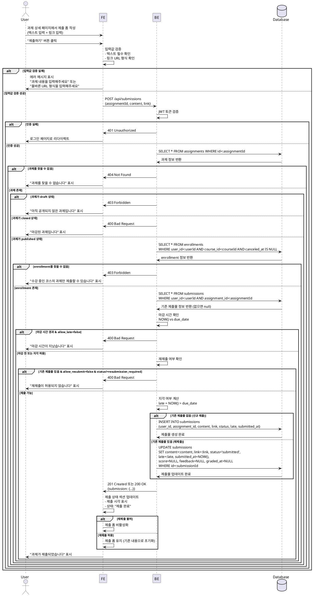

# UC-005: 과제 제출/재제출 (Learner)

## Primary Actor
학습자 (Learner)

## Precondition
- 사용자가 Learner 역할로 로그인된 상태
- 수강 중인 코스 존재
- 과제 상세 페이지(`/courses/[courseId]/assignments/[assignmentId]`) 접근
- 과제 상태가 `published`

## Trigger
과제 상세 페이지에서 제출 버튼 클릭

## Main Scenario

1. 사용자가 과제 상세 페이지의 제출 폼에서 텍스트 필드에 과제 내용 입력 (필수)
2. 사용자가 링크 필드에 URL 입력 (선택)
3. 사용자가 "제출하기" 버튼 클릭
4. FE가 입력값 검증 (텍스트 필수, 링크 URL 형식)
5. FE가 BE에 과제 제출 요청 (`POST /api/submissions`)
6. BE가 사용자 인증 확인 (JWT 토큰 검증)
7. BE가 과제 정보 조회 (`assignments` 테이블)
8. BE가 과제 상태 확인 (`published`만 허용)
9. BE가 수강 여부 확인 (`enrollments` 테이블, `canceled_at = null`)
10. BE가 기존 제출물 조회 (`submissions` 테이블)
11. BE가 마감 시간 확인:
    - 마감 전: 정상 제출 가능
    - 마감 후 & 지각 허용(`allow_late = true`): 지각 제출 가능
    - 마감 후 & 지각 불허(`allow_late = false`): 제출 차단
12. BE가 재제출 여부 확인:
    - 기존 제출물 없음: 신규 제출
    - 기존 제출물 있음 & 재제출 허용(`allow_resubmit = true`): 재제출
    - 기존 제출물 있음 & 재제출 불허(`allow_resubmit = false`): 제출 차단
    - 재제출 요청 상태(`resubmission_required`): 재제출 허용
13. BE가 `submissions` 테이블에 레코드 생성 또는 업데이트:
    - 신규 제출: `INSERT` (status=`submitted`)
    - 재제출: `UPDATE` (status=`submitted`, 기존 score/feedback 초기화)
14. BE가 지각 여부 계산 및 저장 (`late` 필드)
15. BE가 성공 응답 반환 (`201 Created` 또는 `200 OK`)
16. FE가 성공 메시지 표시 ("과제가 제출되었습니다")
17. FE가 제출 상태 섹션 업데이트 (제출 시각, 상태 표시)
18. FE가 제출 폼 비활성화 (재제출 불허 시) 또는 유지 (재제출 허용 시)

## Edge Cases

### 1. 비로그인 사용자가 제출 시도
- **상황**: 인증되지 않은 사용자가 제출 시도
- **처리**: `401 Unauthorized`, 로그인 페이지로 리다이렉트

### 2. 수강하지 않은 코스의 과제 제출 시도
- **상황**: enrollment가 없거나 취소된 상태에서 제출 시도
- **처리**: `403 Forbidden`, "수강 중인 코스의 과제만 제출할 수 있습니다" 메시지 표시

### 3. draft 상태 과제 제출 시도
- **상황**: 아직 공개되지 않은 과제에 제출 시도
- **처리**: `403 Forbidden`, "아직 공개되지 않은 과제입니다" 메시지 표시

### 4. closed 상태 과제 제출 시도
- **상황**: 마감된 과제에 제출 시도
- **처리**: `400 Bad Request`, "마감된 과제입니다" 메시지 표시

### 5. 마감 시간 경과 & 지각 불허
- **상황**: `due_date` 경과 & `allow_late = false`
- **처리**: `400 Bad Request`, "마감 시간이 지났습니다" 메시지 표시

### 6. 재제출 불허 & 이미 제출 완료
- **상황**: 제출물 존재 & `allow_resubmit = false` & 재제출 요청 상태 아님
- **처리**: `400 Bad Request`, "재제출이 허용되지 않습니다" 메시지 표시

### 7. 텍스트 필드 비어있음
- **상황**: 필수 필드인 텍스트가 비어있음
- **처리**: FE에서 검증, "과제 내용을 입력해주세요" 메시지 표시, 제출 차단

### 8. 링크 필드 URL 형식 오류
- **상황**: 링크 필드에 유효하지 않은 URL 입력
- **처리**: FE에서 검증, "올바른 URL 형식을 입력해주세요" 메시지 표시

### 9. 존재하지 않는 과제
- **상황**: 삭제되었거나 존재하지 않는 과제 ID로 제출 시도
- **처리**: `404 Not Found`, "과제를 찾을 수 없습니다" 메시지 표시

### 10. 네트워크 오류
- **상황**: BE 통신 실패 (타임아웃, 서버 오류 등)
- **처리**: "제출에 실패했습니다. 다시 시도해주세요" 메시지 표시

## Business Rules

### BR-001: published 상태 과제만 제출 가능
- `status = published`인 과제만 제출 가능
- `status = draft`는 Instructor만 접근 가능, Learner는 제출 불가
- `status = closed`는 열람만 가능, 제출 불가

### BR-002: 수강 중인 코스의 과제만 제출 가능
- 해당 과제의 `course_id`에 대한 활성 enrollment 필요 (`canceled_at = null`)
- enrollment가 없거나 취소된 경우 제출 불가

### BR-003: 마감 시간 검증
- 제출 시점(`NOW()`)과 `due_date` 비교
- 마감 전: 정상 제출, `late = false`
- 마감 후 & `allow_late = true`: 지각 제출, `late = true`
- 마감 후 & `allow_late = false`: 제출 차단

### BR-004: 지각 제출 정책
- `allow_late = true`: 마감일 이후에도 제출 가능, `late` 필드에 지각 여부 기록
- `allow_late = false`: 마감일 이후 제출 차단
- 지각 제출된 경우 Instructor는 지각 여부를 확인하여 감점 고려 가능

### BR-005: 재제출 정책
- `allow_resubmit = true`: 기존 제출물 업데이트 가능, 기존 점수/피드백 초기화
- `allow_resubmit = false`: 최초 1회만 제출 가능
- 예외: `status = resubmission_required`인 경우 재제출 허용 여부와 무관하게 재제출 가능

### BR-006: 입력 필드 검증
- 텍스트 필드: 필수, 비어있으면 안됨
- 링크 필드: 선택, 입력 시 유효한 URL 형식이어야 함
- 텍스트 필드는 최대 길이 제한 고려 (예: 10,000자)

### BR-007: 제출 시 상태 업데이트
- 신규 제출: `submissions` 테이블에 새 레코드 생성, `status = submitted`, `submitted_at = NOW()`
- 재제출: 기존 레코드 업데이트, `status = submitted`, `submitted_at = NOW()`, `score = null`, `feedback = null`, `graded_at = null`
- 재제출 시 채점 이력은 보존하지 않음 (새로운 제출로 간주)

### BR-008: 제출 후 UI 반영
- 제출 완료 후 제출 상태 섹션 표시
- 재제출 불허 과제는 제출 폼 비활성화
- 재제출 허용 과제는 제출 폼 활성화 유지 (기존 내용으로 초기화)

---

## Sequence Diagram



---

## 제출/재제출 로직 (예시)

```typescript
type SubmitAssignmentInput = {
  assignmentId: string;
  content: string;
  link?: string;
};

type SubmissionResult = {
  success: boolean;
  message: string;
  submission?: SubmissionResponse;
};

const submitAssignment = async (
  supabase: SupabaseClient,
  userId: string,
  input: SubmitAssignmentInput,
): Promise<SubmissionResult> => {
  // 1. 과제 조회
  const { data: assignment, error: assignmentError } = await supabase
    .from('assignments')
    .select('*')
    .eq('id', input.assignmentId)
    .single();

  if (assignmentError || !assignment) {
    return { success: false, message: '과제를 찾을 수 없습니다' };
  }

  if (assignment.status === 'draft') {
    return { success: false, message: '아직 공개되지 않은 과제입니다' };
  }

  if (assignment.status === 'closed') {
    return { success: false, message: '마감된 과제입니다' };
  }

  // 2. 수강 여부 확인
  const { data: enrollment } = await supabase
    .from('enrollments')
    .select('*')
    .eq('user_id', userId)
    .eq('course_id', assignment.course_id)
    .is('canceled_at', null)
    .single();

  if (!enrollment) {
    return { success: false, message: '수강 중인 코스의 과제만 제출할 수 있습니다' };
  }

  // 3. 기존 제출물 조회
  const { data: existingSubmission } = await supabase
    .from('submissions')
    .select('*')
    .eq('user_id', userId)
    .eq('assignment_id', input.assignmentId)
    .single();

  // 4. 마감 시간 확인
  const now = new Date();
  const dueDate = new Date(assignment.due_date);
  const isPastDue = now > dueDate;

  if (isPastDue && !assignment.allow_late) {
    return { success: false, message: '마감 시간이 지났습니다' };
  }

  // 5. 재제출 여부 확인
  if (
    existingSubmission &&
    !assignment.allow_resubmit &&
    existingSubmission.status !== 'resubmission_required'
  ) {
    return { success: false, message: '재제출이 허용되지 않습니다' };
  }

  // 6. 지각 여부 계산
  const late = isPastDue;

  // 7. 제출물 생성 또는 업데이트
  if (!existingSubmission) {
    // 신규 제출
    const { data: newSubmission, error } = await supabase
      .from('submissions')
      .insert({
        user_id: userId,
        assignment_id: input.assignmentId,
        content: input.content,
        link: input.link || null,
        status: 'submitted',
        late,
        submitted_at: new Date().toISOString(),
      })
      .select()
      .single();

    if (error) {
      return { success: false, message: '제출에 실패했습니다' };
    }

    return {
      success: true,
      message: '과제가 제출되었습니다',
      submission: newSubmission,
    };
  } else {
    // 재제출
    const { data: updatedSubmission, error } = await supabase
      .from('submissions')
      .update({
        content: input.content,
        link: input.link || null,
        status: 'submitted',
        late,
        submitted_at: new Date().toISOString(),
        score: null,
        feedback: null,
        graded_at: null,
      })
      .eq('id', existingSubmission.id)
      .select()
      .single();

    if (error) {
      return { success: false, message: '재제출에 실패했습니다' };
    }

    return {
      success: true,
      message: '과제가 재제출되었습니다',
      submission: updatedSubmission,
    };
  }
};
```

---

## UI 구성 (예시)

### 제출 폼 (제출 전)
```
┌─────────────────────────────────────────┐
│ 과제 제출                               │
├─────────────────────────────────────────┤
│ 제출 내용 (필수) *                      │
│ ┌─────────────────────────────────────┐ │
│ │                                     │ │
│ │ [텍스트 입력란]                     │ │
│ │                                     │ │
│ └─────────────────────────────────────┘ │
│                                         │
│ 링크 (선택)                             │
│ ┌─────────────────────────────────────┐ │
│ │ https://github.com/...              │ │
│ └─────────────────────────────────────┘ │
│                                         │
│                        [제출하기 버튼]  │
└─────────────────────────────────────────┘
```

### 제출 폼 (제출 후 - 재제출 허용)
```
┌─────────────────────────────────────────┐
│ 과제 제출                               │
├─────────────────────────────────────────┤
│ ✓ 제출 완료                             │
│ 제출 시각: 2025-11-24 15:30            │
│                                         │
│ 이미 제출된 내용을 수정할 수 있습니다.  │
│                                         │
│ 제출 내용 (필수) *                      │
│ ┌─────────────────────────────────────┐ │
│ │ React Hooks를 사용하여 카운터...    │ │
│ └─────────────────────────────────────┘ │
│                                         │
│ 링크 (선택)                             │
│ ┌─────────────────────────────────────┐ │
│ │ https://github.com/user/repo        │ │
│ └─────────────────────────────────────┘ │
│                                         │
│                      [재제출하기 버튼]  │
└─────────────────────────────────────────┘
```

### 제출 폼 (제출 후 - 재제출 불허)
```
┌─────────────────────────────────────────┐
│ 과제 제출                               │
├─────────────────────────────────────────┤
│ ✓ 제출 완료                             │
│ 제출 시각: 2025-11-24 15:30            │
│ 상태: 채점 대기 중                      │
│                                         │
│ ℹ 재제출이 허용되지 않습니다            │
│                                         │
│ 제출 내용:                              │
│ "React Hooks를 사용하여 카운터..."      │
│                                         │
│ 링크: https://github.com/user/repo     │
└─────────────────────────────────────────┘
```

### 제출 폼 (마감 후 - 지각 허용)
```
┌─────────────────────────────────────────┐
│ 과제 제출                               │
├─────────────────────────────────────────┤
│ ⚠ 지각 제출입니다                       │
│                                         │
│ 마감일이 지났지만 지각 제출이 허용됩니다│
│ 감점이 있을 수 있습니다.                │
│                                         │
│ 제출 내용 (필수) *                      │
│ ┌─────────────────────────────────────┐ │
│ │                                     │ │
│ └─────────────────────────────────────┘ │
│                                         │
│                        [제출하기 버튼]  │
└─────────────────────────────────────────┘
```
