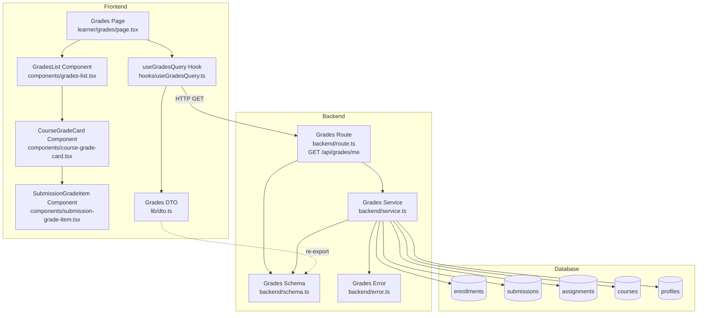

# UC-006: 성적 & 피드백 열람 (Learner) - Implementation Plan

## 개요

### Backend Modules
| 모듈명 | 위치 | 설명 |
|--------|------|------|
| Grades Service | `src/features/grades/backend/service.ts` | 성적 조회 비즈니스 로직 (enrollments, submissions, assignments 조회 및 총점 계산) |
| Grades Route | `src/features/grades/backend/route.ts` | 성적 API 라우트 정의 (`GET /api/grades/me`) |
| Grades Schema | `src/features/grades/backend/schema.ts` | 요청/응답 zod 스키마 정의 |
| Grades Error | `src/features/grades/backend/error.ts` | 에러 코드 정의 |

### Frontend Modules
| 모듈명 | 위치 | 설명 |
|--------|------|------|
| Grades Query Hook | `src/features/grades/hooks/useGradesQuery.ts` | React Query 기반 성적 조회 훅 |
| Grades DTO | `src/features/grades/lib/dto.ts` | Backend 스키마 재노출 |
| Grades List Component | `src/features/grades/components/grades-list.tsx` | 성적 목록 표시 컴포넌트 |
| Course Grade Card | `src/features/grades/components/course-grade-card.tsx` | 코스별 성적 카드 컴포넌트 |
| Submission Grade Item | `src/features/grades/components/submission-grade-item.tsx` | 제출물 성적 아이템 컴포넌트 |
| Grades Page | `src/app/(protected)/learner/grades/page.tsx` | 성적 페이지 |

---

## Diagram



---

## Implementation Plan

### 1. Backend: Grades Schema (`src/features/grades/backend/schema.ts`)

**책임**: 요청/응답 데이터 구조 정의 및 검증

**구현 내용**:
```typescript
// 제출물 성적 스키마
export const GradedSubmissionSchema = z.object({
  submissionId: z.string().uuid(),
  assignmentId: z.string().uuid(),
  assignmentTitle: z.string(),
  score: z.number().min(0).max(100),
  scoreWeight: z.number().min(0).max(100),
  late: z.boolean(),
  feedback: z.string().nullable(),
  submittedAt: z.string(),
  gradedAt: z.string(),
});

// 코스별 성적 스키마
export const CourseGradeSchema = z.object({
  courseId: z.string().uuid(),
  courseTitle: z.string(),
  totalScore: z.number().min(0).max(100),
  gradedCount: z.number().int().min(0),
  submissions: z.array(GradedSubmissionSchema),
});

// 전체 성적 응답 스키마
export const GradesResponseSchema = z.object({
  courses: z.array(CourseGradeSchema),
  summary: z.object({
    averageScore: z.number().min(0).max(100),
    totalGradedCount: z.number().int().min(0),
    totalSubmittedCount: z.number().int().min(0),
    lateSubmissionCount: z.number().int().min(0),
  }),
});

// DB Row 스키마
export const SubmissionRowSchema = z.object({
  id: z.string().uuid(),
  assignment_id: z.string().uuid(),
  score: z.number().nullable(),
  late: z.boolean(),
  feedback: z.string().nullable(),
  submitted_at: z.string(),
  graded_at: z.string().nullable(),
  assignment: z.object({
    title: z.string(),
    weight: z.number(),
    course_id: z.string().uuid(),
  }),
  course: z.object({
    id: z.string().uuid(),
    title: z.string(),
  }),
});

export type GradedSubmission = z.infer<typeof GradedSubmissionSchema>;
export type CourseGrade = z.infer<typeof CourseGradeSchema>;
export type GradesResponse = z.infer<typeof GradesResponseSchema>;
export type SubmissionRow = z.infer<typeof SubmissionRowSchema>;
```

**의존성**:
- `zod` 패키지

---

### 2. Backend: Grades Error (`src/features/grades/backend/error.ts`)

**책임**: 에러 코드 정의

**구현 내용**:
```typescript
export const gradesErrorCodes = {
  notFound: 'GRADES_NOT_FOUND',
  fetchError: 'GRADES_FETCH_ERROR',
  validationError: 'GRADES_VALIDATION_ERROR',
  unauthorized: 'GRADES_UNAUTHORIZED',
  forbidden: 'GRADES_FORBIDDEN',
} as const;

type GradesErrorValue = (typeof gradesErrorCodes)[keyof typeof gradesErrorCodes];

export type GradesServiceError = GradesErrorValue;
```

**의존성**: 없음

---

### 3. Backend: Grades Service (`src/features/grades/backend/service.ts`)

**책임**: 성적 조회 비즈니스 로직

**구현 내용**:
```typescript
import type { SupabaseClient } from '@supabase/supabase-js';
import { failure, success, type HandlerResult } from '@/backend/http/response';
import {
  GradesResponseSchema,
  SubmissionRowSchema,
  type GradesResponse,
  type SubmissionRow,
  type CourseGrade,
  type GradedSubmission,
} from './schema';
import { gradesErrorCodes, type GradesServiceError } from './error';

/**
 * 사용자의 채점 완료된 제출물 조회
 * - enrollments 활성 여부와 무관하게 graded 상태인 모든 제출물 조회
 * - assignment 정보와 course 정보를 JOIN하여 가져옴
 */
const getGradedSubmissions = async (
  client: SupabaseClient,
  userId: string,
): Promise<HandlerResult<SubmissionRow[], GradesServiceError, unknown>> => {
  const { data, error } = await client
    .from('submissions')
    .select(`
      id,
      assignment_id,
      score,
      late,
      feedback,
      submitted_at,
      graded_at,
      assignment:assignments (
        title,
        weight,
        course_id
      ),
      course:assignments (
        course:courses (
          id,
          title
        )
      )
    `)
    .eq('user_id', userId)
    .eq('status', 'graded')
    .order('graded_at', { ascending: false });

  if (error) {
    return failure(500, gradesErrorCodes.fetchError, error.message);
  }

  if (!data || data.length === 0) {
    return success([]);
  }

  // 데이터 검증 및 변환
  const validated = data.map((item) => {
    const parsed = SubmissionRowSchema.safeParse({
      id: item.id,
      assignment_id: item.assignment_id,
      score: item.score,
      late: item.late,
      feedback: item.feedback,
      submitted_at: item.submitted_at,
      graded_at: item.graded_at,
      assignment: item.assignment,
      course: item.course?.course,
    });

    if (!parsed.success) {
      throw new Error('Submission row validation failed');
    }

    return parsed.data;
  });

  return success(validated);
};

/**
 * 제출물 목록을 코스별로 그룹화하고 총점 계산
 */
const groupByCourse = (submissions: SubmissionRow[]): CourseGrade[] => {
  const courseMap = new Map<string, SubmissionRow[]>();

  // 코스별로 그룹화
  for (const submission of submissions) {
    const courseId = submission.course.id;
    if (!courseMap.has(courseId)) {
      courseMap.set(courseId, []);
    }
    courseMap.get(courseId)!.push(submission);
  }

  // 코스별 총점 계산
  const courseGrades: CourseGrade[] = [];

  for (const [courseId, courseSubmissions] of courseMap.entries()) {
    const courseTitle = courseSubmissions[0].course.title;

    const gradedSubmissions: GradedSubmission[] = courseSubmissions.map((sub) => ({
      submissionId: sub.id,
      assignmentId: sub.assignment_id,
      assignmentTitle: sub.assignment.title,
      score: sub.score ?? 0,
      scoreWeight: sub.assignment.weight,
      late: sub.late,
      feedback: sub.feedback,
      submittedAt: sub.submitted_at,
      gradedAt: sub.graded_at ?? '',
    }));

    // 총점 계산: Σ(점수 × 비중 / 100)
    const totalScore = gradedSubmissions.reduce((sum, item) => {
      return sum + (item.score * item.scoreWeight) / 100;
    }, 0);

    courseGrades.push({
      courseId,
      courseTitle,
      totalScore: Math.round(totalScore * 100) / 100, // 소수점 둘째 자리
      gradedCount: gradedSubmissions.length,
      submissions: gradedSubmissions,
    });
  }

  return courseGrades;
};

/**
 * 사용자의 전체 성적 조회
 */
export const getGradesByUserId = async (
  client: SupabaseClient,
  userId: string,
): Promise<HandlerResult<GradesResponse, GradesServiceError, unknown>> => {
  const submissionsResult = await getGradedSubmissions(client, userId);

  if (!submissionsResult.ok) {
    return submissionsResult;
  }

  const submissions = submissionsResult.data;

  if (submissions.length === 0) {
    const emptyResponse: GradesResponse = {
      courses: [],
      summary: {
        averageScore: 0,
        totalGradedCount: 0,
        totalSubmittedCount: 0,
        lateSubmissionCount: 0,
      },
    };
    return success(emptyResponse);
  }

  const courses = groupByCourse(submissions);

  // 전체 요약 계산
  const totalGradedCount = submissions.length;
  const lateSubmissionCount = submissions.filter((s) => s.late).length;
  const averageScore =
    courses.reduce((sum, c) => sum + c.totalScore, 0) / courses.length;

  // 전체 제출 수 조회 (채점 완료 + 미채점)
  const { count: totalSubmittedCount } = await client
    .from('submissions')
    .select('id', { count: 'exact', head: true })
    .eq('user_id', userId);

  const response: GradesResponse = {
    courses,
    summary: {
      averageScore: Math.round(averageScore * 100) / 100,
      totalGradedCount,
      totalSubmittedCount: totalSubmittedCount ?? 0,
      lateSubmissionCount,
    },
  };

  const parsed = GradesResponseSchema.safeParse(response);

  if (!parsed.success) {
    return failure(
      500,
      gradesErrorCodes.validationError,
      'Grades response validation failed',
      parsed.error.format(),
    );
  }

  return success(parsed.data);
};
```

**Unit Tests**:
```typescript
describe('Grades Service', () => {
  describe('getGradesByUserId', () => {
    it('should return empty grades when no submissions', async () => {
      // Mock: 제출물 없음
      const result = await getGradesByUserId(mockClient, userId);
      expect(result.ok).toBe(true);
      expect(result.data.courses).toHaveLength(0);
      expect(result.data.summary.totalGradedCount).toBe(0);
    });

    it('should calculate course grade correctly', async () => {
      // Mock: 과제 2개 (20% 비중 90점, 30% 비중 85점)
      const result = await getGradesByUserId(mockClient, userId);
      expect(result.ok).toBe(true);
      expect(result.data.courses[0].totalScore).toBe(43.5);
    });

    it('should group submissions by course', async () => {
      // Mock: 2개 코스, 각각 제출물 2개씩
      const result = await getGradesByUserId(mockClient, userId);
      expect(result.ok).toBe(true);
      expect(result.data.courses).toHaveLength(2);
    });

    it('should mark late submissions', async () => {
      // Mock: 지각 제출 1개
      const result = await getGradesByUserId(mockClient, userId);
      expect(result.data.summary.lateSubmissionCount).toBe(1);
    });

    it('should handle fetch error', async () => {
      // Mock: DB 에러
      const result = await getGradesByUserId(mockClient, userId);
      expect(result.ok).toBe(false);
      expect(result.error.code).toBe(gradesErrorCodes.fetchError);
    });
  });

  describe('groupByCourse', () => {
    it('should calculate total score correctly', () => {
      const submissions = [
        { score: 90, weight: 20, courseId: 'c1' },
        { score: 85, weight: 30, courseId: 'c1' },
      ];
      const result = groupByCourse(submissions);
      expect(result[0].totalScore).toBe(43.5);
    });

    it('should round to 2 decimal places', () => {
      const submissions = [
        { score: 88.7, weight: 33.33, courseId: 'c1' },
      ];
      const result = groupByCourse(submissions);
      expect(result[0].totalScore).toBe(29.56);
    });
  });
});
```

**의존성**:
- `@supabase/supabase-js`
- `@/backend/http/response`
- `./schema`
- `./error`

---

### 4. Backend: Grades Route (`src/features/grades/backend/route.ts`)

**책임**: Hono 라우트 정의 및 인증/권한 검증

**구현 내용**:
```typescript
import type { Hono } from 'hono';
import { failure, respond, type ErrorResult } from '@/backend/http/response';
import { getLogger, getSupabase, type AppEnv } from '@/backend/hono/context';
import { getGradesByUserId } from './service';
import { gradesErrorCodes, type GradesServiceError } from './error';

export const registerGradesRoutes = (app: Hono<AppEnv>) => {
  /**
   * GET /api/grades/me
   * 현재 사용자의 성적 조회
   */
  app.get('/api/grades/me', async (c) => {
    const supabase = getSupabase(c);
    const logger = getLogger(c);

    // 사용자 인증 확인
    const {
      data: { user },
      error: authError,
    } = await supabase.auth.getUser();

    if (authError || !user) {
      logger.warn('Unauthorized access to grades', authError?.message);
      return respond(
        c,
        failure(401, gradesErrorCodes.unauthorized, 'Unauthorized'),
      );
    }

    // 사용자 역할 확인 (Learner만 허용)
    const { data: profile } = await supabase
      .from('profiles')
      .select('role')
      .eq('id', user.id)
      .single();

    if (!profile || profile.role !== 'learner') {
      logger.warn('Non-learner access attempt to grades', { userId: user.id });
      return respond(
        c,
        failure(
          403,
          gradesErrorCodes.forbidden,
          'Only learners can access grades',
        ),
      );
    }

    const result = await getGradesByUserId(supabase, user.id);

    if (!result.ok) {
      const errorResult = result as ErrorResult<GradesServiceError, unknown>;

      if (errorResult.error.code === gradesErrorCodes.fetchError) {
        logger.error('Failed to fetch grades', errorResult.error.message);
      }

      return respond(c, result);
    }

    logger.info('Grades fetched successfully', { userId: user.id });
    return respond(c, result);
  });
};
```

**의존성**:
- `hono`
- `@/backend/http/response`
- `@/backend/hono/context`
- `./service`
- `./error`

---

### 5. Hono App Integration

**파일**: `src/backend/hono/app.ts`

**수정 내용**:
```typescript
import { registerGradesRoutes } from '@/features/grades/backend/route';

export const createHonoApp = () => {
  // ... 기존 코드 ...

  // 라우트 등록
  registerExampleRoutes(app);
  registerGradesRoutes(app); // 추가

  return app;
};
```

---

### 6. Frontend: Grades DTO (`src/features/grades/lib/dto.ts`)

**책임**: Backend 스키마 재노출

**구현 내용**:
```typescript
export {
  GradesResponseSchema,
  CourseGradeSchema,
  GradedSubmissionSchema,
  type GradesResponse,
  type CourseGrade,
  type GradedSubmission,
} from '@/features/grades/backend/schema';
```

---

### 7. Frontend: Grades Query Hook (`src/features/grades/hooks/useGradesQuery.ts`)

**책임**: React Query 기반 성적 조회

**구현 내용**:
```typescript
'use client';

import { useQuery } from '@tanstack/react-query';
import { apiClient, extractApiErrorMessage } from '@/lib/remote/api-client';
import { GradesResponseSchema } from '@/features/grades/lib/dto';

const fetchMyGrades = async () => {
  try {
    const { data } = await apiClient.get('/api/grades/me');
    return GradesResponseSchema.parse(data);
  } catch (error) {
    const message = extractApiErrorMessage(error, 'Failed to fetch grades.');
    throw new Error(message);
  }
};

export const useMyGradesQuery = () =>
  useQuery({
    queryKey: ['grades', 'me'],
    queryFn: fetchMyGrades,
    staleTime: 60 * 1000, // 1분
    retry: 2,
  });
```

**의존성**:
- `@tanstack/react-query`
- `@/lib/remote/api-client`
- `@/features/grades/lib/dto`

---

### 8. Frontend: Components

#### 8.1. Submission Grade Item (`src/features/grades/components/submission-grade-item.tsx`)

**책임**: 제출물 성적 표시

**구현 내용**:
```typescript
'use client';

import type { GradedSubmission } from '@/features/grades/lib/dto';
import { format } from 'date-fns';

type Props = {
  submission: GradedSubmission;
};

export const SubmissionGradeItem = ({ submission }: Props) => {
  return (
    <div className="border rounded-lg p-4 space-y-2">
      <div className="flex items-center justify-between">
        <h4 className="font-medium">{submission.assignmentTitle}</h4>
        {submission.late && (
          <span className="text-xs bg-red-100 text-red-800 px-2 py-1 rounded">
            지각 제출
          </span>
        )}
      </div>

      <div className="flex items-center gap-4 text-sm text-gray-600">
        <span>점수: {submission.score}점</span>
        <span>비중: {submission.scoreWeight}%</span>
        <span>
          가중 점수: {((submission.score * submission.scoreWeight) / 100).toFixed(2)}점
        </span>
      </div>

      <div className="text-xs text-gray-500 flex gap-4">
        <span>제출: {format(new Date(submission.submittedAt), 'yyyy-MM-dd HH:mm')}</span>
        <span>채점: {format(new Date(submission.gradedAt), 'yyyy-MM-dd HH:mm')}</span>
      </div>

      {submission.feedback && (
        <div className="mt-3 p-3 bg-gray-50 rounded text-sm">
          <p className="font-medium mb-1">피드백:</p>
          <p className="text-gray-700 whitespace-pre-wrap">{submission.feedback}</p>
        </div>
      )}
    </div>
  );
};
```

**QA Sheet**:
| 항목 | 확인 사항 |
|------|-----------|
| 렌더링 | 제출물 정보가 올바르게 표시되는가? |
| 조건부 렌더링 | 지각 제출 배지가 late=true일 때만 표시되는가? |
| 조건부 렌더링 | 피드백이 있을 때만 피드백 섹션이 표시되는가? |
| 계산 | 가중 점수가 올바르게 계산되는가? (점수 × 비중 / 100) |
| 날짜 포맷 | 제출/채점 날짜가 올바른 형식으로 표시되는가? |
| 스타일 | 레이아웃이 깨지지 않는가? |

#### 8.2. Course Grade Card (`src/features/grades/components/course-grade-card.tsx`)

**책임**: 코스별 성적 카드 표시

**구현 내용**:
```typescript
'use client';

import type { CourseGrade } from '@/features/grades/lib/dto';
import { SubmissionGradeItem } from './submission-grade-item';

type Props = {
  courseGrade: CourseGrade;
};

export const CourseGradeCard = ({ courseGrade }: Props) => {
  return (
    <div className="border rounded-lg p-6 space-y-4">
      <div className="flex items-center justify-between border-b pb-3">
        <div>
          <h3 className="text-xl font-bold">{courseGrade.courseTitle}</h3>
          <p className="text-sm text-gray-600 mt-1">
            채점 완료: {courseGrade.gradedCount}개 과제
          </p>
        </div>
        <div className="text-right">
          <p className="text-3xl font-bold text-blue-600">
            {courseGrade.totalScore.toFixed(2)}점
          </p>
          <p className="text-xs text-gray-500 mt-1">코스 총점</p>
        </div>
      </div>

      <div className="space-y-3">
        {courseGrade.submissions.map((submission) => (
          <SubmissionGradeItem key={submission.submissionId} submission={submission} />
        ))}
      </div>
    </div>
  );
};
```

**QA Sheet**:
| 항목 | 확인 사항 |
|------|-----------|
| 렌더링 | 코스 제목, 총점, 과제 수가 올바르게 표시되는가? |
| 자식 컴포넌트 | SubmissionGradeItem이 각 제출물에 대해 올바르게 렌더링되는가? |
| 숫자 포맷 | 총점이 소수점 둘째 자리까지 표시되는가? |
| 빈 배열 | 제출물이 없을 때 빈 섹션이 표시되는가? |
| 스타일 | 레이아웃이 반응형으로 동작하는가? |

#### 8.3. Grades List (`src/features/grades/components/grades-list.tsx`)

**책임**: 전체 성적 목록 및 요약 표시

**구현 내용**:
```typescript
'use client';

import type { GradesResponse } from '@/features/grades/lib/dto';
import { CourseGradeCard } from './course-grade-card';

type Props = {
  grades: GradesResponse;
};

export const GradesList = ({ grades }: Props) => {
  const { courses, summary } = grades;

  return (
    <div className="space-y-6">
      {/* 전체 요약 */}
      <div className="bg-blue-50 border border-blue-200 rounded-lg p-6">
        <h2 className="text-lg font-bold mb-4">전체 요약</h2>
        <div className="grid grid-cols-2 md:grid-cols-4 gap-4">
          <div>
            <p className="text-sm text-gray-600">평균 점수</p>
            <p className="text-2xl font-bold">{summary.averageScore.toFixed(2)}점</p>
          </div>
          <div>
            <p className="text-sm text-gray-600">채점 완료</p>
            <p className="text-2xl font-bold">{summary.totalGradedCount}개</p>
          </div>
          <div>
            <p className="text-sm text-gray-600">제출 완료</p>
            <p className="text-2xl font-bold">{summary.totalSubmittedCount}개</p>
          </div>
          <div>
            <p className="text-sm text-gray-600">지각 제출</p>
            <p className="text-2xl font-bold text-red-600">
              {summary.lateSubmissionCount}개
            </p>
          </div>
        </div>
      </div>

      {/* 코스별 성적 */}
      <div>
        <h2 className="text-lg font-bold mb-4">코스별 성적</h2>
        {courses.length === 0 ? (
          <p className="text-gray-500">채점 완료된 과제가 없습니다.</p>
        ) : (
          <div className="space-y-4">
            {courses.map((course) => (
              <CourseGradeCard key={course.courseId} courseGrade={course} />
            ))}
          </div>
        )}
      </div>
    </div>
  );
};
```

**QA Sheet**:
| 항목 | 확인 사항 |
|------|-----------|
| 렌더링 | 전체 요약 섹션이 올바르게 표시되는가? |
| 조건부 렌더링 | 코스가 없을 때 "채점 완료된 과제가 없습니다" 메시지가 표시되는가? |
| 자식 컴포넌트 | CourseGradeCard가 각 코스에 대해 올바르게 렌더링되는가? |
| 반응형 | 모바일/데스크톱에서 그리드 레이아웃이 올바르게 동작하는가? |
| 숫자 포맷 | 평균 점수가 소수점 둘째 자리까지 표시되는가? |

---

### 9. Frontend: Grades Page (`src/app/(protected)/learner/grades/page.tsx`)

**책임**: 성적 페이지 진입점

**구현 내용**:
```typescript
'use client';

import { useMyGradesQuery } from '@/features/grades/hooks/useGradesQuery';
import { GradesList } from '@/features/grades/components/grades-list';

export default function GradesPage() {
  const { data, isLoading, error } = useMyGradesQuery();

  if (isLoading) {
    return (
      <div className="flex items-center justify-center min-h-screen">
        <p className="text-gray-500">성적을 불러오는 중...</p>
      </div>
    );
  }

  if (error) {
    return (
      <div className="flex flex-col items-center justify-center min-h-screen">
        <p className="text-red-600 mb-4">
          성적을 불러오는데 실패했습니다: {error.message}
        </p>
        <button
          onClick={() => window.location.reload()}
          className="px-4 py-2 bg-blue-600 text-white rounded hover:bg-blue-700"
        >
          새로고침
        </button>
      </div>
    );
  }

  if (!data) {
    return null;
  }

  return (
    <div className="container mx-auto px-4 py-8 max-w-6xl">
      <h1 className="text-3xl font-bold mb-8">내 성적</h1>
      <GradesList grades={data} />
    </div>
  );
}
```

**QA Sheet**:
| 항목 | 확인 사항 |
|------|-----------|
| 로딩 상태 | 로딩 중일 때 로딩 메시지가 표시되는가? |
| 에러 상태 | 에러 발생 시 에러 메시지와 새로고침 버튼이 표시되는가? |
| 성공 상태 | 데이터 로드 성공 시 GradesList가 렌더링되는가? |
| 라우팅 | /learner/grades 경로로 접근 가능한가? |
| 인증 | 비로그인 사용자는 리다이렉트되는가? (protected route) |
| 권한 | Instructor 역할은 접근 불가능한가? |

---

## 구현 순서

1. **Backend Schema & Error** 정의
2. **Backend Service** 구현 및 Unit Test 작성
3. **Backend Route** 구현 및 Hono App 통합
4. **Frontend DTO** 작성
5. **Frontend Hook** 구현
6. **Frontend Components** 구현 (SubmissionGradeItem → CourseGradeCard → GradesList)
7. **Frontend Page** 구현
8. **통합 테스트** 수행

---

## 테스트 체크리스트

### Backend
- [ ] 제출물이 없을 때 빈 배열 반환
- [ ] 단일 코스의 총점 계산 정확성
- [ ] 여러 코스의 성적 그룹화 정확성
- [ ] 지각 제출 카운트 정확성
- [ ] DB 에러 처리
- [ ] 인증 실패 처리 (401)
- [ ] 권한 없음 처리 (403, Instructor 접근 시)

### Frontend
- [ ] 로딩 상태 표시
- [ ] 에러 상태 표시 및 새로고침
- [ ] 빈 데이터 처리
- [ ] 코스별 성적 카드 렌더링
- [ ] 제출물 성적 아이템 렌더링
- [ ] 피드백 조건부 렌더링
- [ ] 지각 제출 배지 표시
- [ ] 반응형 레이아웃
- [ ] 숫자 포맷 (소수점 둘째 자리)
