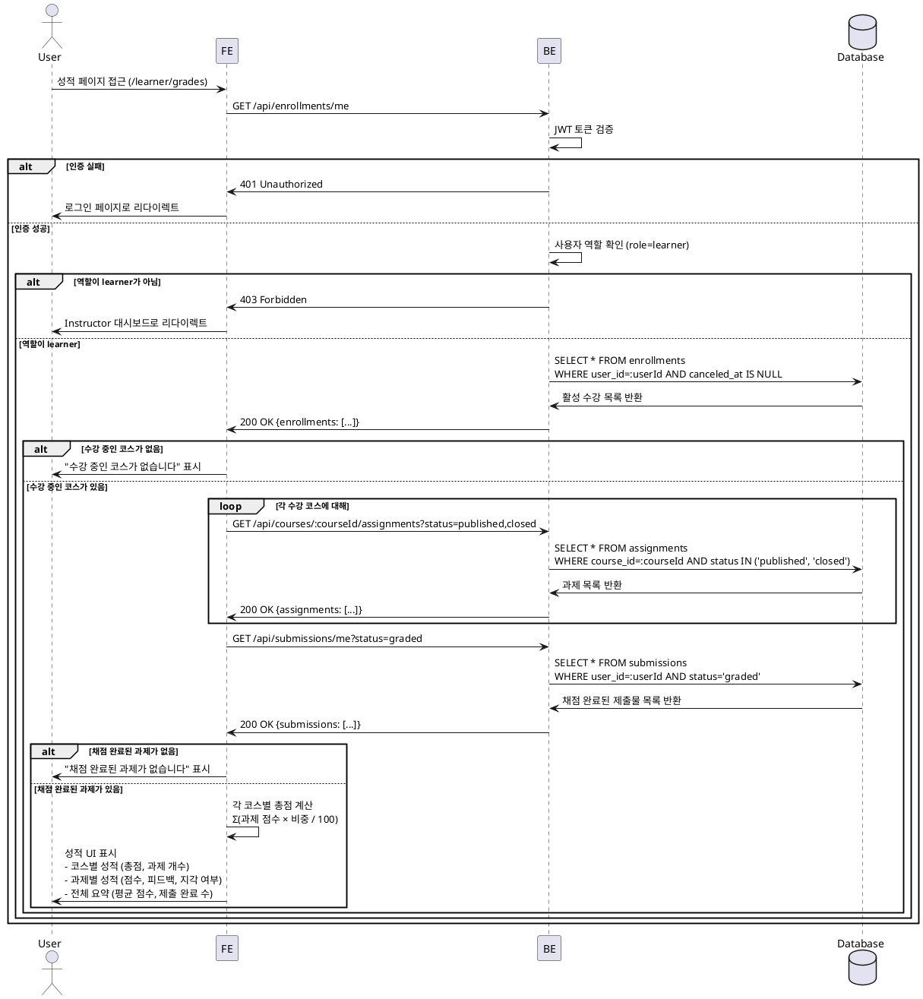

# UC-006: 성적 & 피드백 열람 (Learner)

## Primary Actor
학습자 (Learner)

## Precondition
- 사용자가 Learner 역할로 로그인된 상태
- 수강 중인 코스 존재
- 성적 페이지(`/learner/grades` 또는 `/courses/[courseId]/grades`) 접근

## Trigger
성적 페이지 접근 또는 대시보드에서 "성적 보기" 링크 클릭

## Main Scenario

1. 사용자가 성적 페이지 접근 (`/learner/grades`)
2. FE가 BE에 내 수강 목록 요청 (`GET /api/enrollments/me`)
3. BE가 현재 사용자의 활성 수강 목록 반환 (`canceled_at = null`)
4. FE가 각 코스별 과제 목록 요청 (`GET /api/courses/:courseId/assignments?status=published,closed`)
5. FE가 내 제출물 목록 요청 (`GET /api/submissions/me?status=graded`)
6. FE가 각 제출물의 정보 표시:
   - 과제명, 코스명
   - 점수 (0-100)
   - 피드백 내용
   - 지각 여부 (`late` 필드)
   - 제출 시각, 채점 시각
7. FE가 코스별 총점 계산:
   - 총점 = Σ(과제 점수 × 과제 비중 / 100)
   - 예: 과제1(20% 비중, 90점) + 과제2(30% 비중, 85점) = (90 × 0.2) + (85 × 0.3) = 43.5점
8. FE가 성적 UI 표시:
   - **코스별 성적 섹션**: 코스명, 총점, 과제 개수
   - **과제별 성적 섹션**: 과제명, 점수, 비중, 지각 여부, 피드백
   - **전체 요약 섹션**: 평균 점수, 제출 완료 과제 수

## Edge Cases

### 1. 비로그인 사용자
- **상황**: 인증되지 않은 사용자가 성적 페이지 접근 시도
- **처리**: `401 Unauthorized`, 로그인 페이지로 리다이렉트

### 2. Instructor가 Learner 성적 페이지 접근
- **상황**: Instructor 역할로 Learner 성적 페이지 접근 시도
- **처리**: `403 Forbidden` 또는 Instructor 대시보드로 리다이렉트

### 3. 수강 중인 코스가 없음
- **상황**: enrollment가 없거나 모두 취소됨
- **처리**: "수강 중인 코스가 없습니다. 코스를 탐색해보세요." 메시지 + 코스 카탈로그 링크 표시

### 4. 제출물이 없음
- **상황**: 모든 과제가 미제출 상태
- **처리**: "제출한 과제가 없습니다." 메시지 표시, 총점 0점

### 5. 채점 완료된 과제가 없음
- **상황**: 제출했지만 아직 채점되지 않음
- **처리**: "채점 완료된 과제가 없습니다." 메시지 표시

### 6. 네트워크 오류
- **상황**: BE 통신 실패 (타임아웃, 서버 오류 등)
- **처리**: "성적을 불러오는데 실패했습니다. 다시 시도해주세요." 메시지 + 새로고침 버튼 표시

## Business Rules

### BR-001: Learner만 접근 가능
- `role=learner`인 사용자만 Learner 성적 페이지 접근 가능
- `role=instructor`는 본인이 가르치는 코스의 학습자 성적만 조회 가능 (별도 페이지)

### BR-002: 본인 제출물만 조회 가능
- `submissions` 테이블에서 `user_id = 현재 사용자 ID`인 레코드만 조회
- 다른 학습자의 성적은 조회 불가

### BR-003: 채점 완료된 제출물만 표시
- `status = graded`인 제출물만 성적 페이지에 표시
- `status = submitted` 또는 `status = resubmission_required`는 "채점 대기 중" 표시

### BR-004: 코스별 총점 계산 방식
- 총점 = Σ(과제 점수 × 과제 비중 / 100)
- 예: 과제1(20% 비중, 90점) + 과제2(30% 비중, 85점) = 18 + 25.5 = 43.5점
- 미제출 과제는 총점 계산에서 제외 (제출한 과제만 합산)
- 소수점 둘째 자리까지 표시

### BR-005: 지각 제출 표시
- `late = true`인 제출물은 "지각 제출" 배지 표시
- 지각 제출로 인한 감점은 Instructor가 점수에 반영 (별도 감점 필드 없음)

### BR-006: 피드백 표시
- `feedback` 필드가 있으면 전체 내용 표시
- `feedback`가 null이면 "피드백 없음" 표시

### BR-007: 정렬 및 필터링
- 기본 정렬: `graded_at` 내림차순 (최근 채점된 순서)
- 필터: 코스별, 점수 범위별, 지각 여부별

---

## Sequence Diagram



---

## 성적 계산 로직 (예시)

```typescript
type GradedSubmission = {
  assignmentId: string;
  assignmentTitle: string;
  score: number;
  scoreWeight: number; // 과제 비중 (0-100)
  late: boolean;
  feedback: string | null;
  gradedAt: string;
};

type CourseGrade = {
  courseId: string;
  courseTitle: string;
  totalScore: number; // 총점
  gradedCount: number; // 채점 완료된 과제 수
  assignments: GradedSubmission[];
};

const calculateCourseGrade = (
  assignments: Assignment[],
  submissions: Submission[],
): CourseGrade => {
  // 채점 완료된 제출물만 필터링
  const gradedSubmissions = submissions.filter((s) => s.status === 'graded');

  // 각 제출물의 과제 정보 조합
  const gradedAssignments: GradedSubmission[] = gradedSubmissions.map((submission) => {
    const assignment = assignments.find((a) => a.id === submission.assignmentId)!;
    return {
      assignmentId: assignment.id,
      assignmentTitle: assignment.title,
      score: submission.score!,
      scoreWeight: assignment.scoreWeight,
      late: submission.late,
      feedback: submission.feedback,
      gradedAt: submission.gradedAt!,
    };
  });

  // 총점 계산: Σ(점수 × 비중 / 100)
  const totalScore = gradedAssignments.reduce((sum, item) => {
    return sum + (item.score * item.scoreWeight) / 100;
  }, 0);

  return {
    courseId: assignments[0]?.courseId || '',
    courseTitle: assignments[0]?.courseTitle || '',
    totalScore: Math.round(totalScore * 100) / 100, // 소수점 둘째 자리
    gradedCount: gradedSubmissions.length,
    assignments: gradedAssignments,
  };
};
```

---

## UI 구성 (예시)

### 코스별 성적 섹션
```
┌─────────────────────────────────────────┐
│ React 기초 강의                  [43.5점]│
│ 채점 완료: 2/3 과제                     │
│                              [상세 보기] │
├─────────────────────────────────────────┤
│ React Hooks 과제             [18.0/20점]│
│ 점수: 90점 | 비중: 20%                  │
│ 제출: 2025-11-24 15:30 | 채점: 11-25    │
│ 피드백: "매우 잘 작성하셨습니다..."     │
├─────────────────────────────────────────┤
│ 상태 관리 프로젝트 🔴      [25.5/30점]│
│ 점수: 85점 | 비중: 30% | 지각 제출      │
│ 제출: 2025-11-22 10:00 | 채점: 11-23    │
│ 피드백: "전반적으로 좋습니다. 다만..." │
└─────────────────────────────────────────┘
```

### 전체 요약 섹션
```
┌─────────────────────────────────────────┐
│ 전체 요약                               │
├─────────────────────────────────────────┤
│ 평균 점수: 87.5점                       │
│ 채점 완료: 5개 과제                     │
│ 제출 완료: 7개 과제                     │
│ 지각 제출: 1개 과제                     │
└─────────────────────────────────────────┘
```
