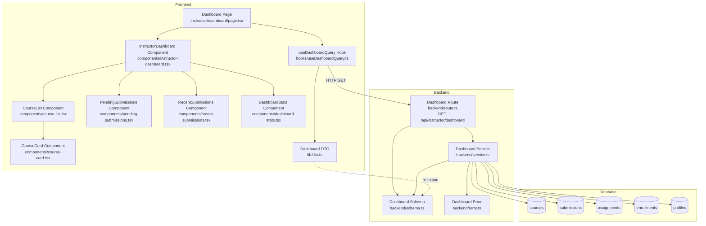

# UC-007: Instructor 대시보드 - Implementation Plan

## 개요

### Backend Modules
| 모듈명 | 위치 | 설명 |
|--------|------|------|
| Dashboard Service | `src/features/instructor-dashboard/backend/service.ts` | 대시보드 조회 비즈니스 로직 (코스 목록, 채점 대기 수, 최근 제출물, 통계) |
| Dashboard Route | `src/features/instructor-dashboard/backend/route.ts` | 대시보드 API 라우트 정의 (`GET /api/instructor/dashboard`) |
| Dashboard Schema | `src/features/instructor-dashboard/backend/schema.ts` | 요청/응답 zod 스키마 정의 |
| Dashboard Error | `src/features/instructor-dashboard/backend/error.ts` | 에러 코드 정의 |

### Frontend Modules
| 모듈명 | 위치 | 설명 |
|--------|------|------|
| Dashboard Query Hook | `src/features/instructor-dashboard/hooks/useDashboardQuery.ts` | React Query 기반 대시보드 조회 훅 |
| Dashboard DTO | `src/features/instructor-dashboard/lib/dto.ts` | Backend 스키마 재노출 |
| Dashboard Component | `src/features/instructor-dashboard/components/instructor-dashboard.tsx` | 대시보드 메인 컴포넌트 |
| Course List Component | `src/features/instructor-dashboard/components/course-list.tsx` | 코스 목록 컴포넌트 |
| Course Card Component | `src/features/instructor-dashboard/components/course-card.tsx` | 코스 카드 컴포넌트 |
| Pending Submissions Component | `src/features/instructor-dashboard/components/pending-submissions.tsx` | 채점 대기 섹션 컴포넌트 |
| Recent Submissions Component | `src/features/instructor-dashboard/components/recent-submissions.tsx` | 최근 제출물 섹션 컴포넌트 |
| Dashboard Stats Component | `src/features/instructor-dashboard/components/dashboard-stats.tsx` | 통계 요약 컴포넌트 |
| Dashboard Page | `src/app/(protected)/instructor/dashboard/page.tsx` | Instructor 대시보드 페이지 |

---

## Diagram



---

## Implementation Plan

### 1. Backend: Dashboard Schema (`src/features/instructor-dashboard/backend/schema.ts`)

**책임**: 요청/응답 데이터 구조 정의 및 검증

**구현 내용**:
```typescript
import { z } from 'zod';

// 코스 정보 스키마
export const CourseItemSchema = z.object({
  id: z.string().uuid(),
  title: z.string(),
  description: z.string().nullable(),
  category: z.string(),
  difficulty: z.enum(['beginner', 'intermediate', 'advanced']),
  status: z.enum(['draft', 'published', 'archived']),
  enrollmentCount: z.number().int().min(0),
  assignmentCount: z.number().int().min(0),
  pendingCount: z.number().int().min(0),
  createdAt: z.string(),
  updatedAt: z.string(),
});

// 최근 제출물 스키마
export const RecentSubmissionSchema = z.object({
  submissionId: z.string().uuid(),
  learnerName: z.string(),
  assignmentTitle: z.string(),
  courseTitle: z.string(),
  submittedAt: z.string(),
  status: z.enum(['submitted', 'graded', 'resubmission_required']),
  late: z.boolean(),
});

// 대시보드 통계 스키마
export const DashboardStatsSchema = z.object({
  totalCourses: z.number().int().min(0),
  publishedCourses: z.number().int().min(0),
  draftCourses: z.number().int().min(0),
  archivedCourses: z.number().int().min(0),
  totalEnrollments: z.number().int().min(0),
  totalAssignments: z.number().int().min(0),
  totalPendingSubmissions: z.number().int().min(0),
});

// 대시보드 응답 스키마
export const DashboardResponseSchema = z.object({
  courses: z.array(CourseItemSchema),
  recentSubmissions: z.array(RecentSubmissionSchema),
  stats: DashboardStatsSchema,
});

// DB Row 스키마
export const CourseRowSchema = z.object({
  id: z.string().uuid(),
  title: z.string(),
  description: z.string().nullable(),
  category: z.string(),
  difficulty: z.enum(['beginner', 'intermediate', 'advanced']),
  status: z.enum(['draft', 'published', 'archived']),
  created_at: z.string(),
  updated_at: z.string(),
});

export const SubmissionRowSchema = z.object({
  id: z.string().uuid(),
  submitted_at: z.string(),
  status: z.enum(['submitted', 'graded', 'resubmission_required']),
  late: z.boolean(),
  user: z.object({
    name: z.string(),
  }),
  assignment: z.object({
    title: z.string(),
    course: z.object({
      title: z.string(),
    }),
  }),
});

export type CourseItem = z.infer<typeof CourseItemSchema>;
export type RecentSubmission = z.infer<typeof RecentSubmissionSchema>;
export type DashboardStats = z.infer<typeof DashboardStatsSchema>;
export type DashboardResponse = z.infer<typeof DashboardResponseSchema>;
export type CourseRow = z.infer<typeof CourseRowSchema>;
export type SubmissionRow = z.infer<typeof SubmissionRowSchema>;
```

**의존성**:
- `zod` 패키지

---

### 2. Backend: Dashboard Error (`src/features/instructor-dashboard/backend/error.ts`)

**책임**: 에러 코드 정의

**구현 내용**:
```typescript
export const dashboardErrorCodes = {
  fetchError: 'DASHBOARD_FETCH_ERROR',
  validationError: 'DASHBOARD_VALIDATION_ERROR',
  unauthorized: 'DASHBOARD_UNAUTHORIZED',
  forbidden: 'DASHBOARD_FORBIDDEN',
} as const;

type DashboardErrorValue = (typeof dashboardErrorCodes)[keyof typeof dashboardErrorCodes];

export type DashboardServiceError = DashboardErrorValue;
```

**의존성**: 없음

---

### 3. Backend: Dashboard Service (`src/features/instructor-dashboard/backend/service.ts`)

**책임**: 대시보드 조회 비즈니스 로직

**구현 내용**:
```typescript
import type { SupabaseClient } from '@supabase/supabase-js';
import { failure, success, type HandlerResult } from '@/backend/http/response';
import {
  DashboardResponseSchema,
  CourseRowSchema,
  SubmissionRowSchema,
  type DashboardResponse,
  type CourseItem,
  type RecentSubmission,
  type DashboardStats,
} from './schema';
import { dashboardErrorCodes, type DashboardServiceError } from './error';

/**
 * Instructor의 코스 목록 조회
 */
const getCoursesByInstructorId = async (
  client: SupabaseClient,
  instructorId: string,
) => {
  const { data, error } = await client
    .from('courses')
    .select('*')
    .eq('instructor_id', instructorId)
    .order('created_at', { ascending: false });

  if (error) {
    return { data: null, error };
  }

  return { data, error: null };
};

/**
 * 코스별 수강생 수 조회
 */
const getEnrollmentCountByCourseId = async (
  client: SupabaseClient,
  courseId: string,
): Promise<number> => {
  const { count } = await client
    .from('enrollments')
    .select('id', { count: 'exact', head: true })
    .eq('course_id', courseId)
    .is('canceled_at', null);

  return count ?? 0;
};

/**
 * 코스별 과제 수 조회 (published + closed)
 */
const getAssignmentCountByCourseId = async (
  client: SupabaseClient,
  courseId: string,
): Promise<number> => {
  const { count } = await client
    .from('assignments')
    .select('id', { count: 'exact', head: true })
    .eq('course_id', courseId)
    .in('status', ['published', 'closed']);

  return count ?? 0;
};

/**
 * 코스별 채점 대기 제출물 수 조회
 */
const getPendingCountByCourseId = async (
  client: SupabaseClient,
  courseId: string,
): Promise<number> => {
  const { count } = await client
    .from('submissions')
    .select('id', { count: 'exact', head: true })
    .eq('assignment.course_id', courseId)
    .eq('status', 'submitted');

  return count ?? 0;
};

/**
 * Instructor의 최근 제출물 조회
 */
const getRecentSubmissions = async (
  client: SupabaseClient,
  instructorId: string,
  limit: number = 10,
) => {
  const { data, error } = await client
    .from('submissions')
    .select(`
      id,
      submitted_at,
      status,
      late,
      user:profiles!submissions_user_id_fkey (
        name
      ),
      assignment:assignments (
        title,
        course:courses (
          title
        )
      )
    `)
    .eq('assignment.course.instructor_id', instructorId)
    .order('submitted_at', { ascending: false })
    .limit(limit);

  if (error) {
    return { data: null, error };
  }

  return { data, error: null };
};

/**
 * Instructor 대시보드 데이터 조회
 */
export const getDashboardData = async (
  client: SupabaseClient,
  instructorId: string,
): Promise<HandlerResult<DashboardResponse, DashboardServiceError, unknown>> => {
  // 1. 코스 목록 조회
  const coursesResult = await getCoursesByInstructorId(client, instructorId);

  if (coursesResult.error) {
    return failure(500, dashboardErrorCodes.fetchError, coursesResult.error.message);
  }

  const rawCourses = coursesResult.data || [];

  // 2. 각 코스별 통계 계산
  const coursesWithStats: CourseItem[] = await Promise.all(
    rawCourses.map(async (course) => {
      const parsed = CourseRowSchema.safeParse(course);

      if (!parsed.success) {
        throw new Error('Course row validation failed');
      }

      const [enrollmentCount, assignmentCount, pendingCount] = await Promise.all([
        getEnrollmentCountByCourseId(client, course.id),
        getAssignmentCountByCourseId(client, course.id),
        getPendingCountByCourseId(client, course.id),
      ]);

      return {
        id: parsed.data.id,
        title: parsed.data.title,
        description: parsed.data.description,
        category: parsed.data.category,
        difficulty: parsed.data.difficulty,
        status: parsed.data.status,
        enrollmentCount,
        assignmentCount,
        pendingCount,
        createdAt: parsed.data.created_at,
        updatedAt: parsed.data.updated_at,
      };
    }),
  );

  // 3. 최근 제출물 조회
  const submissionsResult = await getRecentSubmissions(client, instructorId, 10);

  if (submissionsResult.error) {
    return failure(500, dashboardErrorCodes.fetchError, submissionsResult.error.message);
  }

  const rawSubmissions = submissionsResult.data || [];

  const recentSubmissions: RecentSubmission[] = rawSubmissions.map((sub) => {
    const parsed = SubmissionRowSchema.safeParse(sub);

    if (!parsed.success) {
      throw new Error('Submission row validation failed');
    }

    return {
      submissionId: parsed.data.id,
      learnerName: parsed.data.user.name,
      assignmentTitle: parsed.data.assignment.title,
      courseTitle: parsed.data.assignment.course.title,
      submittedAt: parsed.data.submitted_at,
      status: parsed.data.status,
      late: parsed.data.late,
    };
  });

  // 4. 전체 통계 계산
  const stats: DashboardStats = {
    totalCourses: coursesWithStats.length,
    publishedCourses: coursesWithStats.filter((c) => c.status === 'published').length,
    draftCourses: coursesWithStats.filter((c) => c.status === 'draft').length,
    archivedCourses: coursesWithStats.filter((c) => c.status === 'archived').length,
    totalEnrollments: coursesWithStats.reduce((sum, c) => sum + c.enrollmentCount, 0),
    totalAssignments: coursesWithStats.reduce((sum, c) => sum + c.assignmentCount, 0),
    totalPendingSubmissions: coursesWithStats.reduce((sum, c) => sum + c.pendingCount, 0),
  };

  const response: DashboardResponse = {
    courses: coursesWithStats,
    recentSubmissions,
    stats,
  };

  const parsed = DashboardResponseSchema.safeParse(response);

  if (!parsed.success) {
    return failure(
      500,
      dashboardErrorCodes.validationError,
      'Dashboard response validation failed',
      parsed.error.format(),
    );
  }

  return success(parsed.data);
};
```

**Unit Tests**:
```typescript
describe('Dashboard Service', () => {
  describe('getDashboardData', () => {
    it('should return empty dashboard when no courses', async () => {
      // Mock: 코스 없음
      const result = await getDashboardData(mockClient, instructorId);
      expect(result.ok).toBe(true);
      expect(result.data.courses).toHaveLength(0);
      expect(result.data.stats.totalCourses).toBe(0);
    });

    it('should calculate course stats correctly', async () => {
      // Mock: 코스 1개, 수강생 5명, 과제 3개, 채점 대기 2개
      const result = await getDashboardData(mockClient, instructorId);
      expect(result.ok).toBe(true);
      expect(result.data.courses[0].enrollmentCount).toBe(5);
      expect(result.data.courses[0].assignmentCount).toBe(3);
      expect(result.data.courses[0].pendingCount).toBe(2);
    });

    it('should group courses by status', async () => {
      // Mock: published 2개, draft 1개, archived 1개
      const result = await getDashboardData(mockClient, instructorId);
      expect(result.data.stats.publishedCourses).toBe(2);
      expect(result.data.stats.draftCourses).toBe(1);
      expect(result.data.stats.archivedCourses).toBe(1);
    });

    it('should fetch recent submissions', async () => {
      // Mock: 최근 제출물 5개
      const result = await getDashboardData(mockClient, instructorId);
      expect(result.data.recentSubmissions).toHaveLength(5);
      expect(result.data.recentSubmissions[0].learnerName).toBe('김철수');
    });

    it('should handle fetch error', async () => {
      // Mock: DB 에러
      const result = await getDashboardData(mockClient, instructorId);
      expect(result.ok).toBe(false);
      expect(result.error.code).toBe(dashboardErrorCodes.fetchError);
    });

    it('should calculate total pending submissions', async () => {
      // Mock: 코스 3개, 각각 채점 대기 2, 3, 1개
      const result = await getDashboardData(mockClient, instructorId);
      expect(result.data.stats.totalPendingSubmissions).toBe(6);
    });
  });

  describe('getEnrollmentCountByCourseId', () => {
    it('should count active enrollments only', async () => {
      // Mock: 총 10명, 취소 2명
      const count = await getEnrollmentCountByCourseId(mockClient, courseId);
      expect(count).toBe(8);
    });
  });

  describe('getPendingCountByCourseId', () => {
    it('should count submitted status only', async () => {
      // Mock: submitted 5개, graded 3개
      const count = await getPendingCountByCourseId(mockClient, courseId);
      expect(count).toBe(5);
    });
  });
});
```

**의존성**:
- `@supabase/supabase-js`
- `@/backend/http/response`
- `./schema`
- `./error`

---

### 4. Backend: Dashboard Route (`src/features/instructor-dashboard/backend/route.ts`)

**책임**: Hono 라우트 정의 및 인증/권한 검증

**구현 내용**:
```typescript
import type { Hono } from 'hono';
import { failure, respond, type ErrorResult } from '@/backend/http/response';
import { getLogger, getSupabase, type AppEnv } from '@/backend/hono/context';
import { getDashboardData } from './service';
import { dashboardErrorCodes, type DashboardServiceError } from './error';

export const registerInstructorDashboardRoutes = (app: Hono<AppEnv>) => {
  /**
   * GET /api/instructor/dashboard
   * Instructor 대시보드 데이터 조회
   */
  app.get('/api/instructor/dashboard', async (c) => {
    const supabase = getSupabase(c);
    const logger = getLogger(c);

    // 사용자 인증 확인
    const {
      data: { user },
      error: authError,
    } = await supabase.auth.getUser();

    if (authError || !user) {
      logger.warn('Unauthorized access to dashboard', authError?.message);
      return respond(
        c,
        failure(401, dashboardErrorCodes.unauthorized, 'Unauthorized'),
      );
    }

    // 사용자 역할 확인 (Instructor만 허용)
    const { data: profile } = await supabase
      .from('profiles')
      .select('role')
      .eq('id', user.id)
      .single();

    if (!profile || profile.role !== 'instructor') {
      logger.warn('Non-instructor access attempt to dashboard', { userId: user.id });
      return respond(
        c,
        failure(
          403,
          dashboardErrorCodes.forbidden,
          'Only instructors can access dashboard',
        ),
      );
    }

    const result = await getDashboardData(supabase, user.id);

    if (!result.ok) {
      const errorResult = result as ErrorResult<DashboardServiceError, unknown>;

      if (errorResult.error.code === dashboardErrorCodes.fetchError) {
        logger.error('Failed to fetch dashboard', errorResult.error.message);
      }

      return respond(c, result);
    }

    logger.info('Dashboard fetched successfully', { userId: user.id });
    return respond(c, result);
  });
};
```

**의존성**:
- `hono`
- `@/backend/http/response`
- `@/backend/hono/context`
- `./service`
- `./error`

---

### 5. Hono App Integration

**파일**: `src/backend/hono/app.ts`

**수정 내용**:
```typescript
import { registerInstructorDashboardRoutes } from '@/features/instructor-dashboard/backend/route';

export const createHonoApp = () => {
  // ... 기존 코드 ...

  // 라우트 등록
  registerExampleRoutes(app);
  registerGradesRoutes(app);
  registerInstructorDashboardRoutes(app); // 추가

  return app;
};
```

---

### 6. Frontend: Dashboard DTO (`src/features/instructor-dashboard/lib/dto.ts`)

**책임**: Backend 스키마 재노출

**구현 내용**:
```typescript
export {
  DashboardResponseSchema,
  CourseItemSchema,
  RecentSubmissionSchema,
  DashboardStatsSchema,
  type DashboardResponse,
  type CourseItem,
  type RecentSubmission,
  type DashboardStats,
} from '@/features/instructor-dashboard/backend/schema';
```

---

### 7. Frontend: Dashboard Query Hook (`src/features/instructor-dashboard/hooks/useDashboardQuery.ts`)

**책임**: React Query 기반 대시보드 조회

**구현 내용**:
```typescript
'use client';

import { useQuery } from '@tanstack/react-query';
import { apiClient, extractApiErrorMessage } from '@/lib/remote/api-client';
import { DashboardResponseSchema } from '@/features/instructor-dashboard/lib/dto';

const fetchDashboard = async () => {
  try {
    const { data } = await apiClient.get('/api/instructor/dashboard');
    return DashboardResponseSchema.parse(data);
  } catch (error) {
    const message = extractApiErrorMessage(error, 'Failed to fetch dashboard.');
    throw new Error(message);
  }
};

export const useDashboardQuery = () =>
  useQuery({
    queryKey: ['instructor', 'dashboard'],
    queryFn: fetchDashboard,
    staleTime: 30 * 1000, // 30초
    retry: 2,
  });
```

**의존성**:
- `@tanstack/react-query`
- `@/lib/remote/api-client`
- `@/features/instructor-dashboard/lib/dto`

---

### 8. Frontend: Components

#### 8.1. Dashboard Stats (`src/features/instructor-dashboard/components/dashboard-stats.tsx`)

**책임**: 통계 요약 표시

**구현 내용**:
```typescript
'use client';

import type { DashboardStats } from '@/features/instructor-dashboard/lib/dto';

type Props = {
  stats: DashboardStats;
};

export const DashboardStatsComponent = ({ stats }: Props) => {
  return (
    <div className="bg-blue-50 border border-blue-200 rounded-lg p-6">
      <h2 className="text-lg font-bold mb-4">전체 통계</h2>
      <div className="grid grid-cols-2 md:grid-cols-4 gap-4">
        <div>
          <p className="text-sm text-gray-600">총 코스</p>
          <p className="text-2xl font-bold">{stats.totalCourses}개</p>
          <p className="text-xs text-gray-500 mt-1">
            공개: {stats.publishedCourses} / 작성 중: {stats.draftCourses} / 아카이브: {stats.archivedCourses}
          </p>
        </div>
        <div>
          <p className="text-sm text-gray-600">총 수강생</p>
          <p className="text-2xl font-bold">{stats.totalEnrollments}명</p>
        </div>
        <div>
          <p className="text-sm text-gray-600">총 과제</p>
          <p className="text-2xl font-bold">{stats.totalAssignments}개</p>
        </div>
        <div>
          <p className="text-sm text-gray-600">채점 대기</p>
          <p className="text-2xl font-bold text-red-600">{stats.totalPendingSubmissions}개</p>
        </div>
      </div>
    </div>
  );
};
```

**QA Sheet**:
| 항목 | 확인 사항 |
|------|-----------|
| 렌더링 | 모든 통계 항목이 올바르게 표시되는가? |
| 반응형 | 모바일/데스크톱에서 그리드 레이아웃이 올바르게 동작하는가? |
| 스타일 | 채점 대기 수가 강조(빨간색)되는가? |

#### 8.2. Course Card (`src/features/instructor-dashboard/components/course-card.tsx`)

**책임**: 코스 카드 표시

**구현 내용**:
```typescript
'use client';

import type { CourseItem } from '@/features/instructor-dashboard/lib/dto';
import { format } from 'date-fns';

type Props = {
  course: CourseItem;
};

const statusLabels = {
  draft: '작성 중',
  published: '공개',
  archived: '아카이브됨',
};

const statusColors = {
  draft: 'bg-gray-100 text-gray-800',
  published: 'bg-green-100 text-green-800',
  archived: 'bg-yellow-100 text-yellow-800',
};

export const CourseCard = ({ course }: Props) => {
  return (
    <div className="border rounded-lg p-4 hover:shadow-md transition-shadow">
      <div className="flex items-start justify-between mb-3">
        <div className="flex-1">
          <h3 className="text-lg font-bold">{course.title}</h3>
          {course.description && (
            <p className="text-sm text-gray-600 mt-1 line-clamp-2">
              {course.description}
            </p>
          )}
        </div>
        <span
          className={`text-xs px-2 py-1 rounded ml-2 ${statusColors[course.status]}`}
        >
          {statusLabels[course.status]}
        </span>
      </div>

      <div className="flex items-center gap-2 text-xs text-gray-500 mb-3">
        <span className="px-2 py-1 bg-gray-100 rounded">{course.category}</span>
        <span className="px-2 py-1 bg-gray-100 rounded">{course.difficulty}</span>
      </div>

      <div className="flex items-center justify-between text-sm">
        <div className="flex gap-4 text-gray-600">
          <span>수강생: {course.enrollmentCount}명</span>
          <span>과제: {course.assignmentCount}개</span>
        </div>
        {course.pendingCount > 0 && (
          <span className="text-red-600 font-medium">
            채점 대기: {course.pendingCount}개
          </span>
        )}
      </div>

      <div className="mt-3 pt-3 border-t text-xs text-gray-500">
        생성일: {format(new Date(course.createdAt), 'yyyy-MM-dd')}
      </div>
    </div>
  );
};
```

**QA Sheet**:
| 항목 | 확인 사항 |
|------|-----------|
| 렌더링 | 코스 정보가 올바르게 표시되는가? |
| 조건부 렌더링 | description이 없을 때 표시되지 않는가? |
| 조건부 렌더링 | 채점 대기가 0일 때 표시되지 않는가? |
| 스타일 | status에 따라 올바른 배지 색상이 적용되는가? |
| Hover | 마우스 호버 시 그림자 효과가 나타나는가? |

#### 8.3. Course List (`src/features/instructor-dashboard/components/course-list.tsx`)

**책임**: 코스 목록 및 필터 표시

**구현 내용**:
```typescript
'use client';

import { useState } from 'react';
import type { CourseItem } from '@/features/instructor-dashboard/lib/dto';
import { CourseCard } from './course-card';

type Props = {
  courses: CourseItem[];
};

type StatusFilter = 'all' | 'draft' | 'published' | 'archived';

export const CourseList = ({ courses }: Props) => {
  const [statusFilter, setStatusFilter] = useState<StatusFilter>('all');

  const filteredCourses = courses.filter((course) => {
    if (statusFilter === 'all') return true;
    return course.status === statusFilter;
  });

  return (
    <div className="space-y-4">
      <div className="flex items-center justify-between">
        <h2 className="text-lg font-bold">내 코스</h2>
        <div className="flex gap-2">
          <button
            onClick={() => setStatusFilter('all')}
            className={`px-3 py-1 rounded text-sm ${
              statusFilter === 'all'
                ? 'bg-blue-600 text-white'
                : 'bg-gray-100 text-gray-700'
            }`}
          >
            전체
          </button>
          <button
            onClick={() => setStatusFilter('draft')}
            className={`px-3 py-1 rounded text-sm ${
              statusFilter === 'draft'
                ? 'bg-blue-600 text-white'
                : 'bg-gray-100 text-gray-700'
            }`}
          >
            작성 중
          </button>
          <button
            onClick={() => setStatusFilter('published')}
            className={`px-3 py-1 rounded text-sm ${
              statusFilter === 'published'
                ? 'bg-blue-600 text-white'
                : 'bg-gray-100 text-gray-700'
            }`}
          >
            공개
          </button>
          <button
            onClick={() => setStatusFilter('archived')}
            className={`px-3 py-1 rounded text-sm ${
              statusFilter === 'archived'
                ? 'bg-blue-600 text-white'
                : 'bg-gray-100 text-gray-700'
            }`}
          >
            아카이브
          </button>
        </div>
      </div>

      {filteredCourses.length === 0 ? (
        <p className="text-gray-500 text-center py-8">
          {statusFilter === 'all'
            ? '생성한 코스가 없습니다.'
            : `${statusFilter} 상태의 코스가 없습니다.`}
        </p>
      ) : (
        <div className="grid grid-cols-1 md:grid-cols-2 gap-4">
          {filteredCourses.map((course) => (
            <CourseCard key={course.id} course={course} />
          ))}
        </div>
      )}
    </div>
  );
};
```

**QA Sheet**:
| 항목 | 확인 사항 |
|------|-----------|
| 필터링 | 각 상태 필터가 올바르게 동작하는가? |
| 조건부 렌더링 | 필터된 결과가 없을 때 적절한 메시지가 표시되는가? |
| 상태 관리 | 필터 버튼 클릭 시 선택된 버튼 스타일이 변경되는가? |
| 자식 컴포넌트 | CourseCard가 각 코스에 대해 올바르게 렌더링되는가? |
| 반응형 | 그리드 레이아웃이 반응형으로 동작하는가? |

#### 8.4. Pending Submissions (`src/features/instructor-dashboard/components/pending-submissions.tsx`)

**책임**: 채점 대기 섹션 표시

**구현 내용**:
```typescript
'use client';

import type { CourseItem } from '@/features/instructor-dashboard/lib/dto';

type Props = {
  courses: CourseItem[];
};

export const PendingSubmissions = ({ courses }: Props) => {
  const coursesWithPending = courses.filter((c) => c.pendingCount > 0);
  const totalPending = coursesWithPending.reduce((sum, c) => sum + c.pendingCount, 0);

  if (totalPending === 0) {
    return (
      <div className="border rounded-lg p-6 text-center text-gray-500">
        채점 대기 중인 제출물이 없습니다.
      </div>
    );
  }

  return (
    <div className="border rounded-lg p-6 space-y-4">
      <h2 className="text-lg font-bold">채점 대기</h2>
      <p className="text-gray-600">
        총 <span className="font-bold text-red-600">{totalPending}개</span>의 제출물이
        채점을 기다리고 있습니다.
      </p>

      <div className="space-y-2">
        {coursesWithPending.map((course) => (
          <div
            key={course.id}
            className="flex items-center justify-between p-3 bg-gray-50 rounded"
          >
            <span className="font-medium">{course.title}</span>
            <span className="text-red-600 font-bold">{course.pendingCount}개</span>
          </div>
        ))}
      </div>
    </div>
  );
};
```

**QA Sheet**:
| 항목 | 확인 사항 |
|------|-----------|
| 조건부 렌더링 | 채점 대기가 0일 때 적절한 메시지가 표시되는가? |
| 필터링 | 채점 대기가 있는 코스만 표시되는가? |
| 계산 | 총 채점 대기 수가 올바르게 계산되는가? |
| 렌더링 | 각 코스의 채점 대기 수가 올바르게 표시되는가? |

#### 8.5. Recent Submissions (`src/features/instructor-dashboard/components/recent-submissions.tsx`)

**책임**: 최근 제출물 섹션 표시

**구현 내용**:
```typescript
'use client';

import type { RecentSubmission } from '@/features/instructor-dashboard/lib/dto';
import { format } from 'date-fns';

type Props = {
  submissions: RecentSubmission[];
};

const statusLabels = {
  submitted: '제출 완료',
  graded: '채점 완료',
  resubmission_required: '재제출 요청',
};

const statusColors = {
  submitted: 'bg-blue-100 text-blue-800',
  graded: 'bg-green-100 text-green-800',
  resubmission_required: 'bg-yellow-100 text-yellow-800',
};

export const RecentSubmissions = ({ submissions }: Props) => {
  if (submissions.length === 0) {
    return (
      <div className="border rounded-lg p-6 text-center text-gray-500">
        최근 제출물이 없습니다.
      </div>
    );
  }

  return (
    <div className="border rounded-lg p-6 space-y-4">
      <h2 className="text-lg font-bold">최근 제출물</h2>

      <div className="space-y-3">
        {submissions.map((submission) => (
          <div
            key={submission.submissionId}
            className="flex items-center justify-between p-3 border rounded hover:bg-gray-50"
          >
            <div className="flex-1">
              <div className="flex items-center gap-2">
                <span className="font-medium">{submission.learnerName}</span>
                {submission.late && (
                  <span className="text-xs bg-red-100 text-red-800 px-2 py-1 rounded">
                    지각
                  </span>
                )}
              </div>
              <p className="text-sm text-gray-600 mt-1">
                {submission.assignmentTitle} | {submission.courseTitle}
              </p>
              <p className="text-xs text-gray-500 mt-1">
                {format(new Date(submission.submittedAt), 'yyyy-MM-dd HH:mm')}
              </p>
            </div>
            <span
              className={`text-xs px-2 py-1 rounded ${statusColors[submission.status]}`}
            >
              {statusLabels[submission.status]}
            </span>
          </div>
        ))}
      </div>
    </div>
  );
};
```

**QA Sheet**:
| 항목 | 확인 사항 |
|------|-----------|
| 조건부 렌더링 | 제출물이 없을 때 적절한 메시지가 표시되는가? |
| 조건부 렌더링 | 지각 제출 배지가 late=true일 때만 표시되는가? |
| 렌더링 | 제출자명, 과제명, 코스명이 올바르게 표시되는가? |
| 날짜 포맷 | 제출 시각이 올바른 형식으로 표시되는가? |
| 스타일 | status에 따라 올바른 배지 색상이 적용되는가? |

#### 8.6. Instructor Dashboard (`src/features/instructor-dashboard/components/instructor-dashboard.tsx`)

**책임**: 대시보드 메인 컴포넌트

**구현 내용**:
```typescript
'use client';

import type { DashboardResponse } from '@/features/instructor-dashboard/lib/dto';
import { DashboardStatsComponent } from './dashboard-stats';
import { CourseList } from './course-list';
import { PendingSubmissions } from './pending-submissions';
import { RecentSubmissions } from './recent-submissions';

type Props = {
  dashboard: DashboardResponse;
};

export const InstructorDashboard = ({ dashboard }: Props) => {
  const { courses, recentSubmissions, stats } = dashboard;

  return (
    <div className="space-y-6">
      {/* 전체 통계 */}
      <DashboardStatsComponent stats={stats} />

      {/* 채점 대기 */}
      <PendingSubmissions courses={courses} />

      {/* 최근 제출물 */}
      <RecentSubmissions submissions={recentSubmissions} />

      {/* 내 코스 */}
      <CourseList courses={courses} />
    </div>
  );
};
```

**QA Sheet**:
| 항목 | 확인 사항 |
|------|-----------|
| 레이아웃 | 각 섹션이 올바른 순서로 표시되는가? |
| 자식 컴포넌트 | 모든 자식 컴포넌트가 올바르게 렌더링되는가? |
| 데이터 전달 | props가 자식 컴포넌트로 올바르게 전달되는가? |
| 간격 | 섹션 간 간격이 적절한가? |

---

### 9. Frontend: Dashboard Page (`src/app/(protected)/instructor/dashboard/page.tsx`)

**책임**: Instructor 대시보드 페이지 진입점

**구현 내용**:
```typescript
'use client';

import { useDashboardQuery } from '@/features/instructor-dashboard/hooks/useDashboardQuery';
import { InstructorDashboard } from '@/features/instructor-dashboard/components/instructor-dashboard';

export default function InstructorDashboardPage() {
  const { data, isLoading, error } = useDashboardQuery();

  if (isLoading) {
    return (
      <div className="flex items-center justify-center min-h-screen">
        <p className="text-gray-500">대시보드를 불러오는 중...</p>
      </div>
    );
  }

  if (error) {
    return (
      <div className="flex flex-col items-center justify-center min-h-screen">
        <p className="text-red-600 mb-4">
          대시보드를 불러오는데 실패했습니다: {error.message}
        </p>
        <button
          onClick={() => window.location.reload()}
          className="px-4 py-2 bg-blue-600 text-white rounded hover:bg-blue-700"
        >
          새로고침
        </button>
      </div>
    );
  }

  if (!data) {
    return null;
  }

  return (
    <div className="container mx-auto px-4 py-8 max-w-7xl">
      <h1 className="text-3xl font-bold mb-8">Instructor 대시보드</h1>
      <InstructorDashboard dashboard={data} />
    </div>
  );
}
```

**QA Sheet**:
| 항목 | 확인 사항 |
|------|-----------|
| 로딩 상태 | 로딩 중일 때 로딩 메시지가 표시되는가? |
| 에러 상태 | 에러 발생 시 에러 메시지와 새로고침 버튼이 표시되는가? |
| 성공 상태 | 데이터 로드 성공 시 InstructorDashboard가 렌더링되는가? |
| 라우팅 | /instructor/dashboard 경로로 접근 가능한가? |
| 인증 | 비로그인 사용자는 리다이렉트되는가? (protected route) |
| 권한 | Learner 역할은 접근 불가능한가? |

---

## 구현 순서

1. **Backend Schema & Error** 정의
2. **Backend Service** 구현 및 Unit Test 작성
3. **Backend Route** 구현 및 Hono App 통합
4. **Frontend DTO** 작성
5. **Frontend Hook** 구현
6. **Frontend Components** 구현 (순서: DashboardStats → CourseCard → CourseList → PendingSubmissions → RecentSubmissions → InstructorDashboard)
7. **Frontend Page** 구현
8. **통합 테스트** 수행

---

## 테스트 체크리스트

### Backend
- [ ] 코스가 없을 때 빈 배열 반환
- [ ] 코스별 통계 계산 정확성 (수강생, 과제, 채점 대기)
- [ ] 코스 상태별 그룹화 정확성
- [ ] 최근 제출물 조회 (최대 10개, 최신순)
- [ ] 전체 통계 계산 정확성
- [ ] DB 에러 처리
- [ ] 인증 실패 처리 (401)
- [ ] 권한 없음 처리 (403, Learner 접근 시)

### Frontend
- [ ] 로딩 상태 표시
- [ ] 에러 상태 표시 및 새로고침
- [ ] 빈 데이터 처리
- [ ] 코스 필터링 동작 (전체/작성 중/공개/아카이브)
- [ ] 코스 카드 렌더링 (상태 배지, 통계)
- [ ] 채점 대기 섹션 렌더링 (총합, 코스별)
- [ ] 최근 제출물 렌더링 (상태 배지, 지각 배지)
- [ ] 전체 통계 렌더링
- [ ] 반응형 레이아웃
- [ ] 조건부 렌더링 (빈 데이터, 채점 대기 0, 지각 제출)
