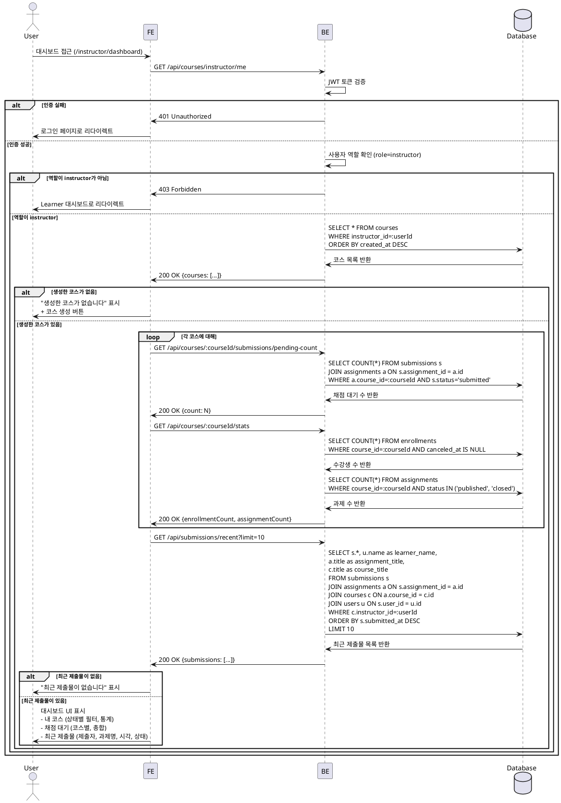

# UC-007: Instructor 대시보드

## Primary Actor
강사 (Instructor)

## Precondition
- 사용자가 Instructor 역할로 로그인된 상태
- 대시보드 페이지(`/instructor/dashboard`) 접근

## Trigger
대시보드 접근 또는 로그인 후 자동 리다이렉트

## Main Scenario

1. 사용자가 대시보드 페이지 접근 (`/instructor/dashboard`)
2. FE가 BE에 내 코스 목록 요청 (`GET /api/courses/instructor/me`)
3. BE가 현재 사용자가 소유한 코스 목록 반환 (모든 상태: draft/published/archived)
4. FE가 각 코스별 채점 대기 수 요청 (`GET /api/courses/:courseId/submissions/pending-count`)
5. FE가 최근 제출물 요청 (`GET /api/submissions/recent?limit=10`)
6. FE가 대시보드 UI 표시:
   - **내 코스 섹션**: 코스 목록, 상태별 필터, 생성/수정 버튼
   - **채점 대기 섹션**: 코스별 채점 대기 수, 총 채점 대기 수
   - **최근 제출물 섹션**: 제출자, 과제명, 제출 시각, 상태
7. FE가 코스별 통계 표시:
   - 수강생 수 (활성 enrollment 수)
   - 과제 수 (published/closed 과제 수)
   - 평균 진행률 (학습자들의 평균 제출 완료율)

## Edge Cases

### 1. 비로그인 사용자
- **상황**: 인증되지 않은 사용자가 대시보드 접근 시도
- **처리**: `401 Unauthorized`, 로그인 페이지로 리다이렉트

### 2. Learner가 Instructor 대시보드 접근
- **상황**: Learner 역할로 Instructor 대시보드 접근 시도
- **처리**: `403 Forbidden` 또는 Learner 대시보드로 리다이렉트

### 3. 생성한 코스가 없음
- **상황**: 아직 코스를 생성하지 않은 Instructor
- **처리**: "생성한 코스가 없습니다. 첫 코스를 만들어보세요." 메시지 + 코스 생성 버튼 표시

### 4. 채점 대기 제출물이 없음
- **상황**: 모든 제출물이 채점 완료됨
- **처리**: "채점 대기 중인 제출물이 없습니다." 메시지 표시

### 5. 최근 제출물이 없음
- **상황**: 아직 학습자 제출물이 없음
- **처리**: "최근 제출물이 없습니다." 메시지 표시

### 6. 네트워크 오류
- **상황**: BE 통신 실패 (타임아웃, 서버 오류 등)
- **처리**: "대시보드를 불러오는데 실패했습니다. 다시 시도해주세요." 메시지 + 새로고침 버튼 표시

## Business Rules

### BR-001: Instructor만 접근 가능
- `role=instructor`인 사용자만 Instructor 대시보드 접근 가능
- `role=learner`는 Learner 대시보드로 리다이렉트

### BR-002: 본인이 소유한 코스만 조회
- `courses` 테이블에서 `instructor_id = 현재 사용자 ID`인 코스만 조회
- 다른 Instructor의 코스는 조회 불가

### BR-003: 코스 상태별 표시
- `draft`: 작성 중, 학습자에게 노출 안됨
- `published`: 공개됨, 학습자 수강 가능
- `archived`: 아카이브됨, 신규 수강 차단

### BR-004: 채점 대기 수 계산
- `submissions` 테이블에서 `status = submitted`인 레코드 수
- 코스별, 과제별로 집계
- 총 채점 대기 수 = 모든 코스의 채점 대기 수 합계

### BR-005: 최근 제출물 조회
- 본인 코스의 과제에 제출된 제출물만 조회
- `submitted_at` 내림차순으로 최대 10개 표시
- 제출자명, 과제명, 코스명, 제출 시각, 상태 표시

### BR-006: 상태별 필터링
- 코스 목록을 상태별로 필터링 (전체/draft/published/archived)
- 기본: 전체 표시

### BR-007: 코스 통계 계산
- 수강생 수: `enrollments` 테이블에서 `course_id = :courseId AND canceled_at IS NULL` 카운트
- 과제 수: `assignments` 테이블에서 `course_id = :courseId AND status IN ('published', 'closed')` 카운트
- 평균 진행률: (총 제출 완료 수 / (수강생 수 × 과제 수)) × 100

---

## Sequence Diagram



---

## 채점 대기 수 계산 로직 (예시)

```typescript
type PendingCount = {
  courseId: string;
  courseTitle: string;
  pendingCount: number;
};

const getPendingCountByCourse = async (
  supabase: SupabaseClient,
  instructorId: string,
): Promise<PendingCount[]> => {
  // 1. Instructor의 코스 목록 조회
  const { data: courses, error: coursesError } = await supabase
    .from('courses')
    .select('id, title')
    .eq('instructor_id', instructorId);

  if (coursesError || !courses) {
    return [];
  }

  // 2. 각 코스별 채점 대기 수 계산
  const pendingCounts = await Promise.all(
    courses.map(async (course) => {
      const { count, error } = await supabase
        .from('submissions')
        .select('id', { count: 'exact', head: true })
        .eq('assignment.course_id', course.id)
        .eq('status', 'submitted');

      return {
        courseId: course.id,
        courseTitle: course.title,
        pendingCount: error ? 0 : count || 0,
      };
    }),
  );

  return pendingCounts;
};

const getTotalPendingCount = (pendingCounts: PendingCount[]): number => {
  return pendingCounts.reduce((sum, item) => sum + item.pendingCount, 0);
};
```

---

## 최근 제출물 조회 로직 (예시)

```typescript
type RecentSubmission = {
  submissionId: string;
  learnerName: string;
  assignmentTitle: string;
  courseTitle: string;
  submittedAt: string;
  status: 'submitted' | 'graded' | 'resubmission_required';
  late: boolean;
};

const getRecentSubmissions = async (
  supabase: SupabaseClient,
  instructorId: string,
  limit: number = 10,
): Promise<RecentSubmission[]> => {
  const { data, error } = await supabase
    .from('submissions')
    .select(`
      id,
      submitted_at,
      status,
      late,
      assignment:assignments (
        title,
        course:courses (
          title
        )
      ),
      user:users (
        name
      )
    `)
    .eq('assignment.course.instructor_id', instructorId)
    .order('submitted_at', { ascending: false })
    .limit(limit);

  if (error || !data) {
    return [];
  }

  return data.map((item) => ({
    submissionId: item.id,
    learnerName: item.user.name,
    assignmentTitle: item.assignment.title,
    courseTitle: item.assignment.course.title,
    submittedAt: item.submitted_at,
    status: item.status,
    late: item.late,
  }));
};
```

---

## UI 구성 (예시)

### 내 코스 섹션
```
┌─────────────────────────────────────────────────────────────┐
│ 내 코스                                     [새 코스 만들기] │
├─────────────────────────────────────────────────────────────┤
│ [전체] [작성 중] [공개] [아카이브]                          │
├─────────────────────────────────────────────────────────────┤
│ React 기초 강의                                   [공개 중] │
│ 수강생: 45명 | 과제: 8개 | 채점 대기: 12개                 │
│                                              [관리하기 >]    │
├─────────────────────────────────────────────────────────────┤
│ TypeScript 심화                                   [작성 중] │
│ 수강생: 0명 | 과제: 3개 | 채점 대기: 0개                   │
│                                              [관리하기 >]    │
├─────────────────────────────────────────────────────────────┤
│ JavaScript 기초                                [아카이브됨] │
│ 수강생: 30명 | 과제: 10개 | 채점 대기: 2개                 │
│                                              [관리하기 >]    │
└─────────────────────────────────────────────────────────────┘
```

### 채점 대기 섹션
```
┌─────────────────────────────────────────────────────────────┐
│ 채점 대기                                                    │
├─────────────────────────────────────────────────────────────┤
│ 총 14개의 제출물이 채점을 기다리고 있습니다                 │
│                                                              │
│ React 기초 강의: 12개                           [채점하기 >]│
│ JavaScript 기초: 2개                            [채점하기 >]│
└─────────────────────────────────────────────────────────────┘
```

### 최근 제출물 섹션
```
┌─────────────────────────────────────────────────────────────┐
│ 최근 제출물                                   [전체 보기 >] │
├─────────────────────────────────────────────────────────────┤
│ 김철수 | React Hooks 과제 | React 기초 강의                │
│ 2025-11-24 15:30 | 제출 완료                   [채점하기 >]│
├─────────────────────────────────────────────────────────────┤
│ 이영희 🔴 | 상태 관리 프로젝트 | React 기초 강의           │
│ 2025-11-24 14:20 | 지각 제출                   [채점하기 >]│
├─────────────────────────────────────────────────────────────┤
│ 박민수 | 클래스 vs 함수형 | JavaScript 기초               │
│ 2025-11-24 10:15 | 제출 완료                   [채점하기 >]│
└─────────────────────────────────────────────────────────────┘
```

### 통계 요약 섹션
```
┌─────────────────────────────────────────────────────────────┐
│ 전체 통계                                                    │
├─────────────────────────────────────────────────────────────┤
│ 총 코스: 3개 (공개: 1개, 작성 중: 1개, 아카이브: 1개)      │
│ 총 수강생: 75명                                             │
│ 총 과제: 21개                                               │
│ 채점 대기: 14개                                             │
│ 평균 진행률: 68%                                            │
└─────────────────────────────────────────────────────────────┘
```
