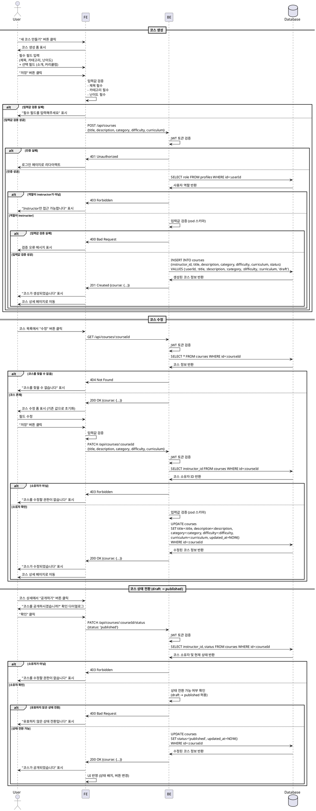

# UC-008: 코스 관리 (Instructor)

## Primary Actor
강사 (Instructor)

## Precondition
- 사용자가 Instructor 역할로 로그인된 상태
- 코스 관리 페이지(`/instructor/courses` 또는 `/instructor/courses/[courseId]/edit`) 접근

## Trigger
- 코스 목록에서 "새 코스 만들기" 버튼 클릭 (생성)
- 코스 카드에서 "수정" 버튼 클릭 (수정)
- 코스 상세에서 상태 전환 버튼 클릭 (상태 변경)

## Main Scenario

### 코스 생성
1. 사용자가 "새 코스 만들기" 버튼 클릭
2. FE가 코스 생성 폼 표시
3. 사용자가 필수 필드 입력:
   - 제목 (필수)
   - 소개 (선택)
   - 카테고리 (필수, 드롭다운)
   - 난이도 (필수, beginner/intermediate/advanced)
   - 커리큘럼 (선택, JSON 형식)
4. 사용자가 "저장" 버튼 클릭
5. FE가 입력값 검증 (제목, 카테고리, 난이도 필수)
6. FE가 BE에 코스 생성 요청 (`POST /api/courses`)
7. BE가 사용자 인증 및 Instructor 역할 확인
8. BE가 입력값 검증 (zod 스키마)
9. BE가 `courses` 테이블에 레코드 생성 (`status=draft`, `instructor_id=현재 사용자`)
10. BE가 생성된 코스 정보 반환 (`201 Created`)
11. FE가 성공 메시지 표시 ("코스가 생성되었습니다")
12. FE가 코스 상세 페이지로 이동

### 코스 수정
1. 사용자가 코스 목록에서 "수정" 버튼 클릭
2. FE가 코스 수정 폼 표시 (기존 값으로 초기화)
3. 사용자가 필드 수정
4. 사용자가 "저장" 버튼 클릭
5. FE가 입력값 검증
6. FE가 BE에 코스 수정 요청 (`PATCH /api/courses/:courseId`)
7. BE가 사용자 인증 및 Instructor 역할 확인
8. BE가 코스 소유자 확인 (`instructor_id = 현재 사용자`)
9. BE가 입력값 검증 (zod 스키마)
10. BE가 `courses` 테이블 레코드 업데이트
11. BE가 수정된 코스 정보 반환 (`200 OK`)
12. FE가 성공 메시지 표시 ("코스가 수정되었습니다")
13. FE가 코스 상세 페이지로 이동

### 코스 상태 전환
1. 사용자가 코스 상세 페이지에서 상태 전환 버튼 클릭
   - "공개하기" (draft → published)
   - "아카이브하기" (published → archived)
2. FE가 확인 다이얼로그 표시
3. 사용자가 "확인" 클릭
4. FE가 BE에 상태 전환 요청 (`PATCH /api/courses/:courseId/status`)
5. BE가 사용자 인증 및 Instructor 역할 확인
6. BE가 코스 소유자 확인
7. BE가 현재 상태 및 전환 가능 여부 확인
8. BE가 `courses` 테이블의 `status` 필드 업데이트
9. BE가 수정된 코스 정보 반환 (`200 OK`)
10. FE가 성공 메시지 표시 ("코스가 공개되었습니다" 또는 "코스가 아카이브되었습니다")
11. FE가 UI 반영 (상태 배지 변경, 버튼 변경)

## Edge Cases

### 1. 비로그인 사용자
- **상황**: 인증되지 않은 사용자가 코스 관리 접근 시도
- **처리**: `401 Unauthorized`, 로그인 페이지로 리다이렉트

### 2. Learner가 코스 관리 접근
- **상황**: Learner 역할로 코스 관리 접근 시도
- **처리**: `403 Forbidden`, Learner 대시보드로 리다이렉트

### 3. 필수 필드 누락
- **상황**: 제목, 카테고리, 난이도 중 하나라도 비어있음
- **처리**: FE에서 검증, "필수 필드를 입력해주세요" 메시지 표시, 저장 차단

### 4. 제목 중복
- **상황**: 동일한 Instructor가 동일한 제목의 코스 생성 시도
- **처리**: `400 Bad Request`, "이미 동일한 제목의 코스가 있습니다" 메시지 표시 (또는 허용)

### 5. 다른 Instructor의 코스 수정 시도
- **상황**: 소유자가 아닌 Instructor가 코스 수정 시도
- **처리**: `403 Forbidden`, "코스를 수정할 권한이 없습니다" 메시지 표시

### 6. 존재하지 않는 코스
- **상황**: 삭제되었거나 존재하지 않는 코스 ID로 수정 시도
- **처리**: `404 Not Found`, "코스를 찾을 수 없습니다" 메시지 표시

### 7. 유효하지 않은 상태 전환
- **상황**: `archived → draft` 또는 `published → draft` 시도
- **처리**: `400 Bad Request`, "유효하지 않은 상태 전환입니다" 메시지 표시

### 8. 커리큘럼 JSON 형식 오류
- **상황**: 커리큘럼 필드에 유효하지 않은 JSON 입력
- **처리**: FE에서 검증 또는 BE에서 `400 Bad Request`, "유효하지 않은 커리큘럼 형식입니다" 메시지 표시

### 9. 카테고리가 metadata에 없음
- **상황**: 존재하지 않는 카테고리 선택 시도
- **처리**: FE에서 드롭다운으로 제한, BE에서 추가 검증

### 10. 네트워크 오류
- **상황**: BE 통신 실패 (타임아웃, 서버 오류 등)
- **처리**: "코스 저장에 실패했습니다. 다시 시도해주세요" 메시지 표시

## Business Rules

### BR-001: Instructor만 코스 생성/수정 가능
- `role=instructor`인 사용자만 코스 관리 기능 접근 가능
- `role=learner`는 코스 목록 조회만 가능

### BR-002: 소유자만 코스 수정 가능
- `courses` 테이블의 `instructor_id = 현재 사용자 ID`인 코스만 수정 가능
- 다른 Instructor의 코스는 조회만 가능

### BR-003: 코스 생성 시 기본 상태는 draft
- 새로 생성된 코스는 `status = draft`
- draft 상태에서는 학습자에게 노출되지 않음
- Instructor만 코스 목록에서 확인 가능

### BR-004: 상태 전환 규칙
- `draft → published`: 코스 공개, 학습자 수강 신청 가능
- `published → archived`: 코스 아카이브, 신규 수강 차단 (기존 수강생은 접근 가능)
- `draft → archived`: 허용 (공개하지 않고 아카이브)
- 역방향 전환 (`archived → published`, `published → draft`, `archived → draft`): 불허 (데이터 정합성 유지)

### BR-005: 필수 필드
- 제목 (title): 필수, 1~200자
- 카테고리 (category): 필수, `metadata_categories` 테이블의 active 값만 허용
- 난이도 (difficulty): 필수, `beginner`, `intermediate`, `advanced` 중 하나
- 소개 (description): 선택, 최대 5000자
- 커리큘럼 (curriculum): 선택, JSONB 형식

### BR-006: 카테고리 및 난이도 메타데이터
- 카테고리는 `metadata_categories` 테이블의 `active=true`인 값만 선택 가능
- 난이도는 `metadata_difficulties` 테이블의 값 사용 (beginner, intermediate, advanced)
- 운영자가 메타데이터를 비활성화해도 기존 코스의 값은 유지

### BR-007: 커리큘럼 구조
- JSONB 형식으로 저장
- 예시 구조:
  ```json
  {
    "sections": [
      {
        "title": "섹션 1: 기초",
        "description": "기초 내용을 다룹니다",
        "order": 1
      },
      {
        "title": "섹션 2: 심화",
        "description": "심화 내용을 다룹니다",
        "order": 2
      }
    ]
  }
  ```
- 스키마 검증은 선택적 (유연성 확보)

### BR-008: 코스 삭제
- 현재 유스케이스에서는 삭제 기능 없음
- 대신 `archived` 상태로 전환하여 숨김 처리
- 물리적 삭제는 운영자 또는 별도 관리 기능에서 처리

### BR-009: published 상태 코스 수정
- published 상태에서도 코스 정보 수정 가능
- 단, 수정 시 학습자에게 즉시 반영됨 (변경 이력 추적은 별도 기능)

### BR-010: 정렬 및 필터링
- 코스 목록 기본 정렬: `created_at` 내림차순 (최신순)
- 상태별 필터: draft, published, archived
- 카테고리별 필터 가능

---

## Sequence Diagram



---

## 코스 관리 로직 (예시)

```typescript
type CreateCourseInput = {
  title: string;
  description?: string;
  category: string;
  difficulty: 'beginner' | 'intermediate' | 'advanced';
  curriculum?: object;
};

type UpdateCourseInput = {
  title?: string;
  description?: string;
  category?: string;
  difficulty?: 'beginner' | 'intermediate' | 'advanced';
  curriculum?: object;
};

type CourseStatusTransition = {
  status: 'draft' | 'published' | 'archived';
};

const createCourse = async (
  supabase: SupabaseClient,
  instructorId: string,
  input: CreateCourseInput,
): Promise<Result<Course>> => {
  // 1. 입력값 검증
  const validated = CreateCourseSchema.safeParse(input);

  if (!validated.success) {
    return failure(400, 'INVALID_INPUT', 'Invalid course data', validated.error.format());
  }

  // 2. 코스 생성 (기본 상태: draft)
  const { data, error } = await supabase
    .from('courses')
    .insert({
      instructor_id: instructorId,
      title: validated.data.title,
      description: validated.data.description || null,
      category: validated.data.category,
      difficulty: validated.data.difficulty,
      curriculum: validated.data.curriculum || null,
      status: 'draft',
    })
    .select()
    .single();

  if (error) {
    return failure(500, 'CREATE_FAILED', error.message);
  }

  return success(data);
};

const updateCourse = async (
  supabase: SupabaseClient,
  courseId: string,
  instructorId: string,
  input: UpdateCourseInput,
): Promise<Result<Course>> => {
  // 1. 소유자 확인
  const { data: course } = await supabase
    .from('courses')
    .select('instructor_id')
    .eq('id', courseId)
    .single();

  if (!course) {
    return failure(404, 'NOT_FOUND', 'Course not found');
  }

  if (course.instructor_id !== instructorId) {
    return failure(403, 'FORBIDDEN', 'Not the course owner');
  }

  // 2. 입력값 검증
  const validated = UpdateCourseSchema.safeParse(input);

  if (!validated.success) {
    return failure(400, 'INVALID_INPUT', 'Invalid course data', validated.error.format());
  }

  // 3. 코스 업데이트
  const { data, error } = await supabase
    .from('courses')
    .update({
      ...(validated.data.title && { title: validated.data.title }),
      ...(validated.data.description !== undefined && { description: validated.data.description }),
      ...(validated.data.category && { category: validated.data.category }),
      ...(validated.data.difficulty && { difficulty: validated.data.difficulty }),
      ...(validated.data.curriculum !== undefined && { curriculum: validated.data.curriculum }),
    })
    .eq('id', courseId)
    .select()
    .single();

  if (error) {
    return failure(500, 'UPDATE_FAILED', error.message);
  }

  return success(data);
};

const transitionCourseStatus = async (
  supabase: SupabaseClient,
  courseId: string,
  instructorId: string,
  targetStatus: 'draft' | 'published' | 'archived',
): Promise<Result<Course>> => {
  // 1. 소유자 및 현재 상태 확인
  const { data: course } = await supabase
    .from('courses')
    .select('instructor_id, status')
    .eq('id', courseId)
    .single();

  if (!course) {
    return failure(404, 'NOT_FOUND', 'Course not found');
  }

  if (course.instructor_id !== instructorId) {
    return failure(403, 'FORBIDDEN', 'Not the course owner');
  }

  // 2. 상태 전환 가능 여부 확인
  const validTransitions: Record<string, string[]> = {
    draft: ['published', 'archived'],
    published: ['archived'],
    archived: [], // 아카이브에서는 전환 불가
  };

  if (!validTransitions[course.status].includes(targetStatus)) {
    return failure(
      400,
      'INVALID_TRANSITION',
      `Cannot transition from ${course.status} to ${targetStatus}`,
    );
  }

  // 3. 상태 업데이트
  const { data, error } = await supabase
    .from('courses')
    .update({ status: targetStatus })
    .eq('id', courseId)
    .select()
    .single();

  if (error) {
    return failure(500, 'UPDATE_FAILED', error.message);
  }

  return success(data);
};
```

---

## UI 구성 (예시)

### 코스 생성/수정 폼
```
┌─────────────────────────────────────────────────────────────┐
│ 코스 생성                                                    │
├─────────────────────────────────────────────────────────────┤
│ 제목 (필수) *                                               │
│ ┌─────────────────────────────────────────────────────────┐ │
│ │ React 기초 강의                                         │ │
│ └─────────────────────────────────────────────────────────┘ │
│                                                              │
│ 소개                                                         │
│ ┌─────────────────────────────────────────────────────────┐ │
│ │ React의 기초를 배우는 강의입니다...                     │ │
│ │                                                         │ │
│ └─────────────────────────────────────────────────────────┘ │
│                                                              │
│ 카테고리 (필수) *                                           │
│ ┌─────────────────────────────────────────────────────────┐ │
│ │ Programming                              [▼]            │ │
│ └─────────────────────────────────────────────────────────┘ │
│                                                              │
│ 난이도 (필수) *                                             │
│ ○ Beginner  ● Intermediate  ○ Advanced                     │
│                                                              │
│ 커리큘럼 (JSON)                                             │
│ ┌─────────────────────────────────────────────────────────┐ │
│ │ {                                                       │ │
│ │   "sections": [...]                                     │ │
│ │ }                                                       │ │
│ └─────────────────────────────────────────────────────────┘ │
│                                                              │
│                                  [취소]  [저장하기]         │
└─────────────────────────────────────────────────────────────┘
```

### 코스 상세 (상태 전환)
```
┌─────────────────────────────────────────────────────────────┐
│ React 기초 강의                                     [작성 중]│
├─────────────────────────────────────────────────────────────┤
│ React의 기초를 배우는 강의입니다...                         │
│                                                              │
│ 카테고리: Programming | 난이도: Intermediate                │
│                                                              │
│                                  [수정하기]  [공개하기]     │
└─────────────────────────────────────────────────────────────┘
```

### 코스 목록 (필터)
```
┌─────────────────────────────────────────────────────────────┐
│ 내 코스                                     [새 코스 만들기]│
│ [전체] [작성 중] [공개] [아카이브]                          │
├─────────────────────────────────────────────────────────────┤
│ React 기초 강의                                   [공개 중] │
│ Programming | Intermediate                                  │
│ 수강생: 45명 | 과제: 8개                     [관리하기 >]   │
├─────────────────────────────────────────────────────────────┤
│ TypeScript 심화                                   [작성 중] │
│ Programming | Advanced                                      │
│ 수강생: 0명 | 과제: 3개                      [관리하기 >]   │
└─────────────────────────────────────────────────────────────┘
```
