# UC-009: 과제 관리 (Instructor)

## Primary Actor
강사 (Instructor)

## Precondition
- 사용자가 Instructor 역할로 로그인된 상태
- 소유한 코스가 존재
- 과제 관리 페이지(`/instructor/courses/[courseId]/assignments` 또는 `/instructor/assignments/[assignmentId]/edit`) 접근

## Trigger
- 코스 상세에서 "새 과제 만들기" 버튼 클릭 (생성)
- 과제 목록에서 "수정" 버튼 클릭 (수정)
- 과제 상세에서 상태 전환 버튼 클릭 (상태 변경)

## Main Scenario

### 과제 생성
1. 사용자가 코스 상세 페이지에서 "새 과제 만들기" 버튼 클릭
2. FE가 과제 생성 폼 표시
3. 사용자가 필수 필드 입력:
   - 제목 (필수)
   - 설명 (필수)
   - 마감일 (필수, datetime)
   - 점수 비중 (필수, 0-100)
   - 지각 허용 여부 (필수, boolean)
   - 재제출 허용 여부 (필수, boolean)
4. 사용자가 "저장" 버튼 클릭
5. FE가 입력값 검증 (제목, 설명, 마감일, 점수 비중 필수, 마감일 현재시각 이후)
6. FE가 BE에 과제 생성 요청 (`POST /api/courses/:courseId/assignments`)
7. BE가 사용자 인증 및 Instructor 역할 확인
8. BE가 코스 소유자 확인 (`courses.instructor_id = 현재 사용자`)
9. BE가 입력값 검증 (zod 스키마)
10. BE가 `assignments` 테이블에 레코드 생성 (`status=draft`, `course_id=코스 ID`)
11. BE가 생성된 과제 정보 반환 (`201 Created`)
12. FE가 성공 메시지 표시 ("과제가 생성되었습니다")
13. FE가 과제 목록 페이지로 이동

### 과제 수정
1. 사용자가 과제 목록에서 "수정" 버튼 클릭
2. FE가 과제 수정 폼 표시 (기존 값으로 초기화)
3. 사용자가 필드 수정
4. 사용자가 "저장" 버튼 클릭
5. FE가 입력값 검증
6. FE가 BE에 과제 수정 요청 (`PATCH /api/assignments/:assignmentId`)
7. BE가 사용자 인증 및 Instructor 역할 확인
8. BE가 과제 소유 코스의 소유자 확인
9. BE가 입력값 검증 (zod 스키마)
10. BE가 `assignments` 테이블 레코드 업데이트
11. BE가 수정된 과제 정보 반환 (`200 OK`)
12. FE가 성공 메시지 표시 ("과제가 수정되었습니다")
13. FE가 과제 상세 페이지로 이동

### 과제 상태 전환
1. 사용자가 과제 상세 페이지에서 상태 전환 버튼 클릭
   - "게시하기" (draft → published)
   - "마감하기" (published → closed)
2. FE가 확인 다이얼로그 표시
3. 사용자가 "확인" 클릭
4. FE가 BE에 상태 전환 요청 (`PATCH /api/assignments/:assignmentId/status`)
5. BE가 사용자 인증 및 Instructor 역할 확인
6. BE가 과제 소유 코스의 소유자 확인
7. BE가 현재 상태 및 전환 가능 여부 확인
8. BE가 `assignments` 테이블의 `status` 필드 업데이트
9. BE가 수정된 과제 정보 반환 (`200 OK`)
10. FE가 성공 메시지 표시 ("과제가 게시되었습니다" 또는 "과제가 마감되었습니다")
11. FE가 UI 반영 (상태 배지 변경, 버튼 변경)

### 과제 목록 조회 (with 제출물 통계)
1. 사용자가 코스 상세에서 "과제" 탭 클릭
2. FE가 BE에 과제 목록 요청 (`GET /api/courses/:courseId/assignments`)
3. BE가 사용자 인증 및 코스 소유자 확인
4. BE가 과제 목록 조회 (모든 상태 포함)
5. BE가 각 과제별 제출물 통계 조회:
   - 총 제출 수
   - 미채점 수 (status=submitted)
   - 지각 제출 수 (late=true)
   - 재제출 요청 수 (status=resubmission_required)
6. BE가 과제 목록 + 통계 반환 (`200 OK`)
7. FE가 과제 목록 UI 표시 (제목, 마감일, 상태, 제출 통계)

## Edge Cases

### 1. 비로그인 사용자
- **상황**: 인증되지 않은 사용자가 과제 관리 접근 시도
- **처리**: `401 Unauthorized`, 로그인 페이지로 리다이렉트

### 2. Learner가 과제 관리 접근
- **상황**: Learner 역할로 과제 관리 접근 시도
- **처리**: `403 Forbidden`, Learner 대시보드로 리다이렉트

### 3. 필수 필드 누락
- **상황**: 제목, 설명, 마감일, 점수 비중 중 하나라도 비어있음
- **처리**: FE에서 검증, "필수 필드를 입력해주세요" 메시지 표시, 저장 차단

### 4. 마감일이 과거
- **상황**: 현재 시각보다 이전의 마감일 설정 시도
- **처리**: FE에서 검증, "마감일은 현재 시각 이후로 설정해주세요" 메시지 표시

### 5. 점수 비중 범위 초과
- **상황**: 점수 비중이 0 미만 또는 100 초과
- **처리**: FE에서 검증 또는 BE에서 `400 Bad Request`, "점수 비중은 0~100 사이여야 합니다" 메시지 표시

### 6. 다른 Instructor의 코스에 과제 생성 시도
- **상황**: 소유하지 않은 코스에 과제 생성 시도
- **처리**: `403 Forbidden`, "해당 코스에 과제를 생성할 권한이 없습니다" 메시지 표시

### 7. 존재하지 않는 과제
- **상황**: 삭제되었거나 존재하지 않는 과제 ID로 수정 시도
- **처리**: `404 Not Found`, "과제를 찾을 수 없습니다" 메시지 표시

### 8. 유효하지 않은 상태 전환
- **상황**: `closed → draft` 또는 `closed → published` 시도
- **처리**: `400 Bad Request`, "유효하지 않은 상태 전환입니다" 메시지 표시

### 9. published 과제에 제출물이 있는 상태에서 수정
- **상황**: 학습자가 이미 제출한 과제의 마감일 수정 시도
- **처리**: 허용 (단, 경고 메시지 표시: "제출물이 있는 과제입니다. 수정 시 학습자에게 영향을 줄 수 있습니다")

### 10. 네트워크 오류
- **상황**: BE 통신 실패 (타임아웃, 서버 오류 등)
- **처리**: "과제 저장에 실패했습니다. 다시 시도해주세요" 메시지 표시

## Business Rules

### BR-001: Instructor만 과제 생성/수정 가능
- `role=instructor`인 사용자만 과제 관리 기능 접근 가능
- `role=learner`는 과제 목록 조회 및 제출만 가능

### BR-002: 소유 코스에만 과제 생성/수정 가능
- `courses` 테이블의 `instructor_id = 현재 사용자 ID`인 코스에만 과제 생성 가능
- `assignments` 테이블의 `course_id`가 소유 코스여야 수정 가능

### BR-003: 과제 생성 시 기본 상태는 draft
- 새로 생성된 과제는 `status = draft`
- draft 상태에서는 학습자에게 노출되지 않음
- Instructor만 과제 목록에서 확인 가능

### BR-004: 상태 전환 규칙
- `draft → published`: 과제 게시, 학습자 제출 가능
- `published → closed`: 과제 마감, 제출 차단 (채점만 가능)
- `draft → closed`: 허용 (게시하지 않고 마감)
- 역방향 전환 (`closed → published`, `published → draft`, `closed → draft`): 불허 (데이터 정합성 유지)

### BR-005: 필수 필드
- 제목 (title): 필수, 1~200자
- 설명 (description): 필수, 1~5000자
- 마감일 (due_date): 필수, 현재 시각 이후
- 점수 비중 (weight): 필수, 0~100 (소수점 2자리까지)
- 지각 허용 (allow_late): 필수, boolean
- 재제출 허용 (allow_resubmit): 필수, boolean

### BR-006: 점수 비중 (weight)
- 0~100 사이의 숫자
- 소수점 둘째 자리까지 허용 (예: 20.5, 33.33)
- 한 코스 내 모든 과제의 비중 합이 100일 필요는 없음 (유연성 확보)
- 성적 계산 시 실제 점수 × 비중 / 100으로 가중치 적용

### BR-007: 마감일 관리
- 마감일은 TIMESTAMPTZ 형식으로 저장 (timezone 고려)
- 마감일 이후에는 제출 차단 (단, `allow_late = true`인 경우 지각 제출 허용)
- 마감일 자동 closed: 별도 스케줄러나 체크 로직 필요 (현재 유스케이스에서는 수동 마감)

### BR-008: 지각 제출 정책
- `allow_late = true`: 마감일 이후에도 제출 가능, `late` 필드에 지각 여부 기록
- `allow_late = false`: 마감일 이후 제출 차단
- 지각 제출에 대한 감점은 Instructor가 채점 시 수동 반영

### BR-009: 재제출 정책
- `allow_resubmit = true`: 기존 제출물 업데이트 가능, 기존 점수/피드백 초기화
- `allow_resubmit = false`: 최초 1회만 제출 가능
- 예외: `status = resubmission_required`인 경우 재제출 허용 여부와 무관하게 재제출 가능

### BR-010: published 상태 과제 수정
- published 상태에서도 과제 정보 수정 가능
- 단, 마감일 변경 시 이미 제출한 학습자에게 영향 (경고 메시지 표시)
- 변경 이력 추적은 별도 기능

### BR-011: 과제 삭제
- 현재 유스케이스에서는 삭제 기능 없음
- 대신 `closed` 상태로 전환하여 숨김 처리
- 물리적 삭제는 운영자 또는 별도 관리 기능에서 처리

### BR-012: 정렬 및 필터링
- 과제 목록 기본 정렬: `due_date` 오름차순 (가장 빠른 마감일 우선)
- 상태별 필터: draft, published, closed
- 제출물 통계 필터: 미채점, 지각, 재제출요청

---

## Sequence Diagram

```plantuml
@startuml
actor User
participant FE
participant BE
database Database

== 과제 생성 ==

User -> FE: "새 과제 만들기" 버튼 클릭

FE -> User: 과제 생성 폼 표시

User -> FE: 필수 필드 입력\n(제목, 설명, 마감일, 점수 비중, 지각/재제출 정책)

User -> FE: "저장" 버튼 클릭

FE -> FE: 입력값 검증\n- 제목, 설명 필수\n- 마감일 현재 시각 이후\n- 점수 비중 0-100

alt 입력값 검증 실패
    FE -> User: "필수 필드를 입력해주세요" 또는\n"마감일은 현재 시각 이후로 설정해주세요" 표시
else 입력값 검증 성공
    FE -> BE: POST /api/courses/:courseId/assignments\n{title, description, due_date, weight, allow_late, allow_resubmit}

    BE -> BE: JWT 토큰 검증

    alt 인증 실패
        BE -> FE: 401 Unauthorized
        FE -> User: 로그인 페이지로 리다이렉트
    else 인증 성공
        BE -> Database: SELECT instructor_id FROM courses WHERE id=:courseId
        Database -> BE: 코스 소유자 ID 반환

        alt 코스를 찾을 수 없음
            BE -> FE: 404 Not Found
            FE -> User: "코스를 찾을 수 없습니다" 표시
        else 코스 존재
            alt 소유자가 아님
                BE -> FE: 403 Forbidden
                FE -> User: "해당 코스에 과제를 생성할 권한이 없습니다" 표시
            else 소유자 확인
                BE -> BE: 입력값 검증 (zod 스키마)

                alt 입력값 검증 실패
                    BE -> FE: 400 Bad Request
                    FE -> User: 검증 오류 메시지 표시
                else 입력값 검증 성공
                    BE -> Database: INSERT INTO assignments\n(course_id, title, description, due_date, weight, allow_late, allow_resubmit, status)\nVALUES (:courseId, :title, :description, :due_date, :weight, :allow_late, :allow_resubmit, 'draft')
                    Database -> BE: 생성된 과제 정보 반환

                    BE -> FE: 201 Created {assignment: {...}}

                    FE -> User: "과제가 생성되었습니다" 표시

                    FE -> User: 과제 목록 페이지로 이동
                end
            end
        end
    end
end

== 과제 수정 ==

User -> FE: 과제 목록에서 "수정" 버튼 클릭

FE -> BE: GET /api/assignments/:assignmentId

BE -> BE: JWT 토큰 검증

BE -> Database: SELECT a.*, c.instructor_id\nFROM assignments a\nJOIN courses c ON a.course_id = c.id\nWHERE a.id=:assignmentId
Database -> BE: 과제 정보 + 코스 소유자 ID 반환

alt 과제를 찾을 수 없음
    BE -> FE: 404 Not Found
    FE -> User: "과제를 찾을 수 없습니다" 표시
else 과제 존재
    alt 코스 소유자가 아님
        BE -> FE: 403 Forbidden
        FE -> User: "과제를 수정할 권한이 없습니다" 표시
    else 소유자 확인
        BE -> FE: 200 OK {assignment: {...}}

        FE -> User: 과제 수정 폼 표시 (기존 값으로 초기화)

        User -> FE: 필드 수정

        User -> FE: "저장" 버튼 클릭

        FE -> FE: 입력값 검증

        FE -> BE: PATCH /api/assignments/:assignmentId\n{title, description, due_date, weight, allow_late, allow_resubmit}

        BE -> BE: JWT 토큰 검증

        BE -> Database: SELECT a.*, c.instructor_id\nFROM assignments a\nJOIN courses c ON a.course_id = c.id\nWHERE a.id=:assignmentId
        Database -> BE: 과제 정보 + 코스 소유자 ID 반환

        alt 소유자가 아님
            BE -> FE: 403 Forbidden
            FE -> User: "과제를 수정할 권한이 없습니다" 표시
        else 소유자 확인
            BE -> BE: 입력값 검증 (zod 스키마)

            BE -> Database: UPDATE assignments\nSET title=:title, description=:description,\ndue_date=:due_date, weight=:weight,\nallow_late=:allow_late, allow_resubmit=:allow_resubmit,\nupdated_at=NOW()\nWHERE id=:assignmentId
            Database -> BE: 수정된 과제 정보 반환

            BE -> FE: 200 OK {assignment: {...}}

            FE -> User: "과제가 수정되었습니다" 표시

            FE -> User: 과제 상세 페이지로 이동
        end
    end
end

== 과제 상태 전환 (draft → published) ==

User -> FE: 과제 상세에서 "게시하기" 버튼 클릭

FE -> User: "과제를 게시하시겠습니까?" 확인 다이얼로그

User -> FE: "확인" 클릭

FE -> BE: PATCH /api/assignments/:assignmentId/status\n{status: 'published'}

BE -> BE: JWT 토큰 검증

BE -> Database: SELECT a.*, c.instructor_id\nFROM assignments a\nJOIN courses c ON a.course_id = c.id\nWHERE a.id=:assignmentId
Database -> BE: 과제 정보 + 코스 소유자 ID 반환

alt 소유자가 아님
    BE -> FE: 403 Forbidden
    FE -> User: "과제를 수정할 권한이 없습니다" 표시
else 소유자 확인
    BE -> BE: 상태 전환 가능 여부 확인\n(draft → published 허용)

    alt 유효하지 않은 상태 전환
        BE -> FE: 400 Bad Request
        FE -> User: "유효하지 않은 상태 전환입니다" 표시
    else 상태 전환 가능
        BE -> Database: UPDATE assignments\nSET status='published', updated_at=NOW()\nWHERE id=:assignmentId
        Database -> BE: 수정된 과제 정보 반환

        BE -> FE: 200 OK {assignment: {...}}

        FE -> User: "과제가 게시되었습니다" 표시

        FE -> FE: UI 반영 (상태 배지, 버튼 변경)
    end
end

== 과제 목록 조회 (with 제출물 통계) ==

User -> FE: 코스 상세에서 "과제" 탭 클릭

FE -> BE: GET /api/courses/:courseId/assignments

BE -> BE: JWT 토큰 검증

BE -> Database: SELECT instructor_id FROM courses WHERE id=:courseId
Database -> BE: 코스 소유자 ID 반환

alt 소유자가 아님
    BE -> FE: 403 Forbidden
    FE -> User: "접근 권한이 없습니다" 표시
else 소유자 확인
    BE -> Database: SELECT * FROM assignments\nWHERE course_id=:courseId\nORDER BY due_date ASC
    Database -> BE: 과제 목록 반환

    loop 각 과제에 대해
        BE -> Database: SELECT COUNT(*) FROM submissions\nWHERE assignment_id=:assignmentId
        Database -> BE: 총 제출 수

        BE -> Database: SELECT COUNT(*) FROM submissions\nWHERE assignment_id=:assignmentId AND status='submitted'
        Database -> BE: 미채점 수

        BE -> Database: SELECT COUNT(*) FROM submissions\nWHERE assignment_id=:assignmentId AND late=true
        Database -> BE: 지각 제출 수

        BE -> Database: SELECT COUNT(*) FROM submissions\nWHERE assignment_id=:assignmentId AND status='resubmission_required'
        Database -> BE: 재제출 요청 수
    end

    BE -> FE: 200 OK {assignments: [...], stats: {...}}

    FE -> User: 과제 목록 + 제출물 통계 표시
end

@enduml
```



---

## 과제 관리 로직 (예시)

```typescript
type CreateAssignmentInput = {
  title: string;
  description: string;
  dueDate: string; // ISO 8601
  weight: number; // 0-100
  allowLate: boolean;
  allowResubmit: boolean;
};

type UpdateAssignmentInput = {
  title?: string;
  description?: string;
  dueDate?: string;
  weight?: number;
  allowLate?: boolean;
  allowResubmit?: boolean;
};

type AssignmentStatusTransition = {
  status: 'published' | 'closed';
};

const createAssignment = async (
  supabase: SupabaseClient,
  courseId: string,
  instructorId: string,
  input: CreateAssignmentInput,
): Promise<Result<Assignment>> => {
  // 1. 코스 소유자 확인
  const { data: course } = await supabase
    .from('courses')
    .select('instructor_id')
    .eq('id', courseId)
    .single();

  if (!course) {
    return failure(404, 'NOT_FOUND', 'Course not found');
  }

  if (course.instructor_id !== instructorId) {
    return failure(403, 'FORBIDDEN', 'Not the course owner');
  }

  // 2. 입력값 검증
  const validated = CreateAssignmentSchema.safeParse(input);

  if (!validated.success) {
    return failure(400, 'INVALID_INPUT', 'Invalid assignment data', validated.error.format());
  }

  // 3. 마감일 검증 (현재 시각 이후)
  const now = new Date();
  const dueDate = new Date(validated.data.dueDate);

  if (dueDate <= now) {
    return failure(400, 'INVALID_DUE_DATE', 'Due date must be in the future');
  }

  // 4. 과제 생성 (기본 상태: draft)
  const { data, error } = await supabase
    .from('assignments')
    .insert({
      course_id: courseId,
      title: validated.data.title,
      description: validated.data.description,
      due_date: validated.data.dueDate,
      weight: validated.data.weight,
      allow_late: validated.data.allowLate,
      allow_resubmit: validated.data.allowResubmit,
      status: 'draft',
    })
    .select()
    .single();

  if (error) {
    return failure(500, 'CREATE_FAILED', error.message);
  }

  return success(data, 201);
};

const updateAssignment = async (
  supabase: SupabaseClient,
  assignmentId: string,
  instructorId: string,
  input: UpdateAssignmentInput,
): Promise<Result<Assignment>> => {
  // 1. 과제 존재 및 코스 소유자 확인
  const { data: assignment } = await supabase
    .from('assignments')
    .select(`
      *,
      course:courses (
        instructor_id
      )
    `)
    .eq('id', assignmentId)
    .single();

  if (!assignment) {
    return failure(404, 'NOT_FOUND', 'Assignment not found');
  }

  if (assignment.course.instructor_id !== instructorId) {
    return failure(403, 'FORBIDDEN', 'Not the course owner');
  }

  // 2. 입력값 검증
  const validated = UpdateAssignmentSchema.safeParse(input);

  if (!validated.success) {
    return failure(400, 'INVALID_INPUT', 'Invalid assignment data', validated.error.format());
  }

  // 3. 마감일 검증 (변경 시)
  if (validated.data.dueDate) {
    const now = new Date();
    const dueDate = new Date(validated.data.dueDate);

    if (dueDate <= now) {
      return failure(400, 'INVALID_DUE_DATE', 'Due date must be in the future');
    }
  }

  // 4. 과제 업데이트
  const updateData: Record<string, any> = {};

  if (validated.data.title !== undefined) {
    updateData.title = validated.data.title;
  }
  if (validated.data.description !== undefined) {
    updateData.description = validated.data.description;
  }
  if (validated.data.dueDate !== undefined) {
    updateData.due_date = validated.data.dueDate;
  }
  if (validated.data.weight !== undefined) {
    updateData.weight = validated.data.weight;
  }
  if (validated.data.allowLate !== undefined) {
    updateData.allow_late = validated.data.allowLate;
  }
  if (validated.data.allowResubmit !== undefined) {
    updateData.allow_resubmit = validated.data.allowResubmit;
  }

  const { data, error } = await supabase
    .from('assignments')
    .update(updateData)
    .eq('id', assignmentId)
    .select()
    .single();

  if (error) {
    return failure(500, 'UPDATE_FAILED', error.message);
  }

  return success(data);
};

const transitionAssignmentStatus = async (
  supabase: SupabaseClient,
  assignmentId: string,
  instructorId: string,
  targetStatus: 'published' | 'closed',
): Promise<Result<Assignment>> => {
  // 1. 과제 존재 및 코스 소유자 확인
  const { data: assignment } = await supabase
    .from('assignments')
    .select(`
      *,
      course:courses (
        instructor_id
      )
    `)
    .eq('id', assignmentId)
    .single();

  if (!assignment) {
    return failure(404, 'NOT_FOUND', 'Assignment not found');
  }

  if (assignment.course.instructor_id !== instructorId) {
    return failure(403, 'FORBIDDEN', 'Not the course owner');
  }

  // 2. 상태 전환 가능 여부 확인
  const validTransitions: Record<string, string[]> = {
    draft: ['published', 'closed'],
    published: ['closed'],
    closed: [], // 마감에서는 전환 불가
  };

  if (!validTransitions[assignment.status].includes(targetStatus)) {
    return failure(
      400,
      'INVALID_TRANSITION',
      `Cannot transition from ${assignment.status} to ${targetStatus}`,
    );
  }

  // 3. 상태 업데이트
  const { data, error } = await supabase
    .from('assignments')
    .update({ status: targetStatus })
    .eq('id', assignmentId)
    .select()
    .single();

  if (error) {
    return failure(500, 'UPDATE_FAILED', error.message);
  }

  return success(data);
};
```

---

## UI 구성 (예시)

### 과제 생성/수정 폼
```
┌─────────────────────────────────────────────────────────────┐
│ 과제 생성                                                    │
├─────────────────────────────────────────────────────────────┤
│ 제목 (필수) *                                               │
│ ┌─────────────────────────────────────────────────────────┐ │
│ │ React Hooks 과제                                        │ │
│ └─────────────────────────────────────────────────────────┘ │
│                                                              │
│ 설명 (필수) *                                               │
│ ┌─────────────────────────────────────────────────────────┐ │
│ │ React Hooks를 사용하여 카운터를 만드세요...             │ │
│ │                                                         │ │
│ └─────────────────────────────────────────────────────────┘ │
│                                                              │
│ 마감일 (필수) *                                             │
│ ┌─────────────────────────────────────────────────────────┐ │
│ │ 2025-12-31 23:59                         [날짜 선택]    │ │
│ └─────────────────────────────────────────────────────────┘ │
│                                                              │
│ 점수 비중 (필수) *                                          │
│ ┌─────────────────────────────────────────────────────────┐ │
│ │ 20                                    (0~100)           │ │
│ └─────────────────────────────────────────────────────────┘ │
│                                                              │
│ ☑ 지각 제출 허용                                           │
│ ☑ 재제출 허용                                              │
│                                                              │
│                                  [취소]  [저장하기]         │
└─────────────────────────────────────────────────────────────┘
```

### 과제 목록 (with 제출물 통계)
```
┌─────────────────────────────────────────────────────────────┐
│ 과제 목록                                   [새 과제 만들기]│
│ [전체] [작성 중] [게시됨] [마감됨]                          │
├─────────────────────────────────────────────────────────────┤
│ React Hooks 과제                                  [게시됨] │
│ 마감일: 2025-12-31 23:59 | 비중: 20%                        │
│ 제출: 45명 | 미채점: 12명 | 지각: 3명       [관리하기 >]   │
├─────────────────────────────────────────────────────────────┤
│ 상태 관리 프로젝트                                [작성 중] │
│ 마감일: 2025-12-25 23:59 | 비중: 30%                        │
│ 제출: 0명                                    [관리하기 >]   │
└─────────────────────────────────────────────────────────────┘
```

### 과제 상세 (상태 전환)
```
┌─────────────────────────────────────────────────────────────┐
│ React Hooks 과제                                  [게시됨]  │
├─────────────────────────────────────────────────────────────┤
│ React Hooks를 사용하여 카운터를 만드세요...                 │
│                                                              │
│ 마감일: 2025-12-31 23:59 | 비중: 20%                        │
│ 지각 제출 허용: O | 재제출 허용: O                          │
│                                                              │
│ 제출물 통계:                                                │
│ 총 제출: 45명 | 미채점: 12명 | 지각: 3명 | 재제출 요청: 1명│
│                                                              │
│                                  [수정하기]  [마감하기]     │
└─────────────────────────────────────────────────────────────┘
```
